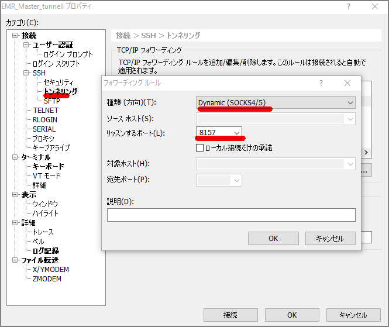
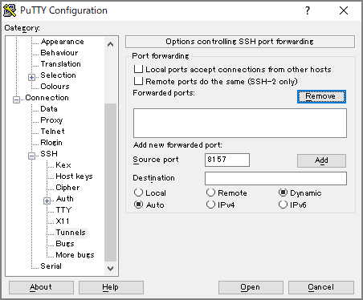
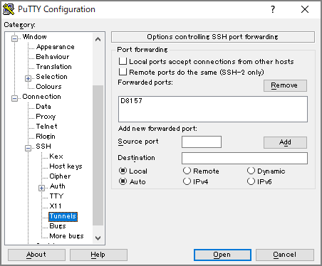
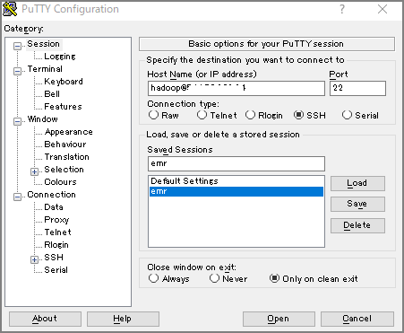
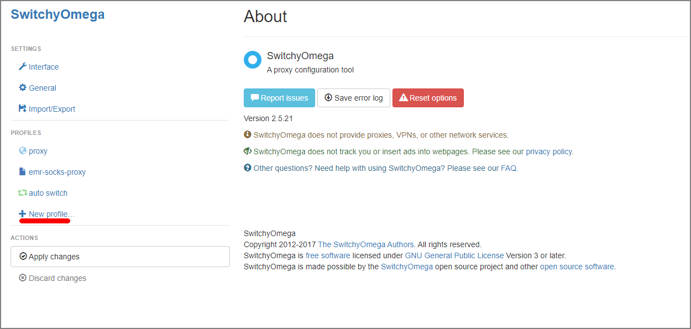
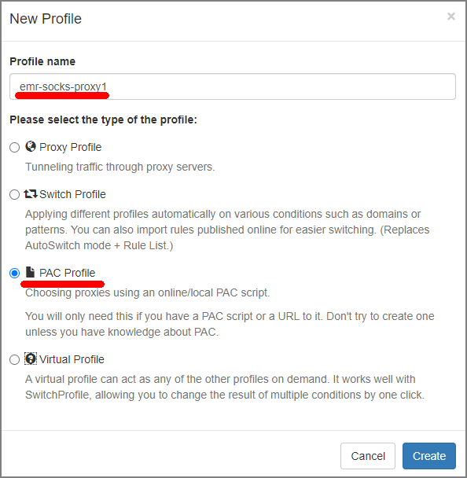
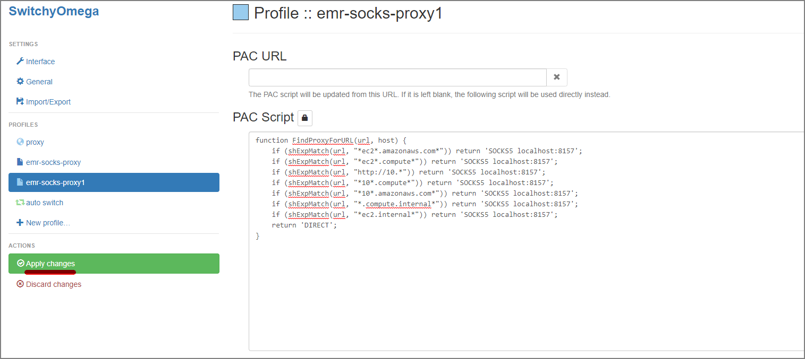
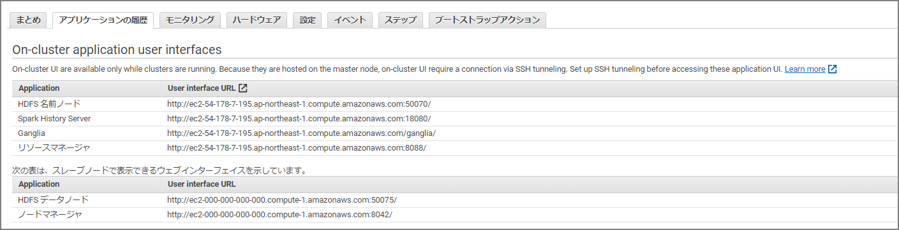

The Spark Web UI and others can be viewed by clicking in the management console, but other web-based GUI tools need to be viewed via SSH tunneling. The following two steps are required:

1. Configure forwarding on the SSH client side
2. Configure proxy settings on the browser side

It's easy once you've done it, but since it's easy to forget when doing it again later, here are the notes.

1. ### Configure Forwarding on the SSH Client Side

> Reference manual
>
> Option 2, Part 1: Set up an SSH Tunnel to the Master Node Using Dynamic Port Forwarding - Amazon EMR https://docs.aws.amazon.com/ja_jp/emr/latest/ManagementGuide/emr-ssh-tunnel.html

- For Xshell6:

  - In the tunneling configuration's forwarding rules, select Dynamic and set the listen port to 8157. (Any unused port will do, but it must match the subsequent proxy configuration.)

  

- For Putty:

Configure dynamic port forwarding under Connection-SSH-Tunnels





Connect to the master node as normal in Session



2. ### Configure Browser Proxy Settings

   > Reference manual
   >
   > Option 2, Part 2: Configure a Proxy to View Websites Hosted on the Master Node - Amazon EMR https://docs.aws.amazon.com/ja_jp/emr/latest/ManagementGuide/emr-connect-master-node-proxy.html


   - Install Proxy Switchy Omega

   https://chrome.google.com/webstore/detail/proxy-switchyomega/padekgcemlokbadohgkifijomclgjgif

   - Open Proxy Switchy Omega options and select New Profile

     


   - Select Profile Name and PAC Profile

   


   - Paste the following into the PAC Script input field and then select Apply Changes

     ```
     function FindProxyForURL(url, host) {
         if (shExpMatch(url, "*ec2*.amazonaws.com*")) return 'SOCKS5 localhost:8157';
         if (shExpMatch(url, "*ec2*.compute*")) return 'SOCKS5 localhost:8157';
         if (shExpMatch(url, "http://10.*")) return 'SOCKS5 localhost:8157';
         if (shExpMatch(url, "*10*.compute*")) return 'SOCKS5 localhost:8157';
         if (shExpMatch(url, "*10*.amazonaws.com*")) return 'SOCKS5 localhost:8157';
         if (shExpMatch(url, "*.compute.internal*")) return 'SOCKS5 localhost:8157';
         if (shExpMatch(url, "*ec2.internal*")) return 'SOCKS5 localhost:8157';
         return 'DIRECT';
     }
     ```

     

After completing the above steps, you can access each Web UI by navigating to the following URLs.


