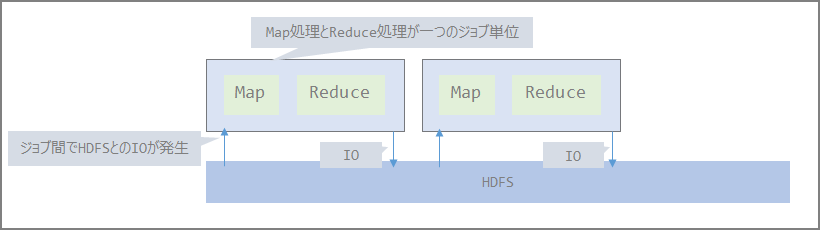
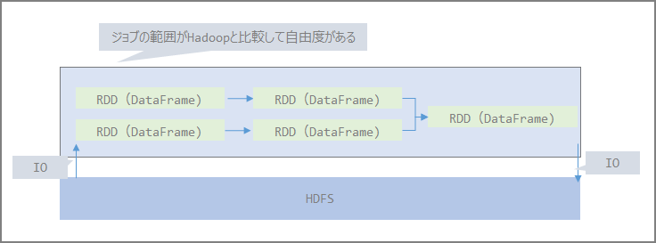
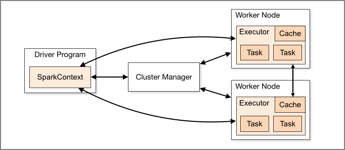
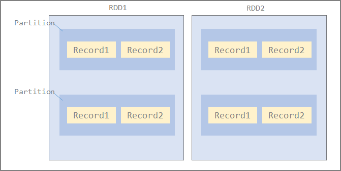
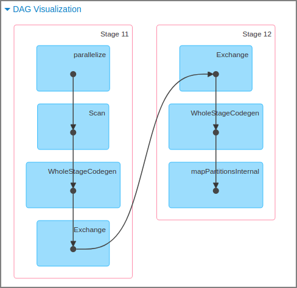
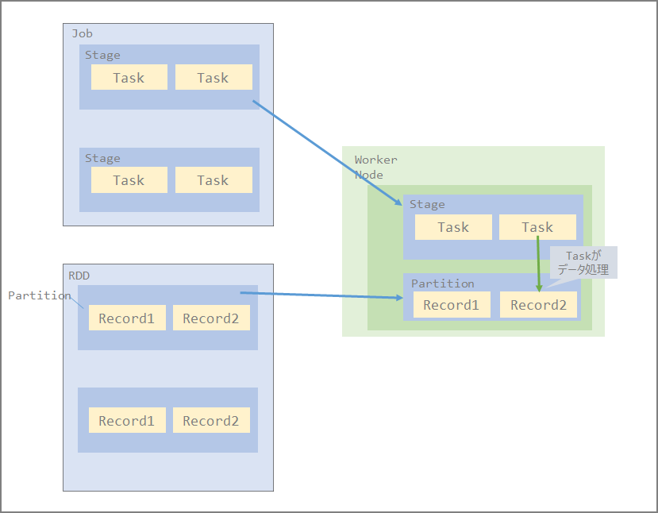
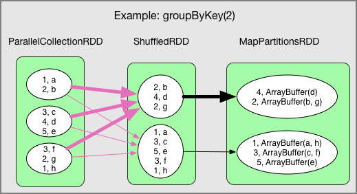

### Differences Between Hadoop and Spark

The distributed file system layer (HDFS) and resource management layer (YARN) are the same for both Hadoop and Spark. (StandAlone and Mesos are also options.)

The Map Reduce portion is replaced by Spark.

- Hadoop

- Spark

### Spark Components

- Driver and Worker Nodes that actually execute jobs. Executors exist within Worker Nodes and can execute multiple tasks.

> https://spark.apache.org/docs/3.1.1/cluster-overview.html

- Driver responsibilities:
  - Entry point for Spark Shell
  - Where SparkContext is created
  - Translates RDDs into execution graphs
  - Divides execution graphs into stages
  - Schedules and controls execution tasks
  - Stores RDD and partition metadata
  - Provides Spark WebUI
- Executor responsibilities:
  - Stores data in JVM Heap or Disk cache
  - Reads data from external data sources
  - Writes data
  - Executes all data processing

### RDD (Resilient Distributed Data)

- A collection of Records makes up a Partition, and a collection of Partitions makes up an RDD.

- Distributed to each Executor node in Partition units

- The number of Partitions is configurable. Fewer partitions reduce the tasks assigned to Executors, leading to lower concurrency, data skew, and inability to leverage distributed processing benefits.

- Default: number of Partitions = number of cores

- Spark assigns one task per Partition, and each Worker processes one task at a time

  

### DataFrame

- A distributed collection of data across nodes, similar to RDD

- DataFrame resembles a table in an RDBMS, and by structuring data this way, queries can be executed using Spark SQL

- In Python, data processing on RDD was generally said to be slow, but processing based on DataFrame eliminates performance disadvantages compared to other languages

### Data Set

- Not available in Python (PySpark) or R. Omitted.

### DAG (Directed Acyclic Graph)

- A directed graph with no cycles in graph theory. A directed graph consists of vertices and directed edges (edges with direction-indicating arrows), and a directed acyclic graph is one where starting from a vertex v, following edges, you cannot return to vertex v.
- DAG scheduler converts DAG to stages and converts each partition in the stage into individual tasks. At this point, the query is optimized by separating RDD transformations and actions to avoid unnecessary data shuffles where possible.
- This DAG is called lazy evaluation, and when an actual action runs, the RDD or DataFrame is distributed and calculated per partition unit.
- For distributed processing, not only data but also logic must be passed. By first assembling the entire data pipeline as a DAG before executing it, the internal scheduler can build an efficient execution plan for the distributed system.
- Example of DAG in Spark:

### Relationship Between Job, Stage, and Task

- Job - Stage - Task as processing units
  - Unit of job division (function image)
- Distributed to each Executor in Stage units
  - Also processed on each node in RDD Partition units

### Shuffle

- Redistributing data, which occurs in certain operations like reduceByKey and groupByKey
- Shuffle involves data transfer over the network, so shuffling especially large data causes significant disk I/O and network I/O, impacting performance.

> [Translation] Spark Architecture: Shuffle - Qiita https://qiita.com/giwa/items/08ac5bda1eabb8c597b3
>
> https://qiita.com/kimutansk/items/3ae363bce568677f79b6

### References

> Understanding Spark Internal Processing - Qiita https://qiita.com/uryyyyyyy/articles/ba2dceb709f8701715f7
>
> Reviewing the Basics of Spark on EMR - Qiita https://qiita.com/uryyyyyyy/articles/34f3d228f339b32e6fb0
>
> Apache Spark Overview - Qiita https://qiita.com/whata/articles/8915182cbd3759eebe6d
>
> Spark's RDD, DataFrame, DAG and Glue's DynamicFrame - ablog https://yohei-a.hatenablog.jp/entry/20180916/1537085186
>
