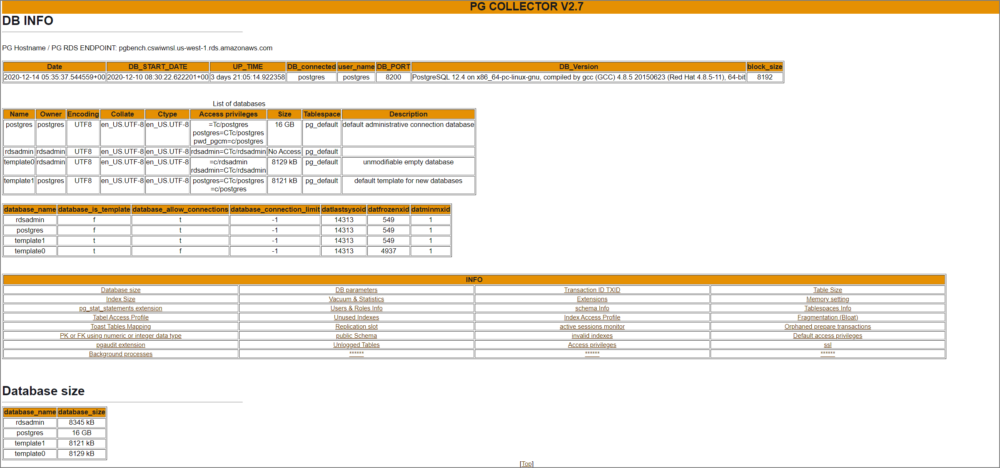

Notes on a convenient tool for extracting mainly static information from PostgreSQL-based RDS and Aurora in AWS environments.

> GitHub - awslabs/pg-collector https://github.com/awslabs/pg-collector

### Enable pg_stat_statements

Note: pg_stat_statements itself is not mandatory. Without installing it, errors will be recorded in the report.

```sql
CREATE EXTENSION pg_stat_statements;
```

If pg_stat_statements is already installed and has accumulated operational statistics, it's better to reset the statistics before running performance tests.

```sql
postgres=# SELECT pg_stat_statements_reset();
 pg_stat_statements_reset
--------------------------
```

### Run the Script

```sh
git clone https://github.com/awslabs/pg-collector.git
cd pg-collector
psql -h aurorapgsqlv1.cluster-xxxxx.ap-northeast-1.rds.amazonaws.com -U postgres -d postgres
\i pg_collector.sql
```

### Execution Example

```sh
postgres=> \i pg_collector.sql
Output format is aligned.
Report name and location: /tmp/pg_collector_postgres-2021-06-10_154014.html
postgres=>
```

### Output Report Example

http://pg-collector.s3-website-us-west-2.amazonaws.com/pg_collector_postgres-2020-12-14_053537.html



The following table information is retrieved. Since it extracts from various pg_catalog sources, it might be useful when you want to quickly obtain and browse information:

- Database size
- Configuration parameters
- Installed extensions
- Vacuum & Statistics
- Unused Indexes & invalid indexes
- Users & Roles Info
- Toast Tables Mapping
- Database schemas
- Fragmentation (Bloat)
- Tablespaces Info
- Memory setting
- Tables and Indexes Size and info
- Transaction ID
- Replication slots
- public Schema info
- Unlogged Tables
