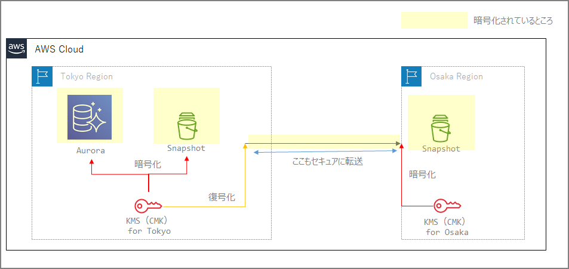

- Since KMS is a service confined within a region, when transferring encrypted snapshots, they are first decrypted in the source region and then re-encrypted with a different CMK in the destination region.

  - When performing cross-region copies for many services, you specify the CMK of the destination region's KMS.
  - Cross-region transfers are also secure. (Users are not aware of this)

- ### Conceptual Diagram

  

# Documentation

### AWS Backup

https://docs.aws.amazon.com/ja_jp/aws-backup/latest/devguide/cross-region-backup.html

> AWS Backup re-encrypts the copy using the customer-managed key of the destination vault.

### For Redshift

https://docs.aws.amazon.com/ja_jp/redshift/latest/mgmt/working-with-db-encryption.html#working-with-aws-kms

> Before a snapshot is copied to the target AWS Region, Amazon Redshift decrypts the snapshot using the master key in the source AWS Region and temporarily re-encrypts it using a randomly generated RSA key that Amazon Redshift manages internally. Amazon Redshift then copies the snapshot over a secure channel to the target AWS Region, decrypts it using the internally managed RSA key, and then re-encrypts it using the master key for the target AWS Region.

### For Aurora

https://docs.aws.amazon.com/ja_jp/AmazonRDS/latest/AuroraUserGuide/USER_CopySnapshot.html

> You can copy snapshots encrypted using an AWS KMS customer master key (CMK). If you copy an encrypted snapshot, the copy of the snapshot must also be encrypted. When you copy an encrypted snapshot within the same AWS Region, you can encrypt the copy with the same AWS KMS CMK as the original snapshot, or you can specify a different CMK. When you copy an encrypted snapshot across regions, you can't use the same AWS KMS CMK for the copy as was used for the source snapshot, because AWS KMS CMKs are region-specific. Instead, you must specify a valid AWS KMS CMK in the target AWS Region.

### For RDS

https://docs.aws.amazon.com/ja_jp/AmazonRDS/latest/UserGuide/Overview.Encryption.html

> - To copy an encrypted snapshot from one AWS Region to another, you must specify the CMK in the destination AWS Region. This is because CMKs are specific to the AWS Region in which they are created.
>
>   The source snapshot remains encrypted throughout the copy process. Amazon Redshift uses envelope encryption to protect data during the copy process. For more information about how envelope encryption works, see "Envelope Encryption" in the AWS Key Management Service Developer Guide.

# Important Notes

RDS has a feature called automatic backup replication to another AWS region, but note that this feature is not supported for encrypted DB instances.

https://docs.aws.amazon.com/ja_jp/AmazonRDS/latest/UserGuide/USER_ReplicateBackups.html

> Backup replication is available for RDS DB instances running the following database engines:
>
> - Oracle version 12.1.0.2.v10 or later
> - PostgreSQL version 9.6 or later
>
> Backup replication is not supported for encrypted DB instances.
