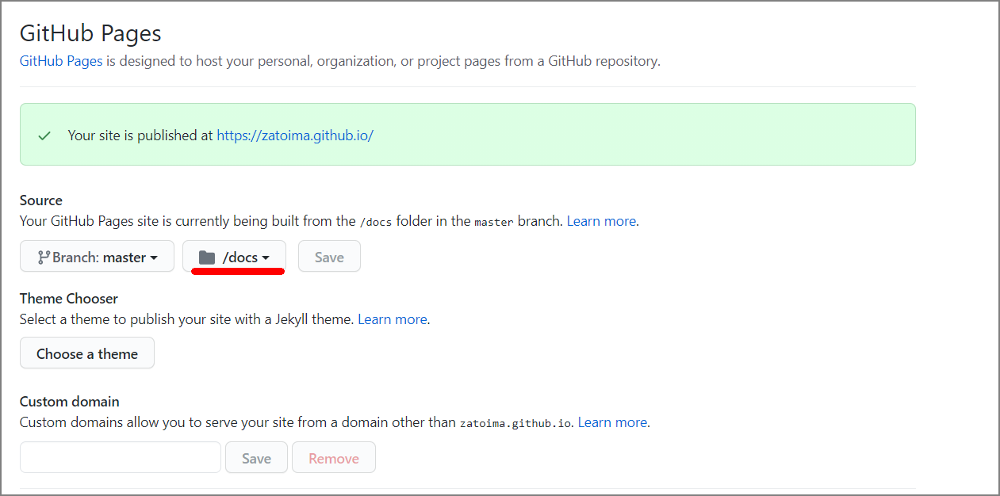

Since the successor version of Academic had become unclear, I switched to a theme called [Mainroad](https://themes.gohugo.io/mainroad/).

### Reference Sites

> - How to configure the Hugo theme "Mainroad" https://itsys-tech.com/list/hugo/007/
> - Creating a blog with Hugo and customizing the mainroad theme - terashim.com https://terashim.com/posts/create-hugo-blog-and-customize-mainroad-theme/

Additionally, I had previously been pushing only the `Public` directory to GitHub, but I changed to push the entire Hugo directory. GitHub Pages settings allow you to choose which directory to publish.

### Future Plans

- Full-text search functionality
  - Since I use this as a memo, I'd like search results to appear when a keyword is passed in the URL
    - [Japanese full-text search with Hugo + Lunr](https://www.google.com/search?q=lunr+search+hugo) looks promising
- Fix the blog name being displayed in all uppercase
- Add social links
