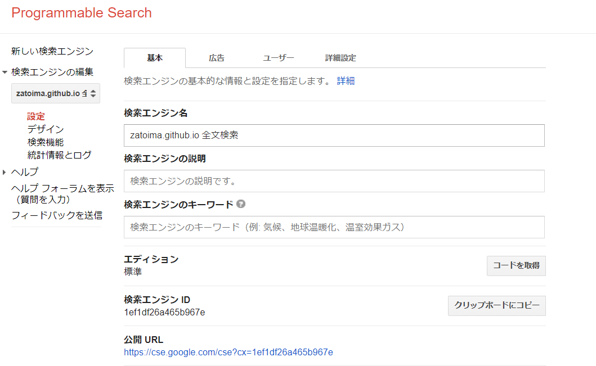
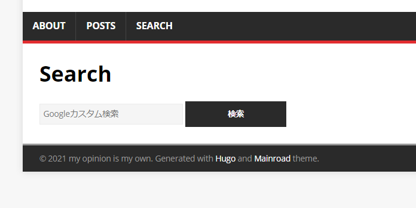

### Prerequisites

- Custom search engine configuration must be completed



### Edit config.toml

To add it to the menu bar, add the following:

```
[[Menus.main]]
  Name = "search"
  URL = "/search/"
```

### Add index.html under content/search

```html
---
title: "Search"
---

<form action="https://cse.google.com/cse">
  <div class="searchBox">
    <input type="hidden" name="cx" value="1ef1df26a465b967e" />
    <input type="hidden" name="ie" value="UTF-8" />
    <input type="search" name="q" placeholder="Google Custom Search" size="30" autocomplete="off" />
    <input type="submit" value="Search" />
  </div>
</form>
```

### Result

The menu bar and search box are now ready.



The URL format is as follows, which allows searching from a command-line launcher:

```html
https://cse.google.com/cse?cx=<search-engine-id>=UTF-8&q=<search-string>
```
