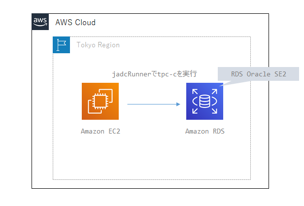
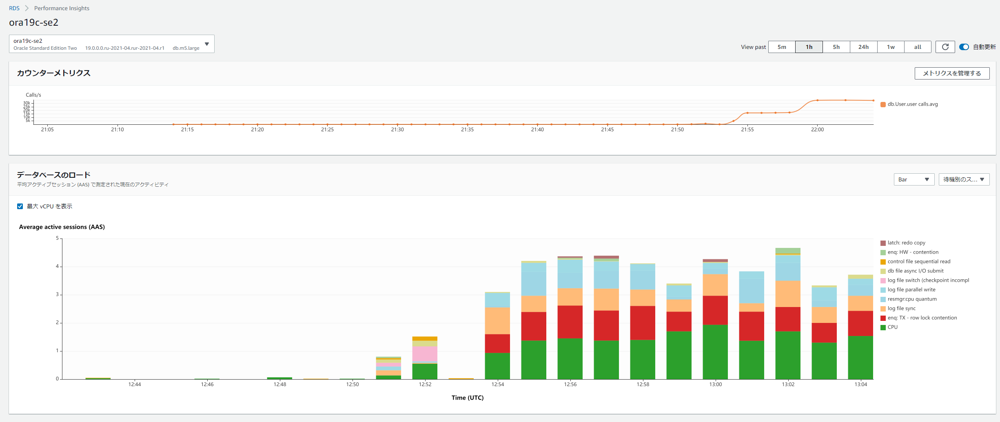
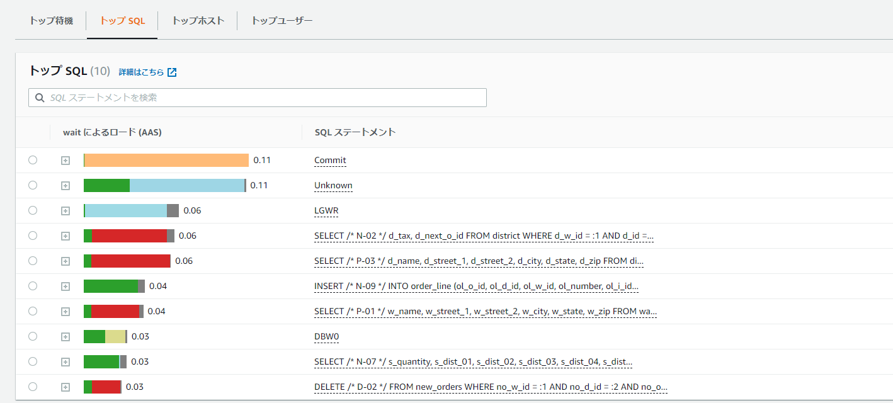

# Overview

Not worth drawing a diagram, but this runs TPC-C based load testing from jdbcRunner deployed on EC2 against RDS Oracle SE2.



For details on the load testing flow, configuration, and behavior using jdbcRunner, see:

> https://dbstudy.info/jdbcrunner/docs_ja/procedure.html

# Downloading jdbcRunner

Download `jdbcrunner-1.3.zip` from the link below and upload it to EC2:

> https://dbstudy.info/jdbcrunner/

# jdbcRunner Setup and Prerequisites

### Install Java

```sh
sudo yum -y install java-1.8.0-openjdk.x86_64
```

### Deploy jdbcrunner

```sh
unzip jdbcrunner-1.3.zip
cd jdbcrunner-1.3
```

### Set Classpath

```sh
export CLASSPATH=/home/ec2-user/jdbcrunner-1.3/jdbcrunner-1.3.jar:/usr/lib/oracle/18.3/client64/lib/ojdbc8.jar
```

### Verify tnsnames.ora

Make sure it is properly configured:

```sh
cat $ORACLE_HOME/network/admin/tnsnames.ora
```

### Modify Scripts

```sh
cd /home/ec2-user/jdbcrunner-1.3/scripts
vi tpcc_load.js
vi tpcc.js
```

Update the existing jdbcUrl as follows:

```sh
#var jdbcUrl = "jdbc:oracle:thin:@//server-public-ip:1521/service-name";
var jdbcUrl = "jdbc:oracle:thin:@//ora19c-se2.xxxxx.ap-northeast-1.rds.amazonaws.com:1521/ora19c";
```

### Create Execution User

```sql
sqlplus oracle@ora19c
drop user tpcc cascade;
drop tablespace tpcc;
create tablespace tpcc datafile autoextend on next 1g maxsize unlimited;
CREATE USER tpcc DEFAULT TABLESPACE tpcc IDENTIFIED BY tpcc;
GRANT CREATE SESSION, CREATE TABLE, UNLIMITED TABLESPACE TO tpcc;
```

### Running jdbcRunner

### Load Test Data

```sh
cd /home/ec2-user/jdbcrunner-1.3/scripts
java JR tpcc_load.js
```

The default scale factor (without specifying -param0) loads approximately 1.5GB of data.

```sh
NAME		STATUS	  TYPE			EXTMGT	   ALLOC	INIT_KB SEGMGT USED(MB)     TOTAL(MB)	 USED(%
--------------- --------- --------------------- ---------- --------- ---------- ------ ------------ ------------ ------
RDSADMIN	ONLINE	  PERMANENT		LOCAL	   SYSTEM	     64 AUTO		6.5	     7.0   92.9
SYSAUX		ONLINE	  PERMANENT		LOCAL	   SYSTEM	     64 AUTO	      375.7	   400.0   93.9
SYSTEM		ONLINE	  PERMANENT		LOCAL	   SYSTEM	     64 MANUAL	      493.7	   500.0   98.7
TEMP		ONLINE	  TEMPORARY		LOCAL	   UNIFORM	   1024 MANUAL	      164.0	   200.0   82.0
TPCC		ONLINE	  PERMANENT		LOCAL	   SYSTEM	     64 AUTO	    1,527.3	 2,148.0   71.1
UNDO_T1 	ONLINE	  UNDO			LOCAL	   SYSTEM	     64 MANUAL	    2,421.0	 2,430.0   99.6
USERS		ONLINE	  PERMANENT		LOCAL	   SYSTEM	     64 AUTO	       68.1	 1,980.6    3.4

7 rows selected.
```

To specify a scale factor, refer to:

> https://dbstudy.info/jdbcrunner/docs_ja/tpc-c.html
>
> By specifying -param0, you can change the scale factor. For each unit of scale factor, the number of records in the warehouse table increases by 1, and other tables increase as follows. The default scale factor is 16.
>
> | Table      | Records                |
> | :--------- | :--------------------- |
> | warehouse  | sf x 1                 |
> | district   | sf x 10                |
> | customer   | sf x 30,000            |
> | history    | sf x 30,000            |
> | item       | 100,000                |
> | stock      | sf x 100,000           |
> | orders     | sf x 30,000            |
> | new_orders | sf x 9,000             |
> | order_line | sf x 300,000 (approx.) |

The example below loads data with 8 parallel agents and scale factor 100, which is approximately 5x the default data volume:

```sh
java JR tpcc_load.js -nAgents 8 -param0 100
```

### Load Test

```sh
cd /home/ec2-user/jdbcrunner-1.3/scripts
java -server JR tpcc.js
```

To modify behavior, refer to the parameter documentation and adjust runtime parameters. For TPC-C, the defaults are nAgents=16, measurementTime=15 minutes (900 seconds), warmupTime=300 seconds, so these are the most likely parameters to change.

> https://dbstudy.info/jdbcrunner/docs_ja/parameter.html

```sh
cd /home/ec2-user/jdbcrunner-1.3/scripts
java -server JR tpcc.js -warmupTime 5 -nAgents 10 -measurementTime 60
```

> -warmupTime: Warmup time. Allows the buffer cache to fill before measurement begins.
>
> -nAgents: Parallelism
>
> -measurementTime: Measurement duration

Results:

```sh
22:13:07 [INFO ] [Progress] 898 sec, 263,277,28,27,27 tps, 237424,237414,23742,23744,23743 tx
22:13:08 [INFO ] [Progress] 899 sec, 274,264,25,28,26 tps, 237698,237678,23767,23772,23769 tx
22:13:09 [INFO ] [Progress] 900 sec, 260,277,27,22,30 tps, 237958,237955,23794,23794,23799 tx
22:13:09 [INFO ] [Total tx count] 237958,237955,23794,23794,23799 tx
22:13:09 [INFO ] [Throughput] 264.4,264.4,26.4,26.4,26.4 tps
22:13:09 [INFO ] [Response time (minimum)] 2,2,0,17,1 msec
22:13:09 [INFO ] [Response time (50%tile)] 38,7,3,81,9 msec
22:13:09 [INFO ] [Response time (90%tile)] 63,14,5,111,15 msec
22:13:09 [INFO ] [Response time (95%tile)] 70,23,6,132,17 msec
22:13:09 [INFO ] [Response time (99%tile)] 93,50,8,184,22 msec
22:13:09 [INFO ] [Response time (maximum)] 478,429,208,445,135 msec
22:13:09 [INFO ] < JdbcRunner SUCCESS
```

Reading the results:

> https://dbstudy.info/jdbcrunner/docs_ja/tpc-c.html
>
> TPC-C defines 5 types of transactions. Results are shown from left to right for New-Order, Payment, Order-Status, Delivery, and Stock-Level transactions.
>
> TPC-C scores typically use the number of New-Order transaction executions per minute. In the example above, 42,727 tx were completed in 15 minutes, so the score is 2,848.5 tpm.

Performance Insights screen during execution:




