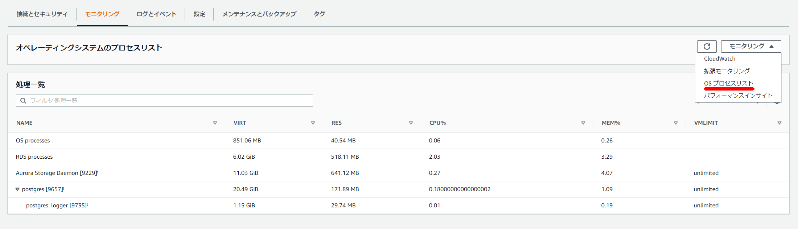

A quick look at pg_proctab, which is now supported in Aurora and RDS PostgreSQL.

The development repository is here:

> pg_proctab / pg_proctab - GitLab https://gitlab.com/pg_proctab/pg_proctab

As described by `PostgreSQL extension to access the operating system process table.`, it provides functions to retrieve OS-related information from PostgreSQL.

For Aurora and RDS, OS process list information was previously available only through the monitoring UI, but it can now also be accessed via SQL from PostgreSQL.



### pg_proctab

```sql
create extension pg_proctab;
\dx
```

### Added Functions

```sql
select * from pg_cputime();
select * from pg_loadavg();
select * from pg_memusage();
select * from pg_proctab();
```

### Execution Results

```sql
postgres=> create extension pg_proctab;
CREATE EXTENSION
postgres=>
postgres=> \dx
                       List of installed extensions
    Name    | Version |   Schema   |              Description
------------+---------+------------+---------------------------------------
 pg_proctab | 0.0.9   | public     | Access operating system process table
 plpgsql    | 1.0     | pg_catalog | PL/pgSQL procedural language
(2 rows)
```

### pg_cputime

```sql
postgres=> select * from pg_cputime();
 user  | nice | system |  idle  | iowait
-------+------+--------+--------+--------
 28387 | 5841 |  14782 | 362592 |   3942
(1 row)

```

> user: normal processes executing in user mode
>
> nice: niced processes executing in user mode
>
> system: processes executing in kernel mode
>
> idle: processes twiddling thumbs
>
> iowait: waiting for I/O to complete

### pg_loadavg

```sql
postgres=> select * from pg_loadavg();
 load1 | load5 | load15 | last_pid
-------+-------+--------+----------
 23.92 |  5.71 |   2.02 |    30030
(1 row)
```

> load1: load average of last minute
>
> load5: load average of last 5 minutes
>
> load15: load average of last 15 minutes
>
> last pid: last pid running

### pg_memusage

```sql
postgres=> select * from pg_memusage();
 memused  | memfree | memshared | membuffers | memcached | swapused | swapfree | swapcached
----------+---------+-----------+------------+-----------+----------+----------+------------
 12767552 | 3357416 |         0 |      62624 |    476284 |        0 |  8384508 |          0
(1 row)
```

> memused: Total physical RAM used
>
> memfree: Total physical RAM not used
>
> memshared: Not used, always 0. (For Solaris.)
>
> membuffers: Temporary storage for raw disk blocks
>
> memcached: In-memory cache for files read from disk
>
> swapused: Total swap space used
>
> swapfree: Memory evicted from RAM that is now temporary on disk
>
> swapcached: Memory that was swapped out, now swapped in but still in swap

### pg_proctab

```sql
postgres=> select * from pg_proctab();
  pid  | comm |                             fullcomm                             | state | ppid | pgrp | session | tty_nr | tpgid | flags | minflt | cminflt | majflt | cmajflt | utime | stime | cutime | cstime | priority | nice | num_threads | itrealvalue | starttime |    vsize    |  rss   | exit_signal | processor
 | rt_priority | policy | delayacct_blkio_ticks | uid | username |  rchar  | wchar | syscr | syscw | reads  | writes | cwrites
-------+------+------------------------------------------------------------------+-------+------+------+---------+--------+-------+-------+--------+---------+--------+---------+-------+-------+--------+--------+----------+------+-------------+-------------+-----------+-------------+--------+-------------+----------
-+-------------+--------+-----------------------+-----+----------+---------+-------+-------+-------+--------+--------+---------
  9811 |      | postgres: autovacuum launcher                                    | S     | 9657 |      |    9811 |      0 |    -1 |       |   4253 |       0 |      2 |       0 |    10 |    20 |      0 |      0 |       39 |   19 |           1 |           0 |     18573 | 22007947264 |  11400 |          17 |
 |           0 |      0 |                     0 |     |          | 5641788 |  3309 |  6468 |  2592 | 172032 |      0 |       0
  9813 |      | postgres: logical replication launcher                           | S     | 9657 |      |    9813 |      0 |    -1 |       |    368 |       0 |      2 |       0 |     0 |     0 |      0 |      0 |       39 |   19 |           1 |           0 |     18573 | 22003752960 |  11380 |          17 |
 |           0 |      0 |                     0 |     |          |   95979 |   726 |    37 |     9 | 454656 |      0 |       0
 15233 |      | postgres: rdsadmin rdsadmin [local] idle                         | S     | 9657 |      |   15233 |      0 |    -1 |       |    638 |       0 |      0 |       0 |    10 |     3 |      0 |      0 |       39 |   19 |           1 |           0 |     28599 | 22114021376 |  17424 |          17 |
 |           0 |      0 |                     0 |     |          |  237463 |     3 |    71 |     3 |      0 |      0 |       0
(17 rows)


```

### References

[pg_proctab: Accessing System Stats in PostgreSQL](https://www.slideshare.net/markwkm/pgproctab-accessing-system-stats-in-postgresql-3573304?from_action=save)
