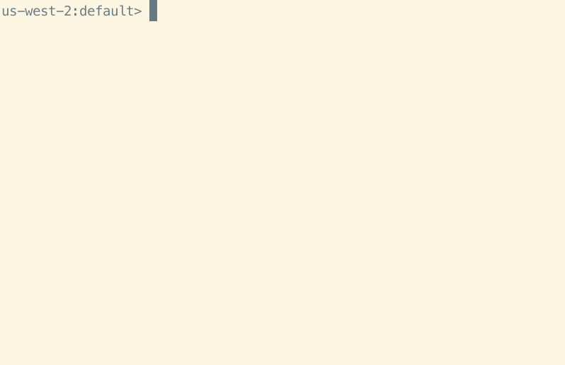

Running Athena queries targeting a database called `s3_spectrum`. (This database was reused from a Redshift Spectrum verification.)

# AWS CLI

With AWS CLI, you use `start-query-execution` to run the query and get the query execution ID, then check the results with another API call. (Somewhat cumbersome.)

### start-query-execution

```sh
aws athena start-query-execution --query-string "select * from supplier limit 2;" --query-execution-context Database=s3_spectrum --result-configuration OutputLocation=s3://xxxx/
```

### get-query-execution

```sh
aws athena get-query-execution --query-execution-id 16751da3-a267-4958-91dd-678c02d2af26
```

### get-query-results

```sh
aws athena get-query-results --query-execution-id 16751da3-a267-4958-91dd-678c02d2af26
```

### Execution Results

`get-query-results` outputs in JSON format, so you may want to use the `jq` command to format it, or download the CSV output stored in S3.

```sh
[ec2-user@ip-10-0-1-31 ~]$ aws athena start-query-execution --query-string "select * from supplier limit 2;" --query-execution-context Database=s3_spectrum --result-configuration OutputLocation=s3://xxxx/
{
    "QueryExecutionId": "16751da3-a267-4958-91dd-678c02d2af26"
}
[ec2-user@ip-10-0-1-31 ~]$ aws athena get-query-execution --query-execution-id 16751da3-a267-4958-91dd-678c02d2af26
{
    "QueryExecution": {
        "QueryExecutionId": "16751da3-a267-4958-91dd-678c02d2af26",
        "Query": "select * from supplier limit 2",
        "StatementType": "DML",
        "ResultConfiguration": {
            "OutputLocation": "s3://xxxx/16751da3-a267-4958-91dd-678c02d2af26.csv"
        },
        "QueryExecutionContext": {
            "Database": "s3_spectrum"
        },
        "Status": {
            "State": "SUCCEEDED",
            "SubmissionDateTime": 1625791317.39,
            "CompletionDateTime": 1625791318.366
        },
        "Statistics": {
            "EngineExecutionTimeInMillis": 761,
            "DataScannedInBytes": 332580,
            "TotalExecutionTimeInMillis": 976,
            "QueryQueueTimeInMillis": 191,
            "QueryPlanningTimeInMillis": 89,
            "ServiceProcessingTimeInMillis": 24
        },
        "WorkGroup": "primary"
    }
}
[ec2-user@ip-10-0-1-31 ~]$ aws athena get-query-results --query-execution-id 16751da3-a267-4958-91dd-678c02d2af26
{
    "ResultSet": {
        "Rows": [
            {
                "Data": [
                    {
                        "VarCharValue": "s_suppkey"
                    },
                    {
                        "VarCharValue": "s_name"
                    },
～omitted～
    },
    "UpdateCount": 0
}
```

# athenacli

AthenaCLI is a command-line interface (CLI) for the Athena service that supports auto-completion and syntax highlighting, similar to CLI tools for PostgreSQL and MySQL. Unlike AWS CLI, it lets you see results in CSV or readable format with a single query execution without multiple API calls.



### Install athenacli

```sh
pip install athenacli
```

### Edit Configuration File

The configuration file is at `~/.athenacli/athenaclirc`:

```sh
vi ~/.athenacli/athenaclirc
```

Only Region and s3_staging_dir are defined. Access keys are omitted since we're using an IAM role:

```sh
[aws_profile default]
# If you are a user of aws cli, you might want to use some configurations of aws cli,
# please refer to https://athenacli.readthedocs.io/en/latest/awsconfig.html for more infomation.
aws_access_key_id = ''
aws_secret_access_key = ''
region = 'ap-northeast-1' # e.g us-west-2, us-east-1

# Add role_arn to assume a role required for Athena access
role_arn = '' # e.g. arn:aws:iam::987654321000:role/MyAthenaAccessRole

# Amazon S3 staging directory where query results are stored
# NOTE: S3 should in the same region as specified above.
# The format is 's3://<your s3 directory path>'
s3_staging_dir = 's3://athenadatacsv/'

# Name of athena workgroup that you want to use
work_group = 'primary' # e.g. primary
～omitted～
```

You can also run it using environment variables:

```sh
export AWS_ACCESS_KEY_ID=YOUR_ACCESS_KEY_ID
export AWS_SECRET_ACCESS_KEY=YOUR_SECRET_ACCESS_KEY
export AWS_DEFAULT_REGION=ap-northeast-1
export AWS_ATHENA_S3_STAGING_DIR=s3://YOUR_S3_BUCKET/path/to/
```

### Execution

Passing SQL as an argument:

```sh
[ec2-user@ip-10-0-1-31 .athenacli]$ athenacli s3_spectrum -e 'select * from supplier limit 2'
s_suppkey,s_name,s_address,s_city,s_nation,s_region,s_phone
1,Supplier#000000001," N kD4on9OM Ipw3,gf0J",PERU     0,PERU,AMERICA,27-989-741-2988
2,Supplier#000000002,89eJ5ksX3Imx,ETHIOPIA 1,ETHIOPIA,AFRICA,15-768-687-3665
[ec2-user@ip-10-0-1-31 .athenacli]$
```

Running interactively on the command line:

```sh
[ec2-user@ip-10-0-1-31 .athenacli]$ athenacli s3_spectrum
ap-northeast-1:s3_spectrum> select * from supplier limit 2;
+-----------+--------------------+-----------------------+------------+----------+----------+-----------------+
| s_suppkey | s_name             | s_address             | s_city     | s_nation | s_region | s_phone         |
+-----------+--------------------+-----------------------+------------+----------+----------+-----------------+
| 1         | Supplier#000000001 |  N kD4on9OM Ipw3,gf0J | PERU     0 | PERU     | AMERICA  | 27-989-741-2988 |
| 2         | Supplier#000000002 | 89eJ5ksX3Imx          | ETHIOPIA 1 | ETHIOPIA | AFRICA   | 15-768-687-3665 |
+-----------+--------------------+-----------------------+------------+----------+----------+-----------------+
2 rows in set
Execution time: 773 ms, Data scanned: 320.58 KB, Approximate cost: $0.00
Time: 1.349s
ap-northeast-1:s3_spectrum>
```

For detailed runtime configuration options, refer to the GitHub readme:

> https://github.com/dbcli/athenacli

### References

> [dbcli/athenacli: AthenaCLI is a CLI tool for AWS Athena service that can do auto-completion and syntax highlighting.](https://github.com/dbcli/athenacli)
