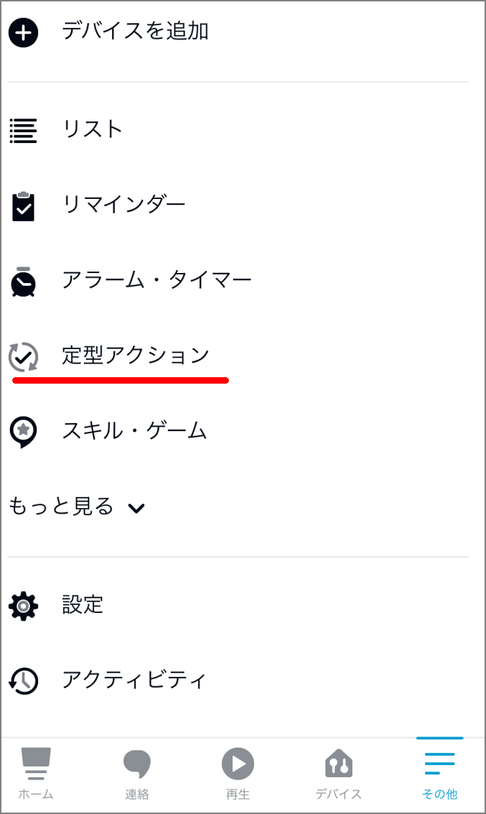
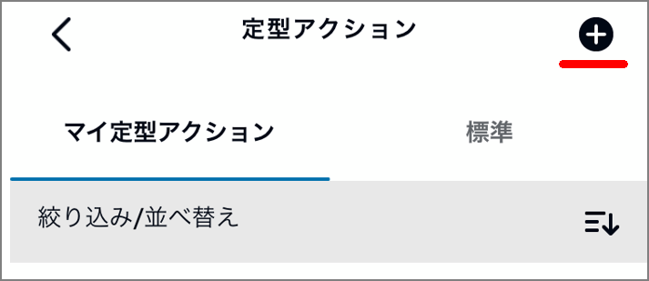
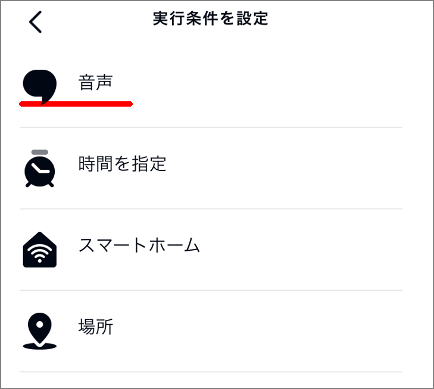
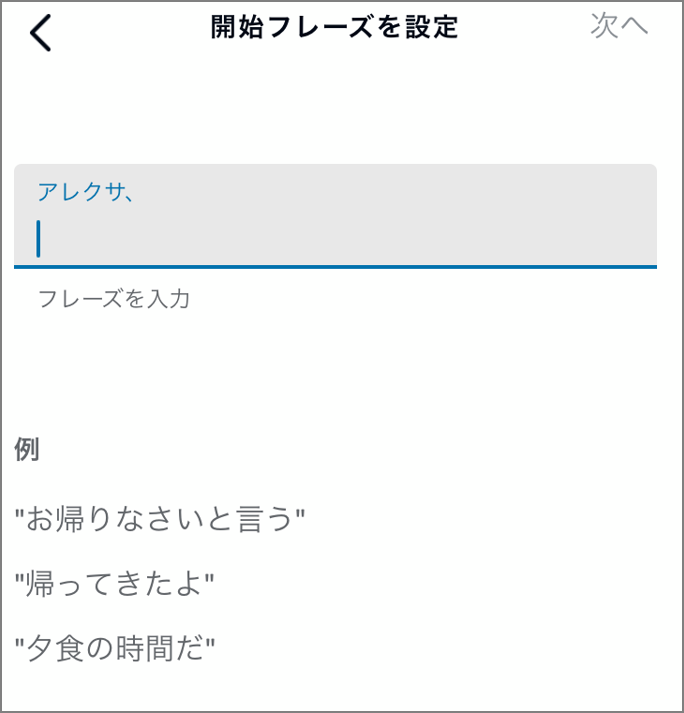
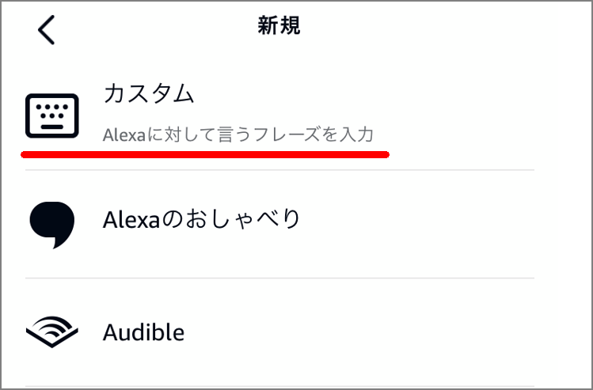
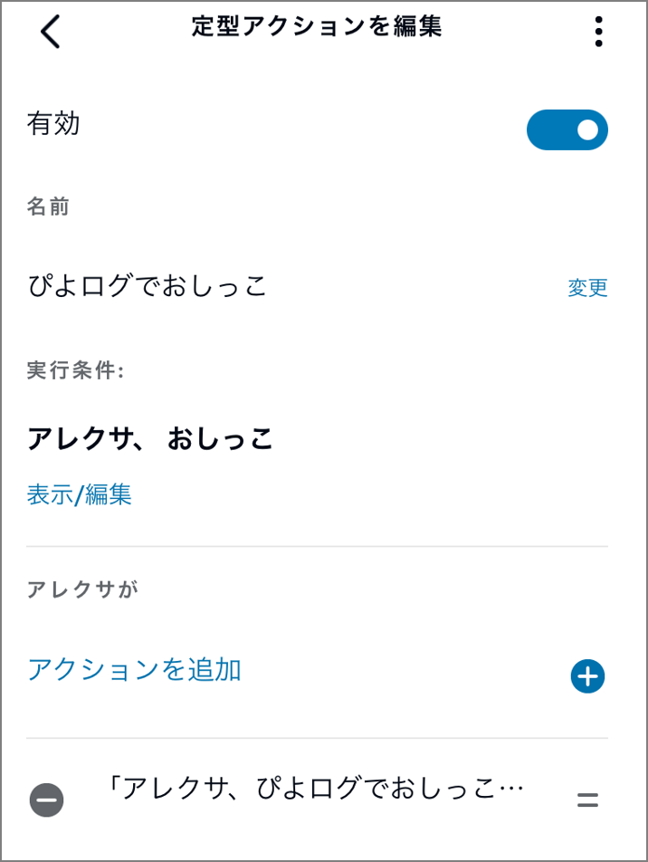

Recently, I've been struggling with first-time parenting. I'm using Piyolog via Alexa to keep childcare records, and it has been very well received by both my wife and me. Before using it, we had to unlock our phones and record things manually, which was tedious. On top of that, we frequently forgot to record things, causing arguments. So I started using Piyolog via Alexa. (I was amazed when I found it!)

> https://www.amazon.co.jp/PiyoLog-Inc-%E3%81%B4%E3%82%88%E3%83%AD%E3%82%B0/dp/B08KFD3FWF

However, there was one issue. It's a wonderful skill, but as noted in the reviews, voice input sometimes fails for certain operations. It doesn't happen frequently, but it occurs about once every five times. Specifically, it's the issue described in reviews:

> Even when saying the template phrase "Alexa, record pee in Piyolog," recording often fails. In most cases, it responds with "This is Piyolog. You can record and check milking, sleep, excretion, and more. What would you like to record?" and you have to say "pee" again, doubling the effort.

Being misheard in the middle of the night at 4 AM doubles the stress, so I wanted to fix this. I decided to set up synonyms (alternative phrases) using Routines. Using Alexa Routines is the easiest way to change the wording for voice commands.

- ##### Select "More" at the bottom right

- ##### Select "Routines"

- ##### Click the "+" button at the top right

- ##### Specify "Routine Name", "When this happens", and "Add action". "Routine Name" is optional and can be skipped.

- ##### For "When this happens", select "Voice". On the next screen, enter the phrase that will trigger the routine.

- ##### For "Add action", enter the phrase that Alexa will speak

With this setup, just saying "pee" to Alexa will trigger the same effect as "Record pee in Piyolog." Since the phrase is short, Alexa won't mishear it, which is very convenient. After that, I created more routines with the same approach for other phrases like "poop," "bath," etc., so I can now log entries in Piyolog with short phrases.

### Thank you Alexa and Piyolog!
