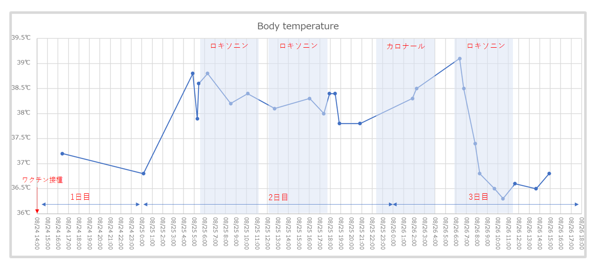
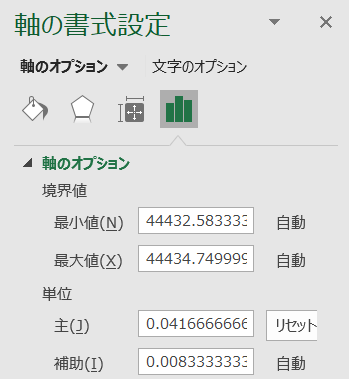

This wasn't immediately obvious, so I'm noting it down.

I wanted to create a chart like the one below with an hourly x-axis (horizontal axis). The data itself is not complete; it is collected only at arbitrary times.

Instead of a line chart, use a scatter chart, and set the axis unit in the "Format Axis" settings to "0.041666666666", which is the serial value representing one hour. By changing this serial value, you can adjust the unit of the X-axis.

Reference

> Excel Graph Time: Excel Basic Operations and Tips http://excelwaza.seesaa.net/article/371155163.html
