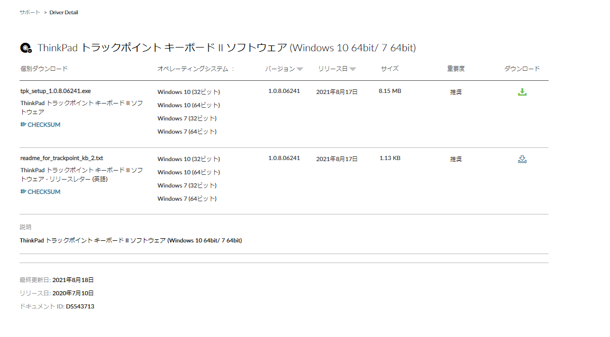
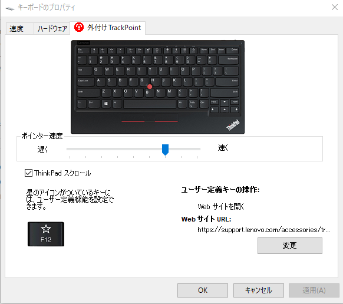

I remember that I used to configure this from Device Manager, but it seems you need to install a utility now.

### Setup Steps

Download the ThinkPad TrackPoint Keyboard II Software from the link below.

https://support.lenovo.com/jp/ja/downloads/ds543713-thinkpad-trackpoint-keyboard-ii-software-for-windows-7-windows-10

After running the exe file, install it with the default settings, then modify the settings from the keyboard properties.

