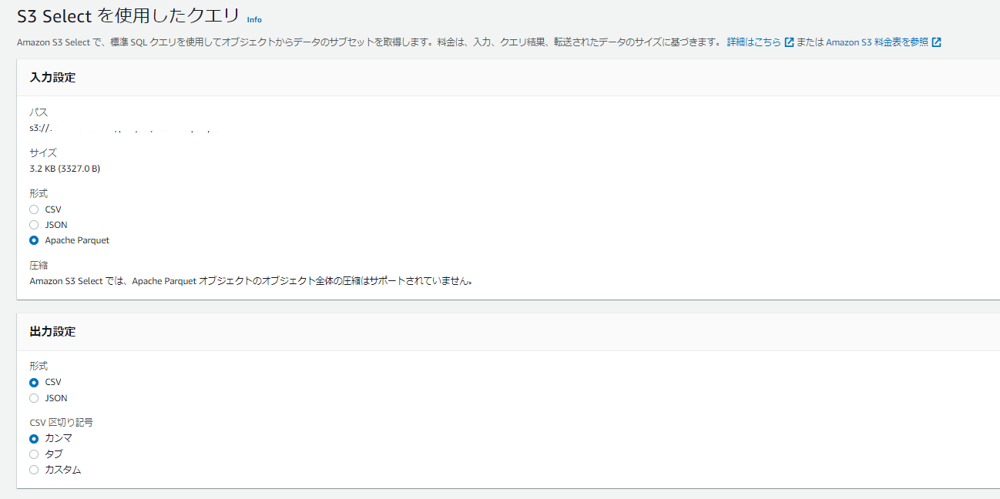
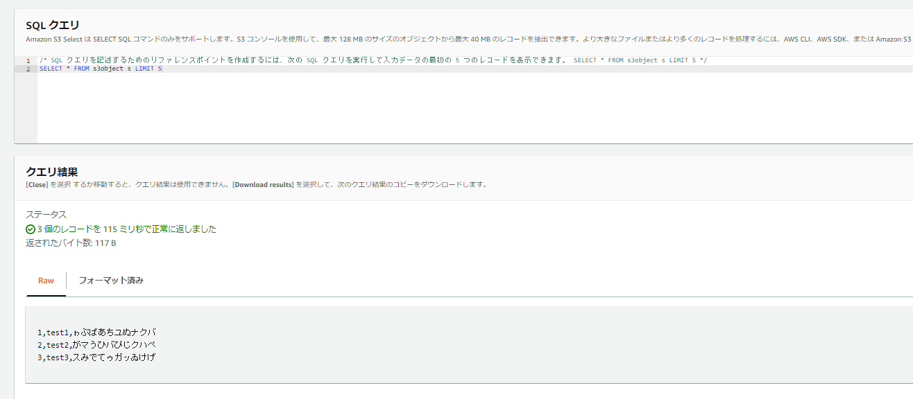

I learned that pandas can handle Parquet files.

### Creating Test CSV Data

```
cat << EOF > testdata.csv
1,test1,ゎぶばあちあぬナクバ
2,test2,がマうひバぴじクハぺ
3,test3,スみでてゥあッあけげ
EOF
```

### Installing pyarrow

```
pip install pyarrow
```

### Converting CSV to Parquet

```
import pandas as pd
import pyarrow as pa
import pyarrow.parquet as pq

#csvからparquetへの変換
df = pd.read_csv('./testdata.csv')
table = pa.Table.from_pandas(df)
pq.write_table(table, './testdata.parquet')
```

### Verifying the Parquet Content

```
#parquetの内容確認
load_df_pq = pd.read_parquet("./testdata.parquet")
print(load_df_pq.info())
print(load_df_pq)
```

You can also easily view Parquet files using AWS S3 Select, which is very convenient.




