### Introduction

> Stream Data from Amazon DynamoDB to Amazon Aurora Using AWS Lambda and Amazon Kinesis Firehose | Amazon Web Services Blog https://aws.amazon.com/blogs/database/how-to-stream-data-from-amazon-dynamodb-aws-lambda-amazon-kinesis-firehose/

Using this 2017 article as a reference, I built the environment from scratch since implementation approaches have changed. This may be replaced if Glue Elastic Views becomes GA. Note that this is for simple replication only. For updates and deletes, you would need to change the loading method to Aurora.

### DynamoDB to Aurora Data Replication Approach

There are several patterns for linking DynamoDB to Aurora, so choose the appropriate approach. See below for reference.

- [Loading Stream Data into Aurora PostgreSQL Database Using AWS DMS and Amazon Kinesis Data Firehose | Amazon Web Services Blog](https://aws.amazon.com/blogs/database/stream-data-into-an-aurora-postgresql-database-using-aws-dms-and-amazon-kinesis-data-firehose/)
- [How to Replicate Ordered Data Between Applications Using Amazon DynamoDB Streams | Amazon Web Services Blog](https://aws.amazon.com/blogs/database/how-to-perform-ordered-data-replication-between-applications-by-using-amazon-dynamodb-streams/)
- [Amazon Kinesis Firehose Data Transformation with AWS Lambda | AWS Compute Blog](https://aws.amazon.com/blogs/compute/amazon-kinesis-firehose-data-transformation-with-aws-lambda/)

This time the flow is: `①DynamoDB -> ②DynamoDB Streams -> ③Amazon Kinesis Data Stream -> ④Amazon Kinesis Firehose -> ⑤Lambda -> ⑥S3 -> ⑦Lambda -> ⑧Aurora`.

The ⑤ Lambda before placing data in S3 converts the streaming JSON to CSV, ⑥ S3 event notification triggers ⑦ Lambda, which loads data into Aurora PostgreSQL.

Although you can send data directly from ④ Kinesis Firehose to S3 without ⑤ Lambda, I chose to insert ⑤ Lambda to store data in CSV format for data loading.

### ① DynamoDB

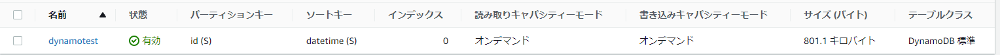

```sh
aws dynamodb create-table \
    --table-name dynamotest \
    --attribute-definitions \
      AttributeName=id,AttributeType=S \
      AttributeName=datetime,AttributeType=S \
    --key-schema AttributeName=id,KeyType=HASH AttributeName=datetime,KeyType=RANGE \
    --billing-mode PAY_PER_REQUEST
```

### ② DynamoDB Streams

Enable data streams:

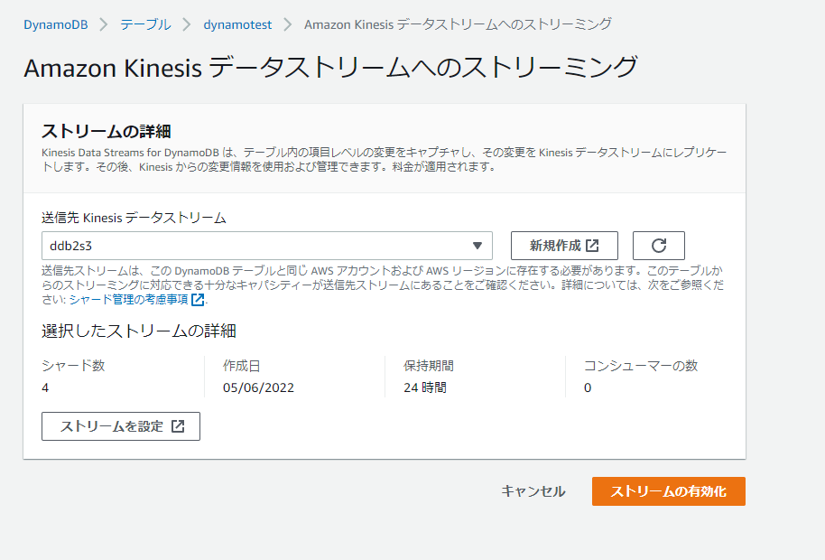

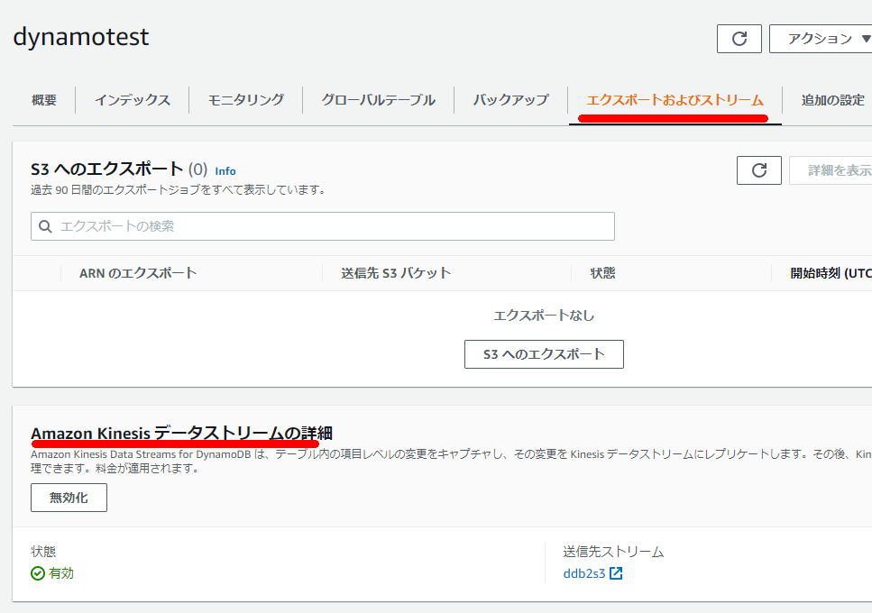

### ③ Amazon Kinesis Data Stream

Choose `On-demand` or specify the `number of shards`. Decide on `data retention period` in advance.

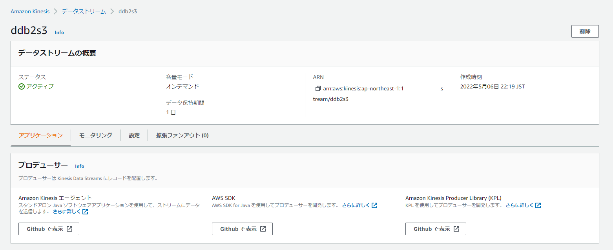

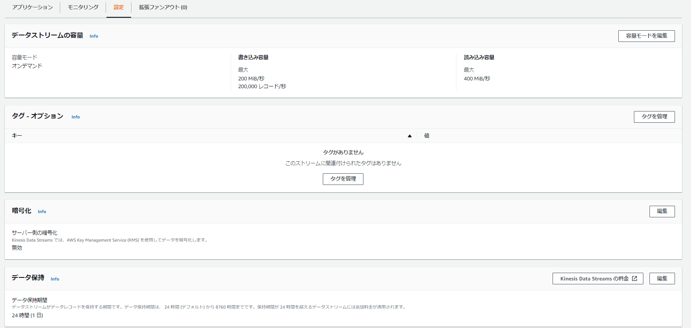

### ④ Amazon Kinesis Firehose

Adjust backup options, buffer size, and interval as needed.

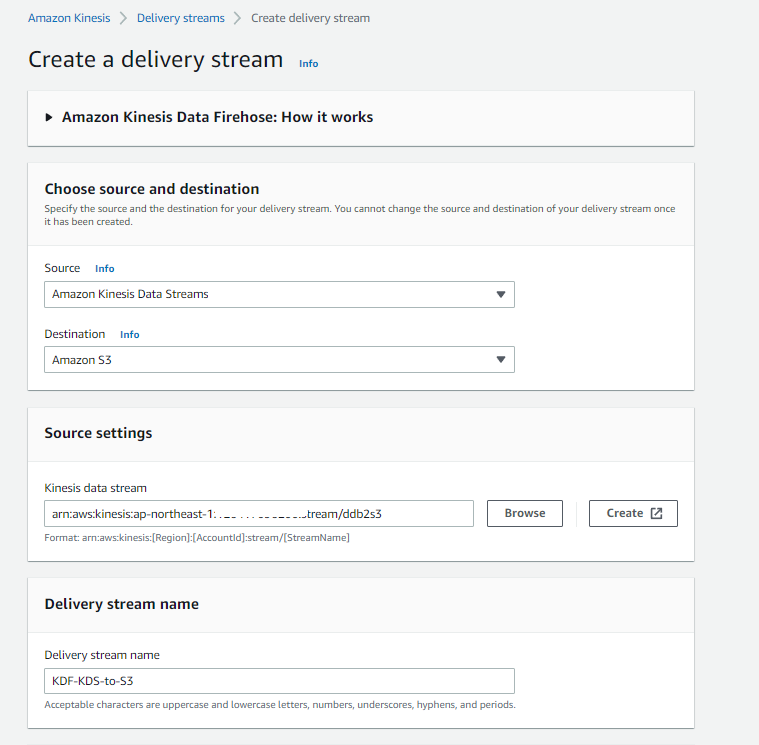

Specify Lambda for `Transform source records with AWS Lambda`.

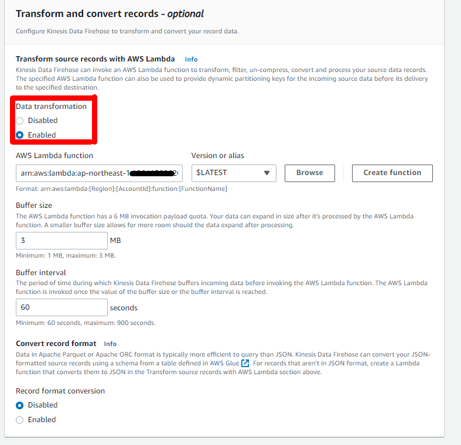

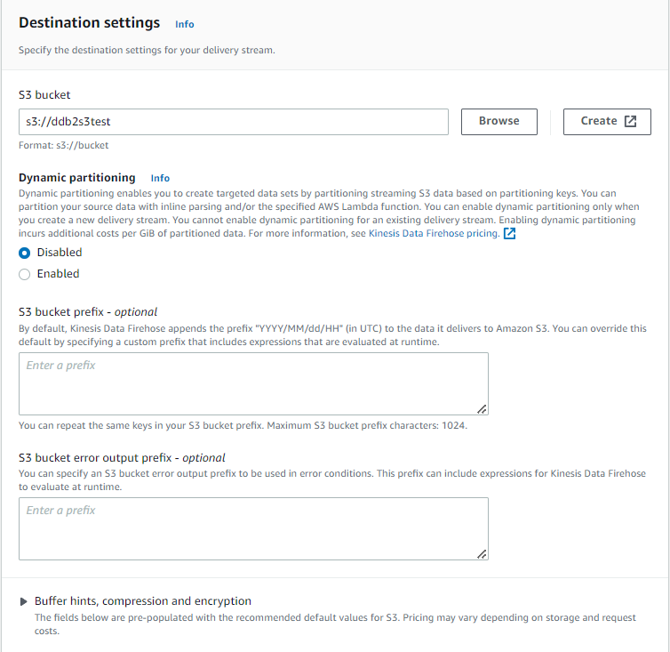

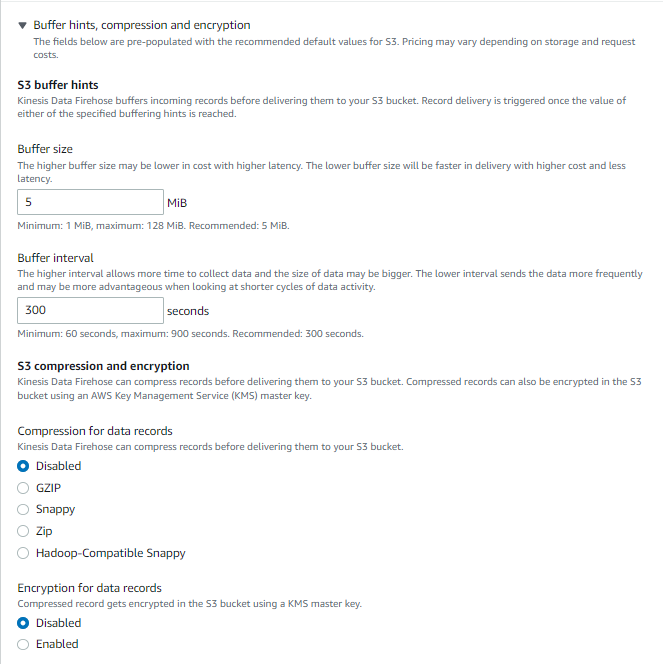

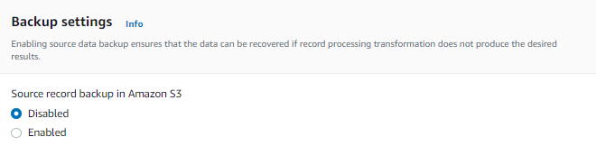

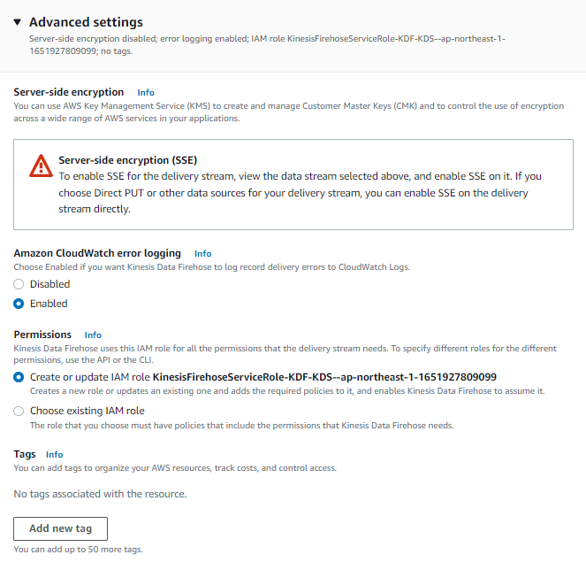

### ⑤ Lambda

As described in the blog below:

- [Python Lambda Script for Converting JSON to CSV Format When Outputting from DynamoDB via Kinesis Firehose to S3 | my opinion is my own](https://zatoima.github.io/aws-dynamodb-to-s3-csv-transform-python-lamdba/)

### ⑥ S3

Nothing special.

### ⑦ Lambda, ⑧ Aurora

As described in the blogs below:

- [Detect S3 File PUT from Lambda and Load CSV Data into Aurora PostgreSQL Table | my opinion is my own](https://zatoima.github.io/aws-aurora-postgres-lambda-s3-event/)

- [Connecting to Aurora PostgreSQL from Lambda Using awslambda-psycopg2 | my opinion is my own](https://zatoima.github.io/aws-aurora-postgres-psycopg2-lambda/)
