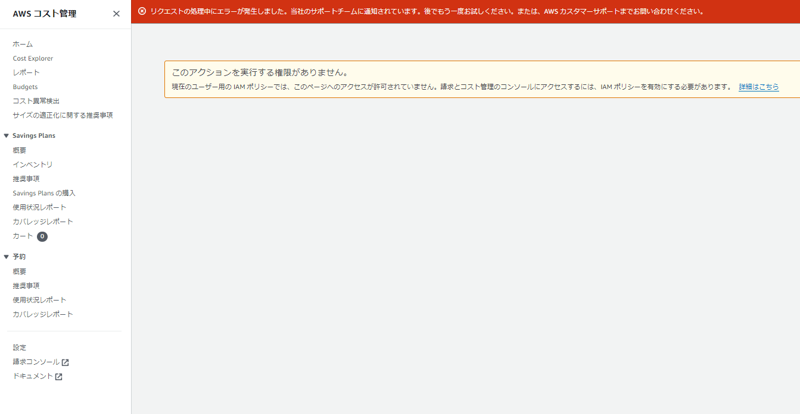
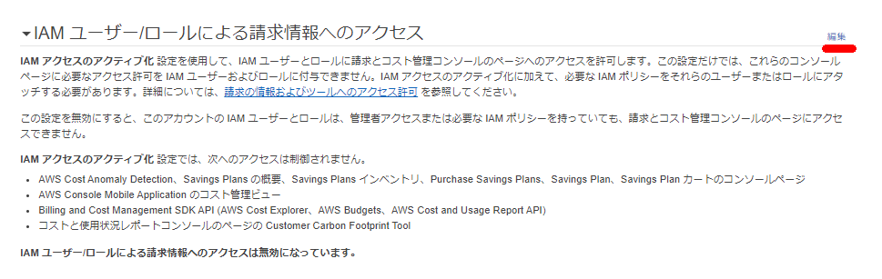
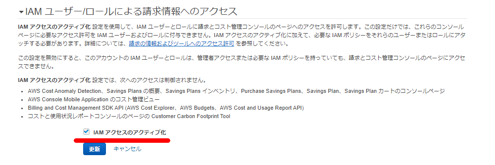
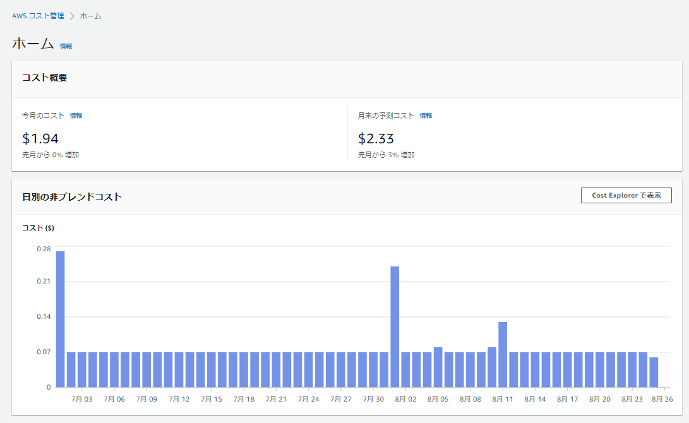

### Screen

### About This Page

It appears that even if an IAM user has AdministratorAccess permissions, they cannot view the cost management page.

> [Overview of Managing Access - AWS Billing](https://docs.aws.amazon.com/awsaccountbilling/latest/aboutv2/control-access-billing.html)
>
> Simply activating IAM access does not grant IAM users and roles the permissions required for these Billing Console pages. In addition to activating IAM access, you must attach the required IAM policies to these users or roles. For more information, see "Using Identity-Based Policies (IAM Policies) with AWS Billing."
>
> To activate the [**Activate IAM Access**] setting, you must sign in to your AWS account using root user credentials, then select the setting on the [My Account](https://console.aws.amazon.com/billing/home#/account) page. Activate this setting for each account where you want to allow IAM users and roles access to Billing Console pages. If you use AWS Organizations, activate this setting for each management account or member account where you want to allow IAM users and roles to access console pages.

### Procedure

> [Overview of Managing Access - AWS Billing](https://docs.aws.amazon.com/awsaccountbilling/latest/aboutv2/control-access-billing.html)
>
> **To activate IAM user and role access to the Billing and Cost Management console:**
>
> 1. Sign in to the AWS Management Console using root account credentials (specifically, the email address and password used to create the AWS account).
> 2. In the navigation bar, choose your account name, then choose [[My Account](https://console.aws.amazon.com/billing/home#/account)].
> 3. Next to [**IAM User and Role Access to Billing Information**], choose [**Edit**].
> 4. Select the [**Activate IAM Access**] checkbox to activate access to the Billing and Cost Management pages.
> 5. Choose **[Update]**.

The cost management screen is now accessible to non-root users as well.

