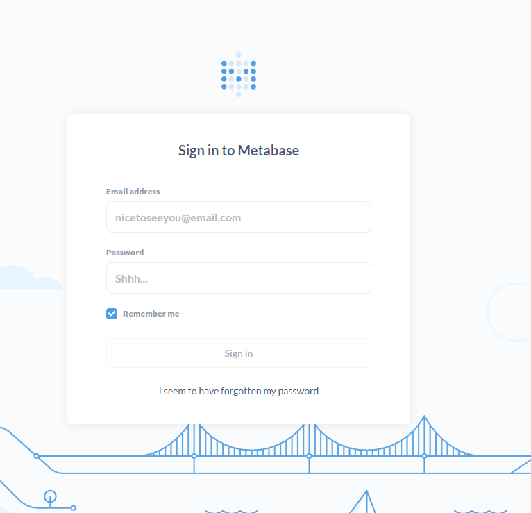

I had previously built Metabase on an EC2 t2.micro, but memory was becoming a concern, so I considered migrating. I wanted to run metabase and postgres smoothly, so I tried Oracle Cloud's always free environment (4 OCPU, 24GB, Arm).

> Shape configuration
>
> Shape: VM.Standard.A1.Flex
>
> Number of OCPUs: 4
>
> Network bandwidth (Gbps): 4
>
> Memory (GB): 24
>
> Local disk: Block storage only

```sh
[opc@oci-arm metabase]$ cat /etc/os-release
NAME="Oracle Linux Server"
VERSION="7.9"
ID="ol"
ID_LIKE="fedora"
VARIANT="Server"
VARIANT_ID="server"
VERSION_ID="7.9"
PRETTY_NAME="Oracle Linux Server 7.9"
ANSI_COLOR="0;31"
CPE_NAME="cpe:/o:oracle:linux:7:9:server"
HOME_URL="https://linux.oracle.com/"
BUG_REPORT_URL="https://bugzilla.oracle.com/"

ORACLE_BUGZILLA_PRODUCT="Oracle Linux 7"
ORACLE_BUGZILLA_PRODUCT_VERSION=7.9
ORACLE_SUPPORT_PRODUCT="Oracle Linux"
ORACLE_SUPPORT_PRODUCT_VERSION=7.9
```

Docker

```sh
[opc@oci-arm metabase]$ docker-compose -v
docker-compose version 1.29.2, build unknown
[opc@oci-arm metabase]$ docker -v
Docker version 19.03.11-ol, build 9bb540d
[opc@oci-arm metabase]$
```

Directory structure

```sh
[opc@oci-arm docker]$ tree
.
├── docker-compose.yaml
├── metabase
│   ├── data
│   └── Dockerfile
└── postgres
    ├── data
    └── init
        └── create_db.sql
```

- docker-compose.yaml

```yaml
version: '3'

services:
  metabase:
    build: ./metabase
    container_name: metabase
    ports:
      - 3000:3000
    volumes:
      - ./metabase/data:/metabase-data
    environment:
      - MB_DB_FILE=/metabase-data/metabase.db

  postgres:
    image: arm32v7/postgres:latest
    ports:
      - 5432:5432
    volumes:
      - ./postgres/data:/var/lib/postgresql/data
      - ./postgres/init:/docker-entrypoint-initdb.d
    environment:
      POSTGRES_USER: postgres
      POSTGRES_PASSWORD: postgres
```

- Metabase Dockerfile

Since this is ARM, it didn't work smoothly. Referenced the github notes below. The Dockerfile in the linked page had an old version of Ubuntu where apt-get didn't work, so I updated to the latest version.

> https://github.com/metabase/metabase/issues/13119#issuecomment-1000350647

```yaml
FROM ubuntu:latest

ENV FC_LANG en-US LC_CTYPE en_US.UTF-8

# dependencies
RUN apt-get update -yq && apt-get install -yq bash fonts-dejavu-core fonts-dejavu-extra fontconfig curl openjdk-11-jre-headless && \
    apt-get clean && \
    rm -rf /var/lib/{apt,dpkg,cache,log}/ && \
    mkdir -p /app/certs && \
    curl https://s3.amazonaws.com/rds-downloads/rds-combined-ca-bundle.pem -o /app/certs/rds-combined-ca-bundle.pem  && \
    keytool -noprompt -import -trustcacerts -alias aws-rds -file /app/certs/rds-combined-ca-bundle.pem -keystore /etc/ssl/certs/java/cacerts -keypass changeit -storepass changeit && \
    curl https://cacerts.digicert.com/DigiCertGlobalRootG2.crt.pem -o /app/certs/DigiCertGlobalRootG2.crt.pem  && \
    keytool -noprompt -import -trustcacerts -alias azure-cert -file /app/certs/DigiCertGlobalRootG2.crt.pem -keystore /etc/ssl/certs/java/cacerts -keypass changeit -storepass changeit && \
    mkdir -p /plugins && chmod a+rwx /plugins && \
    useradd --shell /bin/bash metabase


WORKDIR /app

# copy app from the offical image
COPY --from=metabase/metabase:latest /app /app

RUN chown -R metabase /app

USER metabase
# expose our default runtime port
EXPOSE 3000

# run it
ENTRYPOINT ["/app/run_metabase.sh"]
```

- docker-compose

```sh
[opc@oci-arm metabase]$ docker-compose up -d
Creating network "docker_default" with the default driver
Creating docker_postgres_1 ... done
Creating metabase          ... done
[opc@oci-arm metabase]$ docker ps
CONTAINER ID        IMAGE                     COMMAND                  CREATED             STATUS              PORTS                    NAMES
c74acd420716        arm32v7/postgres:latest   "docker-entrypoint.s…"   5 seconds ago       Up 4 seconds        0.0.0.0:5432->5432/tcp   docker_postgres_1
d15ea2032f2d        docker_metabase           "/app/run_metabase.sh"   5 seconds ago       Up 4 seconds        0.0.0.0:3000->3000/tcp   metabase
```

- Connection verification

> http://"Public IP":3000/auth/login



- PostgreSQL configuration changes

Modified parameters in `postgresql.conf`

```sh
[root@oci-arm data]# grep "share" postgresql.conf
shared_buffers = 2048MB			# min 128kB
```

```sql
metabase=# show shared_buffers;
 shared_buffers
----------------
 2GB
(1 row)

```
