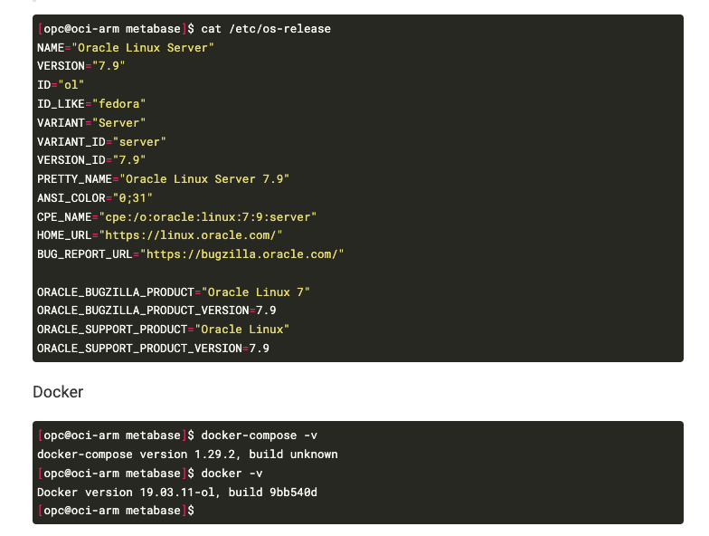

I migrated Hugo (the execution environment for this blog) when switching computers. I forgot how to change the syntax highlight settings, so I looked it up and made some notes.

```
zatoima@M1MBA zatoima.github.io % pwd
/Users/zatoima/work/hugo/zatoima.github.io
zatoima@M1MBA zatoima.github.io %
zatoima@M1MBA zatoima.github.io % mkdir -p assets/css/libs/chroma/
zatoima@M1MBA zatoima.github.io % hugo gen chromastyles --style=monokai > assets/css/libs/chroma/monokai.css
zatoima@M1MBA zatoima.github.io % ls -l assets/css/libs/chroma/monokai.css
-rw-r--r--  1 zatoima  staff  4394  9 26 17:15 assets/css/libs/chroma/monokai.css
```

Modify the `syntax_highlighter` section:

```
zatoima@M1MBA zatoima.github.io % cat config/_default/params.yaml
# SITE SETUP
# Guide: https://wowchemy.com/docs/getting-started/
# Documentation: https://wowchemy.com/docs/
# This file is formatted using YAML syntax - learn more at https://learnxinyminutes.com/docs/yaml/

features:
  syntax_highlighter:
    theme_light: monokai
    theme_dark: monokai
  math:
    enable: false
~omitted~
```

> https://wowchemy.com/docs/getting-started/customization/#code-syntax-highlighting
>
> ### Code syntax highlighting
>
> Hugo's code syntax highlighter is named *Chroma*. How can we customize Chroma's light and dark styles?
>
> Check out the languages and styles which Hugo supports at the [Chroma Playground](https://swapoff.org/chroma/playground/)
>
> Choose from one of the built-in styles including:
>
> - github-light
> - github-dark
> - dracula
>
> or [import a Hugo Chroma style](https://gohugo.io/commands/hugo_gen_chromastyles/) to your `assets/css/libs/chroma/` folder (creating the folders as needed). For example, to import the `xcode` style as `xcode-light` and `xcode-dark` as `xcode-dark`:
>
> ```bash
> mkdir -p assets/css/libs/chroma/
> hugo gen chromastyles --style=xcode > assets/css/libs/chroma/xcode-light.css
> hugo gen chromastyles --style=xcode-dark > assets/css/libs/chroma/xcode-dark.css
> ```
>
> Once you have chosen your styles, reference them in `params.yaml`:
>
> ```yaml
> features:
>   syntax_highlighter:
>     theme_light: xcode-light
>     theme_dark: xcode-dark
> ```

The syntax highlight now looks like this.


