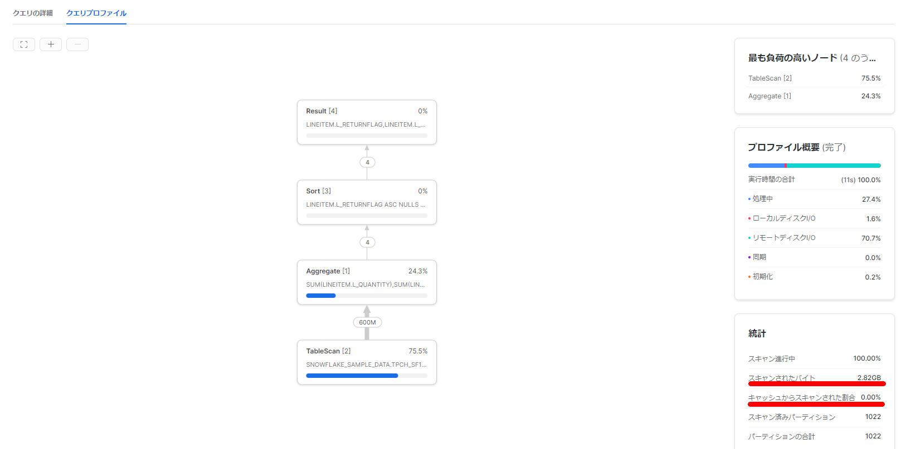
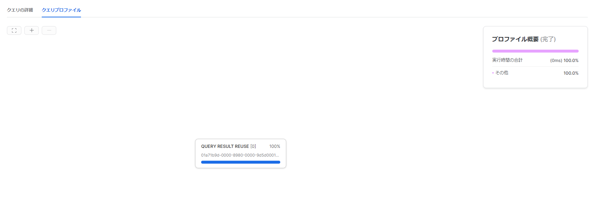
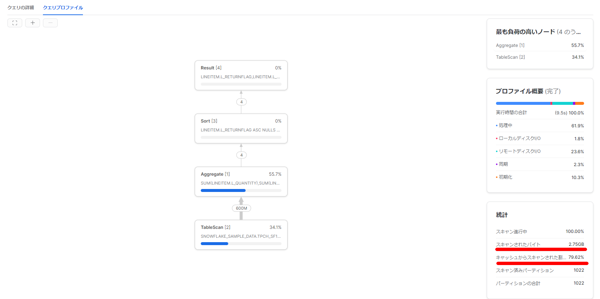
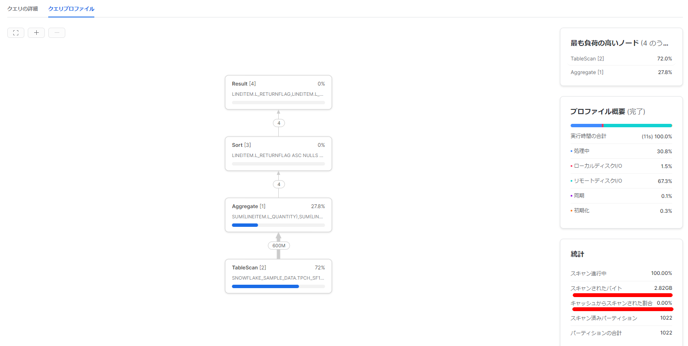

Snowflake's result cache can be disabled by changing a parameter, but I wondered if the data cache can also be disabled, so I investigated.

### Conclusion

Suspend and resume the warehouse.

> [Considerations for Warehouses — Snowflake Documentation](https://docs.snowflake.com/en/user-guide/warehouses-considerations.html)
>
> - When a warehouse is suspended, the cache is dropped, so after resuming the warehouse, some query performance may decrease initially. As the resumed warehouse runs and processes more queries, the cache is rebuilt and query performance improves for queries that can use the cache.

```sql
SHOW WAREHOUSES;
ALTER WAREHOUSE IF EXISTS XSMALL SUSPEND;
SHOW WAREHOUSES;
ALTER WAREHOUSE XSMALL RESUME IF SUSPENDED;
SHOW WAREHOUSES;
```

### SQL

```sql
SELECT l_returnflag, l_linestatus,
SUM(l_quantity) AS sum_qty,
SUM(l_extendedprice) AS sum_base_price,
SUM(l_extendedprice * (l_discount)) AS sum_disc_price,
SUM(l_extendedprice * (l_discount) * (1+l_tax)) AS sum_charge,
AVG(l_quantity) AS avg_qty,
AVG(l_extendedprice) AS avg_price,
AVG(l_discount) AS avg_disc,
COUNT(*) AS count_order
FROM lineitem
WHERE l_shipdate <= dateadd(day, 90, to_date('1998-12-01'))
GROUP BY l_returnflag, l_linestatus
ORDER BY l_returnflag, l_linestatus;
```

### First Execution

Reading from remote disk (S3) occurs. The percentage scanned from cache is naturally 0%.



### Query Profile When Executed Twice Without Changes

The result cache is used, completing quickly.



### Disabling Query Result Cache

```sql
SHOW PARAMETERS LIKE '%USE_CACHED_RESULT%';
ALTER SESSION SET USE_CACHED_RESULT = FALSE;
```

Even without using the result cache, data is read from the data cache. (The warehouse size is small, so perhaps not everything fits in the cache.)



### How to Disable Data Cache

> Is it possible to clear the cache? https://community.snowflake.com/s/question/0D50Z00008SNECoSAP/is-it-possible-to-clear-the-cache
>
> Aside from the USE_CACHED_RESULT session parameter, is there any way to force the warehouse cache to disable? https://community.snowflake.com/s/question/0D70Z000001l2ovSAA/detail

As described above, there is no command available for this, so suspend and resume the warehouse to prevent data cache from being used.

- [Considerations for Warehouses — Snowflake Documentation](https://docs.snowflake.com/en/user-guide/warehouses-considerations.html)
  - When a warehouse is suspended, the cache is dropped, so after resuming the warehouse, some query performance may decrease initially. As the resumed warehouse runs and processes more queries, the cache is rebuilt and query performance improves for queries that can use the cache.

```sql
SHOW WAREHOUSES;
ALTER WAREHOUSE IF EXISTS XSMALL SUSPEND;
SHOW WAREHOUSES;
ALTER WAREHOUSE XSMALL RESUME IF SUSPENDED;
SHOW WAREHOUSES;
```

The percentage scanned from cache is now 0%.



### Reference

> - [Learning About Snowflake's Three Types of Cache | DevelopersIO](https://dev.classmethod.jp/articles/snowflake-cache-three/)
