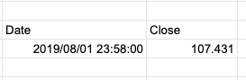

Using only the GOOGLEFINANCE function will return both a Date and Close price.

```
=GOOGLEFINANCE("CURRENCY:USDJPY", "price", "2019/8/1")
```



Wrap the function with `index(..., 2, 2)` to get only the second cell in the second row.

```
=index(GOOGLEFINANCE("CURRENCY:USDJPY", "price", "2019/8/1"), 2, 2)
```

Getting a specific company's stock price. Also use the Index function to retrieve only the desired information.

```
=index(GOOGLEFINANCE("NASDAQ:AMZN", "price", "2019/8/1"), 2, 2)
```
