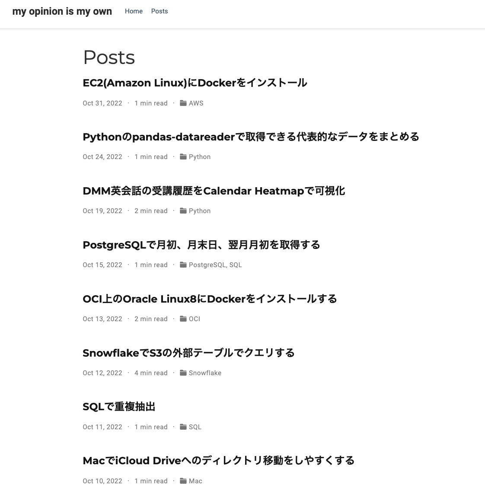
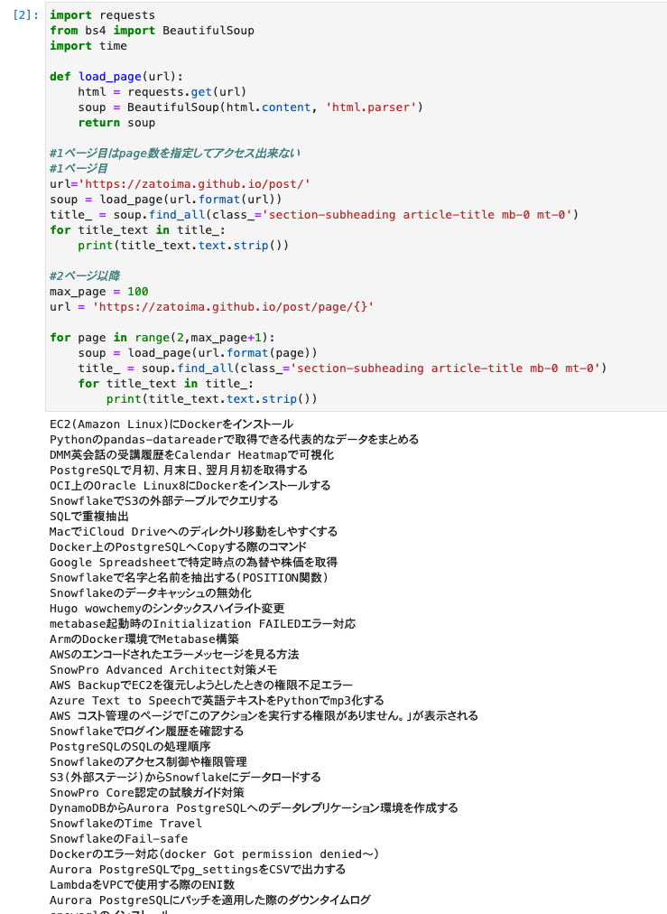

Getting a list of Hugo articles using `BeautifulSoup`.

```python
import requests
from bs4 import BeautifulSoup
import time

def load_page(url):
    html = requests.get(url)
    soup = BeautifulSoup(html.content, 'html.parser')
    return soup

# Page 1 cannot be accessed by specifying the page number
# Page 1
url='https://zatoima.github.io/post/'
soup = load_page(url.format(url))
title_ = soup.find_all(class_='section-subheading article-title mb-0 mt-0')
for title_text in title_:
    print(title_text.text.strip())

# Page 2 and beyond
max_page = 100
url = 'https://zatoima.github.io/post/page/{}'

for page in range(2,max_page+1):
    soup = load_page(url.format(page))
    title_ = soup.find_all(class_='section-subheading article-title mb-0 mt-0')
    for title_text in title_:
        print(title_text.text.strip())
```

### Post List Screen



### Execution


