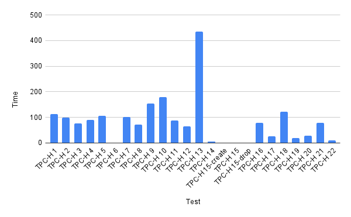

Based on this [Github script](https://github.com/SatoriCyber/snowflake-tpch-timing), I adapted it to work.

### Reference Materials

- TPC BENCHMARK H https://www.tpc.org/tpc_documents_current_versions/pdf/tpc-h_v3.0.1.pdf
- TPC Download Current Specs/Source https://www.tpc.org/tpc_documents_current_versions/current_specifications5.asp?utm_source=pocket_saves

## Prerequisites

### Script Execution Environment

```sh
zatoima@M1MBA snowflake_benchmark % sw_vers
ProductName:		macOS
ProductVersion:		13.0
BuildVersion:		22A380
```

### Use SECURITYADMIN to create roles
```sql
USE ROLE SECURITYADMIN;
```

### Create role
```sql
CREATE ROLE WORKROLE;
```

### Grant permissions to created role to SYSADMIN and your user (inheritance)
```sql
GRANT ROLE WORKROLE TO ROLE SYSADMIN;
GRANT ROLE WORKROLE TO USER zato;
```

### Switch roles and create warehouse
```sql
USE ROLE SYSADMIN;
CREATE WAREHOUSE WORK_WH WITH
  WAREHOUSE_SIZE = xsmall
  INITIALLY_SUSPENDED = TRUE
  AUTO_SUSPEND = 60
  AUTO_RESUME = TRUE;
```

### Grant warehouse usage permissions
```sql
GRANT USAGE ON WAREHOUSE WORK_WH TO ROLE WORKROLE;
```

### Create database
```sql
CREATE DATABASE TESTDB;
```

### Grant all necessary permissions to the role to create tables in any schema
```sql
GRANT USAGE ON DATABASE TESTDB TO ROLE WORKROLE;
GRANT USAGE ON SCHEMA TESTDB.PUBLIC TO ROLE WORKROLE;
GRANT CREATE TABLE ON SCHEMA TESTDB.PUBLIC TO ROLE WORKROLE;
```

### Create tables
```sql
USE ROLE WORKROLE;
USE WAREHOUSE WORK_WH;
USE DATABASE TESTDB;
USE SCHEMA TESTDB.PUBLIC;
```

### Create schema for VIEW creation

```sql
CREATE DATABASE TESTDB;
CREATE SCHEMA temp;
GRANT USAGE ON DATABASE TESTDB TO ROLE WORKROLE;
GRANT USAGE ON SCHEMA TESTDB.temp TO ROLE WORKROLE;
GRANT CREATE TABLE ON SCHEMA TESTDB.temp TO ROLE WORKROLE;
GRANT CREATE VIEW ON SCHEMA TESTDB.TEMP TO ROLE WORKROLE;
```

### Install libraries with pip
```python
pip install snowflake.connector,logzero
```

### Place files as follows
```sh
zatoima@M1MBA snowflake_benchmark % tree
.
├── tpch.py
└── tpch.sql
```

### Python

Created as `tpch.py`. Modify the environment-specific portions. Set session parameter (`USE_CACHED_RESULT`) to avoid using result cache.

```python
import snowflake.connector
import time
from logzero import logger
import logzero
import os

# Environment-specific
direct_con = snowflake.connector.connect(
    user='xxxx',
    password='xxxxx',
    account='xxxxxxx',
    database='SNOWFLAKE_SAMPLE_DATA',
    schema='tpch_sf10',
    warehouse='WORK_WH'
    session_parameters={
        'USE_CACHED_RESULT': 'False',
    }
)

NUM_OF_SAMPLES = 10

# End of environment-specific section
# Note: The database and schema for creating VIEWs in the SQL script are also environment-specific

def benchmark():
    print("Benchmarking for snowflake")

    filename = "results.txt"
    with open(filename, 'w') as result_file:
        with open('tpch.sql') as f:
            all_queries = f.read()
            results = "Test\tTime\n"
            for i in range(0, NUM_OF_SAMPLES):

                # Running the benchmark for each query in the queries file
                for query in all_queries.split(';'):
                    #If there is a blank line, "IndexError: list index out of range list split" is returned, so "if statement" is added.
                    if query != '\n':
                        label = query.split("-- ")[1].split('\n')[0]
                        query = query.rstrip()
                        start_ts = time.time()

                        logger.info(label + " Start!!")
                        cs = direct_con.cursor()
                        cs.execute(query)
                        rows = cs.fetchall()
                        for _row in rows:
                            continue

                        end_ts = time.time()
                        delta = end_ts-start_ts
                        # Results are tab-delimited for easy pasting to a spreadsheet
                        results += "{0:s}\t{1:3.5f}\n".format(label, delta)
                        logger.info(label + " Done!!")
            result_file.write(results)

if __name__ == "__main__":
    if "LOG_LEVEL" in os.environ:
        logzero.loglevel(int(os.environ["LOG_LEVEL"]))
    benchmark()
```

### SQL for Execution

TPC-H SQL called from the Python side.

Note: The database and schema for creating VIEWs are also environment-specific. Creating in the `TEMP` schema of `TESTDB`.

```sql
-- TPC-H 1
select
	l_returnflag,
	l_linestatus,
	sum(l_quantity) as sum_qty,
	sum(l_extendedprice) as sum_base_price,
	sum(l_extendedprice * (1 - l_discount)) as sum_disc_price,
	sum(l_extendedprice * (1 - l_discount) * (1 + l_tax)) as sum_charge,
	avg(l_quantity) as avg_qty,
	avg(l_extendedprice) as avg_price,
	avg(l_discount) as avg_disc,
	count(*) as count_order
from
	lineitem
where
	l_shipdate <= DATEADD(day, 90, '1998-12-01')
group by
	l_returnflag,
	l_linestatus
order by
	l_returnflag,
	l_linestatus;

-- TPC-H 2
select
	s_acctbal,
	s_name,
	n_name,
	p_partkey,
	p_mfgr,
	s_address,
	s_phone,
	s_comment
from
	part,
	supplier,
	partsupp,
	nation,
	region
where
	p_partkey = ps_partkey
	and s_suppkey = ps_suppkey
	and p_size = 15
	and p_type like '%BRASS'
	and s_nationkey = n_nationkey
	and n_regionkey = r_regionkey
	and r_name = 'EUROPE'
	and ps_supplycost = (
		select
			min(ps_supplycost)
		from
			partsupp,
			supplier,
			nation,
			region
		where
			p_partkey = ps_partkey
			and s_suppkey = ps_suppkey
			and s_nationkey = n_nationkey
			and n_regionkey = r_regionkey
			and r_name = 'EUROPE'
	)
order by
	s_acctbal desc,
	n_name,
	s_name,
	p_partkey LIMIT 100;

-- (TPC-H 3 through 22 queries omitted for brevity - same SQL as original)
```

### Execution
```python
python3 tpch.py
```

### After Execution

Output to `results.txt`

```bash
zatoima@M1MBA snowflake_benchmark % cat results.txt
Test	Time
TPC-H 1	113.73667
TPC-H 2	99.42642
TPC-H 3	75.91233
TPC-H 4	90.76858
TPC-H 5	106.15041
TPC-H 6	0.61596
TPC-H 7	101.50721
TPC-H 8	72.16892
TPC-H 9	153.48268
TPC-H 10	180.15991
TPC-H 11	87.48690
TPC-H 12	64.69897
TPC-H 13	435.00685
TPC-H 14	5.21159
TPC-H 15-create	0.27758
TPC-H 15	1.82527
TPC-H 15-drop	0.17074
TPC-H 16	78.74033
TPC-H 17	25.61653
TPC-H 18	122.15002
TPC-H 19	19.55574
TPC-H 20	28.58548
TPC-H 21	78.01457
TPC-H 22	9.47315
```



You should be able to run in the background to observe queue buildup and multi-cluster behavior. It would have been nice to also automate warehouse size changes while at it.
