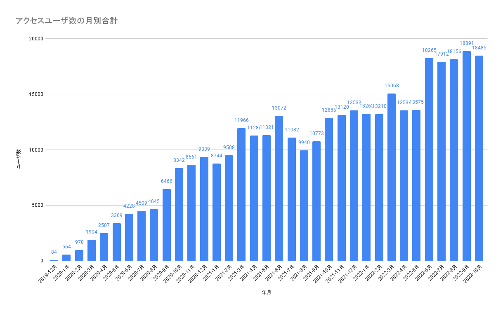
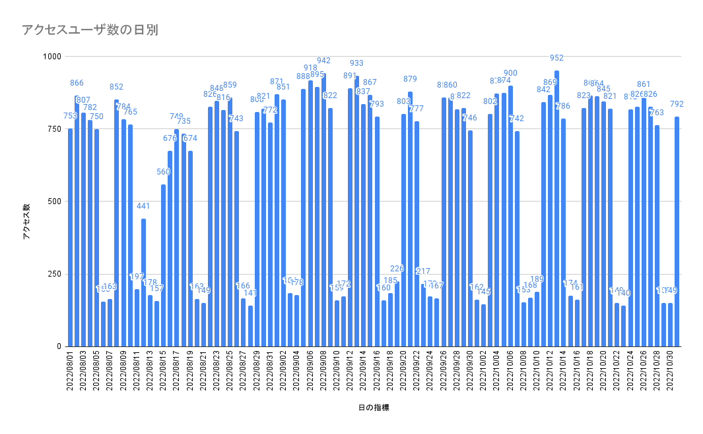

I checked Google Analytics for the first time in a while. The graphs below were created in Google Spreadsheet using GA as the source. This shows data after migrating from Hatena to Github Pages in December 2019. I'm surprised that a Github Pages operation used as a memo has this many visitors. On weekdays, it gets 700-800 PV, and some days the session count exceeds 1000. Is it Hugo's strong SEO, the high update frequency, Github Pages being powerful, or the Github domain being strong...?

