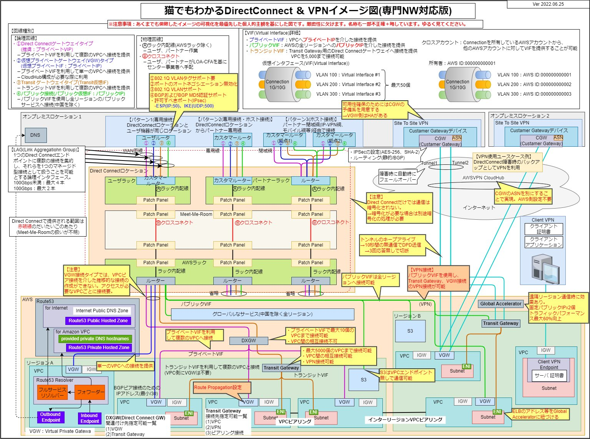

This was extremely easy to understand. I tend to forget things without looking at the manual or Blackbelt each time, so I'm making notes. From `[@kamogashira](https://twitter.com/kamogashira)`'s tweet.

https://twitter.com/kamogashira/status/1589182761440792576?s=12&t=KUYcQm1RyjKtp8WCm3QJVQ

