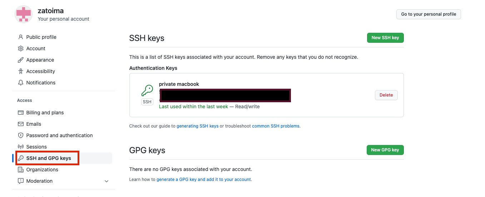

Setup (migration) notes when migrating the Hugo blog writing environment from Windows to Mac.

#### Check OS
```sh
xxxx@xxxx blog % sw_vers
ProductName:		macOS
ProductVersion:		13.0.1
BuildVersion:		22A400
```

#### Install Hugo
```sh
brew install hugo
```

#### Create working directory
```sh
mkdir -p /Users/jimazato/work/hugo/zatoima.github.io
```

#### Initial Github Setup
Generate a public key and register it in Github's `SSH and GPG Keys`
```sh
cd $HOME/.ssh && ls
ssh-keygen -t rsa -f id_rsa_git
cat id_rsa_git.pub
```



When making SSH connections, only `~/.ssh/id_rsa`, `~/.ssh/id_dsa`, and `~/.ssh/identity` are checked by default. If you've changed from the defaults, create a config file under `$HOME/.ssh` and write the following:
```sh
jimazato@XXXXXXX .ssh % cat config
Host github github.com
  HostName github.com
  IdentityFile ~/.ssh/id_rsa_git #Your key filename here
  User git
```

Without this, you'll get an error when pushing or pulling:
```sh
jimazato@XXXXXXX zatoima.github.io % git pull origin master
This key is not known by any other names
Are you sure you want to continue connecting (yes/no/[fingerprint])? yes
Warning: Permanently added 'github.com' (ED25519) to the list of known hosts.
git@github.com: Permission denied (publickey).
fatal: Could not read from remote repository.
```

Other initial Github configuration:
```sh
git config --global user.name zatoima
git config --global user.email xxxx.xxxxx@gmail.com
git remote set-url origin git@github.com:
git remote set-url origin git@github.com:zatoima/zatoima.github.io.git
```

It should look like this:
```sh
jimazato@XXXXXXX zatoima.github.io % git remote -v
origin	git@github.com:zatoima/zatoima.git (fetch)
origin	git@github.com:zatoima/zatoima.git (push)
```

Once you've gotten here, do pull, push, clone, etc. to verify the settings are correct.
