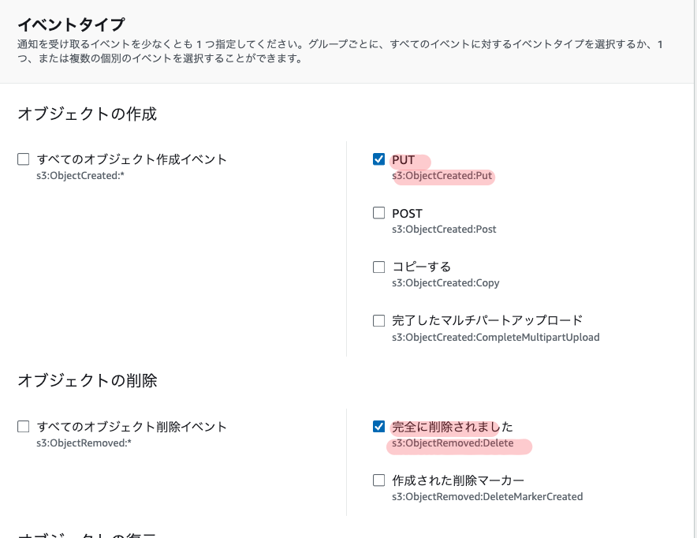

## Introduction

Exploring how to automatically reflect changes to data files on S3 into Snowflake's metadata using AWS S3 and Snowflake's directory table feature. By detecting file additions, updates, and deletions in an S3 bucket and using these as triggers, you can keep Snowflake's directory table metadata up to date.

## What is a Directory Table?

A directory table is an object that stores metadata about data files on a Snowflake stage. Similar in concept to an external table, it holds information such as file paths, sizes, and last modified times for files in the stage.

By using directory tables, you can process unstructured data as follows:

- Query a list of all files on the stage and their metadata
- Create views combining unstructured and structured data
- Build file processing pipelines

Directory table metadata can be automatically updated by integrating with cloud storage event notifications. This allows file additions, updates, and deletions on the stage to always be reflected in the metadata.

We'll implement this on AWS.

## Prerequisites

- AWS account and S3 bucket already created
- Snowflake account already created
- Storage integration configured to connect S3 and Snowflake

## Steps

### Step 1: Create an External Stage with a Directory Table

First, create a Snowflake external stage pointing to your S3 bucket, specifying the directory table option.

```sql
CREATE STAGE mystage
  URL='s3://mybucket/path/'
  STORAGE_INTEGRATION = my_storage_int
  DIRECTORY = (ENABLE = true, AUTO_REFRESH = true);
```

- Specify the S3 bucket path in URL
- Specify the previously created storage integration object in STORAGE_INTEGRATION
- Enable the directory table by specifying ENABLE=true and AUTO_REFRESH=true in the DIRECTORY option

### Step 2: Check the ARN of the Notification SQS Queue

Check the ARN (Amazon Resource Name) of the SQS queue used for directory table updates.

Run `DESC STAGE mystage;` and copy the value of `directory_notification_channel` from the output.

### Step 3: Configure S3 Bucket Event Notifications

Open the S3 bucket properties in the AWS Management Console and configure "Event Notifications".

- Select `s3:ObjectCreated:Put` and `s3:ObjectRemoved:Delete` under "Events"



- Select `SQS queue` as the "Destination" and specify the SQS queue ARN copied in Step 2

This configures the S3 bucket to send notifications to the specified SQS queue whenever objects are created or deleted.

### Step 4: Manually Run the Initial Metadata Update

Run the `ALTER STAGE mystage REFRESH;` command to reflect the current state of the S3 bucket in the directory table. Once this initial manual update is complete, automatic updates will be triggered by S3 event notifications going forward.

### Step 5: Configure Access Permissions

Grant the necessary permissions to additional roles to query the directory table:

- `USAGE` permission on the database and schema
- `USAGE` and `READ` permissions on the stage
- `USAGE` permission on the file format

## Using Directory Tables

### Querying Directory Tables

By executing a SELECT statement on a directory table, you can retrieve a list of all files on the stage and metadata for each file.

```sql
SELECT * FROM DIRECTORY(@mystage);
```

This returns columns such as:

- RELATIVE_PATH: Relative path to the file
- SIZE: File size (bytes)
- LAST_MODIFIED: Last modified time
- FILE_URL: Snowflake URL to the file
- etc.

Filtering by condition is also possible.

```sql
-- Get URLs of files larger than 100KB
SELECT FILE_URL FROM DIRECTORY(@mystage) WHERE SIZE > 100000;

-- Get URLs of CSV files
SELECT FILE_URL FROM DIRECTORY(@mystage) WHERE RELATIVE_PATH LIKE '%.csv';
```

### Use Case 1: Creating a View of Unstructured Data

By joining the directory table with other tables, you can create views of unstructured data that combine file metadata with other information.

For example, suppose you have a stage `my_pdf_stage` storing PDF files and a metadata table `report_metadata` for those files. By JOINing on FILE_URL, you can create a view like this:

```sql
CREATE VIEW reports_information AS
  SELECT
    file_url AS report_link,
    author,
    publish_date,
    approved_date,
    geography,
    num_of_pages
  FROM directory(@my_pdf_stage) s
  JOIN report_metadata m
    ON s.file_url = m.file_url;
```

This view contains the URL of each PDF file along with related metadata like author and publication date.

### Use Case 2: Building a Data Processing Pipeline

By combining directory tables with other Snowflake features, you can build data processing pipelines.

For example, here is a simple pipeline for processing PDF files:

1. Create a stage `my_pdf_stage` with a directory table
2. Create a stream `my_pdf_stream` to detect changes in the directory table
3. Create a UDF `PDF_PARSE` to extract data from PDFs
4. Create a table `prod_reviews` to store the extracted data
5. Create a task `load_new_file_data` triggered by the stream to run the UDF and load data into the table

When a PDF is added to the stage, the task runs automatically and inserts data into the table. Querying `prod_reviews` lets you view the data extracted from the PDFs.

### Creating Streams on Directory Tables

You can also create Snowflake streams to detect changes in directory tables.

```sql
CREATE STREAM dirtable_mystage_s ON STAGE mystage;
```

To feed data into the stream, manually update the directory table metadata.

```sql
ALTER STAGE mystage REFRESH;
```

After adding a file to the stage, querying the stream shows the changes.

```sql
SELECT * FROM dirtable_mystage_s;
```

Output:

```text
+-------------------+--------+-------------------------------+----------------------------------+----------------------------------+-------------------------------------------------------------------------------------------+-----------------+-------------------+-----------------+
| RELATIVE_PATH     | SIZE   | LAST_MODIFIED                 | MD5                              | ETAG                             | FILE_URL                                                                                  | METADATA$ACTION | METADATA$ISUPDATE | METADATA$ROW_ID |
|-------------------+--------+-------------------------------+----------------------------------+----------------------------------+-------------------------------------------------------------------------------------------+-----------------+-------------------+-----------------|
| file1.csv.gz      |   1048 | 2021-05-14 06:09:08.000 -0700 | c98f600c492c39bef249e2fcc7a4b6fe | c98f600c492c39bef249e2fcc7a4b6fe | https://myaccount.snowflakecomputing.com/api/files/MYDB/MYSCHEMA/MYSTAGE/file1%2ecsv%2egz | INSERT          | False             |                 |
| file2.csv.gz      |   3495 | 2021-05-14 06:09:09.000 -0700 | 7f1a4f98ef4c7c42a2974504d11b0e20 | 7f1a4f98ef4c7c42a2974504d11b0e20 | https://myaccount.snowflakecomputing.com/api/files/MYDB/MYSCHEMA/MYSTAGE/file2%2ecsv%2egz | INSERT          | False             |                 |
+-------------------+--------+-------------------------------+-------------------------------
```

Using this stream, you can detect file additions and deletions in the directory table and trigger further processing.

## Notes

- The S3 event notification must specify the SQS queue dedicated to directory table metadata updates. Do not share it with other uses.
- You can create up to 100 event notification configurations per S3 bucket.
- You cannot create duplicate event notifications for the same S3 bucket prefix (directory).
- The Snowflake storage integration must be configured with appropriate access permissions to the S3 bucket.
- The Snowflake stage requires ENCRYPTION=(TYPE='SNOWFLAKE_SSE') to be configured. Without this, downloaded files may become corrupted.

## Billing

The management overhead for automatic directory table metadata updates is billed as Snowpipe charges. Costs increase with the number of files added to the stage.

You can check usage with the `PIPE_USAGE_HISTORY` function or the `Account Usage PIPE_USAGE_HISTORY` view.

Manual metadata updates (`ALTER STAGE REFRESH`) also incur a small additional charge.

## Summary

Following these steps, you can automatically reflect S3 file changes in the metadata of a Snowflake directory table environment using S3 as the data source.

This enables you to always query the latest data and promotes automation of data pipelines.

Directory tables can also be used to join file metadata with other tables, providing flexible handling of unstructured data.

Additionally, by creating streams that detect changes in directory tables, you can detect file additions and deletions in real-time and build data processing flows triggered by them.

## References

[Building a Data Processing Pipeline Using Directory Tables \| Snowflake Documentation](https://docs.snowflake.com/ja/user-guide/data-load-dirtables-pipeline)

[Automated Metadata Updates for Directory Tables \| Snowflake Documentation](https://docs.snowflake.com/ja/user-guide/data-load-dirtables-auto)

[Querying Directory Tables \| Snowflake Documentation](https://docs.snowflake.com/ja/user-guide/data-load-dirtables-query)
