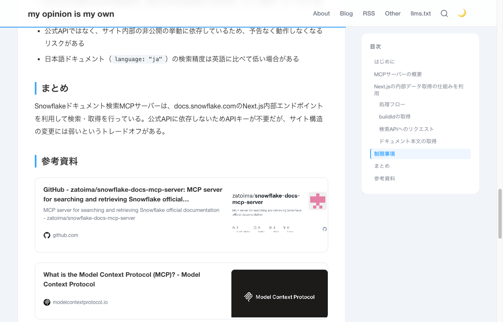
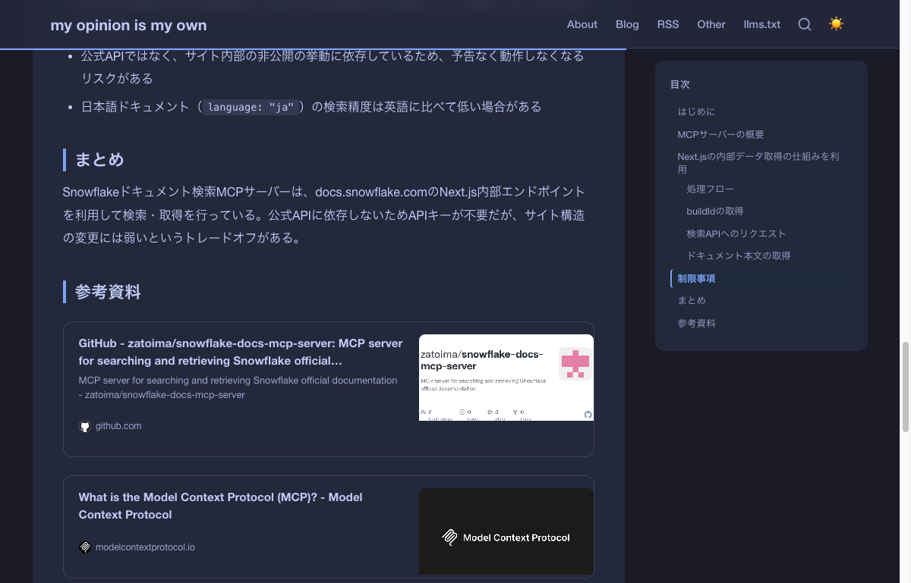

## Introduction

When listing URLs in the reference sections of blog articles, plain bullet-point links look plain and uninviting. To achieve link card displays like those on Zenn or Hatena Blog, I created a `linkcard` shortcode combining Hugo custom shortcodes with automatic OGP metadata fetching.

## Final Result

### Light Mode



### Dark Mode



## Implementation Approach

There are several approaches for implementing link cards:

| Method | Pros | Cons |
|--------|------|------|
| JavaScript (client-side) | Dynamic OGP fetching | CORS restrictions, display delay |
| Manual parameter specification | Reliable | Requires manual input each time |
| **Build-time OGP fetching (adopted)** | **Auto-fetch, no JS needed** | **Slightly longer build time** |

I adopted the approach of using Hugo's `resources.GetRemote` to fetch the link destination's HTML at build time and extract OGP metadata. It's a hybrid type that also supports manual parameter overrides.

## Implementation

### Adding Hugo Configuration

To issue HTTP requests with `resources.GetRemote`, you need to add a security setting to `hugo.toml`.

```toml
[security]
  [security.http]
    methods = ['(?i)GET']
    urls = ['.*']
```

### Shortcode Template

Create `layouts/shortcodes/linkcard.html`.

```html
{{- $url := .Get 0 | default (.Get "url") -}}
{{- $title := .Get "title" | default "" -}}
{{- $description := .Get "description" | default "" -}}
{{- $image := .Get "image" | default "" -}}

{{- if $url -}}
  {{- $domain := replaceRE `^https?://([^/]+).*` "$1" $url -}}
  {{- $favicon := printf "https://www.google.com/s2/favicons?sz=32&domain=%s" $domain -}}

  {{- if not $title -}}
    {{- with resources.GetRemote $url -}}
      {{- with .Err -}}
        {{- warnf "linkcard: failed to fetch %s" $url -}}
      {{- else -}}
        {{- $body := .Content -}}

        {{/* og:title */}}
        {{- range findRE `<meta[^>]*property="og:title"[^>]*>` $body 1 -}}
          {{- $title = replaceRE `.*content="([^"]*)".*` "$1" . -}}
        {{- end -}}

        {{/* og:description */}}
        {{- if not $description -}}
          {{- range findRE `<meta[^>]*property="og:description"[^>]*>` $body 1 -}}
            {{- $description = replaceRE `.*content="([^"]*)".*` "$1" . -}}
          {{- end -}}
        {{- end -}}

        {{/* og:image */}}
        {{- if not $image -}}
          {{- range findRE `<meta[^>]*property="og:image"[^>]*>` $body 1 -}}
            {{- $image = replaceRE `.*content="([^"]*)".*` "$1" . -}}
          {{- end -}}
        {{- end -}}

        {{/* fallback: <title> tag */}}
        {{- if not $title -}}
          {{- range findRE `<title[^>]*>[^<]+</title>` $body 1 -}}
            {{- $title = replaceRE `<title[^>]*>([^<]+)</title>` "$1" . -}}
          {{- end -}}
        {{- end -}}

        {{/* fallback: meta name="description" */}}
        {{- if not $description -}}
          {{- range findRE `<meta[^>]*name="description"[^>]*>` $body 1 -}}
            {{- $description = replaceRE `.*content="([^"]*)".*` "$1" . -}}
          {{- end -}}
        {{- end -}}

        {{/* resolve relative og:image */}}
        {{- if and $image (hasPrefix $image "/") -}}
          {{- $baseURL := replaceRE `^(https?://[^/]+).*` "$1" $url -}}
          {{- $image = printf "%s%s" $baseURL $image -}}
        {{- end -}}
      {{- end -}}
    {{- end -}}
  {{- end -}}

  {{/* final fallback for title */}}
  {{- if not $title -}}
    {{- $title = $url -}}
  {{- end -}}

  <div class="link-card">
    <a href="{{ $url }}" target="_blank" rel="noopener noreferrer">
      <div class="link-card-body">
        <div class="link-card-text">
          <div class="link-card-title">{{ $title }}</div>
          {{- if $description -}}
            <div class="link-card-description">{{ $description }}</div>
          {{- end -}}
          <div class="link-card-meta">
            
            <span class="link-card-domain">{{ $domain }}</span>
          </div>
        </div>
        {{- if $image -}}
          <div class="link-card-image">
            
          </div>
        {{- end -}}
      </div>
    </a>
  </div>
{{- end -}}
```

The processing flow is as follows:

1. Get URL from the first argument or named parameter `url`
2. Fetch HTML using `resources.GetRemote`
3. Extract OGP meta tags (`og:title`, `og:description`, `og:image`) with regex
4. Fall back to `<title>` tag or `meta name="description"` if OGP is absent
5. Convert relative OG images to absolute paths by prepending base URL
6. Fetch favicon using Google Favicons API

### CSS

Add link card styles to `static/css/zenn.css`.

```css
/* --- Link Card --- */
.link-card {
  margin: 1.5rem 0;
}

.link-card a {
  display: block;
  text-decoration: none;
  color: inherit;
  border: 1px solid var(--border-color);
  border-radius: 12px;
  overflow: hidden;
  transition: box-shadow 0.2s ease, border-color 0.2s ease;
  background: var(--bg-card);
}

.link-card a:hover {
  box-shadow: var(--shadow-card-hover);
  border-color: var(--accent);
}

.link-card-body {
  display: flex;
  align-items: stretch;
}

.link-card-text {
  flex: 1;
  min-width: 0;
  padding: 1rem 1.25rem;
  display: flex;
  flex-direction: column;
  justify-content: center;
  gap: 0.35rem;
}

.link-card-title {
  font-size: 0.95rem;
  font-weight: 700;
  line-height: 1.5;
  color: var(--text-primary);
  display: -webkit-box;
  -webkit-line-clamp: 2;
  -webkit-box-orient: vertical;
  overflow: hidden;
}

.link-card-description {
  font-size: 0.8rem;
  color: var(--text-secondary);
  line-height: 1.5;
  display: -webkit-box;
  -webkit-line-clamp: 2;
  -webkit-box-orient: vertical;
  overflow: hidden;
}

.link-card-image {
  width: 230px;
  min-width: 230px;
  max-height: 130px;
  overflow: hidden;
}

.link-card-image img {
  width: 100%;
  height: 100%;
  object-fit: cover;
}
```

Since existing CSS variables (`--border-color`, `--bg-card`, `--accent`, etc.) are used, dark mode is automatically supported.

To prevent the `↗` icon added to external links from appearing inside cards, add this rule:

```css
.article-content .link-card a[href]::after {
  content: none;
}
```

## Usage

### Basic (Auto OGP Fetching)

Just pass the URL and the title, description, and image are automatically fetched at build time.

```

```

### Manual Specification

For sites where OGP cannot be fetched or when you want to customize, specify with named parameters.

```

```

## Technical Points

### Extracting OGP Meta Tags

The order of `property` and `content` attributes in HTML `<meta>` tags varies by site. Using `findRE` with `<meta[^>]*property="og:title"[^>]*>` achieves attribute-order-independent extraction.

### Build Cache

Results from `resources.GetRemote` are saved in Hugo's resource cache. On subsequent builds, re-fetching doesn't occur, so the impact on build time is only for the initial build.

### Fallback Strategy

Three levels of fallback are implemented for sites without OGP metadata:

```
og:title → <title> tag → URL string
og:description → meta name="description" → (not displayed)
og:image → (not displayed)
```

## Summary

By combining Hugo's `resources.GetRemote` with regex-based OGP metadata extraction, I implemented a shortcode that automatically generates link cards at build time. Since no JavaScript is used, display is fast and there are no CORS restrictions. Dark mode is also supported by leveraging existing CSS variables.
