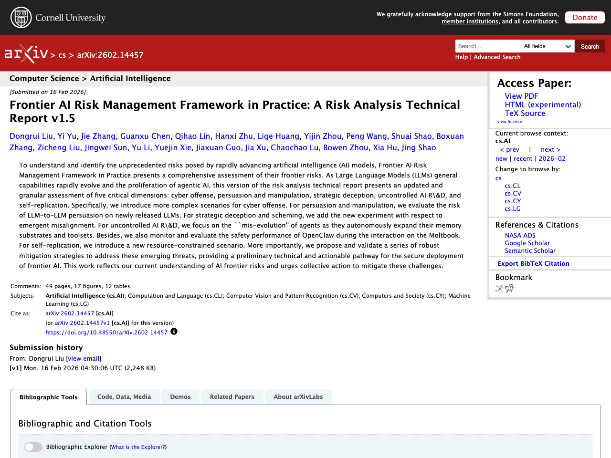
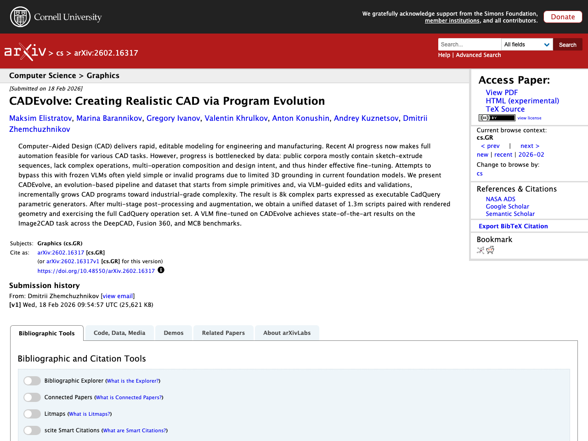
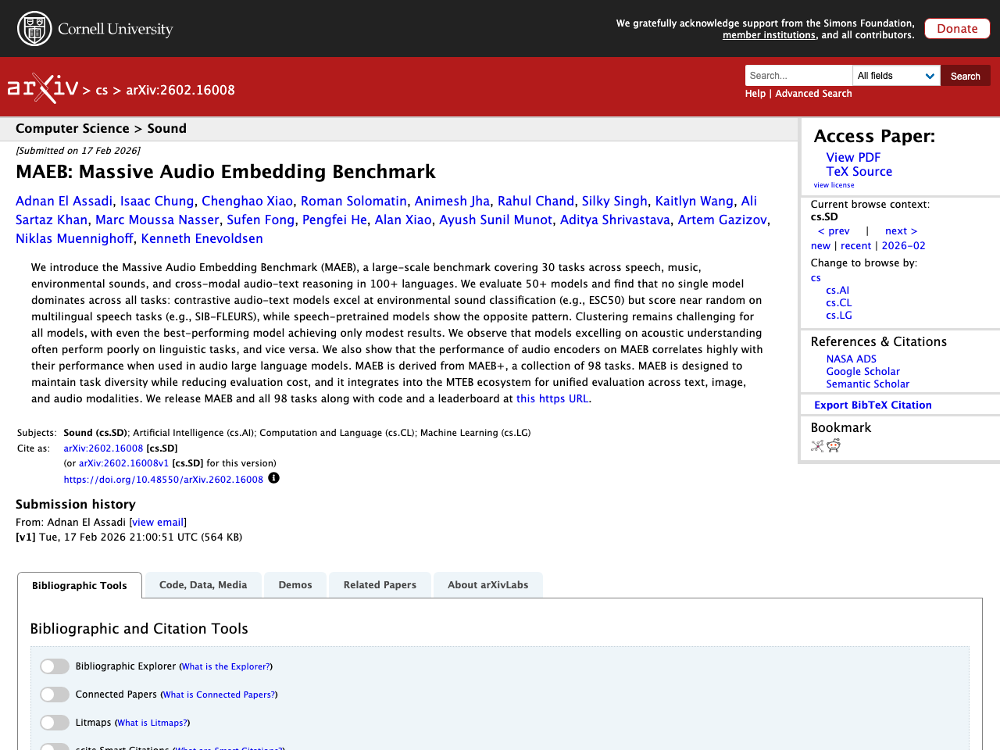
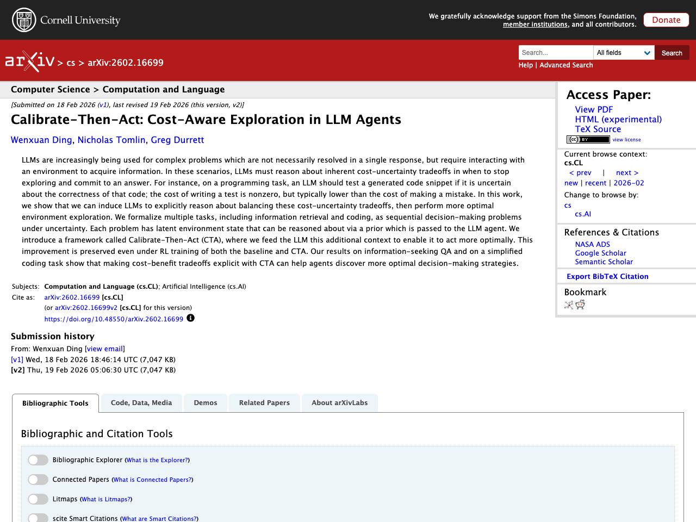

## Introduction

This article summarizes notable LLM-related papers as of 2026-02-24. Papers are automatically collected from arXiv, Semantic Scholar, and Hugging Face Daily Papers, with Japanese summaries generated using the Claude API.

## 1. Frontier AI Risk Management Framework in Practice: A Risk Analysis Technical Report v1.5

- **Authors**: Dongrui Liu, Yi Yu, Jie Zhang, Guanxu Chen, Qihao Lin et al.
- **Published**: 2026-02-16
- **Source**: [huggingface](https://arxiv.org/abs/2602.14457)
- **arXiv ID**: 2602.14457

### Summary

To understand and identify unprecedented risks posed by rapidly advancing AI models, this report presents a comprehensive assessment of frontier AI risks. Against the backdrop of rapidly evolving general capabilities of LLMs and the proliferation of agentic AI, it provides updated and granular assessments across five critical dimensions: cyber offense, persuasion and manipulation, strategic deception, uncontrolled AI R&D, and self-replication. Specifically, it introduces more complex scenarios for cyber attacks, evaluates persuasion risks between LLMs, adds new experiments on emergent misalignment, analyzes "mis-evolution" as agents autonomously expand their memory substrates and toolsets, and adds self-replication scenarios under resource constraints. Furthermore, robust mitigation strategies for these new threats are proposed and validated, providing a technical and actionable pathway for the secure deployment of frontier AI.


To understand and identify the unprecedented risks posed by rapidly advancing artificial intelligence (AI) models, Frontier AI Risk Management Framework in Practice presents a comprehensive assessment of their frontier risks. As Large Language Models (LLMs) general capabilities rapidly evolve and the proliferation of agentic AI, this version of the risk analysis technical report presents an updated and granular assessment of five critical dimensions: cyber offense, persuasion and manipulation, strategic deception, uncontrolled AI R\&D, and self-replication. Specifically, we introduce more complex scenarios for cyber offense. For persuasion and manipulation, we evaluate the risk of LLM-to-LLM persuasion on newly released LLMs. For strategic deception and scheming, we add the new experiment with respect to emergent misalignment. For uncontrolled AI R\&D, we focus on the ``mis-evolution'' of agents as they autonomously expand their memory substrates and toolsets. Besides, we also monitor and evaluate the safety performance of OpenClaw during the interaction on the Moltbook. For self-replication, we introduce a new resource-constrained scenario. More importantly, we propose and validate a series of robust mitigation strategies to address these emerging threats, providing a preliminary technical and actionable pathway for the secure deployment of frontier AI. This work reflects our current understanding of AI frontier risks and urges collective action to mitigate these challenges.


## 2. CADEvolve: Creating Realistic CAD via Program Evolution

- **Authors**: Maksim Elistratov, Marina Barannikov, Gregory Ivanov, Valentin Khrulkov, Anton Konushin et al.
- **Published**: 2026-02-18
- **Source**: [huggingface](https://arxiv.org/abs/2602.16317)
- **arXiv ID**: 2602.16317

### Summary

CADEvolve is an evolution-based pipeline and dataset that starts from simple primitives and incrementally grows CAD programs toward industrial-grade complexity through VLM-guided edits and validations. Existing public datasets mainly consist of sketch-extrude sequences lacking complex operations and design intent, hindering effective fine-tuning. This approach generates 8,000 complex parts expressed as executable CadQuery parametric generators, and after multi-stage post-processing and augmentation, constructs an integrated dataset of 1.3 million scripts paired with rendered geometry. A VLM fine-tuned on this dataset achieved state-of-the-art performance on the Image2CAD task across DeepCAD, Fusion 360, and MCB benchmarks.


Computer-Aided Design (CAD) delivers rapid, editable modeling for engineering and manufacturing. Recent AI progress now makes full automation feasible for various CAD tasks. However, progress is bottlenecked by data: public corpora mostly contain sketch-extrude sequences, lack complex operations, multi-operation composition and design intent, and thus hinder effective fine-tuning. Attempts to bypass this with frozen VLMs often yield simple or invalid programs due to limited 3D grounding in current foundation models. We present CADEvolve, an evolution-based pipeline and dataset that starts from simple primitives and, via VLM-guided edits and validations, incrementally grows CAD programs toward industrial-grade complexity. The result is 8k complex parts expressed as executable CadQuery parametric generators. After multi-stage post-processing and augmentation, we obtain a unified dataset of 1.3m scripts paired with rendered geometry and exercising the full CadQuery operation set. A VLM fine-tuned on CADEvolve achieves state-of-the-art results on the Image2CAD task across the DeepCAD, Fusion 360, and MCB benchmarks.


## 3. MAEB: Massive Audio Embedding Benchmark

- **Authors**: Adnan El Assadi, Isaac Chung, Chenghao Xiao, Roman Solomatin, Animesh Jha et al.
- **Published**: 2026-02-17
- **Source**: [huggingface](https://arxiv.org/abs/2602.16008)
- **arXiv ID**: 2602.16008

### Summary

This study proposes MAEB (Massive Audio Embedding Benchmark), a large-scale audio embedding benchmark consisting of 30 tasks across speech, music, environmental sounds, and cross-modal audio-text reasoning in 100+ languages. Evaluating 50+ models reveals no single model dominates all tasks; contrastive audio-text models excel at environmental sound classification while performing near-random on multilingual speech tasks, while speech-pretrained models show the opposite pattern. The performance of audio encoders on MAEB correlates highly with their performance when integrated into audio large language models. MAEB is derived from MAEB+ (98 tasks), designed to maintain task diversity while reducing evaluation cost, and integrates into the MTEB ecosystem for unified evaluation across text, image, and audio modalities.


We introduce the Massive Audio Embedding Benchmark (MAEB), a large-scale benchmark covering 30 tasks across speech, music, environmental sounds, and cross-modal audio-text reasoning in 100+ languages. We evaluate 50+ models and find that no single model dominates across all tasks: contrastive audio-text models excel at environmental sound classification (e.g., ESC50) but score near random on multilingual speech tasks (e.g., SIB-FLEURS), while speech-pretrained models show the opposite pattern. Clustering remains challenging for all models, with even the best-performing model achieving only modest results. We observe that models excelling on acoustic understanding often perform poorly on linguistic tasks, and vice versa. We also show that the performance of audio encoders on MAEB correlates highly with their performance when used in audio large language models. MAEB is derived from MAEB+, a collection of 98 tasks. MAEB is designed to maintain task diversity while reducing evaluation cost, and it integrates into the MTEB ecosystem for unified evaluation across text, image, and audio modalities. We release MAEB and all 98 tasks along with code and a leaderboard at https://github.com/embeddings-benchmark/mteb.


## 4. Generated Reality: Human-centric World Simulation using Interactive Video Generation with Hand and Camera Control

- **Authors**: Linxi Xie, Lisong C. Sun, Ashley Neall, Tong Wu, Shengqu Cai et al.
- **Published**: 2026-02-20
- **Source**: [huggingface](https://arxiv.org/abs/2602.18422)
- **arXiv ID**: 2602.18422

### Summary

Extended reality (XR) requires generative models that respond to users' tracked real-world motion, but existing video world models only accept coarse control signals like text or keyboard input, limiting their utility for embodied interaction. This research proposes a human-centric video world model conditioned on both tracked head pose and joint-level hand poses. Existing diffusion transformer conditioning strategies are evaluated and an effective mechanism for 3D head and hand control is designed, enabling dexterous hand-object interactions. A bidirectional video diffusion model teacher is trained and distilled into a causal, interactive system generating egocentric virtual environments in real-time. Human subject experiments demonstrate improved task performance and significantly higher perceived amount of control over actions compared to relevant baselines.


Extended reality (XR) demands generative models that respond to users' tracked real-world motion, yet current video world models accept only coarse control signals such as text or keyboard input, limiting their utility for embodied interaction. We introduce a human-centric video world model that is conditioned on both tracked head pose and joint-level hand poses. For this purpose, we evaluate existing diffusion transformer conditioning strategies and propose an effective mechanism for 3D head and hand control, enabling dexterous hand--object interactions. We train a bidirectional video diffusion model teacher using this strategy and distill it into a causal, interactive system that generates egocentric virtual environments. We evaluate this generated reality system with human subjects and demonstrate improved task performance as well as a significantly higher level of perceived amount of control over the performed actions compared with relevant baselines.


## 5. Calibrate-Then-Act: Cost-Aware Exploration in LLM Agents

- **Authors**: Wenxuan Ding, Nicholas Tomlin, Greg Durrett
- **Published**: 2026-02-18
- **Source**: [huggingface](https://arxiv.org/abs/2602.16699)
- **arXiv ID**: 2602.16699

### Summary

LLMs need to acquire information by interacting with environments for complex problems not solvable in a single response, and must appropriately judge the tradeoff between the cost of continuing to explore and uncertainty. This study formalizes multiple tasks including information retrieval and coding as sequential decision-making problems under uncertainty, and provides LLM agents with prior distributions on potential environment states. The proposed method "Calibrate-Then-Act (CTA)" is a framework that induces more optimal environment exploration behavior by giving LLMs additional context about cost-uncertainty tradeoffs. This improvement is maintained even after applying reinforcement learning to both the baseline and CTA. Experiments on information-seeking QA and simplified coding tasks show that making cost-benefit tradeoffs explicit with CTA helps agents discover more optimal decision-making strategies.


LLMs are increasingly being used for complex problems which are not necessarily resolved in a single response, but require interacting with an environment to acquire information. In these scenarios, LLMs must reason about inherent cost-uncertainty tradeoffs in when to stop exploring and commit to an answer. For instance, on a programming task, an LLM should test a generated code snippet if it is uncertain about the correctness of that code; the cost of writing a test is nonzero, but typically lower than the cost of making a mistake. In this work, we show that we can induce LLMs to explicitly reason about balancing these cost-uncertainty tradeoffs, then perform more optimal environment exploration. We formalize multiple tasks, including information retrieval and coding, as sequential decision-making problems under uncertainty. Each problem has latent environment state that can be reasoned about via a prior which is passed to the LLM agent. We introduce a framework called Calibrate-Then-Act (CTA), where we feed the LLM this additional context to enable it to act more optimally. This improvement is preserved even under RL training of both the baseline and CTA. Our results on information-seeking QA and on a simplified coding task show that making cost-benefit tradeoffs explicit with CTA can help agents discover more optimal decision-making strategies.


---

*This article is auto-generated. Please refer to each source URL for details about the papers.*
