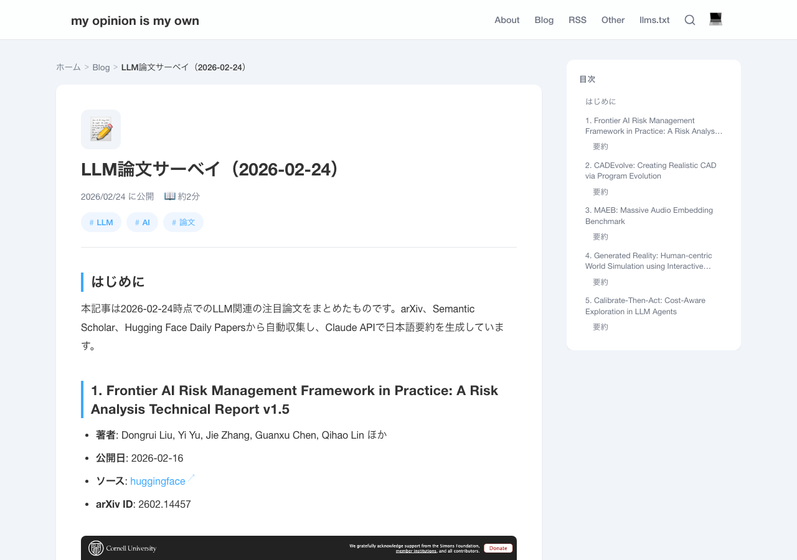

## Introduction

LLM-related papers are published in large volumes every day, making it unrealistic to keep up manually. I built an automated pipeline using Claude Code that handles everything from paper collection, summarization, and blog publishing to Slack notifications.

This article documents the pipeline architecture and implementation of each component.

## Sample Generated Article

Here is a screenshot of an article actually generated by the pipeline.



## Architecture Overview

The overall processing flow of the pipeline is as follows:

```
[launchd: daily at 7:00]
       |
       v
[run_pipeline.sh]
       |
       v
[pipeline.py]
  |
  |-- 1. Load state file (state.py)
  |-- 2. Paper collection (fetchers.py)
  |       |-- arXiv API
  |       |-- Semantic Scholar API
  |       |-- HuggingFace Daily Papers API
  |       |-- Deduplication + popularity sort
  |-- 3. Exclude already processed papers
  |-- 4. Generate Japanese summaries (summarizer.py) ... claude -p
  |-- 5. Capture screenshots (screenshot.py) ... Playwright
  |-- 6. Generate Hugo articles (publisher.py)
  |-- 7. Save state file
  |-- 8. git commit → hugo build → git push
  |-- 9. Slack notification (notifier.py) ... claude -p + Slack MCP
```

### Directory Structure

```
scripts/llm_papers/
├── config.py               # Centralized configuration values
├── fetchers.py             # Paper retrieval from 3 sources
├── summarizer.py           # Summary generation via Claude CLI
├── screenshot.py           # Screenshots via Playwright
├── publisher.py            # Hugo article generation
├── notifier.py             # Slack notification
├── state.py                # Idempotency state management
├── pipeline.py             # Main orchestrator
├── run_pipeline.sh         # Shell wrapper called by launchd
├── requirements.txt        # Python dependencies
├── processed_papers.json   # Record of processed paper IDs
├── pipeline.log            # Application log
└── venv/                   # Python virtual environment
```

## Paper Collection (fetchers.py)

Papers are collected from 3 sources and converted into a unified `Paper` dataclass.

### Data Model

```python
@dataclass
class Paper:
    paper_id: str
    title: str
    authors: list[str]
    abstract: str
    published: str          # ISO date string
    url: str
    source: str             # "arxiv", "semantic_scholar", "huggingface"
    arxiv_id: str | None = None
    doi: str | None = None
    categories: list[str] = field(default_factory=list)
    popularity_score: float = 0.0  # Popularity score
```

### Retrieval Strategy for Each Source

| Source | API | Time Range | Popularity Metric | Max Retrieval |
|--------|-----|------------|-------------------|---------------|
| arXiv | arxiv Python library | Latest 50 | Supplemented via S2 Batch API | 50 |
| Semantic Scholar | Graph API v1 | Past 3 days | citationCount | 20/keyword |
| HuggingFace | Daily Papers API | Current day | upvotes | All |

### arXiv

Filters LLM-related keywords from `cs.CL` (Computational Linguistics) and `cs.AI` (Artificial Intelligence) categories.

```python
cat_query = " OR ".join(f"cat:{cat}" for cat in ["cs.CL", "cs.AI"])
keyword_query = " OR ".join(f'abs:"{kw}"' for kw in ARXIV_KEYWORDS[:5])
query = f"({cat_query}) AND ({keyword_query})"
```

Due to strict rate limiting of the arXiv API, `delay_seconds=5.0` and `num_retries=5` are set.

### Semantic Scholar

Uses the `/paper/search` endpoint of Graph API v1, filtering to the past 3 days with the `publicationDateOrYear` parameter. The `citationCount` field is used directly as the popularity score.

### HuggingFace Daily Papers

Retrieves curated papers for the current day from `https://huggingface.co/api/daily_papers`. Since HuggingFace includes non-LLM papers, keyword filtering is applied.

```python
LLM_FILTER_KEYWORDS = [
    "language model", "LLM", "transformer", "GPT", "BERT",
    "instruction tuning", "RLHF", "prompt", "chain of thought",
    "retrieval augmented", "RAG", "fine-tuning", "alignment",
    "reasoning", "tokeniz", "attention mechanism", ...
]

def _is_llm_related(title: str, abstract: str) -> bool:
    text = (title + " " + abstract).lower()
    return any(kw.lower() in text for kw in LLM_FILTER_KEYWORDS)
```

The `upvotes` field is used as the popularity score.

### Popularity-Based Sorting

Papers retrieved from arXiv lack popularity information, so citation counts are supplemented using the Semantic Scholar Batch API.

```python
def _enrich_popularity_from_s2(papers: list[Paper]) -> None:
    papers_to_enrich = [p for p in papers if p.popularity_score < 0.1 and p.arxiv_id]
    arxiv_ids = [f"ArXiv:{p.arxiv_id}" for p in papers_to_enrich]

    resp = requests.post(
        "https://api.semanticscholar.org/graph/v1/paper/batch",
        json={"ids": arxiv_ids[:500]},
        params={"fields": "citationCount,externalIds"},
    )
    # Reflect results in popularity_score
```

Finally, papers are sorted in descending order by `(popularity_score, published)` tuple, prioritizing popular and recent papers.

### Deduplication

Duplicates from multiple sources are handled in two stages: ID-based deduplication (arXiv sources preferred) and normalized title-based deduplication.

## Japanese Summary Generation (summarizer.py)

Instead of the Anthropic SDK, summaries are generated by directly calling the Claude Code CLI (`claude -p`). This eliminates the need for `ANTHROPIC_API_KEY` management.

```python
def generate_summary(paper: Paper) -> str:
    prompt = (
        f"Please summarize the following paper's Abstract in Japanese. "
        f"The summary should be 3-5 sentences, accurately conveying the technical content. "
        f"Output only the summary text, no preamble or explanation.\n\n"
        f"Title: {paper.title}\n"
        f"Abstract:\n{paper.abstract}"
    )

    result = subprocess.run(
        ["claude", "-p", prompt],
        capture_output=True, text=True, timeout=120,
        env=_get_claude_env(),
    )
```

### Removing CLAUDECODE Environment Variable

When the pipeline is executed from within a Claude Code session, launching nested Claude CLIs is rejected. To work around this, the `CLAUDECODE` environment variable is removed before running subprocesses.

```python
def _get_claude_env() -> dict:
    env = os.environ.copy()
    env.pop("CLAUDECODE", None)
    return env
```

## Slack Notification (notifier.py)

After processing is complete, a paper summary is posted to Slack's `#notify` channel. Instead of calling the Slack API directly, the approach is to call the Slack MCP tool via Claude Code CLI.

```python
def notify_slack(papers, summaries, date) -> bool:
    message = _format_slack_message(papers, summaries, date, blog_url)

    prompt = (
        f"Please post the following message to the Slack notify channel (ID: {SLACK_CHANNEL_ID}) "
        f"using the mcp__slack__slack_post_message tool. "
        f"Post the message content as-is, no other output needed.\n\n"
        f"Message:\n{message}"
    )

    result = subprocess.run(
        ["claude", "-p", "--allowedTools", "mcp__slack__slack_post_message"],
        input=prompt,
        capture_output=True, text=True, timeout=60,
        env=_get_claude_env(),
    )
```

`--allowedTools` is used to allow only the Slack posting tool, preventing unintended tool calls.

## Ensuring Idempotency (state.py)

Processed paper IDs are managed in `processed_papers.json` to prevent duplicate processing of the same paper.

```json
{
  "processed_ids": {
    "arxiv:2602.10693": {
      "title": "VESPO: Variational Sequence-Level Soft Policy Optimization...",
      "processed_at": "2026-02-23T21:52:36.202101"
    },
    "arxiv:2602.08354": {
      "title": "Does Your Reasoning Model Implicitly Know When to Stop Thinking?",
      "processed_at": "2026-02-23T21:52:36.202114"
    }
  },
  "last_run": "2026-02-24T09:16:33.952783"
}
```

In each pipeline run, processed IDs are excluded from the retrieved paper list, and the top N papers (default 5) are selected.

```python
new_papers = [p for p in all_papers if not is_processed(state, p.paper_id)]
featured_papers = new_papers[:TOP_N_PAPERS]
```

## Hugo Article Generation (publisher.py)

Selected papers are output as Markdown with YAML front matter. Each paper includes a Japanese summary and a collapsible original Abstract.

Generated article structure:

```markdown
---
title: "LLM Papers Survey (2026-02-24)"
tags: ["LLM", "AI", "論文"]
url: llm-papers-2026-02-24
date: 2026-02-24
---

## 1. Paper Title
- **Authors**: ...
- **Source**: [huggingface](https://arxiv.org/abs/...)

### Summary
(Japanese summary generated by Claude CLI)


(English original)

```

## Automatic Deployment

After article generation, the following git operations are automatically executed:

```python
def git_commit_and_push(post_dir: Path) -> None:
    subprocess.run(["git", "add", str(post_dir)], cwd=PROJECT_ROOT)
    subprocess.run(["git", "commit", "-m", f"Add LLM papers survey ({date})"], cwd=PROJECT_ROOT)
    subprocess.run(["hugo", "--config", "hugo.toml", "-d", "docs"], cwd=PROJECT_ROOT)
    subprocess.run(["git", "add", "docs/"], cwd=PROJECT_ROOT)
    subprocess.run(["git", "commit", "-m", "Build website"], cwd=PROJECT_ROOT)
    subprocess.run(["git", "push", "origin", "main"], cwd=PROJECT_ROOT)
```

## Scheduled Execution (launchd)

Using macOS launchd, the pipeline runs automatically every morning at 7:00.

```xml
<!-- ~/Library/LaunchAgents/com.zatoima.llm-papers-pipeline.plist -->
<dict>
    <key>Label</key>
    <string>com.zatoima.llm-papers-pipeline</string>
    <key>ProgramArguments</key>
    <array>
        <string>/bin/bash</string>
        <string>/.../scripts/llm_papers/run_pipeline.sh</string>
    </array>
    <key>StartCalendarInterval</key>
    <dict>
        <key>Hour</key>
        <integer>7</integer>
        <key>Minute</key>
        <integer>0</integer>
    </dict>
</dict>
```

In the shell wrapper (`run_pipeline.sh`), the Python binary in the venv is specified directly rather than using `source activate`. This is because `source activate` can fail in the launchd environment.

```bash
# Direct path instead of activate (for launchd compatibility)
./venv/bin/python3 pipeline.py --verbose
```

## Error Handling

Each API call includes a retry mechanism with exponential backoff.

```python
def _retry_request(func, *args, **kwargs):
    for attempt in range(MAX_RETRIES):
        try:
            return func(*args, **kwargs)
        except Exception as e:
            if attempt < MAX_RETRIES - 1:
                wait = RETRY_DELAY * (2 ** attempt)  # 2s, 4s, 8s
                time.sleep(wait)
            else:
                raise
```

Even if retrieval from some sources fails, processing continues with other sources, so the entire pipeline doesn't stop. When summary generation fails, the first 300 characters of the Abstract are used as fallback text.

## CLI Options

The following options are available for development and debugging:

| Option | Description |
|--------|-------------|
| `--verbose` | DEBUG level log output |
| `--skip-screenshots` | Skip screenshot capture |
| `--skip-push` | Skip git commit/push |
| `--dry-run` | Only display papers to be processed |
| `--max-papers N` | Specify number of papers to retrieve |

## Source Code

The source code for this pipeline is published on GitHub.

<https://github.com/zatoima/llm-papers-pipeline>

## Summary

Key features of this pipeline:

- **3-source collection**: Automatic collection from arXiv, Semantic Scholar, and HuggingFace Daily Papers
- **Popularity-based selection**: Automatic pickup of notable papers via upvotes and citation count prioritization
- **Claude Code CLI utilization**: Summary generation without API key management and Slack MCP-based notifications
- **Idempotency**: Duplicate processing prevention via state management with `processed_papers.json`
- **Automatic deployment**: End-to-end execution from Hugo build → GitHub Pages publishing → Slack notification
- **Scheduled execution**: Unattended operation at 7:00 daily via macOS launchd
