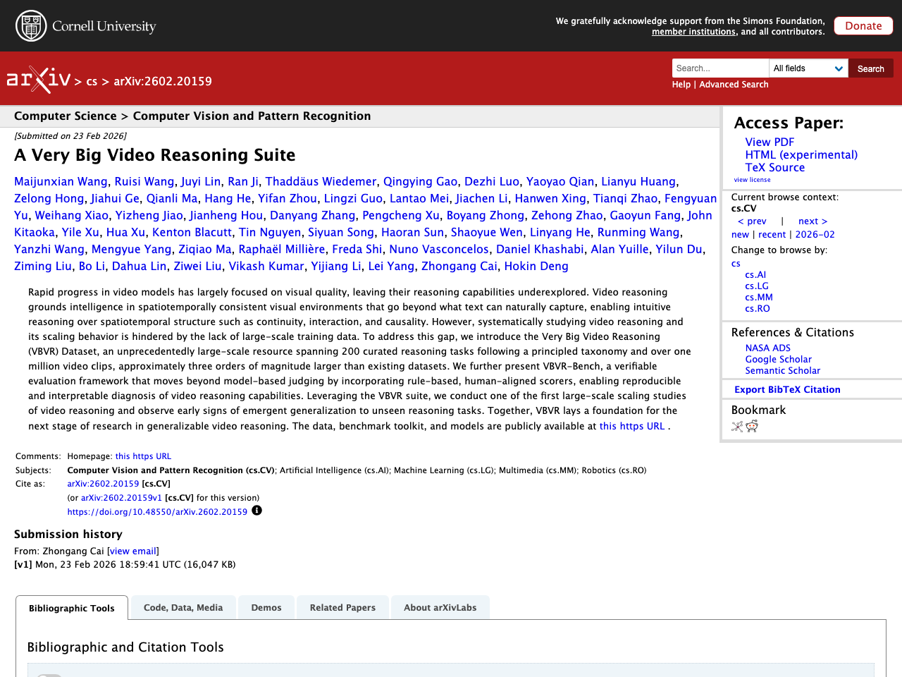
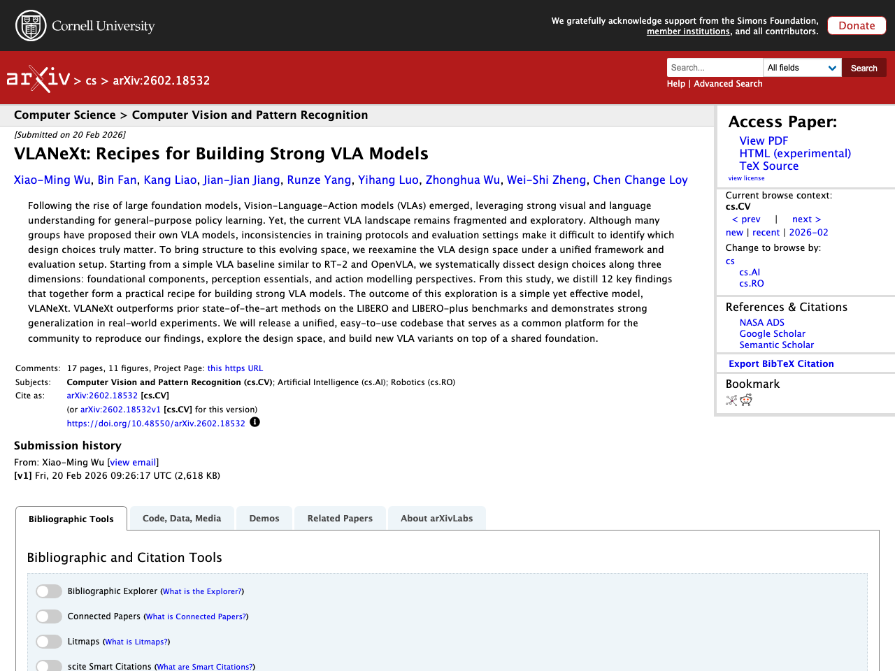
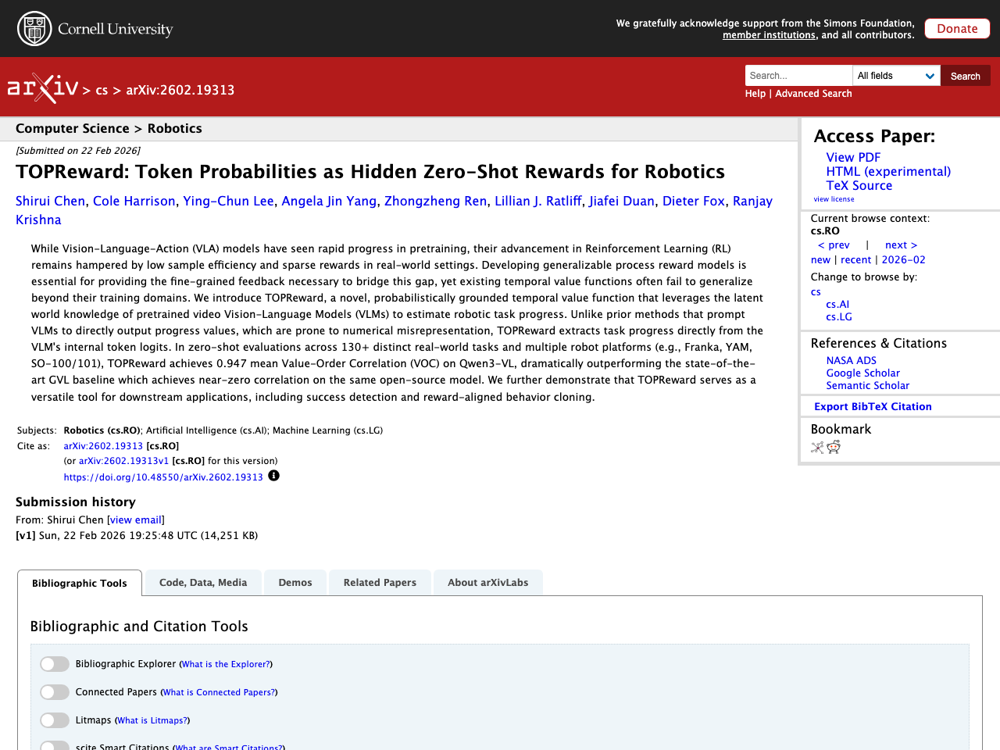
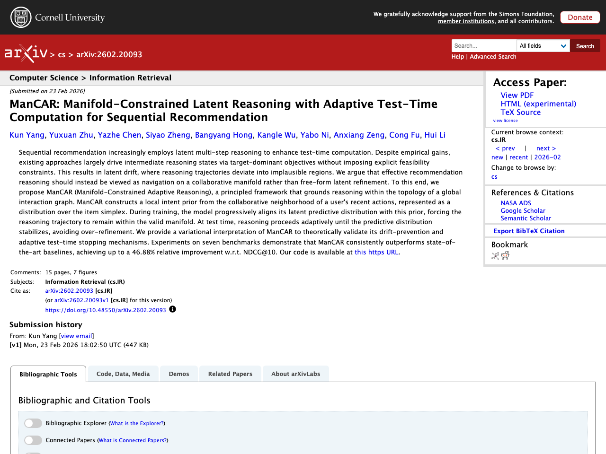
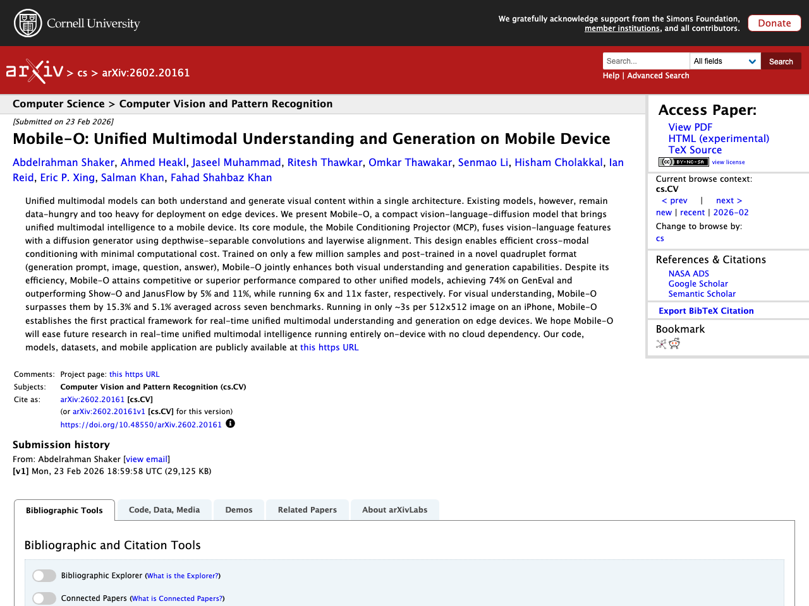

## Introduction

This article summarizes notable LLM-related papers as of 2026-02-25. Papers are automatically collected from arXiv, Semantic Scholar, and Hugging Face Daily Papers, with Japanese summaries generated using the Claude API.

## 1. A Very Big Video Reasoning Suite

- **Authors**: Maijunxian Wang, Ruisi Wang, Juyi Lin, Ran Ji, Thaddäus Wiedemer et al.
- **Published**: 2026-02-23
- **Source**: [huggingface](https://arxiv.org/abs/2602.20159)
- **arXiv ID**: 2602.20159

### Summary

Rapid progress in video models has largely focused on visual quality, leaving reasoning capabilities underexplored. To address the lack of large-scale training data for video reasoning, this work constructs the "VBVR Dataset," an unprecedentedly large-scale resource spanning 200 curated reasoning tasks based on a principled taxonomy and over one million video clips. Additionally, the paper presents "VBVR-Bench," a verifiable evaluation framework that moves beyond model-based judging by incorporating rule-based, human-aligned scorers. Leveraging the VBVR suite, the authors conduct one of the first large-scale scaling studies of video reasoning and observe early signs of emergent generalization to unseen reasoning tasks. The dataset, benchmark toolkit, and models are all publicly available.


Rapid progress in video models has largely focused on visual quality, leaving their reasoning capabilities underexplored. Video reasoning grounds intelligence in spatiotemporally consistent visual environments that go beyond what text can naturally capture, enabling intuitive reasoning over spatiotemporal structure such as continuity, interaction, and causality. However, systematically studying video reasoning and its scaling behavior is hindered by the lack of large-scale training data. To address this gap, we introduce the Very Big Video Reasoning (VBVR) Dataset, an unprecedentedly large-scale resource spanning 200 curated reasoning tasks following a principled taxonomy and over one million video clips, approximately three orders of magnitude larger than existing datasets. We further present VBVR-Bench, a verifiable evaluation framework that moves beyond model-based judging by incorporating rule-based, human-aligned scorers, enabling reproducible and interpretable diagnosis of video reasoning capabilities. Leveraging the VBVR suite, we conduct one of the first large-scale scaling studies of video reasoning and observe early signs of emergent generalization to unseen reasoning tasks. Together, VBVR lays a foundation for the next stage of research in generalizable video reasoning. The data, benchmark toolkit, and models are publicly available at https://video-reason.com/ .


## 2. VLANeXt: Recipes for Building Strong VLA Models

- **Authors**: Xiao-Ming Wu, Bin Fan, Kang Liao, Jian-Jian Jiang, Runze Yang et al.
- **Published**: 2026-02-20
- **Source**: [huggingface](https://arxiv.org/abs/2602.18532)
- **arXiv ID**: 2602.18532

### Summary

With the rise of large foundation models, Vision-Language-Action (VLA) models have emerged to leverage strong visual and language understanding for general-purpose policy learning. However, the current VLA landscape remains fragmented due to inconsistencies in training protocols and evaluation settings, making it difficult to identify which design choices truly matter. This study reexamines the VLA design space under a unified framework and evaluation setup, starting from a simple baseline similar to RT-2 and OpenVLA, and systematically analyzing design choices across three dimensions: foundational components, perception essentials, and action modeling. From this analysis, 12 key findings are distilled as a practical recipe for building strong VLA models. The resulting model, VLANeXt, outperforms prior state-of-the-art methods on the LIBERO and LIBERO-plus benchmarks and demonstrates strong generalization in real-world experiments.


Following the rise of large foundation models, Vision-Language-Action models (VLAs) emerged, leveraging strong visual and language understanding for general-purpose policy learning. Yet, the current VLA landscape remains fragmented and exploratory. Although many groups have proposed their own VLA models, inconsistencies in training protocols and evaluation settings make it difficult to identify which design choices truly matter. To bring structure to this evolving space, we reexamine the VLA design space under a unified framework and evaluation setup. Starting from a simple VLA baseline similar to RT-2 and OpenVLA, we systematically dissect design choices along three dimensions: foundational components, perception essentials, and action modelling perspectives. From this study, we distill 12 key findings that together form a practical recipe for building strong VLA models. The outcome of this exploration is a simple yet effective model, VLANeXt. VLANeXt outperforms prior state-of-the-art methods on the LIBERO and LIBERO-plus benchmarks and demonstrates strong generalization in real-world experiments. We will release a unified, easy-to-use codebase that serves as a common platform for the community to reproduce our findings, explore the design space, and build new VLA variants on top of a shared foundation.


## 3. TOPReward: Token Probabilities as Hidden Zero-Shot Rewards for Robotics

- **Authors**: Shirui Chen, Cole Harrison, Ying-Chun Lee, Angela Jin Yang, Zhongzheng Ren et al.
- **Published**: 2026-02-22
- **Source**: [huggingface](https://arxiv.org/abs/2602.19313)
- **arXiv ID**: 2602.19313

### Summary

To address low sample efficiency and sparse rewards in reinforcement learning for Vision-Language-Action (VLA) models, this paper proposes "TOPReward," a novel temporal value function that leverages the latent world knowledge of pretrained video Vision-Language Models (VLMs) to estimate robotic task progress. Unlike prior methods that prompt VLMs to directly output progress values—which are prone to numerical misrepresentation—TOPReward extracts task progress probabilistically from the VLM's internal token logits. In zero-shot evaluations across 130+ distinct real-world tasks and multiple robot platforms (Franka, YAM, SO-100/101, etc.), TOPReward achieves a mean Value-Order Correlation (VOC) of 0.947 on Qwen3-VL, dramatically outperforming the state-of-the-art GVL baseline which achieves near-zero correlation on the same model. The paper further demonstrates that TOPReward is effective for downstream applications including success detection and reward-aligned behavior cloning.


While Vision-Language-Action (VLA) models have seen rapid progress in pretraining, their advancement in Reinforcement Learning (RL) remains hampered by low sample efficiency and sparse rewards in real-world settings. Developing generalizable process reward models is essential for providing the fine-grained feedback necessary to bridge this gap, yet existing temporal value functions often fail to generalize beyond their training domains. We introduce TOPReward, a novel, probabilistically grounded temporal value function that leverages the latent world knowledge of pretrained video Vision-Language Models (VLMs) to estimate robotic task progress. Unlike prior methods that prompt VLMs to directly output progress values, which are prone to numerical misrepresentation, TOPReward extracts task progress directly from the VLM's internal token logits. In zero-shot evaluations across 130+ distinct real-world tasks and multiple robot platforms (e.g., Franka, YAM, SO-100/101), TOPReward achieves 0.947 mean Value-Order Correlation (VOC) on Qwen3-VL, dramatically outperforming the state-of-the-art GVL baseline which achieves near-zero correlation on the same open-source model. We further demonstrate that TOPReward serves as a versatile tool for downstream applications, including success detection and reward-aligned behavior cloning.


## 4. ManCAR: Manifold-Constrained Latent Reasoning with Adaptive Test-Time Computation for Sequential Recommendation

- **Authors**: Kun Yang, Yuxuan Zhu, Yazhe Chen, Siyao Zheng, Bangyang Hong et al.
- **Published**: 2026-02-23
- **Source**: [huggingface](https://arxiv.org/abs/2602.20093)
- **arXiv ID**: 2602.20093

### Summary

In sequential recommendation, multi-step reasoning in latent space is effective for enhancing test-time computation, but existing methods lack explicit feasibility constraints on intermediate reasoning states, leading to "latent drift" where reasoning trajectories deviate into implausible regions. This paper proposes ManCAR (Manifold-Constrained Adaptive Reasoning), which frames recommendation reasoning as navigation on a collaborative filtering manifold rather than free-form latent refinement. ManCAR constructs a local intent prior from the collaborative neighborhood of a user's recent actions as a distribution over the item simplex, and during training progressively aligns the latent predictive distribution with this prior to constrain reasoning trajectories within the valid manifold. At test time, reasoning proceeds adaptively until the predictive distribution stabilizes, avoiding over-refinement. Experiments on seven benchmarks demonstrate that ManCAR consistently outperforms state-of-the-art methods, achieving up to 46.88% relative improvement in NDCG@10.


Sequential recommendation increasingly employs latent multi-step reasoning to enhance test-time computation. Despite empirical gains, existing approaches largely drive intermediate reasoning states via target-dominant objectives without imposing explicit feasibility constraints. This results in latent drift, where reasoning trajectories deviate into implausible regions. We argue that effective recommendation reasoning should instead be viewed as navigation on a collaborative manifold rather than free-form latent refinement. To this end, we propose ManCAR (Manifold-Constrained Adaptive Reasoning), a principled framework that grounds reasoning within the topology of a global interaction graph. ManCAR constructs a local intent prior from the collaborative neighborhood of a user's recent actions, represented as a distribution over the item simplex. During training, the model progressively aligns its latent predictive distribution with this prior, forcing the reasoning trajectory to remain within the valid manifold. At test time, reasoning proceeds adaptively until the predictive distribution stabilizes, avoiding over-refinement. We provide a variational interpretation of ManCAR to theoretically validate its drift-prevention and adaptive test-time stopping mechanisms. Experiments on seven benchmarks demonstrate that ManCAR consistently outperforms state-of-the-art baselines, achieving up to a 46.88% relative improvement w.r.t. NDCG@10. Our code is available at https://github.com/FuCongResearchSquad/ManCAR.


## 5. Mobile-O: Unified Multimodal Understanding and Generation on Mobile Device

- **Authors**: Abdelrahman Shaker, Ahmed Heakl, Jaseel Muhammad, Ritesh Thawkar, Omkar Thawakar et al.
- **Published**: 2026-02-23
- **Source**: [huggingface](https://arxiv.org/abs/2602.20161)
- **arXiv ID**: 2602.20161

### Summary

Unified multimodal models can both understand and generate visual content within a single architecture, but existing models are data-hungry and too heavy for deployment on edge devices. This paper presents Mobile-O, a compact vision-language-diffusion model that brings unified multimodal intelligence to mobile devices. Its core module, the Mobile Conditioning Projector (MCP), fuses vision-language features with a diffusion generator using depthwise-separable convolutions and layerwise alignment with minimal computational cost. Trained on only a few million samples with a novel quadruplet post-training format, Mobile-O achieves 74% on GenEval, outperforming Show-O and JanusFlow by 5% and 11% while running 6x and 11x faster respectively, and surpasses them by 15.3% and 5.1% on visual understanding averaged across seven benchmarks. Running in approximately 3 seconds per 512x512 image on an iPhone, Mobile-O establishes the first practical framework for real-time unified multimodal understanding and generation on edge devices.


Unified multimodal models can both understand and generate visual content within a single architecture. Existing models, however, remain data-hungry and too heavy for deployment on edge devices. We present Mobile-O, a compact vision-language-diffusion model that brings unified multimodal intelligence to a mobile device. Its core module, the Mobile Conditioning Projector (MCP), fuses vision-language features with a diffusion generator using depthwise-separable convolutions and layerwise alignment. This design enables efficient cross-modal conditioning with minimal computational cost. Trained on only a few million samples and post-trained in a novel quadruplet format (generation prompt, image, question, answer), Mobile-O jointly enhances both visual understanding and generation capabilities. Despite its efficiency, Mobile-O attains competitive or superior performance compared to other unified models, achieving 74% on GenEval and outperforming Show-O and JanusFlow by 5% and 11%, while running 6x and 11x faster, respectively. For visual understanding, Mobile-O surpasses them by 15.3% and 5.1% averaged across seven benchmarks. Running in only ~3s per 512x512 image on an iPhone, Mobile-O establishes the first practical framework for real-time unified multimodal understanding and generation on edge devices. We hope Mobile-O will ease future research in real-time unified multimodal intelligence running entirely on-device with no cloud dependency. Our code, models, datasets, and mobile application are publicly available at https://amshaker.github.io/Mobile-O/


---

*This article is auto-generated. Please refer to each source URL for details about the papers.*
