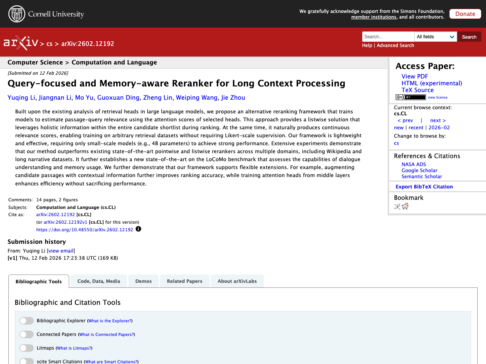
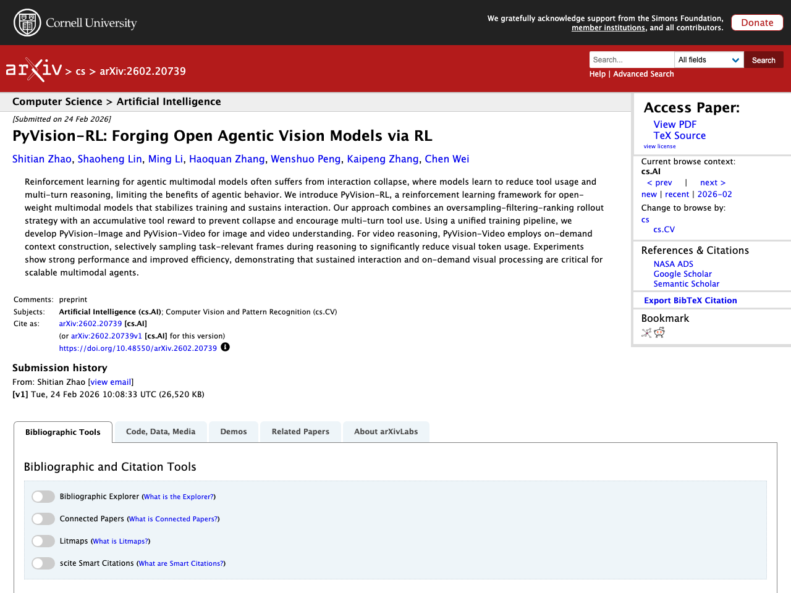
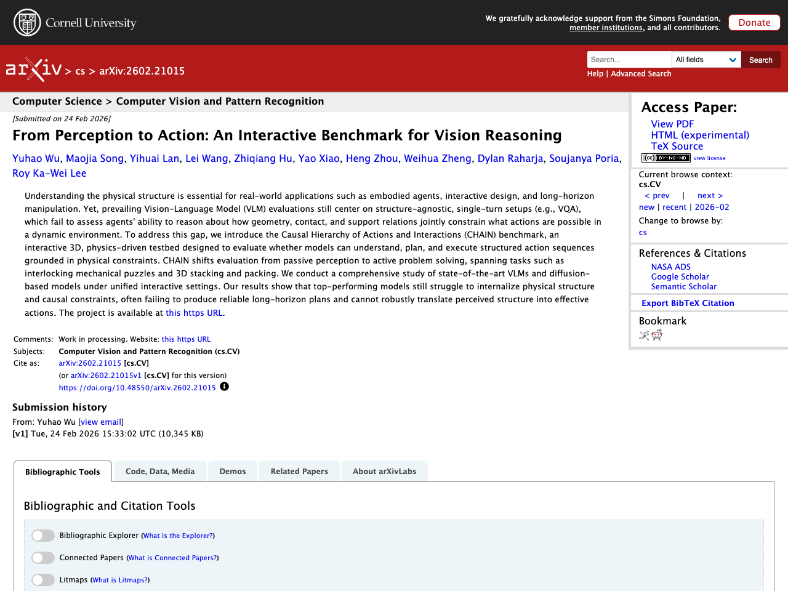
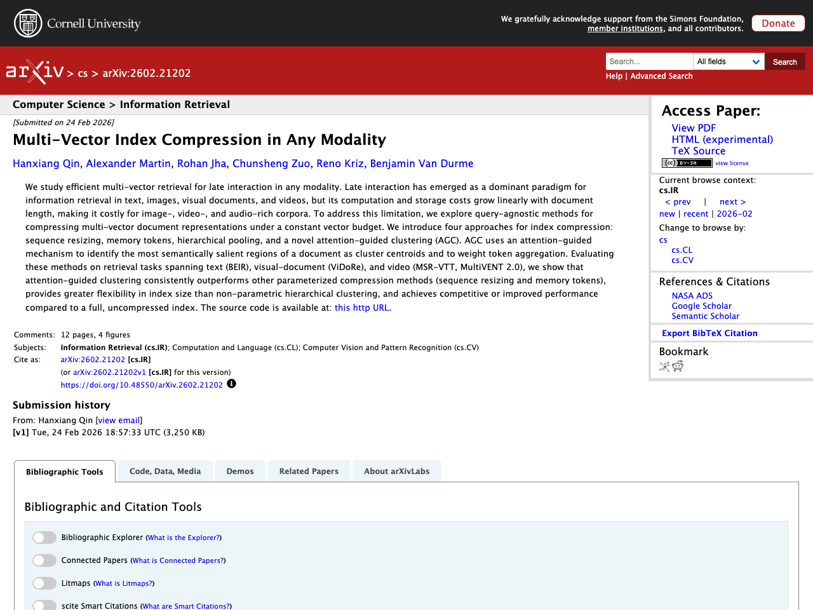
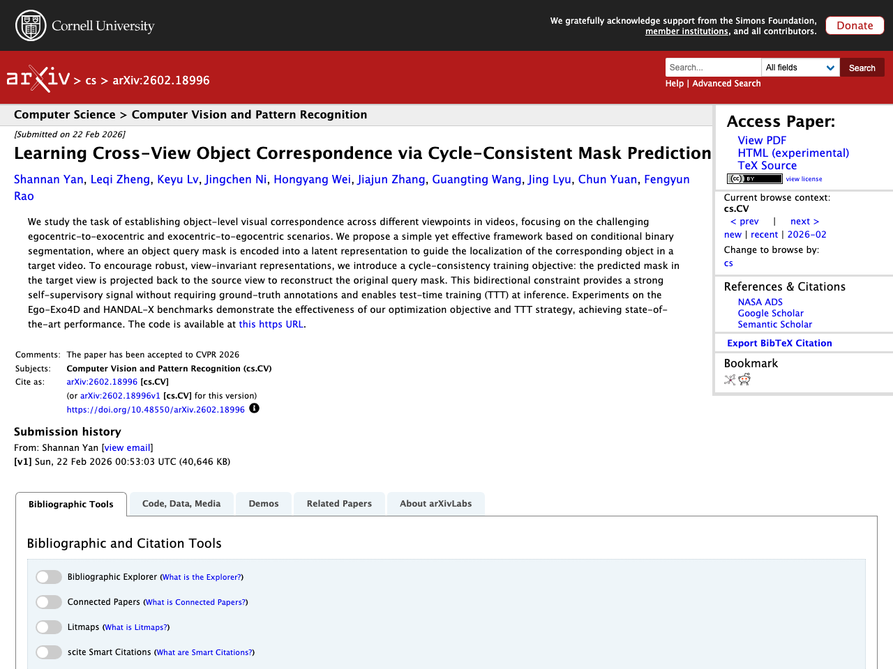

## Introduction

This article summarizes notable LLM-related papers as of 2026-02-26. Papers are automatically collected from arXiv, Semantic Scholar, and Hugging Face Daily Papers, with Japanese summaries generated using the Claude API.

## 1. Query-focused and Memory-aware Reranker for Long Context Processing

- **Authors**: Yuqing Li, Jiangnan Li, Mo Yu, Guoxuan Ding, Zheng Lin et al.
- **Published**: 2026-02-12
- **Source**: [huggingface](https://arxiv.org/abs/2602.12192)
- **arXiv ID**: 2602.12192

### Summary

Based on analysis of retrieval heads in large language models, this paper proposes a reranking framework that trains models to estimate passage-query relevance using the attention scores of selected heads. This listwise approach leverages holistic information within the entire candidate shortlist and naturally produces continuous relevance scores, enabling training on arbitrary retrieval datasets without requiring Likert-scale supervision. The framework is lightweight and effective with small-scale models (e.g., 4B parameters), outperforming state-of-the-art pointwise and listwise rerankers across multiple domains including Wikipedia and long narrative datasets. It further establishes a new state-of-the-art on the LoCoMo benchmark for dialogue understanding and memory usage, and supports flexible extensions such as augmenting candidate passages with contextual information and training attention heads from middle layers.


Built upon the existing analysis of retrieval heads in large language models, we propose an alternative reranking framework that trains models to estimate passage-query relevance using the attention scores of selected heads. This approach provides a listwise solution that leverages holistic information within the entire candidate shortlist during ranking. At the same time, it naturally produces continuous relevance scores, enabling training on arbitrary retrieval datasets without requiring Likert-scale supervision. Our framework is lightweight and effective, requiring only small-scale models (e.g., 4B parameters) to achieve strong performance. Extensive experiments demonstrate that our method outperforms existing state-of-the-art pointwise and listwise rerankers across multiple domains, including Wikipedia and long narrative datasets. It further establishes a new state-of-the-art on the LoCoMo benchmark that assesses the capabilities of dialogue understanding and memory usage. We further demonstrate that our framework supports flexible extensions. For example, augmenting candidate passages with contextual information further improves ranking accuracy, while training attention heads from middle layers enhances efficiency without sacrificing performance.


## 2. PyVision-RL: Forging Open Agentic Vision Models via RL

- **Authors**: Shitian Zhao, Shaoheng Lin, Ming Li, Haoquan Zhang, Wenshuo Peng et al.
- **Published**: 2026-02-24
- **Source**: [huggingface](https://arxiv.org/abs/2602.20739)
- **arXiv ID**: 2602.20739

### Summary

In reinforcement learning for agentic multimodal models, "interaction collapse" is a challenge where models learn to reduce tool usage and multi-turn reasoning. This paper introduces PyVision-RL, a reinforcement learning framework for open-weight multimodal models that combines an oversampling-filtering-ranking rollout strategy with accumulative tool rewards to prevent collapse and encourage multi-turn tool use. Using a unified training pipeline, the authors develop PyVision-Image and PyVision-Video for image and video understanding. For video reasoning in particular, PyVision-Video employs on-demand context construction, selectively sampling task-relevant frames during reasoning to significantly reduce visual token usage. Experiments demonstrate strong performance and improved efficiency, showing that sustained interaction and on-demand visual processing are critical for scalable multimodal agents.


Reinforcement learning for agentic multimodal models often suffers from interaction collapse, where models learn to reduce tool usage and multi-turn reasoning, limiting the benefits of agentic behavior. We introduce PyVision-RL, a reinforcement learning framework for open-weight multimodal models that stabilizes training and sustains interaction. Our approach combines an oversampling-filtering-ranking rollout strategy with an accumulative tool reward to prevent collapse and encourage multi-turn tool use. Using a unified training pipeline, we develop PyVision-Image and PyVision-Video for image and video understanding. For video reasoning, PyVision-Video employs on-demand context construction, selectively sampling task-relevant frames during reasoning to significantly reduce visual token usage. Experiments show strong performance and improved efficiency, demonstrating that sustained interaction and on-demand visual processing are critical for scalable multimodal agents.


## 3. From Perception to Action: An Interactive Benchmark for Vision Reasoning

- **Authors**: Yuhao Wu, Maojia Song, Yihuai Lan, Lei Wang, Zhiqiang Hu et al.
- **Published**: 2026-02-24
- **Source**: [huggingface](https://arxiv.org/abs/2602.21015)
- **arXiv ID**: 2602.21015

### Summary

While understanding physical structure is essential for real-world applications such as embodied agents, interactive design, and long-horizon manipulation, existing Vision-Language Model (VLM) evaluations center on structure-agnostic, single-turn setups (e.g., VQA) that fail to assess agents' ability to reason about geometry, contact, and support relations in dynamic environments. To address this gap, the authors propose the CHAIN (Causal Hierarchy of Actions and Interactions) benchmark, an interactive 3D physics-driven testbed that evaluates whether models can understand, plan, and execute structured action sequences grounded in physical constraints. CHAIN shifts evaluation from passive perception to active problem solving, spanning tasks such as interlocking mechanical puzzles and 3D stacking and packing. A comprehensive study of state-of-the-art VLMs and diffusion-based models reveals that top-performing models still struggle to internalize physical structure and causal constraints, often failing to produce reliable long-horizon plans.


Understanding the physical structure is essential for real-world applications such as embodied agents, interactive design, and long-horizon manipulation. Yet, prevailing Vision-Language Model (VLM) evaluations still center on structure-agnostic, single-turn setups (e.g., VQA), which fail to assess agents' ability to reason about how geometry, contact, and support relations jointly constrain what actions are possible in a dynamic environment. To address this gap, we introduce the Causal Hierarchy of Actions and Interactions (CHAIN) benchmark, an interactive 3D, physics-driven testbed designed to evaluate whether models can understand, plan, and execute structured action sequences grounded in physical constraints. CHAIN shifts evaluation from passive perception to active problem solving, spanning tasks such as interlocking mechanical puzzles and 3D stacking and packing. We conduct a comprehensive study of state-of-the-art VLMs and diffusion-based models under unified interactive settings. Our results show that top-performing models still struggle to internalize physical structure and causal constraints, often failing to produce reliable long-horizon plans and cannot robustly translate perceived structure into effective actions. The project is available at https://social-ai-studio.github.io/CHAIN/.


## 4. Multi-Vector Index Compression in Any Modality

- **Authors**: Hanxiang Qin, Alexander Martin, Rohan Jha, Chunsheng Zuo, Reno Kriz et al.
- **Published**: 2026-02-24
- **Source**: [huggingface](https://arxiv.org/abs/2602.21202)
- **arXiv ID**: 2602.21202

### Summary

This paper proposes efficient multi-vector index compression methods for late interaction retrieval in any modality including text, images, and video. While late interaction has emerged as a dominant paradigm for information retrieval, computation and storage costs grow linearly with document length. To address this, the paper proposes four approaches for query-agnostic multi-vector document representation compression: sequence resizing, memory tokens, hierarchical pooling, and a novel attention-guided clustering (AGC). AGC uses an attention mechanism to identify the most semantically salient regions of a document as cluster centroids and weights token aggregation. Evaluation on retrieval tasks spanning text (BEIR), visual documents (ViDoRe), and video (MSR-VTT, MultiVENT 2.0) shows that AGC consistently outperforms other parameterized compression methods and achieves competitive or improved performance compared to uncompressed indexes.


We study efficient multi-vector retrieval for late interaction in any modality. Late interaction has emerged as a dominant paradigm for information retrieval in text, images, visual documents, and videos, but its computation and storage costs grow linearly with document length, making it costly for image-, video-, and audio-rich corpora. To address this limitation, we explore query-agnostic methods for compressing multi-vector document representations under a constant vector budget. We introduce four approaches for index compression: sequence resizing, memory tokens, hierarchical pooling, and a novel attention-guided clustering (AGC). AGC uses an attention-guided mechanism to identify the most semantically salient regions of a document as cluster centroids and to weight token aggregation. Evaluating these methods on retrieval tasks spanning text (BEIR), visual-document (ViDoRe), and video (MSR-VTT, MultiVENT 2.0), we show that attention-guided clustering consistently outperforms other parameterized compression methods (sequence resizing and memory tokens), provides greater flexibility in index size than non-parametric hierarchical clustering, and achieves competitive or improved performance compared to a full, uncompressed index. The source code is available at: github.com/hanxiangqin/omni-col-press.


## 5. Learning Cross-View Object Correspondence via Cycle-Consistent Mask Prediction

- **Authors**: Shannan Yan, Leqi Zheng, Keyu Lv, Jingchen Ni, Hongyang Wei et al.
- **Published**: 2026-02-22
- **Source**: [huggingface](https://arxiv.org/abs/2602.18996)
- **arXiv ID**: 2602.18996

### Summary

This paper addresses the task of establishing object-level visual correspondence across different viewpoints in videos, focusing on egocentric-to-exocentric and exocentric-to-egocentric scenarios. The proposed method is a simple yet effective framework based on conditional binary segmentation, where an object query mask is encoded into a latent representation to guide localization of the corresponding object in a target video. To learn robust, view-invariant representations, a cycle-consistency training objective is introduced: the predicted mask in the target view is projected back to the source view to reconstruct the original query mask. This bidirectional constraint provides a strong self-supervisory signal without requiring ground-truth annotations and enables test-time training (TTT) at inference. Experiments on Ego-Exo4D and HANDAL-X benchmarks demonstrate the effectiveness of the optimization objective and TTT strategy, achieving state-of-the-art performance.


We study the task of establishing object-level visual correspondence across different viewpoints in videos, focusing on the challenging egocentric-to-exocentric and exocentric-to-egocentric scenarios. We propose a simple yet effective framework based on conditional binary segmentation, where an object query mask is encoded into a latent representation to guide the localization of the corresponding object in a target video. To encourage robust, view-invariant representations, we introduce a cycle-consistency training objective: the predicted mask in the target view is projected back to the source view to reconstruct the original query mask. This bidirectional constraint provides a strong self-supervisory signal without requiring ground-truth annotations and enables test-time training (TTT) at inference. Experiments on the Ego-Exo4D and HANDAL-X benchmarks demonstrate the effectiveness of our optimization objective and TTT strategy, achieving state-of-the-art performance. The code is available at https://github.com/shannany0606/CCMP.


---

*This article is auto-generated. Please refer to each source URL for details about the papers.*
