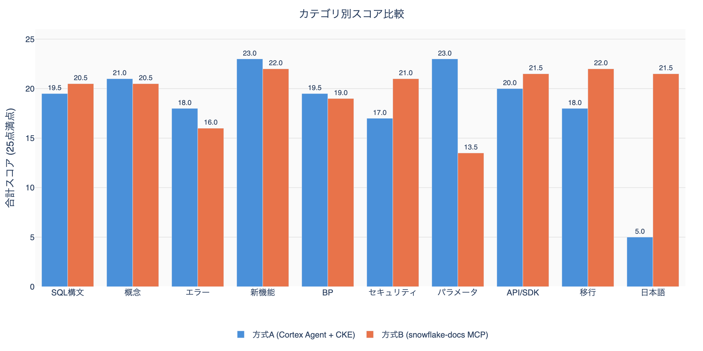
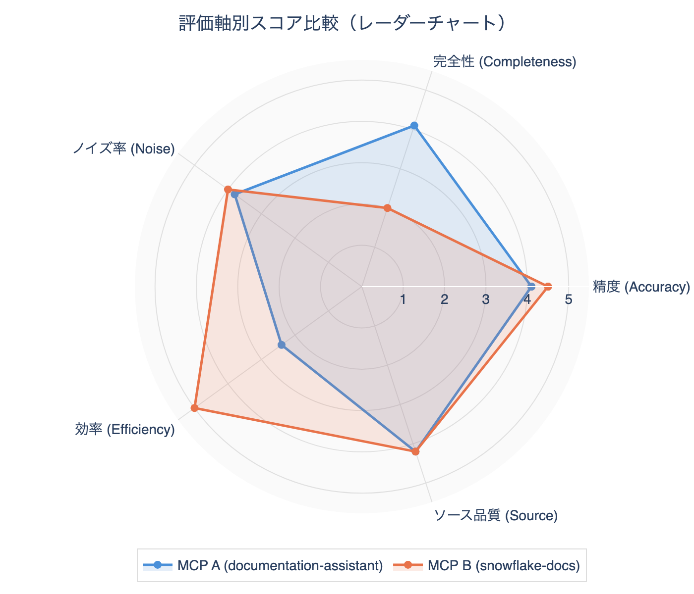
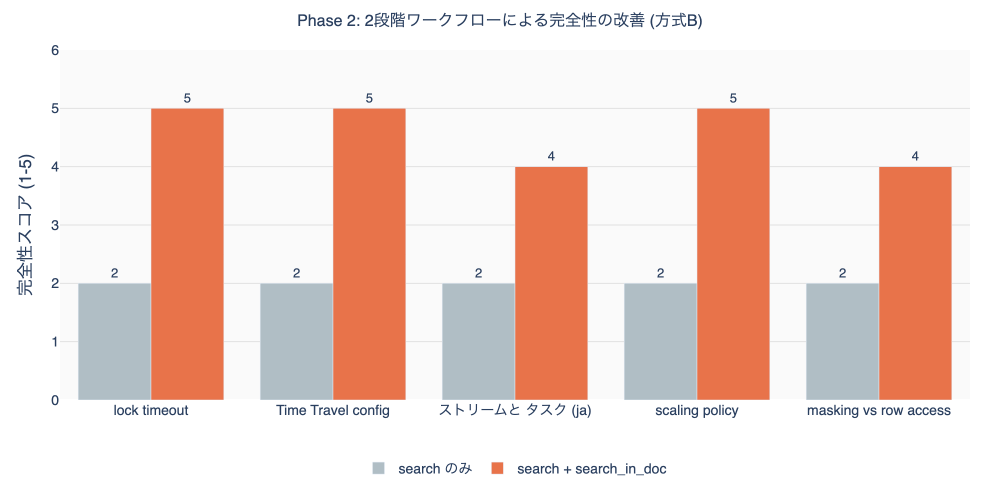

## Introduction

I operate two MCP servers for searching Snowflake official documentation: `snowflake-documentation-assistant` and my custom `snowflake-docs`.



The reason I built the custom MCP server was to allow it to be referenced from Claude Code, Cursor, and Cortex Code CLI running locally without deploying CKE.

The backend of `snowflake-documentation-assistant` is a Cortex Search Service registered as a [Cortex Knowledge Extension (CKE)](https://docs.snowflake.com/en/user-guide/snowflake-cortex/cortex-knowledge-extensions/cke-overview) to Snowflake's [Cortex Agent](https://docs.snowflake.com/en/user-guide/snowflake-cortex/cortex-agents). The Cortex Agent integrates Cortex Search (unstructured data) and Cortex Analyst (structured data) as tools, orchestrating via LLM—this is wrapped as an MCP server and called from Claude Code, Cursor, Cortex Code CLI, etc. The `snowflake-docs` server, on the other hand, is a custom MCP server based on the official site's API and scraping.

This article summarizes the results of a comprehensive benchmark across 10 categories, 20 queries, and 5 evaluation axes.

## Configuration Details

### Method A: snowflake-documentation-assistant (Cortex Agent + CKE)

| Item | Details |
|------|---------|
| Identifier | `snowflake-documentation-assistant` |
| Backend | Cortex Agent + Cortex Search Service (CKE) |
| Call method | Used from Claude Code / Cursor / Cortex Code CLI etc. as MCP server |
| Search method | Semantic search (vector similarity + text match) |
| Number of tools | 1 |
| Language support | English only |

The Cortex Search Service (CKE) registered with Cortex Agent operates as the backend, performing semantic search on document chunks and returning results with scores. Claude Code etc. calls this Cortex Agent via the MCP server.

| Parameter | Type | Default | Description |
|-----------|------|---------|-------------|
| `query` (required) | string | - | Unstructured text query |
| `columns` | array[string] | All columns | Specify columns to return |
| `filter` | object | - | Cortex Search filter (`@eq`, `@contains`, `@gte`, `@lte`) |
| `limit` | integer | 10 | Maximum number of results |

Features:
- Full chunk text returned in a single call (no additional calls needed)
- Handles typos and expression variations via semantic search
- Filter functionality (date, numeric, attribute)
- Approximately 2,500-3,000 tokens consumed at limit=5

### Method B: snowflake-docs (Custom MCP Server)

| Item | Details |
|------|---------|
| Server identifier | `user-snowflake-docs` |
| GitHub | https://github.com/zatoima/snowflake-docs-mcp-server |
| Base technology | Snowflake official site API + scraping |
| Search method | Keyword full-text search (official search API) |
| Number of tools | 5 |
| Language support | English and Japanese (`language` parameter) |

#### Tool List

| # | Tool name | Purpose | Key parameters |
|---|-----------|---------|---------------|
| 1 | `search_snowflake_docs` | Keyword full-text search | `query`, `max_results`(1-20), `language`("en"/"ja"), `include_headings` |
| 2 | `search_in_doc` | In-page search (auto-extract relevant sections) | `url`, `query`, `max_sections`(default 3), `max_length`(max 20000) |
| 3 | `get_doc_toc` | Get heading structure (table of contents) | `url` |
| 4 | `get_doc_section` | Retrieve a specific section | `url`, `section_id`, `include_code_blocks`, `max_length` |
| 5 | `get_doc_content` | Full page retrieval | `url`, `max_length`, `start_index`(pagination) |

Recommended workflow:

```
search_snowflake_docs(include_headings=True)  ~200-400 tokens
         |
         v
search_in_doc(url, query)                     ~600-900 tokens additional
         |
         v
Total ~800-1,200 tokens to get necessary information
```

Features:
- Efficient retrieval of only necessary information via gradual approach
- Code blocks excluded by default (`include_code_blocks=True` to retrieve)
- Native support for Japanese documentation
- Knowledge Base articles also in search scope
- Pagination support

### Architecture Comparison

| Comparison item | Method A (Cortex Agent + CKE) | Method B (snowflake-docs MCP) |
|----------------|-------------------------------|-------------------------------|
| Type | MCP server (backend: Cortex Agent + CKE) | MCP server (custom) |
| Search method | Semantic (vector similarity) | Keyword (full-text search API) |
| Number of tools | 1 | 5 |
| Number of calls | Completes in 1 call | 1-3 gradual calls |
| Typical token consumption | ~2,500-3,000 (limit=5) | ~200-400 (search only), ~800-1,200 (2-stage) |
| Japanese support | Not supported | Supported |
| Code example retrieval | Automatic if in chunk | Explicitly specified with `include_code_blocks=True` |
| Filtering | Cortex Search filters | None |
| Source scope | Official docs + SnowConvert | Official docs + Knowledge Base |
| Granularity control | limit (chunk count) only | max_results, max_sections, max_length, section_id |

## Evaluation Method

### Scoring Method

The LLM-as-a-Judge method was adopted for scoring search results for each query. Claude Opus 4.6 evaluates the search results and assigns scores from 1-5 on each of 5 axes. Since this is not scored by humans, consistency is high, but care should be taken for axes involving subjective judgment (especially noise rate and source quality).

### Evaluation Axes (5 axes, 1-5 score each)

| Axis | Definition |
|------|-----------|
| Accuracy | Does the result contain the information sought? |
| Completeness | Is there sufficient information to answer without additional calls? |
| Noise | Degree of irrelevant results mixed in (5 = no noise) |
| Context Efficiency | Ratio of information value to token consumption |
| Source Quality | Do official references appear at the top? |

### Score Definitions (1-5)

| Score | Accuracy | Completeness | Noise | Context Efficiency | Source Quality |
|-------|----------|-------------|-------|-------------------|---------------|
| 5 | Returns accurate official information | Answerable without additional search | No irrelevant results | Covers necessary info with minimum tokens | Official references only |
| 4 | Accurate but some gaps | Answerable with minor supplement | 1-2 irrelevant results | Some redundancy but acceptable | Mostly official, some KB articles |
| 3 | Has relevant info but indirect | 1 additional search needed | About half irrelevant | Slightly high token cost for info amount | Official and unofficial mixed |
| 2 | Only partial match | Multiple additional searches needed | Mostly irrelevant | Much redundant info | Mostly unofficial |
| 1 | Target information not found | Cannot answer | Almost entirely irrelevant | No info worth the token cost | No official info |

### Test Categories (10 categories x 2 queries = 20 tests)

1. SQL Syntax: CREATE DYNAMIC TABLE, MERGE INTO
2. Concepts/Architecture: micro-partitions, scaling policy
3. Errors: Object does not exist, lock timeout
4. New features: Cortex Agent, Notebooks ML
5. Best practices: CSV loading, warehouse auto-suspend
6. Security: masking vs row access policy, network policy
7. Parameters: STATEMENT_TIMEOUT, DATA_RETENTION_TIME
8. API/SDK: Snowpark saveAsTable, REST API
9. Migration: Oracle PL/SQL, Redshift DISTKEY
10. Japanese: Streams and Tasks, external stage

## Phase 1: 20-Query Score Matrix

See the test categories above for the content of each query. Scores are 1-5 for each axis, with a total of 25 points.

### Method A

| # | Category | Acc | Comp | Noise | Eff | Src | Total |
|---|---------|-----|------|-------|-----|-----|-------|
| Q1 | SQL Syntax | 5 | 5 | 5 | 3 | 5 | 23 |
| Q2 | SQL Syntax | 4 | 4 | 3 | 2 | 3 | 16 |
| Q3 | Concept | 5 | 5 | 5 | 3 | 5 | 23 |
| Q4 | Concept | 4 | 4 | 3 | 3 | 5 | 19 |
| Q5 | Error | 4 | 4 | 3 | 2 | 4 | 17 |
| Q6 | Error | 4 | 4 | 4 | 2 | 5 | 19 |
| Q7 | New Feature | 5 | 5 | 5 | 3 | 5 | 23 |
| Q8 | New Feature | 5 | 5 | 5 | 3 | 5 | 23 |
| Q9 | BP | 4 | 4 | 3 | 2 | 3 | 16 |
| Q10 | BP | 5 | 5 | 5 | 3 | 5 | 23 |
| Q11 | Security | 3 | 3 | 3 | 2 | 4 | 15 |
| Q12 | Security | 4 | 4 | 4 | 2 | 5 | 19 |
| Q13 | Parameter | 5 | 5 | 5 | 3 | 5 | 23 |
| Q14 | Parameter | 5 | 5 | 5 | 3 | 5 | 23 |
| Q15 | API/SDK | 4 | 4 | 3 | 2 | 4 | 17 |
| Q16 | API/SDK | 5 | 5 | 5 | 3 | 5 | 23 |
| Q17 | Migration | 4 | 3 | 3 | 2 | 4 | 16 |
| Q18 | Migration | 5 | 5 | 4 | 2 | 4 | 20 |
| Q19 | Japanese | 1 | 1 | 1 | 1 | 1 | 5 |
| Q20 | Japanese | 1 | 1 | 1 | 1 | 1 | 5 |
| | **Average** | **4.1** | **4.1** | **3.8** | **2.4** | **4.2** | **18.4** |

### Method B

| # | Category | Acc | Comp | Noise | Eff | Src | Total |
|---|---------|-----|------|-------|-----|-----|-------|
| Q1 | SQL Syntax | 5 | 2 | 5 | 5 | 5 | 22 |
| Q2 | SQL Syntax | 5 | 2 | 3 | 5 | 4 | 19 |
| Q3 | Concept | 5 | 2 | 5 | 5 | 5 | 22 |
| Q4 | Concept | 4 | 2 | 4 | 5 | 4 | 19 |
| Q5 | Error | 3 | 2 | 3 | 5 | 2 | 15 |
| Q6 | Error | 4 | 2 | 3 | 5 | 3 | 17 |
| Q7 | New Feature | 5 | 2 | 5 | 5 | 5 | 22 |
| Q8 | New Feature | 5 | 2 | 5 | 5 | 5 | 22 |
| Q9 | BP | 5 | 2 | 4 | 5 | 4 | 20 |
| Q10 | BP | 4 | 2 | 3 | 5 | 4 | 18 |
| Q11 | Security | 5 | 2 | 5 | 5 | 5 | 22 |
| Q12 | Security | 5 | 2 | 4 | 5 | 4 | 20 |
| Q13 | Parameter | 3 | 2 | 2 | 5 | 2 | 14 |
| Q14 | Parameter | 3 | 2 | 1 | 5 | 2 | 13 |
| Q15 | API/SDK | 4 | 2 | 5 | 5 | 5 | 21 |
| Q16 | API/SDK | 5 | 2 | 5 | 5 | 5 | 22 |
| Q17 | Migration | 5 | 2 | 5 | 5 | 5 | 22 |
| Q18 | Migration | 5 | 2 | 5 | 5 | 5 | 22 |
| Q19 | Japanese | 5 | 2 | 4 | 5 | 5 | 21 |
| Q20 | Japanese | 5 | 2 | 5 | 5 | 5 | 22 |
| | **Average** | **4.5** | **2.0** | **4.0** | **5.0** | **4.2** | **19.8** |

### Category-level Aggregation



Method A dominates: Concepts, Errors, New Features, Best Practices, Parameters (5 categories)
Method B dominates: SQL Syntax, Security, API/SDK, Migration, Japanese (5 categories)

### Axis-level Aggregation



## Phase 2: Deep-dive Workflow Test (snowflake-docs)

Verified how completeness improves with a 2-stage workflow of `search` + `search_in_doc`.



When combining `search_in_doc`, completeness improved from an average of 2.0 to 4.6. The additional cost is ~700-900 tokens. The 2-stage workflow total stays at ~1,000-1,200 tokens, about 40% of Method A's ~2,500-3,000 tokens.

## Phase 3: Special Case Tests

### Ambiguous query "how to connect"

| | Method A | Method B |
|---|---|---|
| Results | Spark connection, CONNECT BY syntax → mostly irrelevant | UiPath, DataGrip, Tableau connection → concrete |
| Accuracy | 1 | 3 |

### Specific query "FLATTEN RECURSIVE nested JSON array"

| | Method A | Method B |
|---|---|---|
| Results | FLATTEN function code examples and parameter specifics | FLATTEN reference page + KB article |
| Accuracy | 5 | 5 |
| Completeness | 5 (includes code examples) | 2 (excerpt only) |

### Non-existent feature "Snowflake GraphQL API endpoint"

| | Method A | Method B |
|---|---|---|
| Results | SQL API, Cortex Search REST API | REST API, SQL API overview |
| Accuracy | 2 | 3 |
| Verdict | Neither explicitly states "does not exist" |

### Query with typo "CREAT TABEL with primery key"

| | Method A | Method B |
|---|---|---|
| Results | CREATE TABLE + PRIMARY KEY examples | CREATE TABLE CONSTRAINT + reference |
| Accuracy | 4 | 5 |

### Special Case Aggregation

| Test | Method A | Method B | Dominant |
|------|---------|---------|---------|
| Ambiguous | 1 | 3 | B |
| Specific | 5 | 5 | Tie (A wins on completeness) |
| Non-existent feature | 2 | 3 | B |
| Typo | 4 | 5 | B |

## Overall Scorecard

### Search only (1 call)

| Evaluation axis | Method A | Method B | Dominant |
|----------------|---------|---------|---------|
| Accuracy | 4.1 | 4.5 | B |
| Completeness | 4.1 | 2.0 | A |
| Noise rate | 3.8 | 4.0 | B |
| Efficiency | 2.4 | 5.0 | B |
| Source quality | 4.2 | 4.2 | Tie |
| Japanese support | 1.0 | 5.0 | B |
| Special case resilience | 3.0 | 4.0 | B |

### 2-stage workflow (search + search_in_doc)

| Evaluation axis | Method A (1 call) | Method B (2 calls) | Dominant |
|----------------|------------------|------------------|---------|
| Accuracy | 4.1 | 4.5 | B |
| Completeness | 4.1 | 4.6 | B |
| Noise rate | 3.8 | 4.0 | B |
| Efficiency | 2.4 | 4.0 | B |
| Token consumption | ~2,500-3,000 | ~1,000-1,200 | B |

## Observations from the Evaluation

### 1. Decisive Difference in Japanese Support

Method A returned completely unrelated results for Japanese queries (text_match score 0.0). This is because the Cortex Search Service index consists only of English content. Method B can accurately search Japanese documentation with `language: "ja"`.

### 2. Completeness vs Efficiency Tradeoff

Method A returns full chunk text in a single call, achieving high completeness (4.1), but context consumption is 2-3x higher. Method B can achieve equal or better completeness (4.6) with fewer tokens using the 2-stage workflow.

### 3. Source Diversity

Method B includes Knowledge Base articles in its search scope. Useful for troubleshooting, but for parameter-related queries, KB articles can rank too high, making official references harder to find.

### 4. SnowConvert Noise

Method A tends to mix in migration-related chunks (SnowConvert: Oracle, Redshift, etc.). For SQL syntax queries, 3-4 of 5 results may be SnowConvert documentation.

### 5. Parameter Search

Method A directly matches parameter names within chunks, giving high accuracy for specific parameters like `STATEMENT_TIMEOUT_IN_SECONDS`. Method B tends to rank KB articles higher.

## Related Articles





## References








