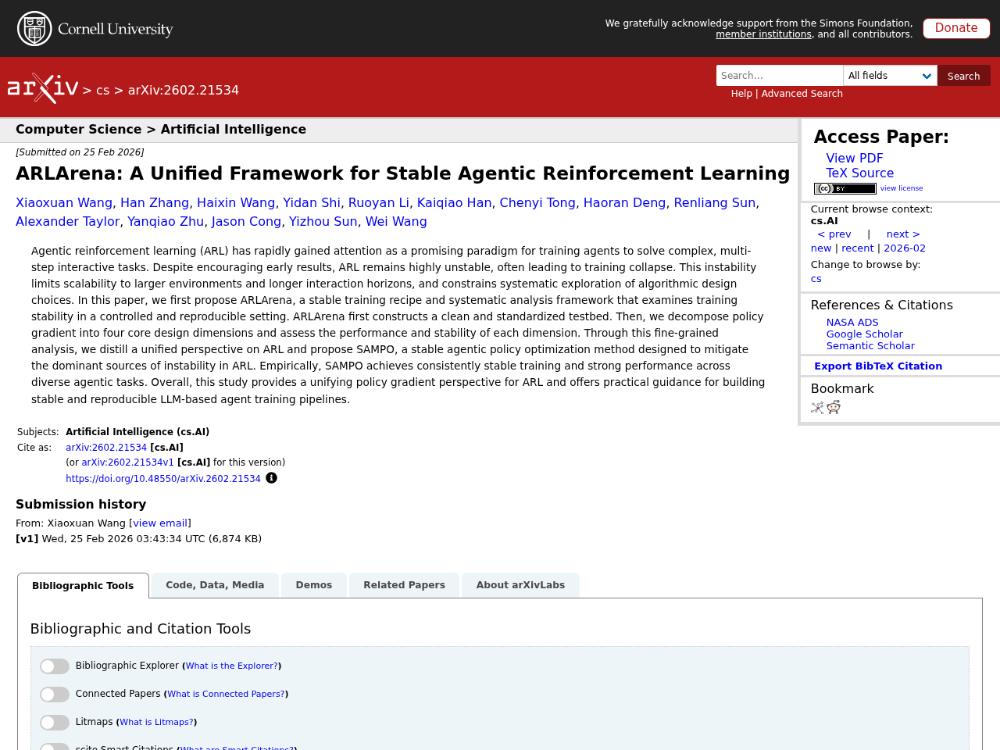
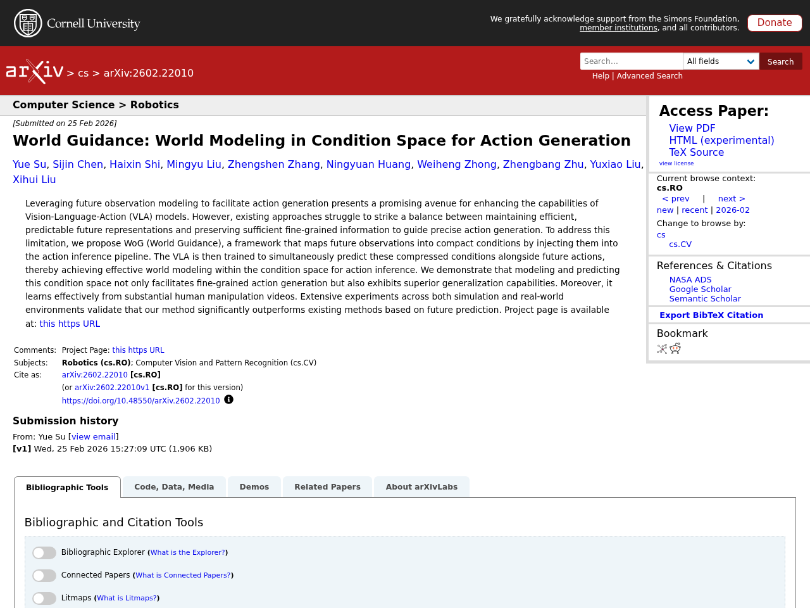
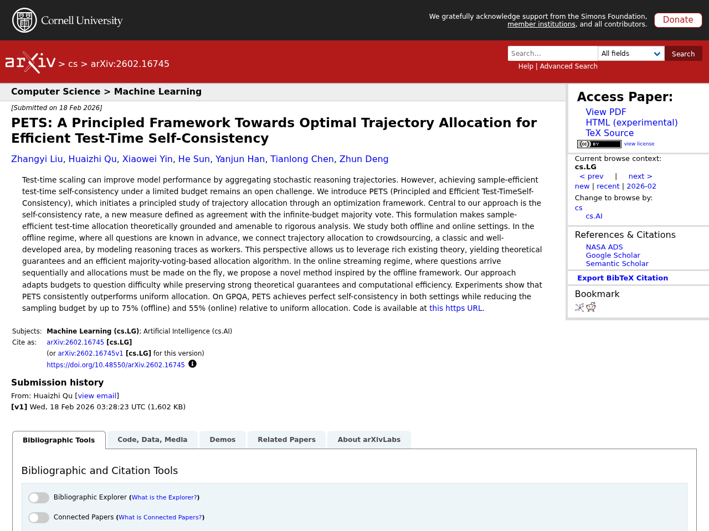
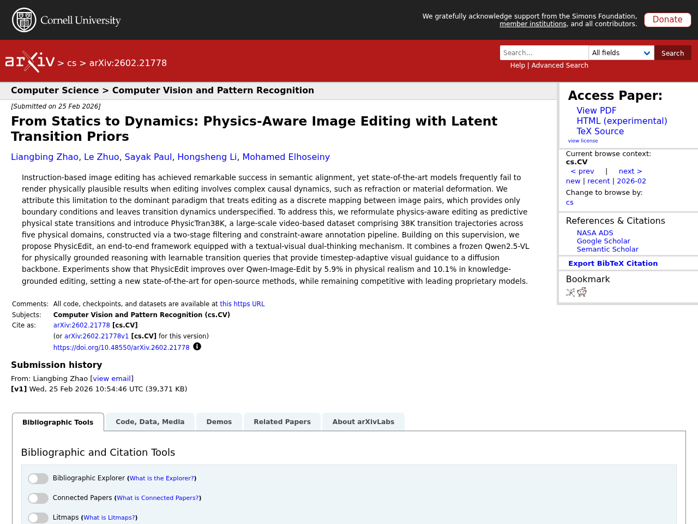

## Introduction

This article summarizes notable LLM-related papers as of 2026-02-27. Papers are automatically collected from arXiv, Semantic Scholar, and Hugging Face Daily Papers, with Japanese summaries generated using the Claude API.

## 1. ARLArena: A Unified Framework for Stable Agentic Reinforcement Learning

- **Authors**: Xiaoxuan Wang, Han Zhang, Haixin Wang, Yidan Shi, Ruoyan Li et al.
- **Published**: 2026-02-25
- **Source**: [huggingface](https://arxiv.org/abs/2602.21534)
- **arXiv ID**: 2602.21534

### Summary

Agentic reinforcement learning (ARL) has rapidly gained attention as a promising paradigm for training agents on complex multi-step interactive tasks, but training instability (collapse) is a serious challenge. This paper proposes ARLArena, a framework for systematically analyzing training stability in a controlled and reproducible environment, decomposing policy gradient into four core design dimensions on a standardized testbed to assess the performance and stability of each dimension. Based on this fine-grained analysis, the paper proposes SAMPO (Stable Agentic Policy Optimization Method), designed to mitigate the dominant sources of instability in ARL. Experiments demonstrate that SAMPO consistently achieves stable training and strong performance across diverse agentic tasks, providing practical guidance for building stable LLM-based agent training pipelines.


Agentic reinforcement learning (ARL) has rapidly gained attention as a promising paradigm for training agents to solve complex, multi-step interactive tasks. Despite encouraging early results, ARL remains highly unstable, often leading to training collapse. This instability limits scalability to larger environments and longer interaction horizons, and constrains systematic exploration of algorithmic design choices. In this paper, we first propose ARLArena, a stable training recipe and systematic analysis framework that examines training stability in a controlled and reproducible setting. ARLArena first constructs a clean and standardized testbed. Then, we decompose policy gradient into four core design dimensions and assess the performance and stability of each dimension. Through this fine-grained analysis, we distill a unified perspective on ARL and propose SAMPO, a stable agentic policy optimization method designed to mitigate the dominant sources of instability in ARL. Empirically, SAMPO achieves consistently stable training and strong performance across diverse agentic tasks. Overall, this study provides a unifying policy gradient perspective for ARL and offers practical guidance for building stable and reproducible LLM-based agent training pipelines.


## 2. World Guidance: World Modeling in Condition Space for Action Generation

- **Authors**: Yue Su, Sijin Chen, Haixin Shi, Mingyu Liu, Zhengshen Zhang et al.
- **Published**: 2026-02-25
- **Source**: [huggingface](https://arxiv.org/abs/2602.22010)
- **arXiv ID**: 2602.22010

### Summary

This paper proposes WoG (World Guidance), a framework for improving action generation in Vision-Language-Action (VLA) models by leveraging future observation information. Existing methods struggle to balance maintaining efficient, predictable future representations while preserving fine-grained information needed for precise action generation. WoG addresses this by mapping future observations into compact conditions and injecting them into the action inference pipeline, achieving effective world modeling in the condition space. This approach not only enables fine-grained action generation but also exhibits superior generalization capabilities, and is shown to effectively learn from large volumes of human manipulation videos. Extensive experiments in both simulation and real-world environments validate significant outperformance over existing methods based on future prediction.


Leveraging future observation modeling to facilitate action generation presents a promising avenue for enhancing the capabilities of Vision-Language-Action (VLA) models. However, existing approaches struggle to strike a balance between maintaining efficient, predictable future representations and preserving sufficient fine-grained information to guide precise action generation. To address this limitation, we propose WoG (World Guidance), a framework that maps future observations into compact conditions by injecting them into the action inference pipeline. The VLA is then trained to simultaneously predict these compressed conditions alongside future actions, thereby achieving effective world modeling within the condition space for action inference. We demonstrate that modeling and predicting this condition space not only facilitates fine-grained action generation but also exhibits superior generalization capabilities. Moreover, it learns effectively from substantial human manipulation videos. Extensive experiments across both simulation and real-world environments validate that our method significantly outperforms existing methods based on future prediction. Project page is available at: https://selen-suyue.github.io/WoGNet/


## 3. PETS: A Principled Framework Towards Optimal Trajectory Allocation for Efficient Test-Time Self-Consistency

- **Authors**: Zhangyi Liu, Huaizhi Qu, Xiaowei Yin, He Sun, Yanjun Han et al.
- **Published**: 2026-02-18
- **Source**: [huggingface](https://arxiv.org/abs/2602.16745)
- **arXiv ID**: 2602.16745

### Summary

This paper proposes PETS (Principled and Efficient Test-Time Self-Consistency), a principled framework for efficiently achieving self-consistency under a limited computational budget in test-time scaling. The core is the "self-consistency rate," a new measure defined as agreement with the infinite-budget majority vote, enabling theoretically grounded optimization of trajectory allocation. In the offline setting, the paper connects to crowdsourcing theory by modeling reasoning traces as workers and derives a majority-voting-based allocation algorithm with theoretical guarantees. In the online streaming setting, it proposes a novel method that adaptively allocates budgets based on question difficulty while preserving theoretical guarantees and computational efficiency. Experiments show that on the GPQA benchmark, PETS achieves perfect self-consistency while reducing the sampling budget by up to 75% (offline) and 55% (online) compared to uniform allocation.


Test-time scaling can improve model performance by aggregating stochastic reasoning trajectories. However, achieving sample-efficient test-time self-consistency under a limited budget remains an open challenge. We introduce PETS (Principled and Efficient Test-TimeSelf-Consistency), which initiates a principled study of trajectory allocation through an optimization framework. Central to our approach is the self-consistency rate, a new measure defined as agreement with the infinite-budget majority vote. This formulation makes sample-efficient test-time allocation theoretically grounded and amenable to rigorous analysis. We study both offline and online settings. In the offline regime, where all questions are known in advance, we connect trajectory allocation to crowdsourcing, a classic and well-developed area, by modeling reasoning traces as workers. This perspective allows us to leverage rich existing theory, yielding theoretical guarantees and an efficient majority-voting-based allocation algorithm. In the online streaming regime, where questions arrive sequentially and allocations must be made on the fly, we propose a novel method inspired by the offline framework. Our approach adapts budgets to question difficulty while preserving strong theoretical guarantees and computational efficiency. Experiments show that PETS consistently outperforms uniform allocation. On GPQA, PETS achieves perfect self-consistency in both settings while reducing the sampling budget by up to 75% (offline) and 55% (online) relative to uniform allocation. Code is available at https://github.com/ZDCSlab/PETS.


## 4. The Trinity of Consistency as a Defining Principle for General World Models

- **Authors**: Jingxuan Wei, Siyuan Li, Yuhang Xu, Zheng Sun, Junjie Jiang et al.
- **Published**: 2026-02-26
- **Source**: [huggingface](https://arxiv.org/abs/2602.23152)
- **arXiv ID**: 2602.23152

### Summary

This paper proposes the "Trinity of Consistency" as a theoretical framework defining the essential properties that General World Models should possess. The framework consists of three elements: Modal Consistency as a semantic interface, Spatial Consistency as a geometric basis, and Temporal Consistency as a causal engine. Reviewing the evolution of multimodal learning against the backdrop of advances in video generation models like Sora and Unified Multimodal Models (UMM), the paper reveals a trajectory from loosely coupled specialized modules toward unified architectures. Additionally, the paper introduces "CoW-Bench," a benchmark focused on multi-frame reasoning and generation scenarios, presenting a unified evaluation protocol for video generation models and UMMs.


The construction of World Models capable of learning, simulating, and reasoning about objective physical laws constitutes a foundational challenge in the pursuit of Artificial General Intelligence. Recent advancements represented by video generation models like Sora have demonstrated the potential of data-driven scaling laws to approximate physical dynamics, while the emerging Unified Multimodal Model (UMM) offers a promising architectural paradigm for integrating perception, language, and reasoning. Despite these advances, the field still lacks a principled theoretical framework that defines the essential properties requisite for a General World Model. In this paper, we propose that a World Model must be grounded in the Trinity of Consistency: Modal Consistency as the semantic interface, Spatial Consistency as the geometric basis, and Temporal Consistency as the causal engine. Through this tripartite lens, we systematically review the evolution of multimodal learning, revealing a trajectory from loosely coupled specialized modules toward unified architectures that enable the synergistic emergence of internal world simulators. To complement this conceptual framework, we introduce CoW-Bench, a benchmark centered on multi-frame reasoning and generation scenarios. CoW-Bench evaluates both video generation models and UMMs under a unified evaluation protocol. Our work establishes a principled pathway toward general world models, clarifying both the limitations of current systems and the architectural requirements for future progress.


## 5. From Statics to Dynamics: Physics-Aware Image Editing with Latent Transition Priors

- **Authors**: Liangbing Zhao, Le Zhuo, Sayak Paul, Hongsheng Li, Mohamed Elhoseiny
- **Published**: 2026-02-25
- **Source**: [huggingface](https://arxiv.org/abs/2602.21778)
- **arXiv ID**: 2602.21778

### Summary

While instruction-based image editing has achieved remarkable success in semantic alignment, state-of-the-art models frequently fail to render physically plausible results when editing involves complex causal dynamics such as refraction or material deformation. This paper reformulates physics-aware editing as predictive physical state transitions and introduces PhysicTran38K, a large-scale video-based dataset comprising 38K transition trajectories across five physical domains. Building on this, the paper proposes PhysicEdit, an end-to-end framework equipped with a textual-visual dual-thinking mechanism, combining a frozen Qwen2.5-VL for physically grounded reasoning with learnable transition queries that provide timestep-adaptive visual guidance to a diffusion backbone. Experiments show that PhysicEdit improves over Qwen-Image-Edit by 5.9% in physical realism and 10.1% in knowledge-grounded editing, setting a new state-of-the-art for open-source methods.


Instruction-based image editing has achieved remarkable success in semantic alignment, yet state-of-the-art models frequently fail to render physically plausible results when editing involves complex causal dynamics, such as refraction or material deformation. We attribute this limitation to the dominant paradigm that treats editing as a discrete mapping between image pairs, which provides only boundary conditions and leaves transition dynamics underspecified. To address this, we reformulate physics-aware editing as predictive physical state transitions and introduce PhysicTran38K, a large-scale video-based dataset comprising 38K transition trajectories across five physical domains, constructed via a two-stage filtering and constraint-aware annotation pipeline. Building on this supervision, we propose PhysicEdit, an end-to-end framework equipped with a textual-visual dual-thinking mechanism. It combines a frozen Qwen2.5-VL for physically grounded reasoning with learnable transition queries that provide timestep-adaptive visual guidance to a diffusion backbone. Experiments show that PhysicEdit improves over Qwen-Image-Edit by 5.9% in physical realism and 10.1% in knowledge-grounded editing, setting a new state-of-the-art for open-source methods, while remaining competitive with leading proprietary models.


---

*This article is auto-generated. Please refer to each source URL for details about the papers.*
