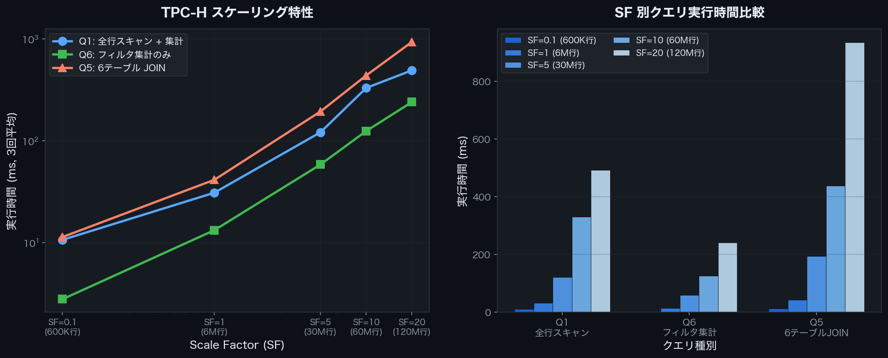

## Introduction

Why is DuckDB so fast? Despite being usable with just `pip install`, how can it process large-scale data aggregations at high speed? This article explains its internal architecture.

DuckDB's design is based on the 2020 paper [Data Management for Data Science — Towards Embedded Analytics](https://duckdb.org/pdf/CIDR2020-raasveldt-muehleisen-duckdb.pdf) (CIDR 2020). The core of its speed comes down to three key elements:

1. **Columnar Storage** — Read only the columns you need
2. **Vectorized Execution** — Batch processing in units of 2048 rows
3. **Query Optimizer** — Eliminate unnecessary operations in advance

## What Is Columnar Storage?

### Row-Oriented vs. Column-Oriented

Traditional databases (MySQL, PostgreSQL, etc.) use row-oriented storage, where each row's data is stored contiguously on disk.

```
Row Store
┌──────────────────────────────────────┐
│ id=1, name="Alice",  score=95.5, ... │  ← Row 1
│ id=2, name="Bob",    score=87.0, ... │  ← Row 2
│ id=3, name="Charlie",score=92.3, ... │  ← Row 3
└──────────────────────────────────────┘
```

DuckDB uses columnar storage, where data from the same column is stored contiguously.

```
Column Store
┌────────────────────────┐
│ id:    1,  2,  3, ...  │  ← id column
│ name:  Alice, Bob, ... │  ← name column
│ score: 95.5, 87.0, ... │  ← score column
└────────────────────────┘
```

### Why Analytical Queries Become Faster

Consider an aggregation query like `SELECT AVG(score) FROM users`.

- **Row-oriented**: All rows must be read to extract only `score`. `id` and `name` are read unnecessarily
- **Column-oriented**: Only the `score` column is read sequentially. I/O is minimized

Furthermore, since data of the same type is stored contiguously, compression efficiency improves dramatically.

## Vectorized Execution

### Row-at-a-Time vs. Batch Processing

Traditional databases primarily used "row-at-a-time" processing (the Volcano Model).

```
Traditional Model (Volcano Model)
  Query Execution Engine
    ↓ Request 1 row
  Filter Node
    ↓ Request 1 row
  Scan Node
    → Returns 1 row at a time
```

DuckDB uses "vectorized execution," processing 2048 rows at once.

```
Vectorized Execution
  Query Execution Engine
    ↓ Request 2048 rows at once
  Filter Node (evaluate 2048 rows in bulk with SIMD)
    ↓ Resulting 2048 rows
  Scan Node
    → Returns 2048 rows in bulk
```

The advantages of this approach are as follows:

| Comparison | Volcano Model | Vectorized |
|------------|--------------|-----------|
| Function call count | Per row | Rows / 2048 |
| CPU cache efficiency | Low | High |
| SIMD instruction utilization | Difficult | Actively used |
| CPU pipeline | Frequently interrupted | Runs continuously |

### SIMD (Single Instruction, Multiple Data)

Modern CPUs can process multiple data elements simultaneously with a single instruction (SIMD). Vectorized execution leverages this to the fullest.

```
SIMD Operation Example (128-bit SIMD adding 4 int32 values simultaneously)
[1, 2, 3, 4]
[5, 6, 7, 8]
     ↓ SIMD addition (1 instruction)
[6, 8, 10, 12]
```

## Query Optimizer

DuckDB optimizes queries before execution, removing unnecessary operations.

### Predicate Pushdown

Filter conditions are applied as early as possible.

```sql
SELECT name FROM users WHERE score > 90;
```

Before optimization:
```
Full table scan → JOIN/aggregation → Filter (score > 90) → Retrieve name
```

After optimization:
```
Filter (score > 90) during scan → Process only matching rows → Retrieve name
```

The amount of data read is significantly reduced.

### Projection Pushdown

Columns not used in the query are never read in the first place.

```sql
SELECT name, score FROM users;  -- id is not needed
```

The `id` column is not read from disk. This is especially effective when combined with columnar storage.

## Parallel Query Execution

DuckDB automatically utilizes multiple cores. By default, it uses as many threads as logical cores to execute queries in parallel.

```python
import duckdb

# Check the number of threads
con = duckdb.connect()
print(con.execute("SELECT current_setting('threads')").fetchone())
# → ('4',)
```

Scans and aggregations on large tables are automatically partitioned and processed in parallel across cores.

## Memory Management and Out-of-Core Processing

DuckDB can process large-scale data that doesn't fit in memory.

- **Buffer Pool**: Caches frequently accessed data in memory
- **Out-of-Core Processing**: Spills to disk and continues execution when memory is insufficient
- **Memory Limit Configuration**: Can be explicitly limited with `SET memory_limit='4GB'`

```sql
SET memory_limit = '4GB';
SET threads = 2;
```

## TPC-H Benchmark Results

TPC-H is an industry-standard benchmark for OLAP performance. Using DuckDB's `tpch` extension, everything from data generation to query execution can be done in one place.

```python
import duckdb, time

con = duckdb.connect()
con.execute('INSTALL tpch; LOAD tpch;')
con.execute('CALL dbgen(sf=1);')  # Specify Scale Factor with sf=N
```

The Scale Factor (SF) is a multiplier for the amount of data generated. SF=1 generates approximately 6 million rows in the lineitem table.

### Benchmark Queries

Execution time was measured with three types of queries.

**Q1: Full Table Scan + Aggregation** (reads all rows of lineitem and performs group aggregation)

```sql
SELECT l_returnflag, l_linestatus,
       COUNT(*) AS count_order, SUM(l_quantity) AS sum_qty
FROM lineitem
WHERE l_shipdate <= DATE '1998-09-02'
GROUP BY l_returnflag, l_linestatus
ORDER BY l_returnflag, l_linestatus;
```

**Q6: Filtered Aggregation** (single aggregation after applying filter conditions)

```sql
SELECT SUM(l_extendedprice * l_discount) AS revenue
FROM lineitem
WHERE l_shipdate >= DATE '1994-01-01'
  AND l_shipdate < DATE '1995-01-01'
  AND l_discount BETWEEN 0.05 AND 0.07
  AND l_quantity < 24;
```

**Q5: 6-Table JOIN + Aggregation** (the most complex query)

```sql
SELECT n_name, SUM(l_extendedprice * (1 - l_discount)) AS revenue
FROM customer, orders, lineitem, supplier, nation, region
WHERE c_custkey = o_custkey
  AND l_orderkey = o_orderkey
  AND l_suppkey = s_suppkey
  AND c_nationkey = s_nationkey
  AND s_nationkey = n_nationkey
  AND n_regionkey = r_regionkey
  AND r_name = 'ASIA'
  AND o_orderdate >= DATE '1994-01-01'
  AND o_orderdate < DATE '1995-01-01'
GROUP BY n_name ORDER BY revenue DESC;
```

### Measured Results (SF=0.1 to SF=20)

Average values from three measurements at each SF are recorded below.

| SF | lineitem Rows | Q1 (ms) | Q6 (ms) | Q5 (ms) |
| --- | ------------ | ------- | ------- | ------- |
| 0.1 | 600,572 | 10.7 | 2.8 | 11.4 |
| 1 | 6,001,215 | 31.0 | 13.3 | 41.5 |
| 5 | 29,999,795 | 121.4 | 58.6 | 194.2 |
| 10 | 59,986,052 | 330.4 | 124.9 | 438.3 |
| 20 | 119,994,608 | 491.6 | 240.4 | 934.3 |


*Execution time comparison of Q1/Q6/Q5 for TPC-H SF=0.1–20 (DuckDB v1.4.4)*

When SF increases by 10x, execution time increases by roughly 10–20x. Q5 (6-table JOIN) is most affected by data volume growth, reaching 934ms at SF=20. Meanwhile, Q6 (simple filtered aggregation) remains relatively contained at 240ms.

Thanks to I/O reduction from columnar storage and SIMD vectorization, Q1 aggregation on 120 million rows completes within 500ms.

## Relationship with Apache Arrow

DuckDB internally leverages Apache Arrow's columnar format.

- **Zero-Copy Transfer**: Data can be transferred to and from Pandas or Polars without copying
- **Interoperability**: High-speed integration with other tools via the Arrow format
- **Memory Efficiency**: Directly utilizes Arrow's efficient memory layout

```python
import duckdb

con = duckdb.connect()
# Retrieve as Arrow Table (zero-copy)
arrow_table = con.execute("SELECT * FROM range(1000000) t(i)").fetch_arrow_table()
print(arrow_table.schema)
```

## Summary

DuckDB's speed comes from the combination of the following technologies:

| Technology | Effect |
|------------|--------|
| Columnar Storage | Read only needed columns → Minimize I/O |
| Vectorized Execution | 2048-row batches → Maximize CPU efficiency |
| Predicate Pushdown | Apply filters early → Reduce rows processed |
| Projection Pushdown | Skip unneeded columns → Reduce I/O |
| Parallel Execution | Automatically utilize multiple cores |
| Apache Arrow | Zero-copy integration between tools |

Aggregating 600K rows takes around 10ms, and even over 100 million rows completes within a few hundred milliseconds. The fact that this performance is available without a server and with a single-line install is what makes DuckDB so compelling.

## References





