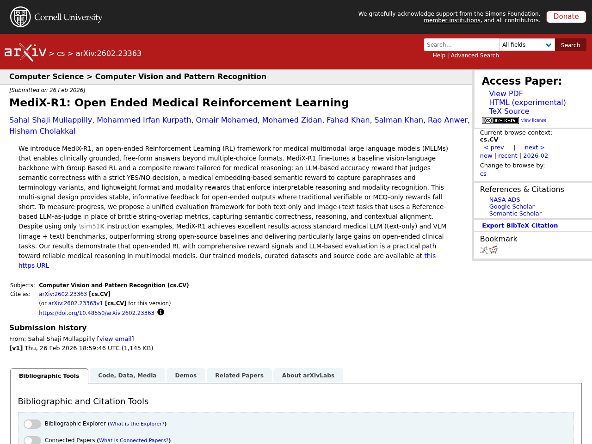
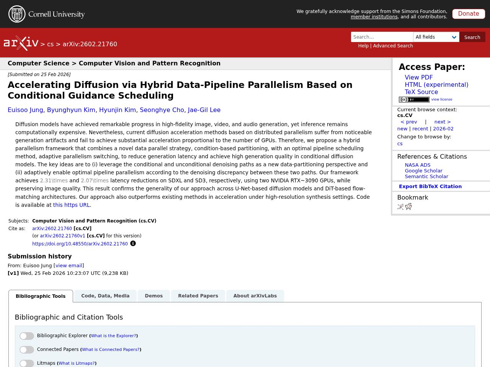
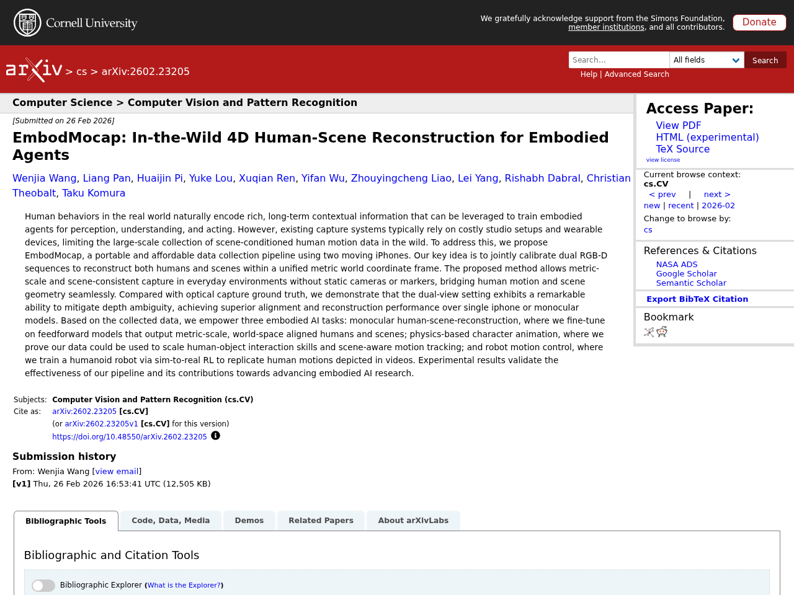
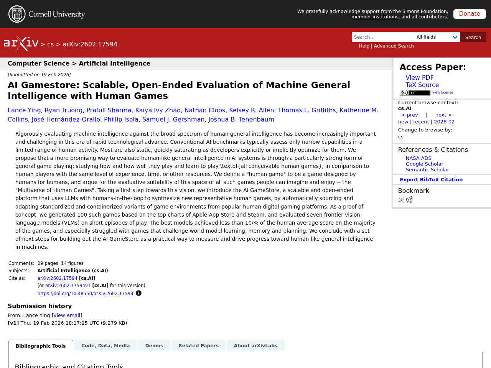
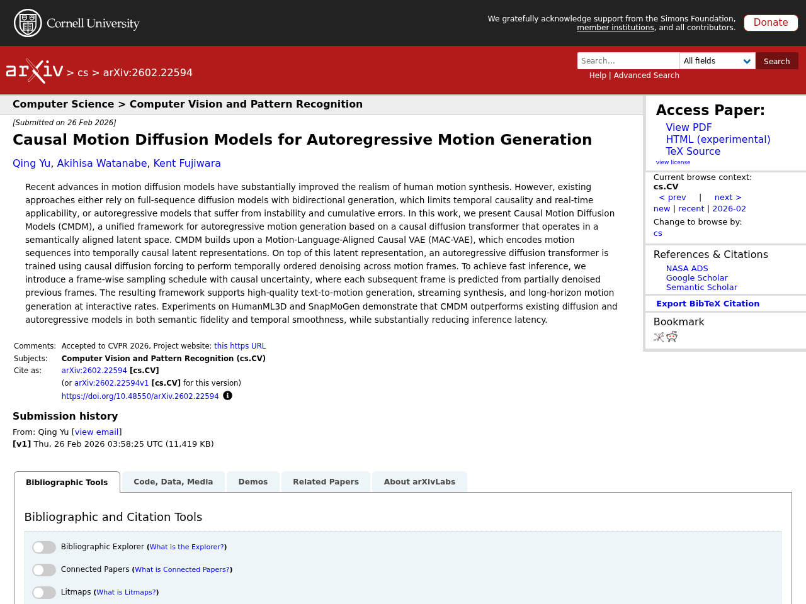

## Introduction

This article summarizes notable LLM-related papers as of 2026-03-01. Papers are automatically collected from arXiv, Semantic Scholar, and Hugging Face Daily Papers, with Japanese summaries generated via the Claude API.

## 1. MediX-R1: Open Ended Medical Reinforcement Learning

- **Authors**: Sahal Shaji Mullappilly, Mohammed Irfan Kurpath, Omair Mohamed, Mohamed Zidan, Fahad Khan et al.
- **Published**: 2026-02-26
- **Source**: [huggingface](https://arxiv.org/abs/2602.23363)
- **arXiv ID**: 2602.23363

### Summary

MediX-R1 is an open-ended reinforcement learning framework for medical multimodal large language models (MLLMs) that enables clinically grounded, free-form answer generation beyond conventional multiple-choice formats. It fine-tunes a vision-language model using group-based reinforcement learning with a composite reward function specifically designed for medical reasoning: an LLM-based accuracy reward, a medical embedding-based semantic reward, and format/modality rewards. For evaluation, the authors propose a unified evaluation framework using a reference-based LLM judge instead of traditional string-matching metrics, capturing semantic correctness, reasoning, and contextual alignment. Despite training on only approximately 51,000 instruction examples, MediX-R1 outperforms strong open-source baselines on both text-only and image+text medical benchmarks, achieving particularly significant performance gains on open-ended clinical tasks.


We introduce MediX-R1, an open-ended Reinforcement Learning (RL) framework for medical multimodal large language models (MLLMs) that enables clinically grounded, free-form answers beyond multiple-choice formats. MediX-R1 fine-tunes a baseline vision-language backbone with Group Based RL and a composite reward tailored for medical reasoning: an LLM-based accuracy reward that judges semantic correctness with a strict YES/NO decision, a medical embedding-based semantic reward to capture paraphrases and terminology variants, and lightweight format and modality rewards that enforce interpretable reasoning and modality recognition. This multi-signal design provides stable, informative feedback for open-ended outputs where traditional verifiable or MCQ-only rewards fall short. To measure progress, we propose a unified evaluation framework for both text-only and image+text tasks that uses a Reference-based LLM-as-judge in place of brittle string-overlap metrics, capturing semantic correctness, reasoning, and contextual alignment. Despite using only sim51K instruction examples, MediX-R1 achieves excellent results across standard medical LLM (text-only) and VLM (image + text) benchmarks, outperforming strong open-source baselines and delivering particularly large gains on open-ended clinical tasks. Our results demonstrate that open-ended RL with comprehensive reward signals and LLM-based evaluation is a practical path toward reliable medical reasoning in multimodal models. Our trained models, curated datasets and source code are available at https://medix.cvmbzuai.com


## 2. Accelerating Diffusion via Hybrid Data-Pipeline Parallelism Based on Conditional Guidance Scheduling

- **Authors**: Euisoo Jung, Byunghyun Kim, Hyunjin Kim, Seonghye Cho, Jae-Gil Lee
- **Published**: 2026-02-25
- **Source**: [huggingface](https://arxiv.org/abs/2602.21760)
- **arXiv ID**: 2602.21760

### Summary

Diffusion models have achieved remarkable progress in high-quality image, video, and audio generation, but inference computational costs remain high. Existing distributed parallelism approaches for acceleration suffer from degraded generation quality and fail to achieve sufficient speedup proportional to the number of GPUs. This study proposes a hybrid parallelism framework that combines a data parallel strategy leveraging conditional and unconditional denoising paths as a novel data-partitioning perspective, with a scheduling method that adaptively switches to optimal pipeline parallelism based on the denoising discrepancy between the two paths. Experiments using two NVIDIA RTX 3090 GPUs achieved latency reductions of 2.31x on SDXL and 2.07x on SD3 while maintaining image quality, demonstrating generality across both U-Net-based and DiT-based architectures. The framework also outperforms existing methods in acceleration under high-resolution generation settings.


Diffusion models have achieved remarkable progress in high-fidelity image, video, and audio generation, yet inference remains computationally expensive. Nevertheless, current diffusion acceleration methods based on distributed parallelism suffer from noticeable generation artifacts and fail to achieve substantial acceleration proportional to the number of GPUs. Therefore, we propose a hybrid parallelism framework that combines a novel data parallel strategy, condition-based partitioning, with an optimal pipeline scheduling method, adaptive parallelism switching, to reduce generation latency and achieve high generation quality in conditional diffusion models. The key ideas are to (i) leverage the conditional and unconditional denoising paths as a new data-partitioning perspective and (ii) adaptively enable optimal pipeline parallelism according to the denoising discrepancy between these two paths. Our framework achieves 2.31times and 2.07times latency reductions on SDXL and SD3, respectively, using two NVIDIA RTX~3090 GPUs, while preserving image quality. This result confirms the generality of our approach across U-Net-based diffusion models and DiT-based flow-matching architectures. Our approach also outperforms existing methods in acceleration under high-resolution synthesis settings. Code is available at https://github.com/kaist-dmlab/Hybridiff.


## 3. EmbodMocap: In-the-Wild 4D Human-Scene Reconstruction for Embodied Agents

- **Authors**: Wenjia Wang, Liang Pan, Huaijin Pi, Yuke Lou, Xuqian Ren et al.
- **Published**: 2026-02-26
- **Source**: [huggingface](https://arxiv.org/abs/2602.23205)
- **arXiv ID**: 2602.23205

### Summary

EmbodMocap is a portable, low-cost 4D human-scene reconstruction pipeline using two iPhones that enables large-scale collection of human behavior data in everyday environments without studio equipment or wearable devices. The core approach jointly calibrates dual RGB-D sequences within a unified metric-scale world coordinate frame to consistently reconstruct both humans and scenes. Compared to monocular or single-iPhone setups, the dual-view configuration significantly mitigates depth ambiguity and achieves superior alignment and reconstruction accuracy. The effectiveness of the collected data is experimentally validated across three embodied AI tasks: fine-tuning for monocular human-scene reconstruction, scaling human-object interaction skills in physics-based character animation, and humanoid robot motion control via sim-to-real reinforcement learning.


Human behaviors in the real world naturally encode rich, long-term contextual information that can be leveraged to train embodied agents for perception, understanding, and acting. However, existing capture systems typically rely on costly studio setups and wearable devices, limiting the large-scale collection of scene-conditioned human motion data in the wild. To address this, we propose EmbodMocap, a portable and affordable data collection pipeline using two moving iPhones. Our key idea is to jointly calibrate dual RGB-D sequences to reconstruct both humans and scenes within a unified metric world coordinate frame. The proposed method allows metric-scale and scene-consistent capture in everyday environments without static cameras or markers, bridging human motion and scene geometry seamlessly. Compared with optical capture ground truth, we demonstrate that the dual-view setting exhibits a remarkable ability to mitigate depth ambiguity, achieving superior alignment and reconstruction performance over single iphone or monocular models. Based on the collected data, we empower three embodied AI tasks: monocular human-scene-reconstruction, where we fine-tune on feedforward models that output metric-scale, world-space aligned humans and scenes; physics-based character animation, where we prove our data could be used to scale human-object interaction skills and scene-aware motion tracking; and robot motion control, where we train a humanoid robot via sim-to-real RL to replicate human motions depicted in videos. Experimental results validate the effectiveness of our pipeline and its contributions towards advancing embodied AI research.


## 4. AI Gamestore: Scalable, Open-Ended Evaluation of Machine General Intelligence with Human Games

- **Authors**: Lance Ying, Ryan Truong, Prafull Sharma, Kaiya Ivy Zhao, Nathan Cloos et al.
- **Published**: 2026-02-19
- **Source**: [huggingface](https://arxiv.org/abs/2602.17594)
- **arXiv ID**: 2602.17594

### Summary

This paper proposes a novel evaluation approach for rigorously assessing AI against human general intelligence by measuring the ability to play and learn any game designed by humans for humans (the "Multiverse of Human Games"). As a first step toward this vision, the authors built AI GameStore, a scalable and open-ended evaluation platform that leverages LLMs and human-in-the-loop to automatically source and adapt standardized, containerized game environments from popular gaming platforms such as the Apple App Store and Steam. As a proof of concept, 100 games were generated from top-ranked titles and seven state-of-the-art vision-language models (VLMs) were evaluated. The best models achieved less than 10% of the human average score on the majority of games, with particularly poor performance on games requiring world-model learning, memory, and planning.


Rigorously evaluating machine intelligence against the broad spectrum of human general intelligence has become increasingly important and challenging in this era of rapid technological advance. Conventional AI benchmarks typically assess only narrow capabilities in a limited range of human activity. Most are also static, quickly saturating as developers explicitly or implicitly optimize for them. We propose that a more promising way to evaluate human-like general intelligence in AI systems is through a particularly strong form of general game playing: studying how and how well they play and learn to play all conceivable human games, in comparison to human players with the same level of experience, time, or other resources. We define a "human game" to be a game designed by humans for humans, and argue for the evaluative suitability of this space of all such games people can imagine and enjoy -- the "Multiverse of Human Games". Taking a first step towards this vision, we introduce the AI GameStore, a scalable and open-ended platform that uses LLMs with humans-in-the-loop to synthesize new representative human games, by automatically sourcing and adapting standardized and containerized variants of game environments from popular human digital gaming platforms. As a proof of concept, we generated 100 such games based on the top charts of Apple App Store and Steam, and evaluated seven frontier vision-language models (VLMs) on short episodes of play. The best models achieved less than 10\% of the human average score on the majority of the games, and especially struggled with games that challenge world-model learning, memory and planning. We conclude with a set of next steps for building out the AI GameStore as a practical way to measure and drive progress toward human-like general intelligence in machines.


## 5. Causal Motion Diffusion Models for Autoregressive Motion Generation

- **Authors**: Qing Yu, Akihisa Watanabe, Kent Fujiwara
- **Published**: 2026-02-26
- **Source**: [huggingface](https://arxiv.org/abs/2602.22594)
- **arXiv ID**: 2602.22594

### Summary

Recent motion diffusion models have substantially improved the realism of human motion synthesis, but existing approaches face challenges: bidirectional generation lacks temporal causality and real-time applicability, while autoregressive models suffer from instability and cumulative errors. This work proposes Causal Motion Diffusion Models (CMDM), a unified framework for autoregressive motion generation based on a causal diffusion transformer operating in a semantically aligned latent space. CMDM builds upon a Motion-Language-Aligned Causal VAE (MAC-VAE) that encodes motion sequences into temporally causal latent representations, and trains an autoregressive diffusion transformer on top using causal diffusion forcing for temporally ordered denoising. For fast inference, a frame-wise sampling schedule with causal uncertainty is introduced, where each subsequent frame is predicted from partially denoised previous frames, enabling text-to-motion generation, streaming synthesis, and long-horizon motion generation at interactive rates. Experiments on HumanML3D and SnapMoGen demonstrate that CMDM outperforms existing diffusion and autoregressive models in both semantic fidelity and temporal smoothness, while substantially reducing inference latency.


Recent advances in motion diffusion models have substantially improved the realism of human motion synthesis. However, existing approaches either rely on full-sequence diffusion models with bidirectional generation, which limits temporal causality and real-time applicability, or autoregressive models that suffer from instability and cumulative errors. In this work, we present Causal Motion Diffusion Models (CMDM), a unified framework for autoregressive motion generation based on a causal diffusion transformer that operates in a semantically aligned latent space. CMDM builds upon a Motion-Language-Aligned Causal VAE (MAC-VAE), which encodes motion sequences into temporally causal latent representations. On top of this latent representation, an autoregressive diffusion transformer is trained using causal diffusion forcing to perform temporally ordered denoising across motion frames. To achieve fast inference, we introduce a frame-wise sampling schedule with causal uncertainty, where each subsequent frame is predicted from partially denoised previous frames. The resulting framework supports high-quality text-to-motion generation, streaming synthesis, and long-horizon motion generation at interactive rates. Experiments on HumanML3D and SnapMoGen demonstrate that CMDM outperforms existing diffusion and autoregressive models in both semantic fidelity and temporal smoothness, while substantially reducing inference latency.


---

*This article is auto-generated. Please refer to the source URLs for paper details.*