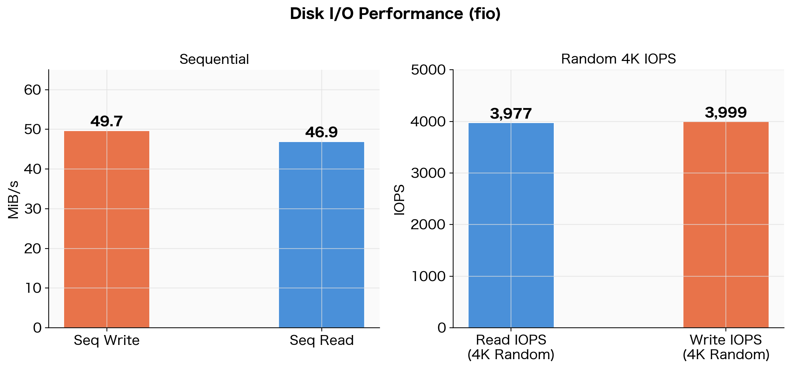

## Introduction

[Oracle Cloud Always Free](https://www.oracle.com/jp/cloud/free/) offers ARM64 architecture [Ampere A1 Compute](https://www.oracle.com/jp/cloud/compute/arm/) instances at no cost. Since CPU cores and memory are available permanently free up to a certain limit, many people use them for personal projects or as CI/CD execution platforms.

In this article, I measure the CPU, cryptographic processing, memory, disk I/O, and network speed of this ARM64 instance using `stress-ng`, `fio`, `openssl speed`, and `speedtest`, running each test 3 times and summarizing the averages.

## Test Environment and Tools

The OS is Oracle Linux 9.6 with an aarch64 (ARM64) kernel.

```bash
$ uname -a
Linux oci-free 6.12.0-1.23.3.2.el9uek.aarch64 #1 SMP ... aarch64 GNU/Linux

$ lscpu | grep -E 'Model name|CPU\(s\)'
CPU(s):   4
Model name: Neoverse-N1
```

The tools used and their purposes are as follows.

| Tool | Purpose | Installation |
| --- | --- | --- |
| stress-ng | CPU and memory stress testing | `dnf install stress-ng` |
| fio | Disk I/O measurement | `dnf install fio` |
| openssl speed | Cryptographic throughput | Pre-installed |
| speedtest | Network speed measurement | Ookla official binary |

`stress-ng` and `fio` can be obtained via the EPEL repository.

```bash
sudo dnf install -y epel-release
sudo dnf install -y stress-ng fio
```

Each item was measured 3 times, and the average values are used.

## CPU Performance

Using the `matrixprod` (matrix multiplication) stressor in `stress-ng`, I applied load for 30 seconds and measured bogo ops/s.

```bash
# Single core
stress-ng --cpu 1 --cpu-method matrixprod --metrics-brief --timeout 30s

# All cores (4)
stress-ng --cpu 4 --cpu-method matrixprod --metrics-brief --timeout 30s
```

```text
stress-ng: metrc: cpu  1609  30.09  30.06  0.00  53.48  53.53
stress-ng: metrc: cpu  6401  30.07  119.64  0.04  212.90  53.49
```

| Test Type | bogo ops/s (3-run average) |
| --- | --- |
| Single core | 53.08 |
| All cores (4) | 211.79 |
| Scaling ratio | 3.99x |


*CPU benchmark results using stress-ng matrixprod (3-run average)*

The scaling efficiency from single core to all cores is nearly 4x, indicating almost no inter-core interference. Since Neoverse-N1 is designed to scale core count without sacrificing single-thread performance, this result is expected.

Note that bogo ops/s is a pseudo-metric specific to stress-ng and cannot be compared across different stressors. Here, the purpose is to verify relative scaling efficiency using the same stressor (matrixprod).

## Cryptographic Performance

I measured AES-256-CBC and SHA-256 throughput using `openssl speed`. Neoverse-N1 includes hardware AES instructions (ARMv8 Cryptography Extensions), which significantly accelerate performance compared to software implementations.

```bash
openssl speed aes-256-cbc sha256
```

```text
sha256           72255.22k   261173.17k   740627.88k  1369694.87k  1817938.60k  1869770.57k
aes-256-cbc     834545.80k  1378167.23k  1615928.85k  1677753.69k  1700137.64k  1702980.27k
```

Each column in the output corresponds to a block size (16B / 64B / 256B / 1KB / 8KB / 16KB).

| Algorithm | 16KB block (3-run average) |
| --- | --- |
| AES-256-CBC | 1,705,589 KB/s (≈ 1.71 GB/s) |
| SHA-256 | 1,870,470 KB/s (≈ 1.87 GB/s) |

AES-256-CBC at approximately **1.71 GB/s** for 16KB blocks represents a throughput level where encryption processing for HTTPS or VPN can be performed at virtually no cost.

## Memory Performance

Using the `--vm` stressor in `stress-ng`, I repeatedly read and wrote to a 4GB working set and measured throughput.

```bash
stress-ng --vm 1 --vm-bytes 4G --metrics-brief --timeout 30s
```

```text
stress-ng: metrc: vm  1324315  30.23  26.54  3.65  43810.44  43868.81
```

| Test | bogo ops/s (3-run average) |
| --- | --- |
| Memory read/write (4GB working set) | 42,896 |

One of the 3 runs produced a lower value (38,748 bogo ops/s), likely due to contention with other processes, but the remaining 2 runs were stable in the 44,000–46,000 range.

## Disk I/O Performance

I measured sequential and random I/O on the `/home` volume (100GB) using `fio`.

```bash
# Sequential write
fio --name=seq_write --directory=/home/opc/fio_test \
    --rw=write --bs=1M --size=2G --numjobs=1 \
    --time_based --runtime=30 --iodepth=16 --ioengine=libaio --direct=1 --group_reporting

# Sequential read
fio --name=seq_read --directory=/home/opc/fio_test \
    --rw=read --bs=1M --size=2G --numjobs=1 \
    --time_based --runtime=30 --iodepth=16 --ioengine=libaio --direct=1 --group_reporting

# Random 4K read/write
fio --name=rand_rw --directory=/home/opc/fio_test \
    --rw=randrw --bs=4k --size=1G --numjobs=4 \
    --time_based --runtime=30 --iodepth=32 --ioengine=libaio --direct=1 --group_reporting
```

```text
# Sequential write
WRITE: bw=51.0MiB/s (53.5MB/s), io=2049MiB, run=40179msec

# Sequential read
READ: bw=46.9MiB/s (49.2MB/s), io=1411MiB, run=30059msec

# Random 4K
read: IOPS=4071, BW=15.9MiB/s
write: IOPS=4094, BW=16.0MiB/s
```

| Test Type | Result (3-run average) |
| --- | --- |
| Sequential write | 49.7 MiB/s |
| Sequential read | 46.9 MiB/s |
| Random 4K Read IOPS | 3,977 |
| Random 4K Write IOPS | 3,999 |


*Disk I/O benchmark results using fio (3-run average)*

Sequential throughput was approximately 50 MiB/s, and random 4K IOPS was approximately 4,000.

### Why These Numbers

OCI Block Volume performance on the "Balanced" tier (default) scales proportionally with volume size.

| Metric | Balanced Tier Formula | Limit for 100GB |
| --- | --- | --- |
| Throughput | 480 KB/s × GB | **47.0 MiB/s** |
| IOPS | 60 IOPS × GB | **6,000 IOPS** |

Comparing our measured values against the limits:

| Measured Result | OCI Limit | Ratio |
| --- | --- | --- |
| Seq Read: 46.9 MiB/s | 47.0 MiB/s | 99.8% (hitting the limit) |
| Seq Write: 49.7 MiB/s | 47.0 MiB/s | Near limit (write buffer effect) |
| 4K Read IOPS: 3,977 | 6,000 IOPS | 66% |

This is not a "slow environment" but rather a state where the Balanced storage performance limit is being fully utilized. For reference, here is a comparison with block storage from other cloud providers:

| Service | Sequential | IOPS |
| --- | --- | --- |
| OCI Always Free (Balanced, 100GB) | ~47 MiB/s | ~6,000 |
| AWS gp3 EBS (default) | 125 MiB/s | 3,000 |
| AWS gp2 EBS (100GB) | 128 MiB/s | 300 (burst 3,000) |

Throughput is about 1/3 of AWS gp3, but this may not be an issue depending on the use case.

| Use Case | Assessment |
| --- | --- |
| Log aggregation, scheduled batch jobs | No issues |
| Lightweight web server / API server | No issues |
| Large-scale ETL (GB-level data) | Can become a bottleneck |
| Heavy random I/O database workloads | Challenging |

## Network Speed

I used Ookla's official `speedtest` CLI, connecting to a fixed server in Tokyo (IPA CyberLab 400G, id: 48463). Using a fixed target server eliminates result variability caused by server selection.

```bash
speedtest --server-id=48463 --accept-license --accept-gdpr
```

```text
Server: IPA CyberLab 400G - Tokyo (id: 48463)
   ISP: Oracle Cloud
Idle Latency:  1.76 ms
    Download:  3829.18 Mbps
      Upload:  3977.41 Mbps
 Packet Loss:  0.0%
```

| Test | Result (3-run average) |
| --- | --- |
| Idle Latency | 1.88 ms |
| Download | 3,838 Mbps |
| Upload | 3,513 Mbps |


*Network speed measurement results using speedtest (IPA CyberLab 400G Tokyo) (3-run average)*

Download was stable across all 3 runs at 3,790–3,860 Mbps, confirming that OCI's network bandwidth delivers approximately **3.8 Gbps**. Upload showed some variation between measurements but averaged over 3.5 Gbps.

## Results Summary

| Metric | Measured Value (3-run average) |
| --- | --- |
| CPU Single Core | 53.08 bogo ops/s |
| CPU All Cores (4) | 211.79 bogo ops/s (scaling efficiency 3.99x) |
| AES-256-CBC 16KB | 1,705,589 KB/s (≈ 1.71 GB/s) |
| SHA-256 16KB | 1,870,470 KB/s (≈ 1.87 GB/s) |
| Memory (4GB WS) | 42,896 bogo ops/s |
| Disk Seq Write | 49.7 MiB/s |
| Disk Seq Read | 46.9 MiB/s |
| Disk 4K Read IOPS | 3,977 |
| Disk 4K Write IOPS | 3,999 |
| Network DL | 3,838 Mbps |
| Network UL | 3,513 Mbps |

## Conclusion

Here is a summary of the OCI Always Free ARM64 instance benchmark results:

- **CPU**: Per-core throughput is modest, but the 4-core scaling efficiency is nearly 100%, making it well-suited for parallel processing
- **Cryptographic processing**: Hardware AES instructions deliver 1.71 GB/s for AES-256-CBC, making it suitable for TLS termination and encrypted storage use cases
- **Disk**: Sequential ~50 MiB/s and random 4K ~4,000 IOPS represent the Balanced tier limits, which is a standard level for cloud block storage
- **Network**: Fixed-server testing recorded **3.8 Gbps** download speed — an impressive bandwidth for a free tier, more than sufficient for large data transfers and high-traffic web services

For a completely free environment, the performance is more than adequate, and it can be utilized for a wide range of purposes including lightweight web servers, scheduled batch processing, and data analysis platforms.

## References





