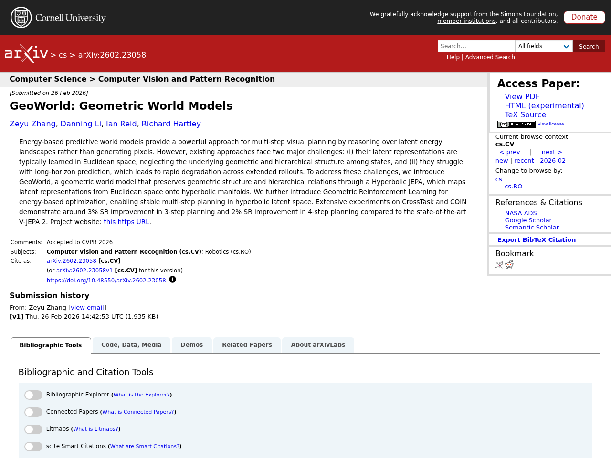
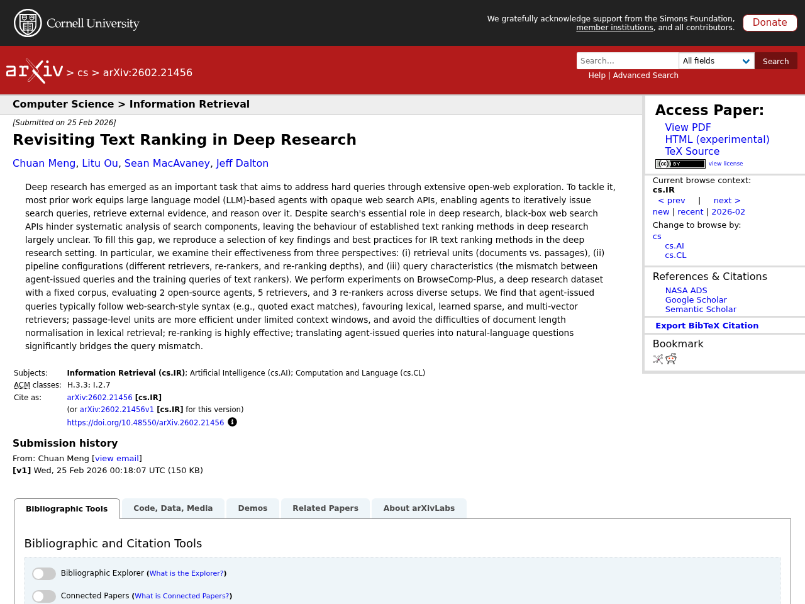

## Introduction

This article summarizes notable LLM-related papers as of 2026-03-02. Papers are automatically collected from arXiv, Semantic Scholar, and Hugging Face Daily Papers, with Japanese summaries generated via the Claude API.

## 1. GeoWorld: Geometric World Models

- **Authors**: Zeyu Zhang, Danning Li, Ian Reid, Richard Hartley
- **Published**: 2026-02-26
- **Source**: [huggingface](https://arxiv.org/abs/2602.23058)
- **arXiv ID**: 2602.23058

### Summary

Energy-based predictive world models offer an effective approach for multi-step visual planning by reasoning over latent energy landscapes rather than generating pixels. However, existing methods face two challenges: latent representations learned in Euclidean space ignore geometric and hierarchical structures between states, and performance degrades rapidly in long-horizon prediction. This study proposes GeoWorld, a geometric world model that preserves geometric structure and hierarchical relations by mapping latent representations from Euclidean space onto hyperbolic manifolds using Hyperbolic JEPA. Furthermore, Geometric Reinforcement Learning is introduced for energy-based optimization, enabling stable multi-step planning in hyperbolic latent space. Experiments on CrossTask and COIN benchmarks demonstrate approximately 3% success rate improvement in 3-step planning and approximately 2% improvement in 4-step planning compared to the state-of-the-art V-JEPA 2.


Energy-based predictive world models provide a powerful approach for multi-step visual planning by reasoning over latent energy landscapes rather than generating pixels. However, existing approaches face two major challenges: (i) their latent representations are typically learned in Euclidean space, neglecting the underlying geometric and hierarchical structure among states, and (ii) they struggle with long-horizon prediction, which leads to rapid degradation across extended rollouts. To address these challenges, we introduce GeoWorld, a geometric world model that preserves geometric structure and hierarchical relations through a Hyperbolic JEPA, which maps latent representations from Euclidean space onto hyperbolic manifolds. We further introduce Geometric Reinforcement Learning for energy-based optimization, enabling stable multi-step planning in hyperbolic latent space. Extensive experiments on CrossTask and COIN demonstrate around 3% SR improvement in 3-step planning and 2% SR improvement in 4-step planning compared to the state-of-the-art V-JEPA 2. Project website: https://steve-zeyu-zhang.github.io/GeoWorld.


## 2. veScale-FSDP: Flexible and High-Performance FSDP at Scale

- **Authors**: Zezhou Wang, Youjie Li, Zhiqi Lin, Jiacheng Yang, Cong Xie et al.
- **Published**: 2026-02-25
- **Source**: [huggingface](https://arxiv.org/abs/2602.22437)
- **arXiv ID**: 2602.22437

### Summary

Fully Sharded Data Parallel (FSDP, also known as ZeRO) is widely used for large-scale model training, but existing FSDP systems cannot handle block-wise quantized training or non-element-wise optimizers such as Shampoo and Muon, as their fixed element-wise or row-wise sharding formats conflict with block-structured computations. This paper proposes veScale-FSDP, a new system that combines a flexible sharding format called RaggedShard with a structure-aware planning algorithm. The system natively supports efficient data placement required by FSDP, enabling block-wise quantization and non-element-wise optimizers. As a result, it achieves 5–66% higher throughput and 16–30% lower memory usage compared to existing FSDP systems, while scaling efficiently to tens of thousands of GPUs.


Fully Sharded Data Parallel (FSDP), also known as ZeRO, is widely used for training large-scale models, featuring its flexibility and minimal intrusion on model code. However, current FSDP systems struggle with structure-aware training methods (e.g., block-wise quantized training) and with non-element-wise optimizers (e.g., Shampoo and Muon) used in cutting-edge models (e.g., Gemini, Kimi K2). FSDP's fixed element- or row-wise sharding formats conflict with the block-structured computations. In addition, today's implementations fall short in communication and memory efficiency, limiting scaling to tens of thousands of GPUs. We introduce veScale-FSDP, a redesigned FSDP system that couples a flexible sharding format, RaggedShard, with a structure-aware planning algorithm to deliver both flexibility and performance at scale. veScale-FSDP natively supports efficient data placement required by FSDP, empowering block-wise quantization and non-element-wise optimizers. As a result, veScale-FSDP achieves 5~66% higher throughput and 16~30% lower memory usage than existing FSDP systems, while scaling efficiently to tens of thousands of GPUs.


## 3. Hepato-LLaVA: An Expert MLLM with Sparse Topo-Pack Attention for Hepatocellular Pathology Analysis on Whole Slide Images

- **Authors**: Yuxuan Yang, Zhonghao Yan, Yi Zhang, Bo Yun, Muxi Diao et al.
- **Published**: 2026-02-23
- **Source**: [huggingface](https://arxiv.org/abs/2602.19424)
- **arXiv ID**: 2602.19424

### Summary

Hepatocellular carcinoma (HCC) diagnosis relies heavily on interpretation of gigapixel-scale whole slide images (WSI), but existing computational approaches suffer from severe information loss or high feature redundancy due to fixed-resolution processing and inefficient feature aggregation. This study proposes Hepato-LLaVA, a multimodal large language model specialized for fine-grained hepatocellular pathology analysis, introducing a novel Sparse Topo-Pack Attention mechanism that explicitly models 2D tissue topology. This mechanism effectively aggregates local diagnostic evidence into semantic summary tokens while preserving global context. Additionally, to address the shortage of multi-scale data, the authors constructed HepatoPathoVQA, a clinically grounded dataset comprising 33K hierarchically structured question-answer pairs validated by expert pathologists. Experiments demonstrate that Hepato-LLaVA achieves state-of-the-art performance on HCC diagnosis and captioning tasks, significantly outperforming existing methods.


Hepatocellular Carcinoma diagnosis relies heavily on the interpretation of gigapixel Whole Slide Images. However, current computational approaches are constrained by fixed-resolution processing mechanisms and inefficient feature aggregation, which inevitably lead to either severe information loss or high feature redundancy. To address these challenges, we propose Hepato-LLaVA, a specialized Multi-modal Large Language Model designed for fine-grained hepatocellular pathology analysis. We introduce a novel Sparse Topo-Pack Attention mechanism that explicitly models 2D tissue topology. This mechanism effectively aggregates local diagnostic evidence into semantic summary tokens while preserving global context. Furthermore, to overcome the lack of multi-scale data, we present HepatoPathoVQA, a clinically grounded dataset comprising 33K hierarchically structured question-answer pairs validated by expert pathologists. Our experiments demonstrate that Hepato-LLaVA achieves state-of-the-art performance on HCC diagnosis and captioning tasks, significantly outperforming existing methods. Our code and implementation details are available at https://pris-cv.github.io/Hepto-LLaVA/.


## 4. Retrieve and Segment: Are a Few Examples Enough to Bridge the Supervision Gap in Open-Vocabulary Segmentation?

- **Authors**: Tilemachos Aravanis, Vladan Stojnić, Bill Psomas, Nikos Komodakis, Giorgos Tolias
- **Published**: 2026-02-26
- **Source**: [huggingface](https://arxiv.org/abs/2602.23339)
- **arXiv ID**: 2602.23339

### Summary

Open-vocabulary segmentation (OVS) extends the zero-shot recognition capabilities of vision-language models (VLMs) to pixel-level prediction, enabling segmentation of arbitrary categories specified by text prompts. However, a performance gap with fully supervised approaches persists due to the coarse image-level supervision used for VLM training and the semantic ambiguity of natural language. This study introduces a few-shot setting that augments text prompts with a support set of pixel-annotated images, and proposes a retrieval-augmented test-time adapter that learns a lightweight per-image classifier by fusing textual and visual support features. Unlike prior methods that rely on late-stage hand-crafted fusion, the proposed approach performs learned per-query fusion, achieving stronger synergy between modalities. The method also supports continual expansion of support sets and fine-grained tasks such as personalized segmentation. Experiments demonstrate that the approach significantly narrows the gap between zero-shot and supervised segmentation while preserving open-vocabulary capability.


Open-vocabulary segmentation (OVS) extends the zero-shot recognition capabilities of vision-language models (VLMs) to pixel-level prediction, enabling segmentation of arbitrary categories specified by text prompts. Despite recent progress, OVS lags behind fully supervised approaches due to two challenges: the coarse image-level supervision used to train VLMs and the semantic ambiguity of natural language. We address these limitations by introducing a few-shot setting that augments textual prompts with a support set of pixel-annotated images. Building on this, we propose a retrieval-augmented test-time adapter that learns a lightweight, per-image classifier by fusing textual and visual support features. Unlike prior methods relying on late, hand-crafted fusion, our approach performs learned, per-query fusion, achieving stronger synergy between modalities. The method supports continually expanding support sets, and applies to fine-grained tasks such as personalized segmentation. Experiments show that we significantly narrow the gap between zero-shot and supervised segmentation while preserving open-vocabulary ability.


## 5. Revisiting Text Ranking in Deep Research

- **Authors**: Chuan Meng, Litu Ou, Sean MacAvaney, Jeff Dalton
- **Published**: 2026-02-25
- **Source**: [huggingface](https://arxiv.org/abs/2602.21456)
- **arXiv ID**: 2602.21456

### Summary

Deep research has attracted attention as a task where LLM agents iteratively collect information and reason using web search APIs. However, black-box search APIs hinder systematic analysis, and the behavior of existing text ranking methods remains insufficiently understood. This study examines the effectiveness of text ranking methods from three perspectives: retrieval units (documents vs. passages), pipeline configurations (combinations of retrievers, re-rankers, and re-ranking depths), and query characteristics (mismatch between agent-issued queries and ranker training queries). Experiments on the BrowseComp-Plus dataset using 2 open-source agents, 5 retrievers, and 3 re-rankers revealed that agent-issued queries follow web-search-style syntax with features like quoted exact matches, favoring lexical, learned sparse, and multi-vector retrievers. The results also showed that passage-level retrieval is more efficient under context window constraints and avoids difficulties with document length normalization in lexical retrieval, that re-ranking is highly effective, and that translating agent-issued queries into natural-language question format significantly mitigates query mismatch.


Deep research has emerged as an important task that aims to address hard queries through extensive open-web exploration. To tackle it, most prior work equips large language model (LLM)-based agents with opaque web search APIs, enabling agents to iteratively issue search queries, retrieve external evidence, and reason over it. Despite search's essential role in deep research, black-box web search APIs hinder systematic analysis of search components, leaving the behaviour of established text ranking methods in deep research largely unclear. To fill this gap, we reproduce a selection of key findings and best practices for IR text ranking methods in the deep research setting. In particular, we examine their effectiveness from three perspectives: (i) retrieval units (documents vs. passages), (ii) pipeline configurations (different retrievers, re-rankers, and re-ranking depths), and (iii) query characteristics (the mismatch between agent-issued queries and the training queries of text rankers). We perform experiments on BrowseComp-Plus, a deep research dataset with a fixed corpus, evaluating 2 open-source agents, 5 retrievers, and 3 re-rankers across diverse setups. We find that agent-issued queries typically follow web-search-style syntax (e.g., quoted exact matches), favouring lexical, learned sparse, and multi-vector retrievers; passage-level units are more efficient under limited context windows, and avoid the difficulties of document length normalisation in lexical retrieval; re-ranking is highly effective; translating agent-issued queries into natural-language questions significantly bridges the query mismatch.


---

*This article is auto-generated. Please refer to the source URLs for full paper details.*