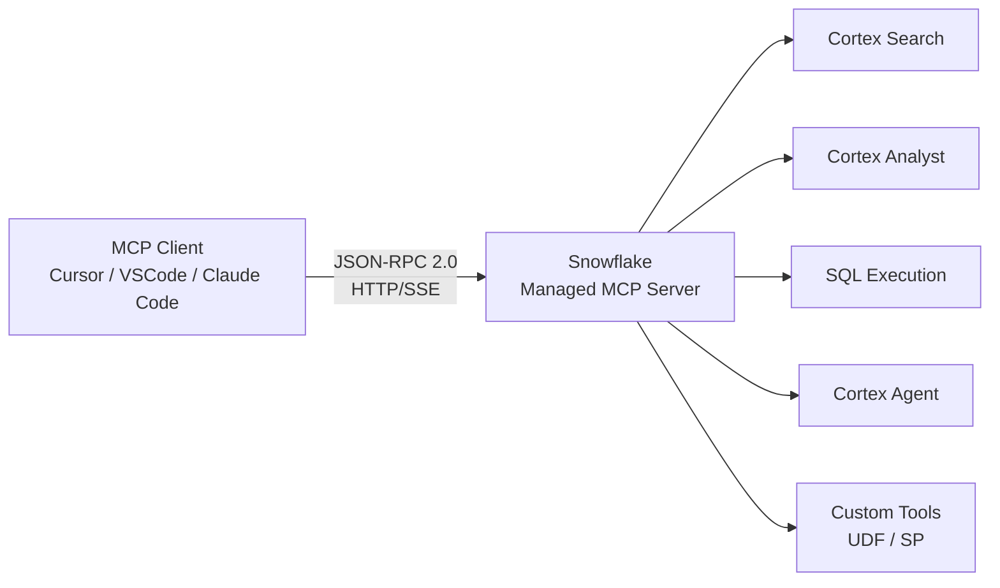
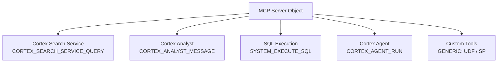
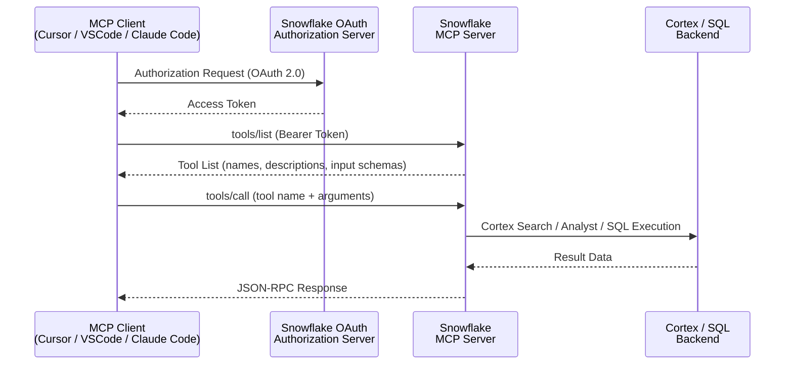
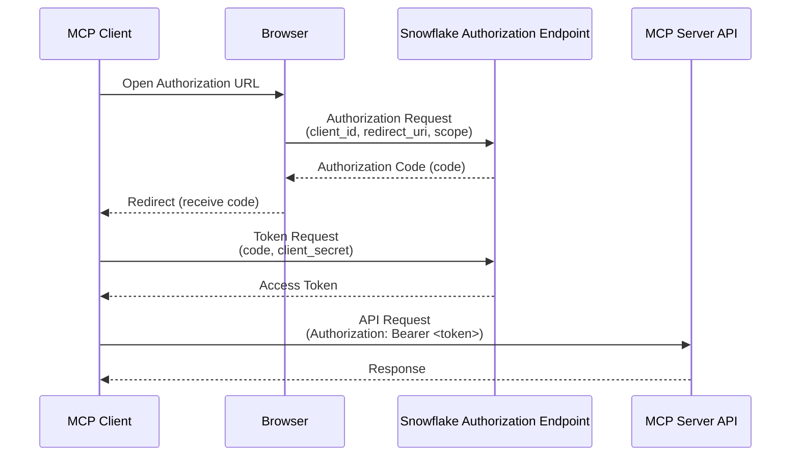

## Introduction

[Snowflake Managed MCP Server](https://docs.snowflake.com/en/user-guide/snowflake-cortex/cortex-agents-mcp) is an MCP (Model Context Protocol) server hosted by Snowflake, enabling AI agents to securely access data in a Snowflake account without provisioning separate infrastructure.

Preview availability began in October 2025, and it reached GA in November of the same year. AI development tools such as Cursor, VSCode, and Claude Code can now connect directly to Snowflake, changing data access patterns.

This article summarizes how Snowflake Managed MCP Server works, along with communication flows and configuration for each client tool.

---

## MCP Basics

Model Context Protocol (MCP) is an open protocol that connects AI agents to external data sources in a standardized way.

The architecture consists of three layers.

| Layer | Role |
| --- | --- |
| MCP Client | AI tools such as Cursor, VSCode, Claude Code |
| MCP Server | Exposes tools and processes calls from clients |
| Backend | Snowflake data, Cortex services, etc. |

The communication protocol uses **JSON-RPC 2.0 over HTTP/SSE (or Streamable HTTP)**. Clients operate in two steps: first retrieving the tool list with `tools/list`, then invoking tools with `tools/call`.



---

## Overall Architecture of Snowflake Managed MCP

It is called "Managed" because Snowflake manages the server infrastructure. Previously, you had to deploy the MCP server yourself, but with Managed MCP, you can create a server object with a single SQL command.

Snowflake currently supports five tool types.

| Tool Type | Constant | Purpose |
| --- | --- | --- |
| Cortex Search | `CORTEX_SEARCH_SERVICE_QUERY` | Semantic search over unstructured data |
| Cortex Analyst | `CORTEX_ANALYST_MESSAGE` | Text-to-SQL conversion using semantic views |
| SQL Execution | `SYSTEM_EXECUTE_SQL` | Execute arbitrary SQL queries |
| Cortex Agent | `CORTEX_AGENT_RUN` | Delegate processing to Cortex Agent |
| Custom Tools | `GENERIC` | UDFs and stored procedures |



### Creating an MCP Server Object

Define the server using the `CREATE MCP SERVER` DDL. Tool definitions are written in YAML format within the SPECIFICATION.

```sql
CREATE MCP SERVER my_mcp_server
  FROM SPECIFICATION $$
    tools:
      - name: "product-search"
        type: "CORTEX_SEARCH_SERVICE_QUERY"
        identifier: "mydb.myschema.product_search_service"
        description: "Semantic search for products"
        title: "Product Search"

      - name: "revenue-analyst"
        type: "CORTEX_ANALYST_MESSAGE"
        identifier: "mydb.myschema.revenue_semantic_view"
        description: "Natural language queries on sales data"
        title: "Revenue Analyst"

      - title: "SQL Execution Tool"
        name: "sql_exec"
        type: "SYSTEM_EXECUTE_SQL"
        description: "Execute SQL queries against Snowflake"
  $$;
```

After creation, you can verify the server with `SHOW MCP SERVERS IN ACCOUNT`.

```sql
SHOW MCP SERVERS IN ACCOUNT;

-- Example output
-- | created_on                             | name           | database_name | schema_name | owner        | comment |
-- |----------------------------------------|----------------|---------------|-------------|--------------|---------|
-- | 2025-11-05 10:00:00.000 +0000          | MY_MCP_SERVER  | MYDB          | MYSCHEMA    | ACCOUNTADMIN | [NULL]  |
```

---

## Communication Flow Details

### Endpoint URL

The endpoint URL format that clients connect to is as follows.

```text
https://<account_URL>/api/v2/databases/{database}/schemas/{schema}/mcp-servers/{name}
```


Including an underscore (`_`) in the hostname causes connection errors. Use hyphens (`-`) instead.


### tools/list (Tool Discovery)

First, retrieve the list of tools provided by the server.

```json
POST /api/v2/databases/mydb/schemas/myschema/mcp-servers/my_mcp_server

{
  "jsonrpc": "2.0",
  "id": 1,
  "method": "tools/list",
  "params": {}
}
```

The response includes tool names, descriptions, and input schemas.

### tools/call (Tool Invocation)

Here is an example of calling a Cortex Analyst tool.

```json
POST /api/v2/databases/mydb/schemas/myschema/mcp-servers/my_mcp_server

{
  "jsonrpc": "2.0",
  "id": 2,
  "method": "tools/call",
  "params": {
    "name": "revenue-analyst",
    "arguments": {
      "message": "Show me the top 10 products by revenue last month"
    }
  }
}
```

Example response:

```json
{
  "jsonrpc": "2.0",
  "id": 2,
  "result": {
    "content": [
      {
        "type": "text",
        "text": "SELECT product_name, SUM(revenue) AS total_revenue FROM sales WHERE month = '2025-10' GROUP BY product_name ORDER BY total_revenue DESC LIMIT 10"
      }
    ]
  }
}
```

### Communication Sequence



---

## Authentication Flow (OAuth 2.0)

Snowflake Managed MCP Server recommends OAuth 2.0 for authentication. While PAT-based connections are possible, OAuth should be used in production environments.

### Creating a Security Integration

```sql
CREATE SECURITY INTEGRATION mcp_oauth_integration
  TYPE = OAUTH
  OAUTH_CLIENT = CUSTOM
  ENABLED = TRUE
  OAUTH_CLIENT_TYPE = 'CONFIDENTIAL'
  OAUTH_REDIRECT_URI = 'http://localhost:8080/callback';
```

After creation, retrieve the client ID and secret. Specify the integration name in uppercase.

```sql
SELECT SYSTEM$SHOW_OAUTH_CLIENT_SECRETS('MCP_OAUTH_INTEGRATION');

-- Example output (JSON)
-- {
--   "OAUTH_CLIENT_ID": "abcdefg1234567",
--   "OAUTH_CLIENT_SECRET": "xxxxxxxxxxxxxxxxxxxxxxxx",
--   "OAUTH_CLIENT_SECRET_2": null
-- }
```

### OAuth Flow



### Using PAT (Programmatic Access Token)

For development and testing purposes, a PAT can be used directly as a Bearer token. Configure a role with minimum privileges before use, and switch to OAuth in production to mitigate token leakage risks.

---

## Client Setup by Tool

### Cursor

Cursor's global MCP configuration is written in `~/.cursor/mcp.json`. Starting with Cursor 1.0, native support for Streamable HTTP and OAuth was added.

```json
{
  "mcpServers": {
    "snowflake": {
      "url": "https://<account_URL>/api/v2/databases/mydb/schemas/myschema/mcp-servers/my_mcp_server",
      "headers": {
        "Authorization": "Bearer <PAT_or_access_token>"
      }
    }
  }
}
```

You can also configure it from Cursor's Settings → Tools & MCP → "Add Custom MCP".

### VSCode (GitHub Copilot)

In VSCode, write the MCP server configuration in `.vscode/mcp.json` or `settings.json`.

```json
{
  "mcp": {
    "servers": {
      "snowflake": {
        "type": "http",
        "url": "https://<account_URL>/api/v2/databases/mydb/schemas/myschema/mcp-servers/my_mcp_server",
        "headers": {
          "Authorization": "Bearer <PAT_or_access_token>"
        }
      }
    }
  }
}
```

### Claude Code

In Claude Code, use the `/mcp` command to add a remote server and execute the OAuth 2.0 authentication flow.

```bash
# Add MCP server
claude mcp add --transport http snowflake \
  "https://<account_URL>/api/v2/databases/mydb/schemas/myschema/mcp-servers/my_mcp_server"
```

To configure directly in `.claude/settings.json`:

```json
{
  "mcpServers": {
    "snowflake": {
      "type": "http",
      "url": "https://<account_URL>/api/v2/databases/mydb/schemas/myschema/mcp-servers/my_mcp_server",
      "headers": {
        "Authorization": "Bearer <PAT_or_access_token>"
      }
    }
  }
}
```

When using OAuth, open the URL displayed after running the `/mcp` command in your browser to complete the authorization flow.

---

## Access Control (RBAC)

Access to the MCP Server object and tool invocation are managed by independent privileges.

| Privilege | Object | Purpose |
| --- | --- | --- |
| `CREATE` | MCP SERVER | Create MCP servers |
| `OWNERSHIP` | MCP SERVER | Update object settings |
| `MODIFY` | MCP SERVER | Update, drop, describe, show, use |
| `USAGE` | MCP SERVER | Connect to server and discover tools |
| `USAGE` | Cortex Search Service | Invoke Cortex Search tools |
| `SELECT` | Semantic View | Invoke Cortex Analyst tools |
| `USAGE` | Cortex Agent | Invoke Cortex Agent tools |
| `USAGE` | UDF / Stored Procedure | Invoke custom tools |


Even with USAGE privileges on the MCP Server, privileges for each tool must be granted separately. Follow the principle of least privilege and grant access only to the required tools.


Example of granting privileges:

```sql
-- Grant USAGE on the MCP Server to the user's role
GRANT USAGE ON MCP SERVER mydb.myschema.my_mcp_server TO ROLE analyst_role;

-- Grant access to the Cortex Search service
GRANT USAGE ON CORTEX SEARCH SERVICE mydb.myschema.product_search_service TO ROLE analyst_role;

-- Grant access to the semantic view for Cortex Analyst
GRANT SELECT ON SEMANTIC VIEW mydb.myschema.revenue_semantic_view TO ROLE analyst_role;
```

---

## Limitations

The main limitations at this time are listed below.

| Item | Details |
| --- | --- |
| Unsupported constructs | resources, prompts, roots, notifications, version negotiations, life cycle phases, sampling |
| Response format | Streaming responses not supported (non-streaming only) |
| Cortex Analyst | Supports Semantic Views only (Semantic Models not supported) |
| Hostname | Underscores (`_`) cause connection errors → use hyphens (`-`) |
| Dynamic client registration | Not supported |

---

## Summary

- A server can be launched with just the `CREATE MCP SERVER` DDL. No infrastructure provisioning is required
- Five tool types are available: Cortex Search / Analyst / SQL / Agent / Custom Tools (UDF/SP)
- Communication is standardized via JSON-RPC 2.0 over HTTP/SSE (or Streamable HTTP). Retrieve the list with `tools/list`, then execute with `tools/call`
- OAuth 2.0 is recommended for authentication. PAT should be limited to development and testing; use OAuth in production
- Cursor, VSCode, and Claude Code all connect by writing the endpoint URL and token in a JSON configuration file
- Access control is managed independently at two levels: the MCP Server object and the individual tools

## References







