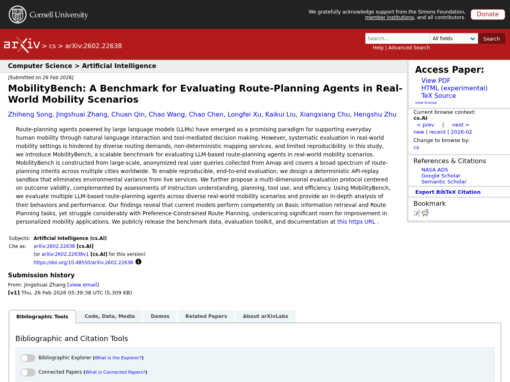
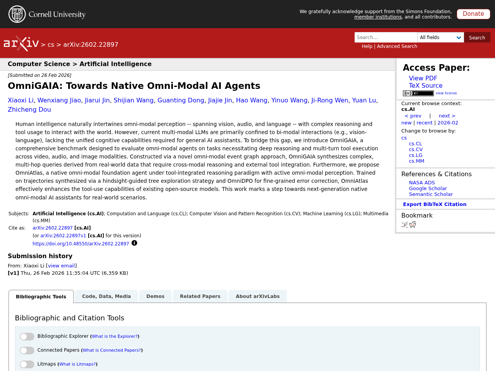

## Introduction

This article summarizes notable LLM-related papers as of 2026-03-03. From 93 newly collected papers automatically gathered from arXiv, Semantic Scholar, and Hugging Face Daily Papers, we picked the top 5 by popularity score and generated Japanese summaries using the Claude API.

## 1. The Trinity of Consistency as a Defining Principle for General World Models

- **Authors**: Jingxuan Wei, Siyuan Li, Yuhang Xu, Zheng Sun, Junjie Jiang et al.
- **Published**: 2026-02-26
- **Source**: [huggingface](https://arxiv.org/abs/2602.23152)
- **arXiv ID**: 2602.23152
- **Popularity Score**: 191

### Summary

Building general world models capable of learning, simulating, and reasoning about objective physical laws is a fundamental challenge in achieving artificial general intelligence. This paper proposes "The Trinity of Consistency" as a theoretical framework defining the essential properties required for general world models, identifying three elements: Modal Consistency as the semantic interface, Spatial Consistency as the geometric foundation, and Temporal Consistency as the causal engine. The paper systematically reviews the evolution of multimodal learning through this tripartite lens, revealing a trajectory from loosely coupled specialized modules toward unified architectures. Furthermore, it introduces CoW-Bench, a benchmark focused on multi-frame reasoning and generation scenarios, presenting a methodology for evaluating both video generation models and unified multimodal models under a unified evaluation protocol.


The construction of World Models capable of learning, simulating, and reasoning about objective physical laws constitutes a foundational challenge in the pursuit of Artificial General Intelligence. Recent advancements represented by video generation models like Sora have demonstrated the potential of data-driven scaling laws to approximate physical dynamics, while the emerging Unified Multimodal Model (UMM) offers a promising architectural paradigm for integrating perception, language, and reasoning. Despite these advances, the field still lacks a principled theoretical framework that defines the essential properties requisite for a General World Model. In this paper, we propose that a World Model must be grounded in the Trinity of Consistency: Modal Consistency as the semantic interface, Spatial Consistency as the geometric basis, and Temporal Consistency as the causal engine. Through this tripartite lens, we systematically review the evolution of multimodal learning, revealing a trajectory from loosely coupled specialized modules toward unified architectures that enable the synergistic emergence of internal world simulators. To complement this conceptual framework, we introduce CoW-Bench, a benchmark centered on multi-frame reasoning and generation scenarios. CoW-Bench evaluates both video generation models and UMMs under a unified evaluation protocol. Our work establishes a principled pathway toward general world models, clarifying both the limitations of current systems and the architectural requirements for future progress.


## 2. From Blind Spots to Gains: Diagnostic-Driven Iterative Training for Large Multimodal Models

- **Authors**: Hongrui Jia, Chaoya Jiang, Shikun Zhang, Wei Ye
- **Published**: 2026-02-26
- **Source**: [huggingface](https://arxiv.org/abs/2602.22859)
- **arXiv ID**: 2602.22859
- **Popularity Score**: 148

### Summary

Training of Large Multimodal Models (LMMs) relies on static data and fixed recipes, making it difficult to diagnose capability blind spots or provide dynamic reinforcement. This work proposes "Diagnostic-driven Progressive Evolution (DPE)," a spiral loop where diagnostics guide data generation and reinforcement learning, and each iteration re-diagnoses the updated model to drive the next round of improvement. DPE employs multiple agents that use tools such as web search and image editing to annotate and quality-control massive unlabeled multimodal data, generating diverse and realistic samples. Additionally, it attributes failures to specific weaknesses, dynamically adjusts data mixture ratios, and performs targeted reinforcement through weakness-focused data generation. Experiments with Qwen3-VL-8B-Instruct and Qwen2.5-VL-7B-Instruct confirmed stable and continuous performance improvements across 11 benchmarks, demonstrating the effectiveness of DPE as a scalable paradigm for continual LMM training under open task distributions.


As Large Multimodal Models (LMMs) scale up and reinforcement learning (RL) methods mature, LMMs have made notable progress in complex reasoning and decision making. Yet training still relies on static data and fixed recipes, making it difficult to diagnose capability blind spots or provide dynamic, targeted reinforcement. Motivated by findings that test driven error exposure and feedback based correction outperform repetitive practice, we propose Diagnostic-driven Progressive Evolution (DPE), a spiral loop where diagnosis steers data generation and reinforcement, and each iteration re-diagnoses the updated model to drive the next round of targeted improvement. DPE has two key components. First, multiple agents annotate and quality control massive unlabeled multimodal data, using tools such as web search and image editing to produce diverse, realistic samples. Second, DPE attributes failures to specific weaknesses, dynamically adjusts the data mixture, and guides agents to generate weakness focused data for targeted reinforcement. Experiments on Qwen3-VL-8B-Instruct and Qwen2.5-VL-7B-Instruct show stable, continual gains across eleven benchmarks, indicating DPE as a scalable paradigm for continual LMM training under open task distributions. Our code, models, and data are publicly available at https://github.com/hongruijia/DPE.


## 3. MobilityBench: A Benchmark for Evaluating Route-Planning Agents in Real-World Mobility Scenarios

- **Authors**: Zhiheng Song, Jingshuai Zhang, Chuan Qin, Chao Wang, Chao Chen et al.
- **Published**: 2026-02-26
- **Source**: [huggingface](https://arxiv.org/abs/2602.22638)
- **arXiv ID**: 2602.22638
- **Popularity Score**: 102

### Summary

Route-planning agents powered by Large Language Models (LLMs) are a promising paradigm for supporting everyday mobility through natural language interaction and tool integration. However, systematic evaluation has been difficult due to diverse routing demands, non-deterministic mapping services, and reproducibility constraints. This study proposes "MobilityBench," a scalable benchmark for evaluating LLM-based route-planning agents in real-world mobility scenarios. MobilityBench is constructed from large-scale anonymized user queries collected from Amap, covering a broad spectrum of route-planning intents across cities worldwide. A deterministic API-replay sandbox was designed to eliminate environmental variance from live services for reproducible end-to-end evaluation. A multi-dimensional evaluation protocol centered on outcome validity is proposed, assessing instruction understanding, planning, tool use, and efficiency. Evaluation of multiple LLM-based agents revealed that while they demonstrate adequate performance on basic information retrieval and route-planning tasks, performance drops significantly on preference-constrained route planning, highlighting substantial room for improvement in personalized mobility applications.


Route-planning agents powered by large language models (LLMs) have emerged as a promising paradigm for supporting everyday human mobility through natural language interaction and tool-mediated decision making. However, systematic evaluation in real-world mobility settings is hindered by diverse routing demands, non-deterministic mapping services, and limited reproducibility. In this study, we introduce MobilityBench, a scalable benchmark for evaluating LLM-based route-planning agents in real-world mobility scenarios. MobilityBench is constructed from large-scale, anonymized real user queries collected from Amap and covers a broad spectrum of route-planning intents across multiple cities worldwide. To enable reproducible, end-to-end evaluation, we design a deterministic API-replay sandbox that eliminates environmental variance from live services. We further propose a multi-dimensional evaluation protocol centered on outcome validity, complemented by assessments of instruction understanding, planning, tool use, and efficiency. Using MobilityBench, we evaluate multiple LLM-based route-planning agents across diverse real-world mobility scenarios and provide an in-depth analysis of their behaviors and performance. Our findings reveal that current models perform competently on Basic information retrieval and Route Planning tasks, yet struggle considerably with Preference-Constrained Route Planning, underscoring significant room for improvement in personalized mobility applications. We publicly release the benchmark data, evaluation toolkit, and documentation at https://github.com/AMAP-ML/MobilityBench .


## 4. dLLM: Simple Diffusion Language Modeling

- **Authors**: Zhanhui Zhou, Lingjie Chen, Hanghang Tong, Dawn Song
- **Published**: 2026-02-26
- **Source**: [huggingface](https://arxiv.org/abs/2602.22661)
- **arXiv ID**: 2602.22661
- **Popularity Score**: 64

### Summary

Diffusion language models (DLMs) are evolving rapidly, but despite many models sharing common components, these are scattered across individual research codebases, making reproduction and extension difficult. To address this challenge, the authors propose "dLLM," an open-source framework that unifies the core components of DLMs -- training, inference, and evaluation -- while making it easy to customize for new designs. With dLLM, users can reproduce, fine-tune, deploy, and evaluate open-source large-scale DLMs such as LLaDA and Dream through a standardized pipeline. The framework also provides reproducible recipes and checkpoints for building small-scale DLMs from scratch with modest computational resources, including methods for converting BERT-style encoders and autoregressive language models into DLMs, aiming to improve the accessibility of DLM research and accelerate its advancement.


Although diffusion language models (DLMs) are evolving quickly, many recent models converge on a set of shared components. These components, however, are distributed across ad-hoc research codebases or lack transparent implementations, making them difficult to reproduce or extend. As the field accelerates, there is a clear need for a unified framework that standardizes these common components while remaining flexible enough to support new methods and architectures.
  To address this gap, we introduce dLLM, an open-source framework that unifies the core components of diffusion language modeling -- training, inference, and evaluation -- and makes them easy to customize for new designs. With dLLM, users can reproduce, finetune, deploy, and evaluate open-source large DLMs such as LLaDA and Dream through a standardized pipeline. The framework also provides minimal, reproducible recipes for building small DLMs from scratch with accessible compute, including converting any BERT-style encoder or autoregressive LM into a DLM. We also release the checkpoints of these small DLMs to make DLMs more accessible and accelerate future research.


## 5. OmniGAIA: Towards Native Omni-Modal AI Agents

- **Authors**: Xiaoxi Li, Wenxiang Jiao, Jiarui Jin, Shijian Wang, Guanting Dong et al.
- **Published**: 2026-02-26
- **Source**: [huggingface](https://arxiv.org/abs/2602.22897)
- **arXiv ID**: 2602.22897
- **Popularity Score**: 51

### Summary

Human intelligence naturally integrates multimodal perception spanning vision, audio, and language with complex reasoning and tool use. However, current multimodal LLMs are primarily limited to interactions between two modalities (e.g., vision and language) and lack the unified cognitive capabilities required for general AI assistants. To address this challenge, the authors propose "OmniGAIA," a comprehensive benchmark for evaluating omni-modal agents on tasks requiring deep reasoning and multi-turn tool execution across video, audio, and image modalities. OmniGAIA is constructed using a novel omni-modal event graph approach, generating complex multi-hop queries from real-world data that require cross-modal reasoning and external tool integration. Furthermore, they propose "OmniAtlas," a native omni-modal foundation agent with a tool-integrated reasoning paradigm and active omni-modal perception. By training on trajectory data synthesized via a hindsight-guided tree exploration strategy and fine-grained error correction through OmniDPO, OmniAtlas effectively enhances the tool-use capabilities of existing open-source models.


Human intelligence naturally intertwines omni-modal perception -- spanning vision, audio, and language -- with complex reasoning and tool usage to interact with the world. However, current multi-modal LLMs are primarily confined to bi-modal interactions (e.g., vision-language), lacking the unified cognitive capabilities required for general AI assistants. To bridge this gap, we introduce OmniGAIA, a comprehensive benchmark designed to evaluate omni-modal agents on tasks necessitating deep reasoning and multi-turn tool execution across video, audio, and image modalities. Constructed via a novel omni-modal event graph approach, OmniGAIA synthesizes complex, multi-hop queries derived from real-world data that require cross-modal reasoning and external tool integration. Furthermore, we propose OmniAtlas, a native omni-modal foundation agent under tool-integrated reasoning paradigm with active omni-modal perception. Trained on trajectories synthesized via a hindsight-guided tree exploration strategy and OmniDPO for fine-grained error correction, OmniAtlas effectively enhances the tool-use capabilities of existing open-source models. This work marks a step towards next-generation native omni-modal AI assistants for real-world scenarios.


---

*This article is automatically generated. Please refer to the source URLs for paper details.*
