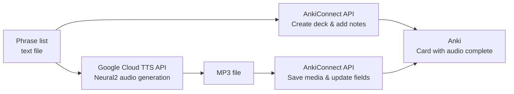

## Introduction

I use Anki to memorize English phrases, but manually registering cards and attaching audio is tedious enough to make me fall off the habit. By combining the REST API of [AnkiConnect](https://github.com/FooSoft/anki-connect) with the Neural2 voices of [Google Cloud Text-to-Speech](https://cloud.google.com/text-to-speech), you can automate everything from card registration to high-quality audio attachment using only curl commands. This article documents that process.

Here is an overview of the entire workflow.



## Prerequisites

| Item | Details |
|------|---------|
| Anki | Version 23.10.0 or later |
| AnkiConnect | Plugin code `2055492159` |
| gcloud CLI | Authenticated |
| Google Cloud | Text-to-Speech API enabled |

To install AnkiConnect, open Anki and go to **Tools → Add-ons → Get Add-ons**, then enter the code `2055492159`. A restart of Anki is required after installation. AnkiConnect starts an HTTP server on port 8765 and accepts JSON-formatted requests.

Enable the Google Cloud Text-to-Speech API with the following command.

```bash
gcloud services enable texttospeech.googleapis.com
```

## Bulk-Register Cards via the AnkiConnect API

### Check the connection

First, verify that AnkiConnect is running.

```bash
curl -s http://localhost:8765 -X POST \
  -H "Content-Type: application/json" \
  -d '{"action": "version", "version": 6}'
```

```json
{"result": 6, "error": null}
```

### Create a deck

Use the `createDeck` action to create a new deck.

```bash
curl -s http://localhost:8765 -X POST \
  -H "Content-Type: application/json" \
  -d '{
    "action": "createDeck",
    "version": 6,
    "params": {"deck": "English Meeting Phrases 15"}
  }'
```

### Check the model (note type)

Before adding cards, confirm the model name and its field names.

```bash
# List all models
curl -s http://localhost:8765 -X POST \
  -H "Content-Type: application/json" \
  -d '{"action": "modelNames", "version": 6}'

# List fields for a model
curl -s http://localhost:8765 -X POST \
  -H "Content-Type: application/json" \
  -d '{
    "action": "modelFieldNames",
    "version": 6,
    "params": {"modelName": "Basic"}
  }'
```

### Bulk-add notes

Use the `addNotes` action to register multiple notes at once. The example below adds English meeting phrases in a Japanese-prompt → English-answer format for instant translation practice.

```bash
curl -s http://localhost:8765 -X POST \
  -H "Content-Type: application/json" \
  -d '{
    "action": "addNotes",
    "version": 6,
    "params": {
      "notes": [
        {
          "deckName": "English Meeting Phrases 15",
          "modelName": "Basic",
          "fields": {
            "Front": "Ask someone to repeat themselves when you did not catch what they said",
            "Back": "Sorry, could you say that again?"
          },
          "tags": ["Week1", "clarification"]
        },
        {
          "deckName": "English Meeting Phrases 15",
          "modelName": "Basic",
          "fields": {
            "Front": "Ask someone to speak more slowly when they are talking too fast",
            "Back": "Could you slow down a bit?"
          },
          "tags": ["Week1", "clarification"]
        }
      ]
    }
  }'
```

The `result` array in the response contains the ID of each note. A `null` value indicates that a duplicate note was found and skipped.

```json
{"result": [1772875633429, 1772875633437], "error": null}
```

If you use a custom model, specify `fields` to match that model's fields. For example, if your model has fields like `Example`, `Synonyms`, and `GrammarNote`, you can populate all of them in the same request.

## Generate Audio with Google Cloud TTS

### Set the quota project

When using gcloud CLI user credentials, you must specify the quota project via the `x-goog-user-project` header. Without it, you will receive a `PERMISSION_DENIED` error.

```bash
TOKEN=$(gcloud auth print-access-token)
PROJECT=$(gcloud config get-value project 2>/dev/null)
```

### Generate an MP3 with a Neural2 voice

Google Cloud TTS Neural2 voices produce more natural-sounding speech compared to Standard or WaveNet voices, making them well-suited for language learning.

```bash
curl -s -X POST \
  -H "Authorization: Bearer $TOKEN" \
  -H "x-goog-user-project: $PROJECT" \
  -H "Content-Type: application/json" \
  -d '{
    "input": {"text": "Sorry, could you say that again? I missed the last part."},
    "voice": {"languageCode": "en-US", "name": "en-US-Neural2-J"},
    "audioConfig": {"audioEncoding": "MP3", "speakingRate": 0.9}
  }' \
  "https://texttospeech.googleapis.com/v1/text:synthesize" \
  | python3 -c "
import sys, json, base64
data = json.load(sys.stdin)
sys.stdout.buffer.write(base64.b64decode(data['audioContent']))
" > meeting_phrase_01.mp3
```

Key parameters are as follows.

| Parameter | Description | Example value |
|-----------|-------------|---------------|
| `voice.name` | Voice model | `en-US-Neural2-J` (male), `en-US-Neural2-F` (female) |
| `audioConfig.speakingRate` | Speaking rate (0.25–2.0) | `0.9` (slightly slower, good for learning) |
| `audioConfig.audioEncoding` | Output format | `MP3`, `OGG_OPUS`, `LINEAR16` |

The API response contains base64-encoded audio data in the `audioContent` field; decode it and write it to a file.

### Free tier

According to the [Google Cloud TTS pricing page](https://cloud.google.com/text-to-speech/pricing), Neural2 voices are free up to 1 million bytes per month. Since English phrases consist of ASCII characters (roughly 1 character ≈ 1 byte), personal English study usage is very unlikely to exceed the free tier.

## Attach Audio Files to Anki Cards

### Store the media file

Use the `storeMediaFile` action to save an MP3 file to Anki's media folder. Pass the file as a base64-encoded string.

```bash
B64=$(base64 -i meeting_phrase_01.mp3)

curl -s http://localhost:8765 -X POST \
  -H "Content-Type: application/json" \
  -d "{
    \"action\": \"storeMediaFile\",
    \"version\": 6,
    \"params\": {
      \"filename\": \"meeting_phrase_01.mp3\",
      \"data\": \"$B64\"
    }
  }"
```

### Update the note field

Retrieve the note ID with `findNotes`, then use `updateNoteFields` to set the Sound field to `[sound:filename]`.

```bash
# Get note IDs
curl -s http://localhost:8765 -X POST \
  -H "Content-Type: application/json" \
  -d '{
    "action": "findNotes",
    "version": 6,
    "params": {"query": "deck:English Meeting Phrases 15"}
  }'

# Update the Sound field
curl -s http://localhost:8765 -X POST \
  -H "Content-Type: application/json" \
  -d '{
    "action": "updateNoteFields",
    "version": 6,
    "params": {
      "note": {
        "id": 1772875633429,
        "fields": {
          "Sound": "[sound:meeting_phrase_01.mp3]"
        }
      }
    }
  }'
```

### Note on card templates

If you store the value as `[sound:filename.mp3]` in the Sound field, writing `[sound:{{Sound}}]` in the card template will double-wrap it and audio will not play. Write only `{{Sound}}` in the template.

```
<!-- Bad: double-wrapping prevents playback -->
[sound:{{Sound}}]

<!-- Good: the field value is expanded as-is -->
{{Sound}}
```

## Batch Processing Script

Below is an example shell script that combines all of the steps above. It reads from a phrase list file and runs the full pipeline — card registration → TTS generation → audio attachment — in a single pass.

```bash
#!/bin/bash
set -euo pipefail

DECK="English Meeting Phrases 15"
MODEL="Basic"
VOICE="en-US-Neural2-J"
RATE=0.9
TOKEN=$(gcloud auth print-access-token)
PROJECT=$(gcloud config get-value project 2>/dev/null)

# Create deck
curl -s http://localhost:8765 -X POST \
  -H "Content-Type: application/json" \
  -d "{\"action\": \"createDeck\", \"version\": 6, \"params\": {\"deck\": \"$DECK\"}}" > /dev/null

# Phrase definitions (TSV: prompt<TAB>English phrase<TAB>example sentence<TAB>tag)
while IFS=$'\t' read -r front back example tag; do
  # Add note
  escaped_back=$(printf '%s' "$back" | python3 -c "import sys,json; print(json.dumps(sys.stdin.read()))")
  escaped_front=$(printf '%s' "$front" | python3 -c "import sys,json; print(json.dumps(sys.stdin.read()))")

  note_id=$(curl -s http://localhost:8765 -X POST \
    -H "Content-Type: application/json" \
    -d "{
      \"action\": \"addNote\",
      \"version\": 6,
      \"params\": {
        \"note\": {
          \"deckName\": \"$DECK\",
          \"modelName\": \"$MODEL\",
          \"fields\": {\"Front\": $escaped_front, \"Back\": $escaped_back},
          \"tags\": [\"$tag\"]
        }
      }
    }" | python3 -c "import sys,json; print(json.load(sys.stdin)['result'])")

  echo "Added note: $note_id - $front"

  # Generate TTS
  escaped_example=$(printf '%s' "$example" | python3 -c "import sys,json; print(json.dumps(sys.stdin.read()))")
  fname="phrase_${note_id}.mp3"

  curl -s -X POST \
    -H "Authorization: Bearer $TOKEN" \
    -H "x-goog-user-project: $PROJECT" \
    -H "Content-Type: application/json" \
    -d "{
      \"input\": {\"text\": $escaped_example},
      \"voice\": {\"languageCode\": \"en-US\", \"name\": \"$VOICE\"},
      \"audioConfig\": {\"audioEncoding\": \"MP3\", \"speakingRate\": $RATE}
    }" \
    "https://texttospeech.googleapis.com/v1/text:synthesize" \
    | python3 -c "import sys,json,base64; d=json.load(sys.stdin); sys.stdout.buffer.write(base64.b64decode(d['audioContent']))" \
    > "/tmp/$fname"

  # Save media to Anki + update field
  b64=$(base64 -i "/tmp/$fname")
  curl -s http://localhost:8765 -X POST \
    -H "Content-Type: application/json" \
    -d "{\"action\": \"storeMediaFile\", \"version\": 6, \"params\": {\"filename\": \"$fname\", \"data\": \"$b64\"}}" > /dev/null

  curl -s http://localhost:8765 -X POST \
    -H "Content-Type: application/json" \
    -d "{\"action\": \"updateNoteFields\", \"version\": 6, \"params\": {\"note\": {\"id\": $note_id, \"fields\": {\"Sound\": \"[sound:$fname]\"}}}}" > /dev/null

  echo "  -> TTS attached: $fname"
done < phrases.tsv
```

The format of the input file `phrases.tsv` is as follows.

```
Ask someone to repeat themselves when you did not catch what they said	Sorry, could you say that again?	Sorry, could you say that again? I missed the last part.	Week1
Ask someone to speak more slowly when they are talking too fast	Could you slow down a bit?	Could you slow down a bit? I want to make sure I'm following.	Week1
```

## Summary

- The AnkiConnect API is easy to drive with curl, enabling deck creation, note addition, and media attachment in a fully programmable way.
- Google Cloud TTS Neural2 voices offer natural-sounding audio quality with a free tier of 1 million bytes per month, which is more than enough for personal English study.
- Pay attention to how the Sound field is handled in card templates (`{{Sound}}` vs `[sound:{{Sound}}]`).

## References





