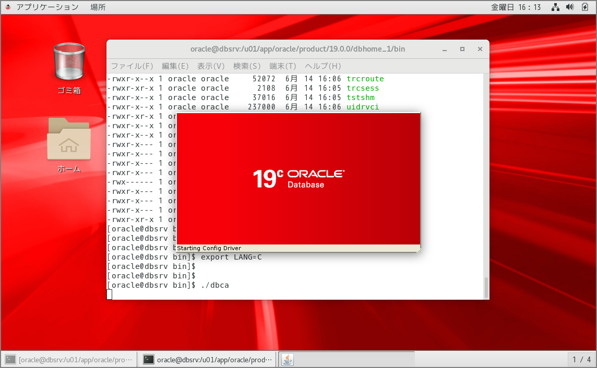
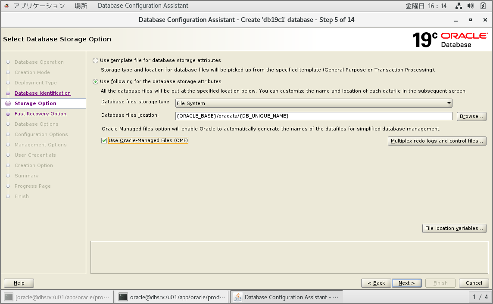
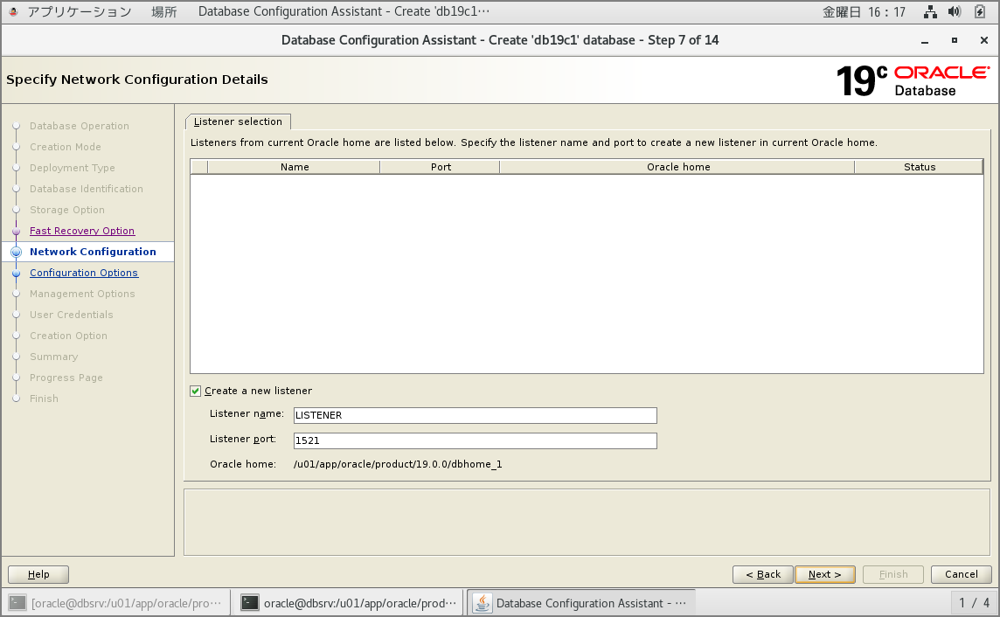
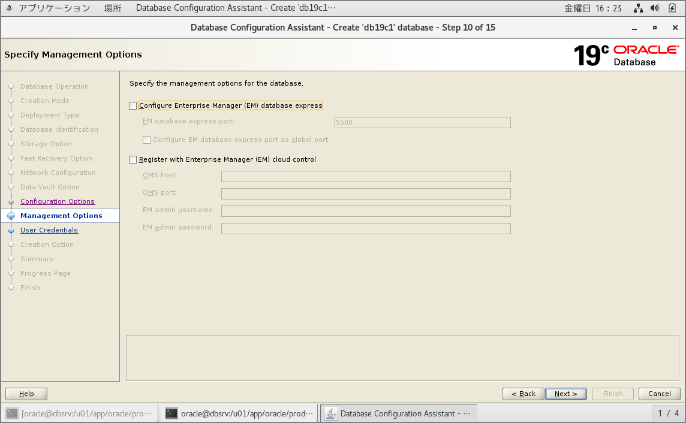
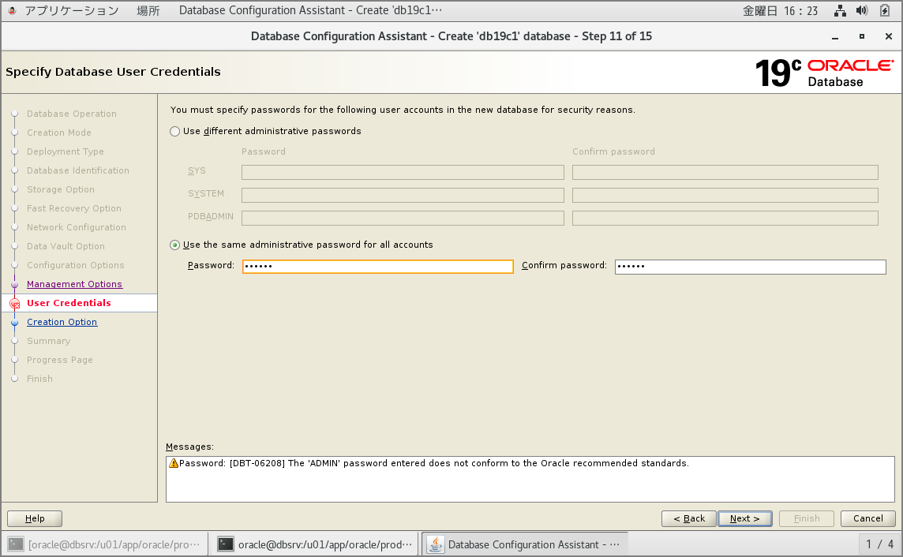

#### **はじめに**

前回で必要パッケージやユーザ、ディレクトリの準備が完了したので実際にOracle Database 19cをインストールしてDBを構築していきます。※シングル環境です。OSはOracle Linux 7.6です。

##### 事前準備編

> Oracle Database 19cインストール事前準備 | my opinion is my own https://zatoima.github.io/oracle-pre-install-19c.html

##### Oracle Database 19c for Linuxのインストールガイド

> Oracle Database Databaseインストレーション・ガイド, 19c for Linux https://docs.oracle.com/cd/F19136_01/ladbi/index.html

#### **Oracle Database 19cのインストール**

事前に「[Oracle Software Delivery Cloud](https://edelivery.oracle.com/)」から、「Oracle Database 19.3.0.0.0（V982063-01.zip）」をダウンロードします。

Oracle 18cからruninstallerを使用したORACLE_HOMEへのインストールではなく、unzip形式に変更になっています。

```sh
[oracle@dbsrv dbhome_1]$ pwd
/u01/app/oracle/product/19.3.0.0/dbhome_1
[oracle@dbsrv dbhome_1]$ ls -l
合計 2987996
-rw-rw-r-- 1 oracle oracle 3059705302  5月 28 11:40 V982063-01.zip
[oracle@dbsrv dbhome_1]$ unzip V982063-01.zip 
Archive:  V982063-01.zip
   creating: drdaas/
   creating: drdaas/admin/
  inflating: drdaas/admin/drdasqtt_translator_setup.sql  
  inflating: drdaas/admin/drdapkg_db2.sql  
  inflating: drdaas/admin/drdaas.ora  
  inflating: drdaas/admin/drdasqt_set_profile_dd.sql  
  
  中略
  
    javavm/admin/classes.bin -> ../../javavm/jdk/jdk8/admin/classes.bin
  javavm/admin/libjtcjt.so -> ../../javavm/jdk/jdk8/admin/libjtcjt.so
  jdk/jre/bin/ControlPanel -> jcontrol
  javavm/admin/lfclasses.bin -> ../../javavm/jdk/jdk8/admin/lfclasses.bin
  javavm/lib/security/cacerts -> ../../../javavm/jdk/jdk8/lib/security/cacerts
  javavm/lib/sunjce_provider.jar -> ../../javavm/jdk/jdk8/lib/sunjce_provider.jar
  javavm/lib/security/README.txt -> ../../../javavm/jdk/jdk8/lib/security/README.txt
  javavm/lib/security/java.security -> ../../../javavm/jdk/jdk8/lib/security/java.security
  jdk/jre/lib/amd64/server/libjsig.so -> ../libjsig.so
[oracle@dbsrv dbhome_1]$ 
```

不要になったzipファイルを削除します。

```sh
[oracle@dbsrv dbhome_1]$ ls -l V982063-01.zip
-rw-rw-r-- 1 oracle oracle 3059705302  5月 28 11:40 V982063-01.zip
[oracle@dbsrv dbhome_1]$ rm -f V982063-01.zip
[oracle@dbsrv dbhome_1]$ 
```

#### **DB作成**

従来どおり、DBCAを使用してDBを作成します。















DBCA実行中に前バージョンと同様に`orainstRoot.sh`と`root.sh`の実行を行います。

```sh
[root@dbsrv ~]# /u01/app/oraInventory/orainstRoot.sh
Changing permissions of /u01/app/oraInventory.
Adding read,write permissions for group.
Removing read,write,execute permissions for world.

Changing groupname of /u01/app/oraInventory to oracle.
The execution of the script is complete.
[root@dbsrv ~]# /u01/app/oracle/product/19.0.0/dbhome_1/root.sh
Performing root user operation.

The following environment variables are set as:
    ORACLE_OWNER= oracle
    ORACLE_HOME=  /u01/app/oracle/product/19.0.0/dbhome_1

Enter the full pathname of the local bin directory: [/usr/local/bin]: 
   Copying dbhome to /usr/local/bin ...
   Copying oraenv to /usr/local/bin ...
   Copying coraenv to /usr/local/bin ...

Creating /etc/oratab file...
Entries will be added to the /etc/oratab file as needed by
Database Configuration Assistant when a database is created
Finished running generic part of root script.
Now product-specific root actions will be performed.
Oracle Trace File Analyzer (TFA - Standalone Mode) is available at :
    /u01/app/oracle/product/19.0.0/dbhome_1/bin/tfactl

Note :

1. tfactl will use TFA Service if that service is running and user has been granted access
2. tfactl will configure TFA Standalone Mode only if user has no access to TFA Service or TFA is not installed

[root@dbsrv ~]# 
```

#### **環境変数の設定**

```sh
export TMPDIR=$HOME/tmp
export TEMP=$HOME/tmp
export ORACLE_BASE=/u01/app/oracle
export ORACLE_HOME=/u01/app/oracle/product/19.0.0/dbhome_1
export PATH=$ORACLE_HOME/bin:$ORACLE_HOME/jdk/bin:${PATH}
export LD_LIBRARY_PATH=$ORACLE_HOME/lib
export NLS_LANG=JAPANESE_JAPAN.UTF8
export LANG=ja_JP.UTF-8
```

#### **プロセス確認**

```sh
[oracle@dbsrv bin]$ ps -ef | grep db19c1
oracle   31811     1  0 16:43 ?        00:00:00 ora_pmon_db19c1
oracle   31813     1  0 16:43 ?        00:00:00 ora_clmn_db19c1
oracle   31815     1  0 16:43 ?        00:00:00 ora_psp0_db19c1
oracle   31818     1  1 16:43 ?        00:00:03 ora_vktm_db19c1
oracle   31822     1  0 16:43 ?        00:00:00 ora_gen0_db19c1
oracle   31824     1  0 16:43 ?        00:00:00 ora_mman_db19c1
oracle   31828     1  0 16:43 ?        00:00:00 ora_gen1_db19c1
oracle   31831     1  0 16:43 ?        00:00:00 ora_diag_db19c1
oracle   31833     1  0 16:43 ?        00:00:00 ora_ofsd_db19c1
oracle   31836     1  0 16:43 ?        00:00:00 ora_dbrm_db19c1
oracle   31838     1  0 16:43 ?        00:00:00 ora_vkrm_db19c1
oracle   31840     1  0 16:43 ?        00:00:00 ora_svcb_db19c1
oracle   31842     1  0 16:43 ?        00:00:00 ora_pman_db19c1
oracle   31844     1  0 16:43 ?        00:00:00 ora_dia0_db19c1
oracle   31846     1  0 16:43 ?        00:00:00 ora_dbw0_db19c1
oracle   31848     1  0 16:43 ?        00:00:00 ora_lgwr_db19c1
oracle   31850     1  0 16:43 ?        00:00:00 ora_lg00_db19c1
oracle   31852     1  0 16:43 ?        00:00:00 ora_ckpt_db19c1
oracle   31854     1  0 16:43 ?        00:00:00 ora_lg01_db19c1
oracle   31856     1  0 16:43 ?        00:00:00 ora_smon_db19c1
oracle   31858     1  0 16:43 ?        00:00:00 ora_smco_db19c1
oracle   31860     1  0 16:43 ?        00:00:00 ora_w000_db19c1
oracle   31862     1  0 16:43 ?        00:00:00 ora_reco_db19c1
oracle   31864     1  0 16:43 ?        00:00:00 ora_w001_db19c1
oracle   31866     1  0 16:43 ?        00:00:00 ora_lreg_db19c1
oracle   31868     1  0 16:43 ?        00:00:00 ora_pxmn_db19c1
oracle   31872     1  1 16:43 ?        00:00:02 ora_mmon_db19c1
oracle   31874     1  0 16:43 ?        00:00:00 ora_mmnl_db19c1
oracle   31876     1  0 16:43 ?        00:00:00 ora_d000_db19c1
oracle   31878     1  0 16:43 ?        00:00:00 ora_s000_db19c1
oracle   31880     1  0 16:43 ?        00:00:00 ora_tmon_db19c1
oracle   31885     1  0 16:44 ?        00:00:00 ora_m000_db19c1
oracle   31887     1  0 16:44 ?        00:00:00 ora_m001_db19c1
oracle   31894     1  0 16:44 ?        00:00:00 ora_tt00_db19c1
oracle   31896     1  0 16:44 ?        00:00:00 ora_arc0_db19c1
oracle   31898     1  0 16:44 ?        00:00:00 ora_tt01_db19c1
oracle   31900     1  0 16:44 ?        00:00:00 ora_arc1_db19c1
oracle   31902     1  0 16:44 ?        00:00:00 ora_arc2_db19c1
oracle   31904     1  0 16:44 ?        00:00:00 ora_arc3_db19c1
oracle   31906     1  0 16:44 ?        00:00:00 ora_tt02_db19c1
oracle   31911     1  0 16:44 ?        00:00:00 ora_aqpc_db19c1
oracle   31913     1  0 16:44 ?        00:00:00 ora_w002_db19c1
oracle   31917     1  0 16:44 ?        00:00:00 ora_p000_db19c1
oracle   31919     1  0 16:44 ?        00:00:00 ora_p001_db19c1
oracle   31921     1  0 16:44 ?        00:00:00 ora_p002_db19c1
oracle   31923     1  0 16:44 ?        00:00:00 ora_p003_db19c1
oracle   31926     1  0 16:44 ?        00:00:01 ora_cjq0_db19c1
oracle   32039     1  0 16:44 ?        00:00:00 ora_w003_db19c1
oracle   32098     1  0 16:44 ?        00:00:00 ora_w004_db19c1
oracle   32101     1  0 16:44 ?        00:00:00 ora_qm02_db19c1
oracle   32105     1  0 16:44 ?        00:00:00 ora_q002_db19c1
oracle   32107     1  0 16:44 ?        00:00:00 ora_q003_db19c1
oracle   32121     1  0 16:44 ?        00:00:00 ora_m002_db19c1
oracle   32123     1  2 16:44 ?        00:00:05 ora_m003_db19c1
oracle   32149     1  0 16:44 ?        00:00:00 ora_m004_db19c1
oracle   32151     1  0 16:44 ?        00:00:00 ora_q004_db19c1
oracle   32157     1  0 16:44 ?        00:00:00 ora_q005_db19c1
oracle   32217     1  0 16:44 ?        00:00:00 ora_w005_db19c1
```