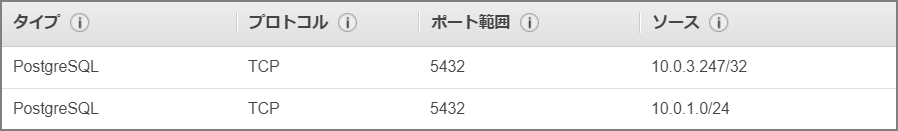

#### はじめに

***

PostgreSQL10から論理レプリケーションが使えるようになった。Auroraでもこの機能を使うことが出来るのでやってみる。基本的にここのドキュメントの通りやれば問題無し。

> Aurora での PostgreSQL 論理レプリケーションの使用 - Amazon Aurora [https://docs.aws.amazon.com/ja_jp/AmazonRDS/latest/AuroraUserGuide/AuroraPostgreSQL.Replication.Logical.html](https://docs.aws.amazon.com/ja_jp/AmazonRDS/latest/AuroraUserGuide/AuroraPostgreSQL.Replication.Logical.html)

#### 環境

***

Aurora PostgreSQL 10.7 と RDS PostgreSQL 10.7 間でレプリケーション環境を構築する

#### マニュアル上の注意事項

***

- rds.logical_replication パラメータを有効にすると、DB クラスターのパフォーマンスに影響します。
- PostgreSQL データベースの論理レプリケーションを実行するために、AWS ユーザーアカウントは rds_superuser ロールを必要とします。
- パブリッシャーの既存の Aurora PostgreSQL DB クラスターを使用するには、エンジンバージョンが 10.6 以降であることが必要です。

#### 事前準備

***

- rds.logical_replicationを「0」から「1」に設定する

  

- PostgreSQLからAurora側への通信をセキュリティグループで許可する



#### 環境準備

***

レプリケーションを行うデータベースを作成

```sql
CREATE DATABASE repdb WITH OWNER postgres;
```

レプリケーションを行うテーブルを用意する。PostgreSQL10時点の論理レプリケーションはDDLレプリケーションを行わないので、Publisher、及びSubscriber側で実施する必要がある。

```sql
\c repdb
CREATE TABLE LogicalReplicationTest (a int PRIMARY KEY);
```

Publisher側だけにデータを投入。

```sql
INSERT INTO LogicalReplicationTest VALUES (generate_series(1,10000));
```

Publisher側で"CREATE PUBLICATION"を実行。"FOR ALL TABLES"を指定してここではデータベース全体を行う方式を選択した。

> https://www.postgresql.jp/document/10/html/sql-createpublication.html
>
> CREATE PUBLICATION
> FOR ALL TABLES
> そのパブリケーションでは、将来作成されるテーブルも含め、そのデータベース内の全テーブルについての変更を複製するものとして印をつけます。

```sql
#repdbに接続
\c repdb

CREATE PUBLICATION alltables FOR ALL TABLES;
```

Subscriber側で"CREATE SUBSCRIPTION"を実行。

```sql
#repdbに接続
\c repdb

CREATE SUBSCRIPTION auroratopostgresql CONNECTION 'host=aurorapostgresqlv1.cluster-xxxxxxxxx.ap-northeast-1.rds.amazonaws.com port=5432 dbname=repdb user=postgres password=postgres' PUBLICATION alltables;
```

ログを確認すると、レプリケーションが始まっていることが確認できる。(初期同期の模様。)

```sql
2019-12-14 09:25:49 UTC::@:[16112]:LOG:  logical replication table synchronization worker for subscription "auroratopostgresql", table "logicalreplicationtest" has started
2019-12-14 09:25:49 UTC::@:[16112]:LOG:  logical replication table synchronization worker for subscription "auroratopostgresql", table "logicalreplicationtest" has finished
```

pg_subscription_relを確認することでどのテーブルが論理レプリケーション対象となっているか確認可能。

```sql
SELECT * FROM pg_subscription_rel;

repdb=> SELECT * FROM pg_subscription_rel;
 srsubid | srrelid | srsubstate | srsublsn 
---------+---------+------------+----------
   16425 |   16417 | d          | 
(1 row)

repdb=> select relname from pg_class where oid=16417;
        relname         
------------------------
 logicalreplicationtest
(1 row)

repdb=> 
```

レプリケーション設定はpg_replication_slotsビューから確認可能。

```sql
repdb=> select * from pg_replication_slots;
-[ RECORD 1 ]-------+-------------------
slot_name           | auroratopostgresql
plugin              | pgoutput
slot_type           | logical
datoid              | 24590
database            | repdb
temporary           | f
active              | t
active_pid          | 19407
xmin                | 
catalog_xmin        | 23236
restart_lsn         | 0/4F8C710
confirmed_flush_lsn | 0/4F8CAE8

```

Publisher側のpg_publicationからは作成した定義情報が確認できる。データベース内のすべてのテーブルをレプリケーション対象としたので「puballtables」が「True」になっている。

```sql
repdb=> select * from pg_publication;
-[ RECORD 1 ]+----------
pubname      | alltables
pubowner     | 16393
puballtables | t
pubinsert    | t
pubupdate    | t
pubdelete    | t
```

