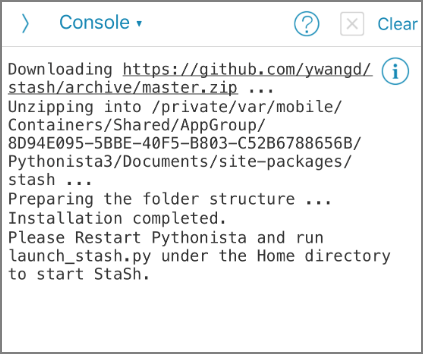

定期的に動作させたいわけではないけど、空いている時間にたまーに動かしてみたいpythonのコードがあった。動かしたいときにPCを使える環境であれば良いが常にそういう環境ではないので、出来れば常に持ち歩いているiPhone or iPadから実行できないかと思いPythonista 3を試してみた。

Pythonista 3はiOS上でpythonを実行するための有料アプリ。2020年1月時点では1,200円。

> ‎Pythonista 3 https://apps.apple.com/jp/app/pythonista-3/id1085978097

公式ページはこちら。

> Pythonista for iOS http://omz-software.com/pythonista/

numpy、matplotlib、requestsなどの人気のあるサードパーティモジュールから、iOS用にカスタマイズされたモジュールが使用可能。iPhoneのモーションセンサーデータ、写真ライブラリ、連絡先、アラーム、iOSクリップボードなどの情報にアクセスすることが出来る。

心配な点は継続アップデートがあるかどうか。（最終アップデートが2018年だった）

とはいえ、iOS上で3rd partyモジュールをインストールしてptyhonコードを実行出来る環境は他には見つからなかったので選択肢はこれしかないのかな、という印象。

今回はStaSHをインストールしてpipインストール出来る環境を整え、tweepyを使ってTwitter API操作を行う。

### StaSh インストール

StaSh（Pythoni**<u>sta Sh</u>**ell）はPythonista 3上でpipなどのコマンド操作が出来るようになる拡張機能。Pythonを使う上でpipは必須機能とも言えるのでStaShも入れておくべき。

インストールはまずはコンソールを開き下記コマンドを実行する。このコマンドでは `https://raw.githubusercontent.com/ywangd/stash/master/getstash.py`から**getstash.py**をダウンロードする。

```python
import requests as r; exec(r.get('http://bit.ly/get-stash').text)
```

​	


githubから**launch_stash.py**がダウンロードされる。"Home directory to Start StaSh"とのこと。



アプリを再起動する。「Script Library」- 「This iPhone」に移動


**launch_stash.py**が配置されているのでこのpythonファイルを実行する。


コンソール画面が起動。この画面でpipコマンドを実行。ここではTwitterAPIのラッパーであるtweepyをインストール。


### pythonコードを実行する

pipで必要なモジュールをインストール出来たので実行するpythonコードをコピペで作って実行してみる。なお、Google DriveやDropboxなどのストレージクラウドから読み込むことは出来ず、ローカルのファイルかiCloudのドライブとなる。

##### ソースコード


##### 実行結果


無事に実行できた。これでスマホしか使えないタイミングでもpythonを実行できるのでQOLが向上すると思う。~~ゲームの自動化とかも出来るのかな？~~

更に詳細を知りたい場合はこちらからどうぞ。

> Pythonista for iOS http://omz-software.com/pythonista/