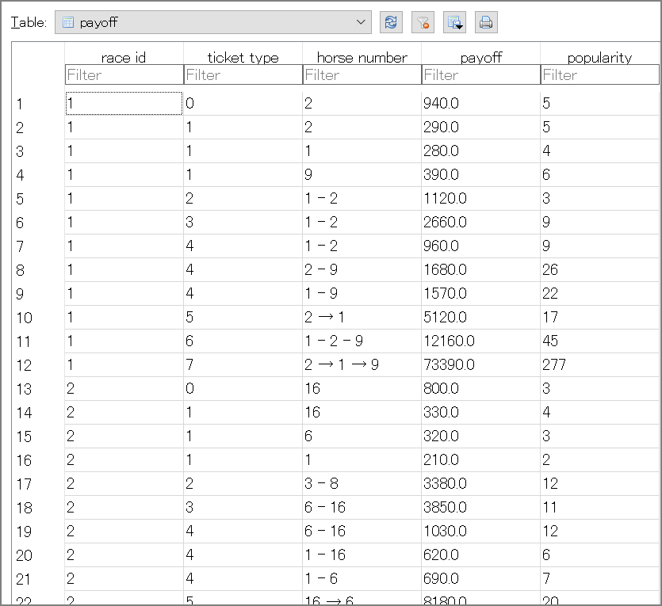

## はじめに

EC2上でnetkeiba-scraperを使ってレース情報を取得する。今回このツールを使いたかった理由は情報取得なのでrace.dbに格納するところまでをやります。

## バージョン情報

```sh
[ec2-user@scraperv2 ~]$ cat /etc/os-release
NAME="Amazon Linux"
VERSION="2"
ID="amzn"
ID_LIKE="centos rhel fedora"
VERSION_ID="2"
PRETTY_NAME="Amazon Linux 2"
ANSI_COLOR="0;33"
CPE_NAME="cpe:2.3:o:amazon:amazon_linux:2"
HOME_URL="https://amazonlinux.com/"
[ec2-user@scraperv2 ~]$ ec2-metadata -t
instance-type: m5.large
[ec2-user@scraperv2 ~]$ 
```

## 事前準備

### javaとgitのインストール

```sh
sudo yum -y install java git
```

javaはAmazon LinuxなこともあってオープンJDK完全互換のCorrettoがインストールされています。

### sbtのインストール

```sh
curl https://bintray.com/sbt/rpm/rpm | sudo tee /etc/yum.repos.d/bintray-sbt-rpm.repo
sudo yum -y install sbt
```

> sbt Reference Manual — Linux への sbt のインストール https://www.scala-sbt.org/1.x/docs/ja/Installing-sbt-on-Linux.html

### scalaのインストール

[公式サイト](https://www.scala-lang.org/download/)からダウンロード。

```sh
wget https://downloads.lightbend.com/scala/2.13.1/scala-2.13.1.rpm
sudo rpm -ivh scala-2.13.1.rpm
```

## netkeiba-scraperのダウンロード、設定変更

```sh
git clone https://github.com/stockedge/netkeiba-scraper.git
```

### 設定変更

#### ./netkeiba-scraper/src/main/scala/netkeiba-scraper/Main.scalaの修正

1. http -> httpsに変更

2. ログインURLの変更 : driver.get("https://regist.netkeiba.com/account/?pid=login")

3. 収集期間の変更

   デフォルトの10年の情報を収集しようとすると全体で数日、いや1週間近く掛かるので1年に変更

   - 修正前

   ```sh
   //過去10年分のURLを収集する
   RaceListScraper.scrape(period = 12 * 10)
   ```

   - 修正後

   ```sh
   //過去1年分のURLを収集する
   RaceListScraper.scrape(period = 12 * 1)
   ```

#### ./netkeiba-scraper/build.sbtを下記の通り修正

```sh
libraryDependencies += "org.xerial" % "sqlite-jdbc" % "3.7.2"
libraryDependencies += "joda-time" % "joda-time" % "2.3"
libraryDependencies += "org.joda" % "joda-convert" % "1.6"
libraryDependencies += "commons-io" % "commons-io" % "2.4"
libraryDependencies += "nu.validator.htmlparser" % "htmlparser" % "1.4"
libraryDependencies += "org.seleniumhq.selenium" % "selenium-java" % "2.41.0"
libraryDependencies += "commons-lang" % "commons-lang" % "2.6"
libraryDependencies += "org.scala-lang.modules" %% "scala-xml" % "1.0.6"
libraryDependencies ++= Seq(
  "org.scalikejdbc" %% "scalikejdbc"               % "2.5.2",
  "com.h2database"  %  "h2"                        % "1.4.196",
  "ch.qos.logback"  %  "logback-classic"           % "1.2.3"
)
```

参照：

> scalikejdbc/scalikejdbc: A tidy SQL-based DB access library for Scala developers. This library naturally wraps JDBC APIs and provides you easy-to-use APIs. https://github.com/scalikejdbc/scalikejdbc
>
> Maven Repository: org.scala-lang.modules » scala-xml https://mvnrepository.com/artifact/org.scala-lang.modules/scala-xml_2.11

## netkeiba-scraperの実行

```sh
cd /home/ec2-user/netkeiba-scraper
sbt
```

### run collecturl

レース結果が載っているURLを収集して「race_list.txt」に保存

```sh
sbt:netkeiba-scraper> run collecturl
[info] Updating 
https://repo1.maven.org/maven2/org/scalikejdbc/scalikejdbc_2.12/2.5.2/scalikejdbc_2.12-2.5.2.pom
  100.0% [##########] 3.0 KiB (6.5 KiB / s)
https://repo1.maven.org/maven2/com/h2database/h2/1.4.196/h2-1.4.196.pom
～中略～
8: collecting URLs from https://db.netkeiba.com/?pid=race_top&date=20190504
9: collecting URLs from https://db.netkeiba.com/?pid=race_top&date=20190406
10: collecting URLs from https://db.netkeiba.com/?pid=race_top&date=20190302
11: collecting URLs from https://db.netkeiba.com/?pid=race_top&date=20190202
[success] Total time: 163 s (02:43), completed Feb 10, 2020, 2:28:33 AM
sbt:netkeiba-scraper> 
```

### run scrapehtml

レース結果のHTMLをスクレイピングしてhtmlフォルダに保存

※稼働確認のために`race_url.txt`の中身を1行（1レース分）を対象にしました。

```sh
sbt:netkeiba-scraper> run scrapehtml
[info] running Main scrapehtml
WARNING: An illegal reflective access operation has occurred
WARNING: Illegal reflective access by net.sourceforge.htmlunit.corejs.javascript.NativeArray (file:/tmp/sbt_e627d576/target/8fadc32b/11102a7b/htmlunit-core-js-2.13.jar) to field java.util.Arrays$LegacyMergeSort.userRequested
WARNING: Please consider reporting this to the maintainers of net.sourceforge.htmlunit.corejs.javascript.NativeArray
WARNING: Use --illegal-access=warn to enable warnings of further illegal reflective access operations
WARNING: All illegal access operations will be denied in a future release
1:downloading https://db.netkeiba.com/race/202005010101
[success] Total time: 7 s, completed Feb 10, 2020, 2:33:39 AM
sbt:netkeiba-scraper> 
```

ここまで完了するとhtmlフォルダにダウンロードしてきたhtmlファイルが格納されています。

```sh
[ec2-user@scraperv2 html]$ pwd
/home/ec2-user/netkeiba-scraper/html
[ec2-user@scraperv2 html]$ ls -l
total 108
-rw-rw-r-- 1 ec2-user ec2-user 107109 Feb 10 02:33 202005010101.html
[ec2-user@scraperv2 html]$ 

```

### run extract

HTMLからレース結果を抜き出しSQLiteに保存

```sh
sbt:netkeiba-scraper> run extract
[info] running Main extract
02:35:20.126 [run-main-2] DEBUG scalikejdbc.ConnectionPool$ - Registered connection pool : ConnectionPool(url:jdbc:sqlite:race.db, user:null) using factory : <default>
02:35:20.130 [run-main-2] DEBUG scalikejdbc.ConnectionPool$ - Registered singleton connection pool : ConnectionPool(url:jdbc:sqlite:race.db, user:null)
～中略～
[success] Total time: 1 s, completed Feb 10, 2020, 2:35:20 AM
```

## race.dbに格納されるデータについて

作成されるrace.dbの中にTableは4つ存在していました。

- feature
- payoff
- race_info
- race_result

なお、sqlite_sequenceというテーブルもありますが、AUTOINCREMENTの情報を sqlite_sequence というテーブルで管理しているので上記の4つがメイン。


### payoff



### race_info


### race_result


