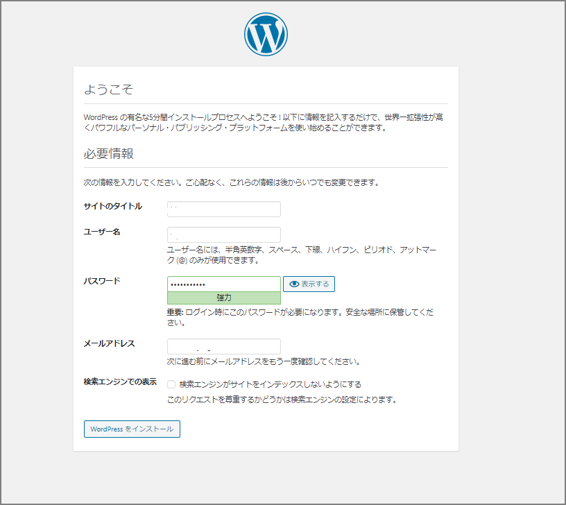

### はじめに

知人にIT業界にいるんだから、ホームページくらい作れるんでしょ？と煽られたのでWordPressをAWSのEC2上にインストールしていきます。

WordPressのインストール要件は下記の通り。

> 要件 | WordPress.org 日本語 https://ja.wordpress.org/about/requirements/
>
> - PHP バージョン 7.3 以上。
> - MySQL バージョン 5.6 以上、または MariaDB バージョン 10.1 以上
> - HTTPS 対応

### 環境情報

無料枠のt2.microにインストールしていきます。Amazon Linuxです。

```sh
[ec2-user@wp-ec2 ~]$ cat /etc/os-release
NAME="Amazon Linux"
VERSION="2"
ID="amzn"
ID_LIKE="centos rhel fedora"
VERSION_ID="2"
PRETTY_NAME="Amazon Linux 2"
ANSI_COLOR="0;33"
CPE_NAME="cpe:2.3:amazon:amazon_linux:2"
HOME_URL="https://amazonlinux.com/"
```

### MySQL

#### MySQLのインストール

Amazon LinuxにはデフォルトでMariaDBがインストールされているので、MySQL5.7を使用できるように設定をしていきます。MariaDBで良い場合は特に何もしなくて良いかと思います。

```sh
sudo su -
yum info mysql

#リポジトリの追加
yum localinstall -y https://dev.mysql.com/get/mysql80-community-release-el7-1.noarch.rpm

#mysql8.0リポジトリの無効化
yum-config-manager --disable mysql80-community

#mysql5.7リポジトリの有効化
yum-config-manager --enable mysql57-community

#mysql5.7がインストールできるか確認
yum info mysql-community-server

#インストール
yum -y install mysql-community-server

#バージョン確認
mysqld --version

#自動起動確認
systemctl start mysqld.service
systemctl enable mysqld.service
systemctl status mysqld.service
```

> 参考：AWSのEC2で行うAmazon Linux2（MySQL5.7）環境構築 - Qiita https://qiita.com/2no553/items/952dbb8df9a228195189

MySQLの5.7.29がインストールされました。

```sh
[root@wp-ec2 ~]# mysqld --version
mysqld  Ver 5.7.29 for Linux on x86_64 (MySQL Community Server (GPL))
[root@wp-ec2 ~]# 
[root@wp-ec2 ~]# systemctl status mysqld.service
● mysqld.service - MySQL Server
   Loaded: loaded (/usr/lib/systemd/system/mysqld.service; enabled; vendor preset: disabled)
   Active: active (running) since Sun 2020-02-02 02:54:44 UTC; 4s ago
     Docs: man:mysqld(8)
           http://dev.mysql.com/doc/refman/en/using-systemd.html
 Main PID: 3749 (mysqld)
   CGroup: /system.slice/mysqld.service
           └─3749 /usr/sbin/mysqld --daemonize --pid-file=/var/run/mysqld/mysqld.pid

Feb 02 02:54:39 wp-ec2 systemd[1]: Starting MySQL Server...
Feb 02 02:54:44 wp-ec2 systemd[1]: Started MySQL Server.
[root@wp-ec2 ~]# 
```

#### mysqlの初期設定

```sh
cat /var/log/mysqld.log | grep password
mysql_secure_installation

Change the password for root ? ((Press y|Y for Yes, any other key for No) : no
Remove anonymous users? (Press y|Y for Yes, any other key for No) : yes
Disallow root login remotely? (Press y|Y for Yes, any other key for No) : yes
Remove test database and access to it? (Press y|Y for Yes, any other key for No) : yes
Reload privilege tables now? (Press y|Y for Yes, any other key for No) : yes
```

#### 文字コード変更

```sh
mysql -u root -p
show global variables like 'character%';
```

#### /etc/my.cnfの設定を変更

```sh
sudo vi /etc/my.cnf

[mysqld]
character_set_server=utf8mb4

[client]
default-character-set=utf8mb4
```

#### mysqlを再起動

```sh
sudo systemctl restart mysqld.service
```

#### WordPress用のデータベース、ユーザ設定を行う

```sh
create database wp1;
grant all privileges on `wp1`.* to 'wp1'@'localhost' IDENTIFIED BY 'xxxxxxxx';
show grants for wp1@localhost;
SELECT host, user FROM mysql.user;
```

### PHP

#### PHPのインストール

```sh
amazon-linux-extras list | grep php 
amazon-linux-extras install php7.3
php -v
```

#### バージョン確認

```sh
[root@wp-ec2 ~]# php -v
PHP 7.3.11 (cli) (built: Oct 31 2019 19:16:47) ( NTS )
Copyright (c) 1997-2018 The PHP Group
Zend Engine v3.3.11, Copyright (c) 1998-2018 Zend Technologies
[root@wp-ec2 ~]# 

```

### Apache

#### Apacheのインストール

```sh
[root@wp-ec2 ~]# yum info httpd
Loaded plugins: extras_suggestions, langpacks, priorities, update-motd
31 packages excluded due to repository priority protections
Available Packages
Name        : httpd
Arch        : x86_64
Version     : 2.4.41
Release     : 1.amzn2.0.1
Size        : 1.3 M
Repo        : amzn2-core/2/x86_64
Summary     : Apache HTTP Server
URL         : https://httpd.apache.org/
License     : ASL 2.0
Description : The Apache HTTP Server is a powerful, efficient, and extensible
            : web server.


yum -y install httpd

[root@wp-ec2 ~]# httpd -v
Server version: Apache/2.4.41 ()
Server built:   Oct 22 2019 22:59:04
[root@wp-ec2 ~]# 
```

#### Apacheの起動

```sh
systemctl status httpd
systemctl start httpd
systemctl status httpd
```

```sh
[root@wp-ec2 ~]# systemctl status httpd
● httpd.service - The Apache HTTP Server
   Loaded: loaded (/usr/lib/systemd/system/httpd.service; disabled; vendor preset: disabled)
  Drop-In: /usr/lib/systemd/system/httpd.service.d
           └─php-fpm.conf
   Active: inactive (dead)
     Docs: man:httpd.service(8)
[root@wp-ec2 ~]# 
[root@wp-ec2 ~]# systemctl start httpd
[root@wp-ec2 ~]# 
[root@wp-ec2 ~]# systemctl status httpd
● httpd.service - The Apache HTTP Server
   Loaded: loaded (/usr/lib/systemd/system/httpd.service; disabled; vendor preset: disabled)
  Drop-In: /usr/lib/systemd/system/httpd.service.d
           └─php-fpm.conf
   Active: active (running) since Sun 2020-02-02 03:13:17 UTC; 4s ago
     Docs: man:httpd.service(8)
 Main PID: 30339 (httpd)
   Status: "Processing requests..."
   CGroup: /system.slice/httpd.service
           ├─30339 /usr/sbin/httpd -DFOREGROUND
           ├─30346 /usr/sbin/httpd -DFOREGROUND
           ├─30347 /usr/sbin/httpd -DFOREGROUND
           ├─30348 /usr/sbin/httpd -DFOREGROUND
           ├─30349 /usr/sbin/httpd -DFOREGROUND
           └─30350 /usr/sbin/httpd -DFOREGROUND

Feb 02 03:13:17 wp-ec2 systemd[1]: Starting The Apache HTTP Server...
Feb 02 03:13:17 wp-ec2 httpd[30339]: AH00558: httpd: Could not reliably determine the server's fully qualified domain name, using fe80::459:bdff:fe4b:3ffa. Set the 'ServerN... this message
Feb 02 03:13:17 wp-ec2 systemd[1]: Started The Apache HTTP Server.
Hint: Some lines were ellipsized, use -l to show in full.
[root@wp-ec2 ~]# 
[root@wp-ec2 ~]# 
[root@wp-ec2 ~]# ps -ef | grep httpd | grep -v grep
root     30339     1  0 03:13 ?        00:00:00 /usr/sbin/httpd -DFOREGROUND
apache   30346 30339  0 03:13 ?        00:00:00 /usr/sbin/httpd -DFOREGROUND
apache   30347 30339  0 03:13 ?        00:00:00 /usr/sbin/httpd -DFOREGROUND
apache   30348 30339  0 03:13 ?        00:00:00 /usr/sbin/httpd -DFOREGROUND
apache   30349 30339  0 03:13 ?        00:00:00 /usr/sbin/httpd -DFOREGROUND
apache   30350 30339  0 03:13 ?        00:00:00 /usr/sbin/httpd -DFOREGROUND
[root@wp-ec2 ~]# 
```

#### Apacheの起動設定確認

```sh
systemctl is-enabled httpd
systemctl enable httpd
systemctl is-enabled httpd

[root@wp-ec2 ~]# systemctl is-enabled httpd
disabled
[root@wp-ec2 ~]# systemctl enable httpd
Created symlink from /etc/systemd/system/multi-user.target.wants/httpd.service to /usr/lib/systemd/system/httpd.service.
[root@wp-ec2 ~]# 
[root@wp-ec2 ~]# systemctl is-enabled httpd
enabled
[root@wp-ec2 ~]# 
```

Apacheのインストール、及び有効化も完了したので、Webサーバへのテストアクセスを行う。ブラウザでパブリックIPを入力して移動する。現時点では特にコンテンツを配置していないので、Apacheのテストページが表示される。

※AWS側のセキュリティグループの設定が必要。http(もしくはhttps)のプロトコルとポートを開けてください。


#### ファイルのパーミッション変更

Amazon Linux Apache ドキュメントルートは /var/www/htmlであり、デフォルトでは root によって所有されるのでこれをec2-userでも編集できるように変更する。具体的にはec2-user を apache グループに追加し、apache ディレクトリの所有権を /var/www グループに付与し、グループへの書き込み権限を割り当てる。これによりwordpressのファイル編集やphpファイルの編集が出来るようになる。

```sh
usermod -a -G apache ec2-user
exit
```

再ログインして確認する。

```sh
[ec2-user@wp-ec2 ~]$ groups
ec2-user adm wheel apache systemd-journal
[ec2-user@wp-ec2 ~]$ 
```

/var/www とそのコンテンツのグループ所有権を apache グループに変更

```sh
sudo chown -R ec2-user:apache /var/www
```

グループの書き込み許可を追加して、これからのサブディレクトにグループ ID を設定するには、/var/www とサブディレクトのディレクトリ許可を変更

```sh
sudo chmod 2775 /var/www && find /var/www -type d -exec sudo chmod 2775 {} \;
```

グループ書き込み許可を追加するには、`/var/www` とサブディレクトリのファイル許可を再帰的に変更

```sh
sudo find /var/www -type f -exec sudo chmod 0664 {} \;
```

#### httpd.confの修正

```sh
vi /etc/httpd/conf/httpd.conf
```

`AllowOverride None`を`AllowOverride All`に変更する。

### WordPress

#### WordPressのインストール、設定

SSL/TLSの設定は一旦、置いておいてWordPress環境のインストール、設定を行う。

```sh
wget https://ja.wordpress.org/latest-ja.tar.gz
tar -xzf latest-ja.tar.gz
```

#### wp-config.php ファイルの作成と編集

```sh
cp wordpress/wp-config-sample.php wordpress/wp-config.php
vi wordpress/wp-config.php
```

下記情報を入力していく。

```sh
define('DB_NAME', 'wordpress-db');
define('DB_USER', 'wordpress-user');
define('DB_PASSWORD', 'your_strong_password');
```

次にAuthentication Unique Keys and Salts のセクションを修正する。これらの KEY と SALT の値は、WordPress ユーザーがローカルマシンに保存したブラウザクッキーに対する暗号化レイヤーを提供します。基本的に、ここで長くてランダムな値を指定すると、サイトのセキュリティが向上します。

```sh
define( 'AUTH_KEY',         'put your unique phrase here' );
define( 'SECURE_AUTH_KEY',  'put your unique phrase here' );
define( 'LOGGED_IN_KEY',    'put your unique phrase here' );
define( 'NONCE_KEY',        'put your unique phrase here' );
define( 'AUTH_SALT',        'put your unique phrase here' );
define( 'SECURE_AUTH_SALT', 'put your unique phrase here' );
define( 'LOGGED_IN_SALT',   'put your unique phrase here' );
define( 'NONCE_SALT',       'put your unique phrase here' );
```

下記にアクセスしてSALTのキーを取得して貼り付ける。

> https://api.wordpress.org/secret-key/1.1/salt/

#### パーミッション変更

wordpress配下の所有者とgroupをapache所有とする

```sh
sudo chown -R apache:apache /var/www/html/*
```

#### WordPressの設定

下記にアクセスして、WordPressのインストール設定を入力する。`xxx.xxx.xxx.xxx`はEC2にアタッチしたElasitc IP。

> http://xxx.xxx.xxx.xxx/wp1/wp-admin/install.php




ここまででWordPressを稼働できるところまで来た。独自ドメインの設定とHTTPS化はまた別途。