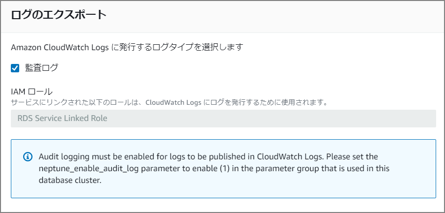
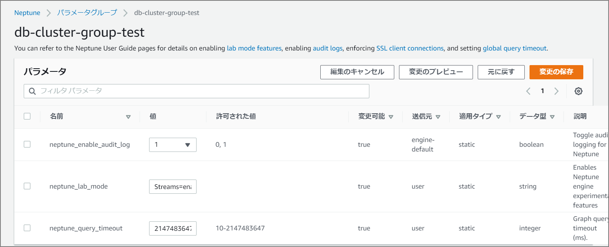

インスタンス作成時に`監査ログ`の有効化をチェックしていたにも関わらず、監査ログが出ないなーと思っていたら`Audit logging must be enabled for logs to be published in CloudWatch Logs. Please set the neptune_enable_audit_log parameter to enable (1) in the parameter group that is used in this database cluster.`とあるようにパラメータの設定が必要だった模様。



監査ログが出力しないと思っていたら、`neptune_enable_audit_log`を「0」から「1」に変更する必要があり、適用タイプがstaticなので変更時には再起動が必要。



#### ログサンプル

1つ目がNeptune Workbench から実行したクエリ、もう一つがcurlからPostしたクエリ。

```sh
1584766979615, 10.0.1.18:34266, 10.0.3.215:8182, HTTP_POST, [unknown], [unknown], "HttpObjectAggregator$AggregatedFullHttpRequest(decodeResult: success, version: HTTP/1.1, content: CompositeByteBuf(ridx: 0, widx: 79, cap: 79, components=1)) POST /sparql HTTP/1.1 Host: neptestdb-cluster.cluster-xxxxxx.ap-northeast-1.neptune.amazonaws.com:8182 User-Agent: python-requests/2.20.0 Accept-Encoding: gzip, deflate Accept: */* Connection: keep-alive Content-Length: 79 Content-Type: application/x-www-form-urlencoded", query=SELECT+%2A%0AWHERE+%7B%0A++%3Fs+%3Fp+%3Fo+.%0A%7D%0ALIMIT+100%0AOFFSET+0+

1584767048270, 10.0.1.123:56336, 10.0.3.215:8182, HTTP_POST, [unknown], [unknown], "HttpObjectAggregator$AggregatedFullHttpRequest(decodeResult: success, version: HTTP/1.1, content: CompositeByteBuf(ridx: 0, widx: 47, cap: 47, components=1)) POST /sparql HTTP/1.1 Host: neptestdb.xxxxxxx.ap-northeast-1.neptune.amazonaws.com:8182 User-Agent: curl/7.61.1 Accept: */* Content-Length: 47 Content-Type: application/x-www-form-urlencoded", query=select ?s ?p ?o where {?s ?p ?o} limit 10

```

### 参考

> Amazon Neptune クラスターで監査ログを使用する - Amazon Neptune https://docs.aws.amazon.com/ja_jp/neptune/latest/userguide/auditing.html

