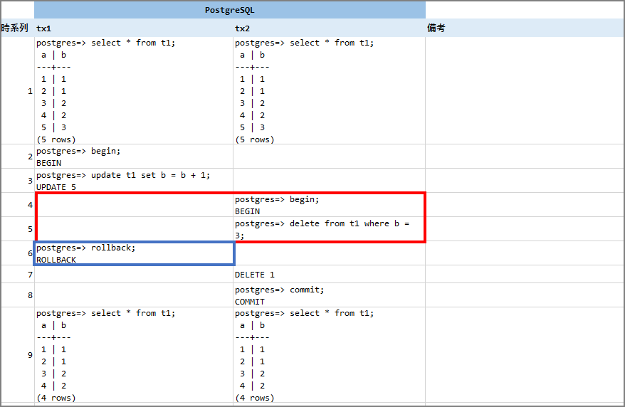

OracleとPostgreSQLのトランザクション分離レベルは同じREAD COMMITTEDだが、トランザクションによってはそれぞれのデータベースで動作が異なる場合がある。関数の違いや機能差異というのは試験でエラーになるが、この仕様差異はエラーにならず、データの結果差異に繋がることから非常に厄介な問題である。

トランザクション分離レベルの概要等は以前にこちらの記事で書いた。

> トランザクション分離レベル(ISOLATION LEVEL)と各DBエンジンについて | my opinion is my own https://zatoima.github.io/oracle-mysql-postgresql-isolation-level.html

今回は上記で触れられなかった各DBエンジンの挙動の違いについてメモしておく。このトランザクション差異の話は有名だと思っているが、あまりネット上で「何故そうなるか？」の観点で記載された記事が無かったので、調査した内容と実機検証の結果を書き留める。（もし誤りがあればご指摘ください。）

### トランザクションの結果が異なるケースについて

#### Writeの競合

| -      | oracle                   |                             | PostgreSQL               |                             |
| ------ | ------------------------ | --------------------------- | ------------------------ | --------------------------- |
| 時系列 | tx1                      | tx2                         | tx1                      | tx2                         |
| 1      | select * from t1;        | select * from t1;           | select * from t1;        | select * from t1;           |
| 2      |                          |                             | begin;                   |                             |
| 3      | update t1 set b = b + 1; |                             | update t1 set b = b + 1; |                             |
| 4      |                          |                             |                          | begin;                      |
| 5      |                          | delete from t1 where b = 3; |                          | delete from t1 where b = 3; |
| 6      | commit;                  |                             | commit;                  |                             |
| 7      |                          | commit;                     |                          | commit;                     |
| 8      | select * from t1;        | select * from t1;           | select * from t1;        | select * from t1;           |

実際に上記の手順を実行した場合は下記の結果となる。赤枠で囲っている箇所のトランザクションの動作が異なる。(※markdownで上手く表に出来なかったため画像にしました。)

- ### Oracleの動作仕様

Oracleの場合は、下記マニュアルにこの動作仕様の説明が記載されている。

> データの同時実行性と整合性 https://docs.oracle.com/cd/E57425_01/121/CNCPT/consist.htm
>
> コミット読取りトランザクション内での書込みの競合
>
> コミット読取りトランザクションでは、未コミットの同時実行トランザクション(*ブロックしているトランザクション*とも呼ばれる)によって更新された行の変更を試行すると、書込みの競合が発生します。コミット読取りトランザクションは、ブロックしているトランザクションが終了して行ロックが解除されるまで待機します。
>
> - ブロックしているトランザクションがコミットされてロックが解除された場合、待機しているトランザクションでは、新たに変更された行に対して更新が実行されます。

上記に記載されている通り、`ブロックしているトランザクションがコミットされてロックが解除された場合、待機しているトランザクションでは、新たに変更された行に対して更新が実行されます。`とあるので、`No.6`の`tx1`の`Commit`実行時に`No.5`の`delete from t1 where b = 3;`は`No.3`の計算結果を踏まえて削除処理が実行される。

- ### PostgreSQLの動作仕様

PostgreSQLの場合は、下記がマニュアルの該当箇所となる。

> 13.2. トランザクションの分離 https://www.postgresql.jp/document/11/html/transaction-iso.html
>
> UPDATE、DELETE、SELECT FOR UPDATE、およびSELECT FOR SHAREコマンドは対象行を検索する際に`SELECT`コマンドと同じように振舞います。 これらのコマンドは、問い合わせが開始された時点で既にコミットされた対象行のみを検出します。 しかし、その対象行は、検出されるまでに、同時実行中の他のトランザクションによって、既に更新（もしくは削除あるいはロック）されてしまっているかもしれません。 このような場合更新されるべき処理は、最初の更新トランザクションが（それがまだ進行中の場合）コミットもしくはロールバックするのを待ちます。 最初の更新処理がロールバックされるとその結果は無視されて、2番目の更新処理で元々検出した行の更新を続行することができます。 最初の更新処理がコミットされると、2番目の更新処理では、最初の更新処理により行が削除された場合はその行を無視します。 行が削除されなかった時の更新処理は、最初のコミットで更新された行に適用されます。 コマンドの検索条件（`WHERE`句）は、更新された行がまだその検索条件に一致するかどうかの確認のため再評価されます。 検索条件と一致している場合、2番目の更新処理は、更新された行を使用して処理を開始します。

`最初の更新処理がコミットされると、2番目の更新処理では、最初の更新処理により行が削除された場合はその行を無視します。 行が削除されなかった時の更新処理は、最初のコミットで更新された行に適用されます。`とあるので、`No.6`の`tx1`の`Commit`実行時に`最初の更新処理により行が削除された`ので、その行の処理についてはskipする。

上記の通り、**OracleではSQL文が再評価（=再起動）されて実行されるのに対して、PostgreSQLでは行が削除された場合は、該当行を無視する**ので結果の差異が生じる。（個人的にPostgreSQLのこの挙動は分かりづらく感じる。）

次に青枠で囲っているcommitをrollbackしてみる。（`最初の更新処理がロールバックされるとその結果は無視されて、2番目の更新処理で元々検出した行の更新を続行することができます。`という文章の確認）

この場合は、元々の`b=3`のデータが削除される。Oracleにおいても下記記載がある通り、同様の挙動となる。当然結果も同じとなる。

> データの同時実行性と整合性 https://docs.oracle.com/cd/E57425_01/121/CNCPT/consist.htm
>
> - ブロックしているトランザクションがロールバックされた場合、待機しているトランザクションでは、ブロックしているトランザクションが存在していなかったかのように、ロックされていた行が変更されます。

#### select for updateとdeleteの競合

次にこのパターンを確認する。

|        | oracle                                                       |                                                              | PostgreSQL                                                   |                                                              |
| ------ | ------------------------------------------------------------ | ------------------------------------------------------------ | ------------------------------------------------------------ | ------------------------------------------------------------ |
| 時系列 | tx1                                                          | tx2                                                          | tx1                                                          | tx2                                                          |
| 1      | SELECT * FROM t1 ORDER BY a;                                 |                                                              | SELECT * FROM t1 ORDER BY a;                                 |                                                              |
| 2      |                                                              |                                                              | BEGIN;                                                       |                                                              |
| 3      | SELECT a, b FROM t1 WHERE a =  (SELECT MIN(a) FROM t1) FOR UPDATE; |                                                              | SELECT a, b FROM t1 WHERE a =  (SELECT MIN(a) FROM t1) FOR UPDATE; |                                                              |
| 4      |                                                              |                                                              |                                                              | BEGIN;                                                       |
| 5      |                                                              | SELECT a, b FROM t1 WHERE a =  (SELECT MIN(a) FROM t1) FOR UPDATE; |                                                              | SELECT a, b FROM t1 WHERE a =  (SELECT MIN(a) FROM t1) FOR UPDATE; |
| 6      | DELETE FROM t1 WHERE a = 1;                                  |                                                              | DELETE FROM t1 WHERE a = 1;                                  |                                                              |
| 7      | COMMIT;                                                      |                                                              | COMMIT;                                                      |                                                              |

上記のトランザクション実行時の結果は次の通り。

- #### Oracleの動作仕様

基本的な考え方はwriteの競合パターンの考え方と同一で良いと考えるが、下記マニュアルにある通り、選択した行が更新または削除された場合は再度問い合わせ文を再起動して評価をし直す。したがって、この場合はNo.7の`commit`のタイミングで再評価され、その時点の最小データである`2`がクエリされることになる。

> アプリケーション開発者用のSQL処理 https://docs.oracle.com/cd/E57425_01/121/ADFNS/adfns_sqlproc.htm#i1025003
>
> 問合せの実行中に、`SELECT` `FOR` `UPDATE`に対する結果セットが変化する場合があります。たとえば、問合せ開始後に問合せで選択された列が更新されたり、行が削除された場合です。このような場合、`SELECT` `FOR` `UPDATE`は変更されなかった行でロックを取得し、このロックを使用して表の読取り一貫性スナップショットを取得してから、残りのロックを取得するために問合せを再起動します。

- #### PostgreSQLの動作仕様

writeの競合パターンと同様に「最初の更新処理がコミットされると、2番目の更新処理では、最初の更新処理により行が削除された場合はその行を無視します。 」となるので0件となる。

### 参考

SQL移行調査編 https://pgecons-sec-tech.github.io/tech-report/pdf/09_SqlMigrationResearch.pdf

Oracle DBとPostgreSQLで異なる処理結果、「仕様差」問題に要注意 | 日経クロステック（xTECH） https://xtech.nikkei.com/atcl/nxt/column/18/00817/061300007/

13.2. トランザクションの分離 https://www.postgresql.jp/document/11/html/transaction-iso.html

Oracle/MySQL/PostgreSQLにおけるサブクエリを含むDMLの非互換性 - SH2の日記 https://sh2.hatenablog.jp/entry/20131223

ept/hermitage: What are the differences between the transaction isolation levels in databases? This is a suite of test cases which differentiate isolation levels. https://github.com/ept/hermitage