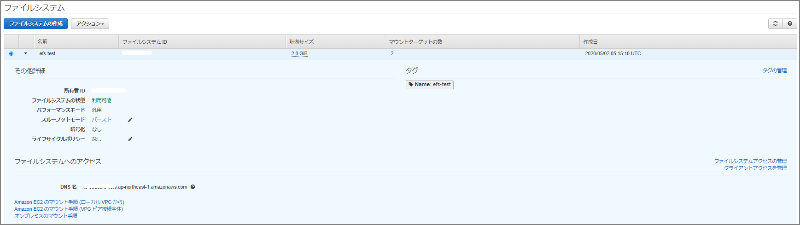

既にマネージメントコンソール側にEFSを作成しているとして、、、、、



### amazon-efs-utilsのインストール

```sh
sudo yum -y install amazon-efs-utils
```

### マウント用のディレクトリ作成

```sh
sudo mkdir /mnt/efs
sudo chown ec2-user:ec2-user /mnt/efs
sudo mount -t efs fs-xxxxx:/ /mnt/efs
echo $?
```

ファイルシステムIDを`fs-xxxxx`に指定


dfで確認してEFSがマウント出来ていることを確認

```sh
[ec2-user@bastin ~]$ df -h
Filesystem                                      Size  Used Avail Use% Mounted on
devtmpfs                                        475M     0  475M   0% /dev
tmpfs                                           492M     0  492M   0% /dev/shm
tmpfs                                           492M  436K  492M   1% /run
tmpfs                                           492M     0  492M   0% /sys/fs/cgroup
/dev/xvda1                                       20G  6.5G   14G  33% /
tmpfs                                            99M     0   99M   0% /run/user/1000
fs-xxxxxx.efs.ap-northeast-1.amazonaws.com:/  8.0E     0  8.0E   0% /mnt/efs
[ec2-user@bastin ~]$ 
```

再起動時にマウントするために/etc/fstabに追加

```sh
fs-xxxxx:/ /mnt/efs efs defaults,_netdev 0 0
```

### 性能簡易測定(ddコマンド)

```sh
[ec2-user@bastin efs]$ dd if=/dev/zero of=/mnt/efs/write.txt ibs=4k obs=4k count=2048
2048+0 records in
2048+0 records out
8388608 bytes (8.4 MB) copied, 1.34538 s, 6.2 MB/s
```

### fioコマンド

```sh
sudo yum install -y fio
fio --version
```

##### block size が 4kの場合

```sh
-- sequencial read
fio -filename=/mnt/efs/fio_test -direct=1 -rw=read -bs=4k -size=2G -numjobs=64 -runtime=10 -group_reporting -name=file1
-- ramdom read
fio -filename=/mnt/efs/fio_test -direct=1 -rw=randread -bs=4k -size=2G -numjobs=64 -runtime=10 -group_reporting -name=file1
-- sequencial write
fio -filename=/mnt/efs/fio_test -direct=1 -rw=write -bs=4k -size=2G -numjobs=64 -runtime=10 -group_reporting -name=file1
-- ramdom write
fio -filename=/mnt/efs/fio_test -direct=1 -rw=randwrite -bs=4k -size=2G -numjobs=64 -runtime=10 -group_reporting -name=file1
```

##### 結果

```sh
#sequencial read
read : io=151396KB, bw=15114KB/s, iops=3778, runt= 10017msec
#ramdom read
read : io=427984KB, bw=42739KB/s, iops=10684, runt= 10014msec
#sequencial write
write: io=9192.0KB, bw=912516B/s, iops=222, runt= 10315msec
#ramdom write
write: io=9848.0KB, bw=980300B/s, iops=239, runt= 10287msec
```

##### block size が 32mの場合

```sh
-- sequencial read
fio -filename=/mnt/efs/fio_test -direct=1 -rw=read -bs=32m -size=2G -numjobs=16 -runtime=10 -group_reporting -name=file1
-- ramdom read
fio -filename=/mnt/efs/fio_test -direct=1 -rw=randread -bs=32m -size=2G -numjobs=16 -runtime=10 -group_reporting -name=file1
-- sequencial write
fio -filename=/mnt/efs/fio_test -direct=1 -rw=write -bs=32m -size=2G -numjobs=16 -runtime=10 -group_reporting -name=file1
-- ramdom write
fio -filename=/mnt/efs/fio_test -direct=1 -rw=randwrite -bs=32m -size=2G -numjobs=16 -runtime=10 -group_reporting -name=file1
```

##### 結果

```sh
#sequencial read
read : io=1536.0MB, bw=109990KB/s, iops=3, runt= 14300msec
#ramdom read
read : io=1504.0MB, bw=110196KB/s, iops=3, runt= 13976msec
#sequencial write
write: io=1504.0MB, bw=108404KB/s, iops=3, runt= 14207msec
#ramdom write
write: io=1472.0MB, bw=109808KB/s, iops=3, runt= 13727msec
```

### その他

```sh
[ec2-user@bastin ~]$ nslookup fs-xxxxxx.efs.ap-northeast-1.amazonaws.com
Server:		10.0.0.2
Address:	10.0.0.2#53

Non-authoritative answer:
Name:	fs-xxxxxxx.efs.ap-northeast-1.amazonaws.com
Address: 10.0.2.177

[ec2-user@bastin ~]$ 
```

