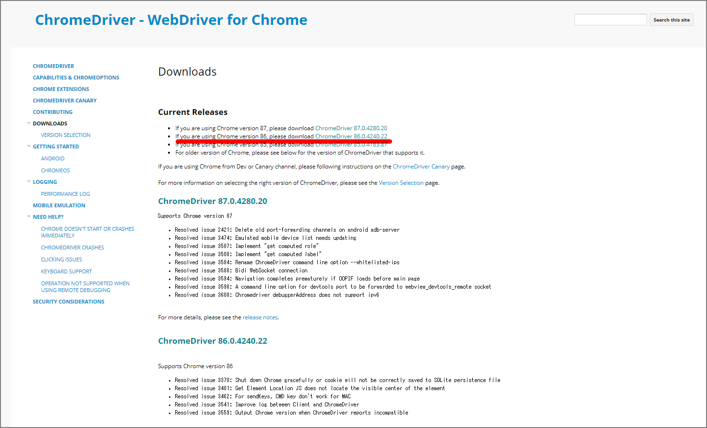

少しハマってしまったので、いつの日にか再度実施することを考慮してメモ。

#### 事前準備

python3とSeleniumをインストール

```
sudo yum install python3
sudo pip3 install Selenium
```

#### Chromeをインストールする

```
sudo yum -y install https://dl.google.com/linux/direct/google-chrome-stable_current_x86_64.rpm
```

stable版をインストールしたらバージョン**<u>86.0</u>**が入った模様。

```
[ec2-user@bastin py]$ rpm -qa | grep google-chrome
google-chrome-stable-86.0.4240.198-1.x86_64
```

#### ChromeDriverをインストール

下記のサイトからgoogle-chromeをインストールした際のバージョンに合うChromeを選択する

> Downloads - ChromeDriver - WebDriver for Chrome https://chromedriver.chromium.org/downloads



バージョンが合わないと下記のようなエラーが発生する

```
[ec2-user@bastin py]$ python3 test_selenium.py
Traceback (most recent call last):
  File "test_selenium.py", line 21, in <module>
    _main()
  File "test_selenium.py", line 8, in _main
    driver = webdriver.Chrome(options=options)
  File "/usr/local/lib/python3.7/site-packages/selenium/webdriver/chrome/webdriver.py", line 81, in __init__
    desired_capabilities=desired_capabilities)
  File "/usr/local/lib/python3.7/site-packages/selenium/webdriver/remote/webdriver.py", line 157, in __init__
    self.start_session(capabilities, browser_profile)
  File "/usr/local/lib/python3.7/site-packages/selenium/webdriver/remote/webdriver.py", line 252, in start_session
    response = self.execute(Command.NEW_SESSION, parameters)
  File "/usr/local/lib/python3.7/site-packages/selenium/webdriver/remote/webdriver.py", line 321, in execute
    self.error_handler.check_response(response)
  File "/usr/local/lib/python3.7/site-packages/selenium/webdriver/remote/errorhandler.py", line 242, in check_response
    raise exception_class(message, screen, stacktrace)
selenium.common.exceptions.SessionNotCreatedException: Message: session not created: This version of ChromeDriver only supports Chrome version 87
Current browser version is 86.0.4240.198 with binary path /usr/bin/google-chrome
```

headlessモードでseleniumを実行可能となる。

