#### はじめに

『AWS Certified Machine Learning – Specialty』に向けて勉強したことをまとめる。主に機械学習の（主に用語）の勉強メモです。書きなぐっているだけ。

#### 用語メモ

- 説明変数
  - 因果関係における原因、関数における入力。y=f(x)におけるxを説明変数と呼ぶ
- 目的変数

  - 因果関係における結果、関数における出力。y=f(x)におけるyを目的変数と呼ぶ
- 線形回帰
  - ある変数xが与えられたとき、それと相関関係のあるyの値を説明・予測

- ロジスティック回帰

  - ロジスティック関数の形は以下となる。0〜1の値を取り、単調増加

    

- 活性化関数

  - 多くの活性化関数が存在する。目的は入力値を別の数値に変換して出力する。

  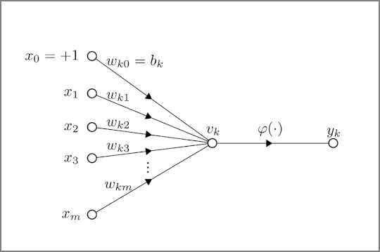

  - シグモイド関数

    - 0～1の間の値を取る。2分類を行う際によく使われる。0や1に近づければ近づくほど滑らかになる

- 過学習

  - 与えられたデータに（ノイズ含めて）過度に適合してしまい、訓練データに対する誤差は少ないが、未知データに対する性能が低下してしまう状態

- 汎化性能

  - 未知のデータに対する性能（汎化性能）。定量化した汎化誤差を小さくすることが重要

- 正規化

  - 特徴量の値の範囲を一定の範囲におさめる変換。主に[0, 1]か、[-1, 1]の範囲内。
  
- 正則化

  - 過学習を防ぐ
  - 極端と思われるデータは対象としない
    - L1正則化（Lasso回帰）：極端なデータの重みを0にする
    - L2正則化（Ridge回帰）：極端なデータの重みを0に近づける
    - 機械学習における正則化の意味を分かりやすく説明する - Qiita https://qiita.com/kenta1984/items/91ab29fae8cd3920cf2b

- ドロップアウト

  - ランダムにノードを非活性にして学習する。データは同じだが、毎回異なるデータを学習するので違う重み付けを行う。
  - 

- ホールドアウト検証

  - データを学習用データとテスト用データにある割合で分割して検証

- K分割交差検証（K-fold cross-validation）

  - データセットをK個に分けてそれぞれで学習した結果を総合評価する。すべてのデータが検証データとなるようにパターンを分けて実行

    

- アンサンブル学習

  - 個々に学習した複数の学習器を融合させて汎化能力を高める機械学習の技術
    - バギング
      - ブートストラップ法を使って全データから訓練データを複数組、生成する。ブートストラップ法とは母集団から重複込みでランダムにデータを取り出す方法
    - ブースティング
      - 訓練データを一つ目のモデルに学習させ、予測結果と実際の値を比較する。次のモデルを学習する際には、間違えた部分を正解できるように学習したデータを重視して学習を行う

- 教師あり学習

  - 学習データに正解ラベルをつけて学習する方法

  - 回帰

    - 各データに対して、データの関係性を表す線（関数）を見出すこと

      - ベイズ線形回帰
        - ベイズ確率：個人の主観が入った確率のこと
          
          - 信頼度（確信度）によって分布が異なってくる
        - ベイズ線形回帰はベイズ確率を使い、信頼度の高そうなデータと信頼度の低そうなデータ（ノイズの可能性がある）を同等に扱わず、重みを変える
          - L1、L2正則化と同様のアプローチとなる
          
        
      - サポートベクター回帰（SVM)
        - 教師あり学習によるパターン認識モデル
        
        - サポートベクター（ベクトル）
        
          - 境界に最も近いデータの点のことを指す。
        
        - マージン
        
          - サポートベクトルと境界との距離を指す
        
        - サポートベクター回帰ではマージンの最大化という基準で分類を行う
        
        - 下記図の場合、縦のラインよりも斜めの線の幅が広い。この状態のことをマージンの最大化という。
        
        - 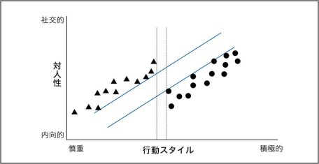
        
        - 誤差（ノイズ）対策を行って過学習を防止する。マージンの考えを使って、誤差に不感帯（川の幅）を設けることでノイズの影響を受けにくくする
        
        - 
        
        - ソフトマージンSVM
        
          - 誤差を認めるとよりよい線形分離が出来るデータを使う（=明確な分離を目指さない）
        
            

    - ランダムフォレスト

      - 決定木ベースのアルゴリズム

      - 下記ステップでアウトプットを得る。アンサンブル学習

        1. データからランダムサンプリング（バギング）でn組のデータを作る
        2. それぞれの決定木を作成
        3. 決定木の結果を統合

        

        

  - 匂配ブースティング

    - 決定木を利用して予測。次に訓練セットと正解データの予測結果の差を取り、誤差を算出。この誤差を正解データとして、決定木を使って2回目の予測を行う。
    
  - k近傍法

    - 分類で使用される教師あり学習のアルゴリズム
      - データを多数決で分類
      - 

  - 数値データの整形

    - 離散化
      - 連続した値を区分に分ける。
        - 例：来場者の年齢を年代ごとに分ける。

  - 分類

    - 2項分類：例えば正常と異常と分類する
      - ロジスティック回帰
        - 電子メールがスパムであるかどうか、またはトランザクションが不正であるかどうか等
        - 発生確率を予測して確率に応じてYes/Noで分類するもの
        - 
    - 多項分類：3つ以上に分類する
      - k近傍法
        - ある未知の値を最も近いグループの仲間とする分類法
        - 学習データをベクトル空間上にプロットしておき、未知のデータが得られたら、そこから距離が近い順に任意のK個を取得し、多数決でデータが属するクラスを推定する。
        - 下図の場合、クラス判別の流れは以下となる。
          １　既知のデータ(学習データ)を黄色と紫の丸としてプロットしておく。
          ２　Kの数を決めておく。K=3とか。
          ３　未知のデータとして赤い星が得られたら、近い点から３つ取得する。
          ４　その３つのクラスの多数決で、属するクラスを推定。
          今回は、未知の赤い星はClass Bに属すると推定する。
        - k近傍法 - Wikipedia https://ja.wikipedia.org/wiki/K%E8%BF%91%E5%82%8D%E6%B3%95
        - 
      

- 回帰モデルにおける代表的な予測誤差集計方法

  - R^2（決定係数）

    - 予測誤差を正規化（数値の大きさなどを揃えること）することで得られる指標。全く予測できていない場合は0、全て予測出来ている場合を1として大きいほどよい性能とする

  - RMSE（平方平均二乗誤差）

    - 予測誤差を二乗して平均したあとに集計する指標で、小さいほどよい性能であることを示す。

  - MAE（平均絶対誤差）

    - 予測誤差の絶対値を平均したあとに集計する指標。

- ハイパーパラメータの自動チューニング

  - グリッドサーチ
    - すべてのハイパーパラメータ候補の組み合わせを試行して、最も性能のよいものを選択するという方法。計算量が増えていくので利用が困難。
  - ランダムサーチ
    - ハイパーパラメータの組み合わせをランダムに試行する。
  - ベイズ最適化
    - ガウス過程という回帰モデルを利用して良いハイパーパラメータを探索する手法。試しにいくつかのパラメータ候補で精度を計算して、その結果をもとに更に精度が高くなりそうなパラメータ候補を推定して効率的に探索する

- 教師なし学習

  - 学習データにラベルをつけないで学習する方法
  - クラスタリング
    - 階層的クラスタリング
      
      - 特徴の似ているクラスタ同士を1つずつ結合させていき、最終的に1つの大きなクラスタになるまで繰り返すことでクラスタリングを行う手法
    - 非階層的クラスタリング
      
      - はじめにクラスタ数を設定して、そのクラスタ数で最もよくデータを分けることができるようクラスタリングを行う手法
      
    - 様々なデータから似ているデータを集めてグループ化する
    - k平均法（k-means)
      - k-means法を理解する - Qiita https://qiita.com/g-k/items/0d5d22a12a4507ecbf11
    - ガウス分布（正規分布）
      
      - 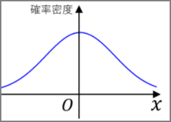
    - 次元削減
      - 次元：特徴量の数
      - 次元削減は「目的（分類や回帰）を達成できる限りの最小の次元にして、次元数を削減すること
        - 特徴選択
          - 考えられる特徴の中から有用なものを厳選する
        - 次元削減
          - Lasso回帰や決定木などを使って取り除いても影響のない次元を見つけ出し、これを削減する
        - 主成分分析（PCA：Principal Component Analysis)
          - データ全体の分布を近似した新たな指標を合成して次元を削減する
          - 
        - t分布型確率的近傍埋め込み法
          - 高次元データの可視化のため2次元または3次元の低次元空間へ埋め込みに最適な非線形次元削減手法
  
- 分類とクラスタリングの違い

  - 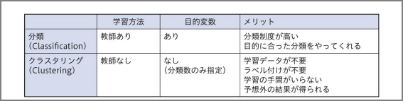

- 機械学習の分類とアルゴリズム

  - 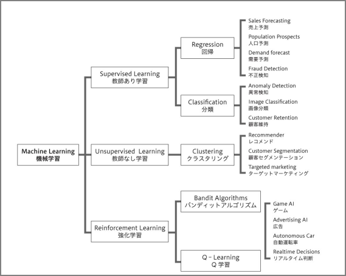
  - 

- 損失関数

  - 機械学習の教師あり学習では、データセット (**x**, y) が与えられたとき、パラメーター θ を持つ関数 f(**x**; θ) の出力値が y に近くなるように学習を行う。このとき、関数 f の出力値と実際の y の値の差

    - 二乗誤差

      - データセット (x, y) が与えられたとき、機械学習で得られた回帰モデルの関数を f としたとき、損失関数（二乗誤差）は次のように計算される。この損失関数では、回帰モデルの出力値 f(x) と y の差を 2 乗しているため、両者が離れば離れるほど大きなペナルティを受ける。データに外れ値が含まれると、その外れ値による影響を大きく受ける。

        
      
        絶対値誤差

      - データセット (**x**, y) が与えられたとき、機械学習で得られた回帰モデルの関数を f としたとき、損失関数（絶対値誤差）は次のように計算される。絶対値誤差のペナルティは、二乗誤差のように誤差を 2 乗していないため、二乗誤差に比べてゆっくりと大きくなる。
    
        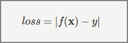
        
        
    

- ニューラルネットワーク

- 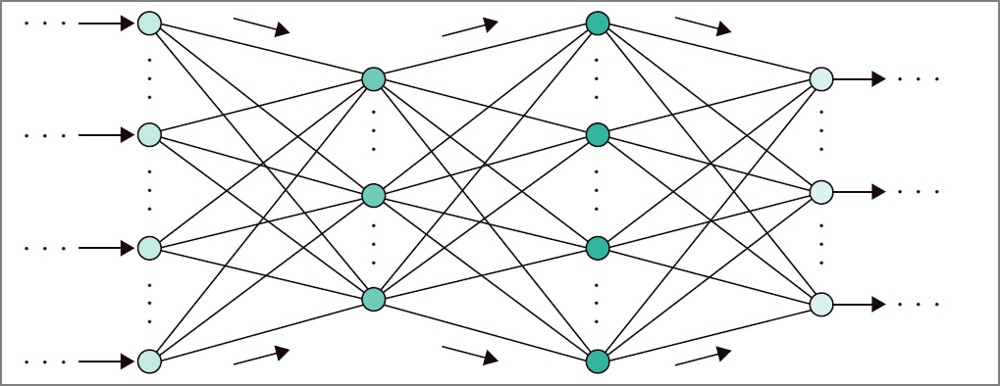

  - 誤差逆伝搬法

    - ニューラルネットワークで、モデルの予測結果と実際の正解値との誤差をネットワークに逆向きにフィードバックさせてネットワークの重みを更新

      - 問題点

        - ネットワークが深くなっていくにあたって誤差が最後まで反映されない

        - シグモイド関数が活性化関数として使用されていたが、シグモイド関数の微分は最大値が0.25にしかならない。つうまり、隠れ層を遡るごとに、伝搬していく誤差はどんどん小さくなっていく。深ければ深いほどフィードバックすべき誤差が少ない（<u>匂配消失問題</u>）

          

- ディープラーニングのアプローチ

  - 事前学習によるアプローチ

    - オートエンコーダ

      - 可視層と隠れ層の2層からなるネットワーク。可視層は入力層と出力層がセットになったもの。

      - 

      - 下記のように入力層と出力層は同じ結果となる。

      - 出力層=入力層>隠れ層とする。隠れ層には圧縮された情報が伝達される。

        

      - 入力層→隠れ層の処理をエンコード。隠れ層→出力層をデコード

    - オートコーダは入力=出力なのでこの場合はラベルが出力できない。教師なし学習となる。オートエンコーダを積み重ねた最後にロジスティック回帰層（シグモイド関数、ソフトマックス関数による出力層）を足すことで教師あり学習となる

    - ロジスティック回帰層も重みの調整が必要（=ファインチューニング）と言う

    - オートエンコーダは事前学習とファインチューニングの工程で構成

    - 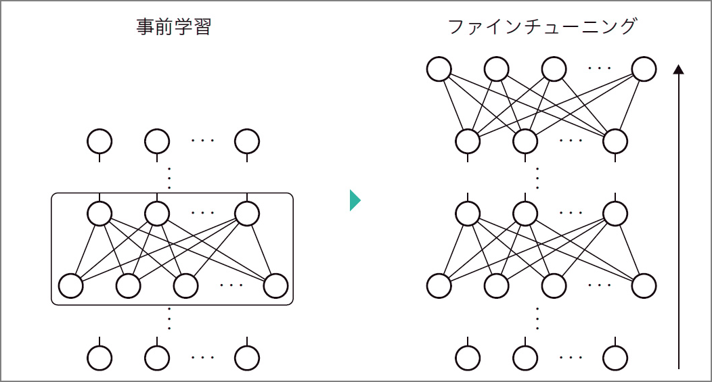

    

- ニューラルネットワークの種類

  - 畳み込みニューラルネットワーク
    - 画像認識
    - 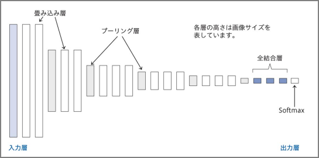
  - 再帰的ニューラルネットワーク（Recurrent Neural Network）
    - 時系列
    - 時間と共に次々と入ってくる、長さも決まらないデータを処理するのに向く
    - 

  

- イテレーション：すべての学習データ何度も繰り返すこと。訓練誤差を小さくしていく。

  - バッチ学習：1度にすべての学習データを読み込み
  - ミニバッチ学習：指定した数のデータを学習する
  - オンライン学習：1回の学習で1つのデータのみを読み込む
  
  
  
- ハイパーパラメータ

  - バッチサイズ
    - ミニバッチ勾配降下法というバッチ勾配降下法と確率的勾配降下法の間を取った手法が使われ、データセットを幾つかのサブセットに分ける
    - この幾つかに分けたぞれぞれのサブセットに含まれるデータの数をバッチサイズ
    - 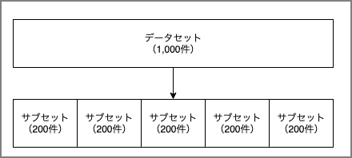
  - エポック数
    - データセットをバッチサイズに従ってN個のサブセットに分ける。
    - 各サブセットを学習に回す。つまり、N回学習を繰り返す。
    - この手順によりデータセットに含まれるデータは少なくとも1度は学習に使用される。エポック数はこの何度繰り返すかのパラメータ
  - 学習率
    - 各層の重みを一度にどの程度変更するかを決めるハイパーパラメータ

- アルゴリズム

  - Linear Learner 分類・回帰

  - Factorization Machines 分類・回帰

  - XGBoost Algorithm 分類・回帰

    - XGBoostアルゴリズムは、回帰、分類、およびランク付けの問題を解決するために使用
    - XGBoostは、学習器として回帰木を使い、Boostingによってモデルの構築と学習を行い、学習時にはモデルの勾配情報でパラメータを更新するモデル

  - Image Classification Algorithm 画像分類

  - Object Detection Algorithm 物体検出

  - Sequence2Sequence 機械翻訳・テキスト要約・音声認識

  - K-Means Algorithm クラスタリング

    - グループのメンバーが互いに類似しているが、他のグループのメンバーと異なるデータ内のグループを見つける

  - Principal Component Analysis (PCA) 特徴量の抽出

  - Latent Dirichlet Allocation (LDA) トピックモデリング

    - 文書中の単語の「トピック」を確率的に求める言語モデル。単語は独立に存在しているのではなく、潜在的なトピックを持ち、同じトピックを持つ単語は同じ文章に出現しやすい。

  - Neural Topic Model (NTM) トピックモデリング

  - DeepAR Forecasting 時系列データに対する予測

    - 一連の断面単位にわたって多くの同様の時系列を使用して予測しようとする場合に最適に機能。
    - 多くのインプットがあり、いくつかの時系列があり、これらすべての時系列を使用して単一のモデルをトレーニングするために使用可能

  - ARIMAモデル

    - 1つの時系列を使用してモデルをトレーニング

  - BlazingText Word2Vec

  - Random Cut Forest 異常検知

  - K-Nearest Neighbors 分類・回帰

  - tf-idf

    - ドキュメント内で一般的及び一般的ではない単語に重みを付けることにより、ドキュメント内の単語の重要性を決定する

  - Bag-of-Words

    - 入力ドキュメントテキストのトークンを作成し、テキストの統計的描写を出力する

  - IP Insights

  - Object2Vec

    - 「Object2Vec」とは「高次元のベクトルを、できるだけ情報量を減らさずに次元削減し、類似した物体を近距離に配置する」手法であり、汎用的なアルゴリズムです。 「物事の関係性を計算」する

  - Senabtuc Segnebtatuib

    <iframe src="//www.slideshare.net/slideshow/embed_code/key/jsDZwgSnbVhr8p?startSlide=17" width="595" height="485" frameborder="0" marginwidth="0" marginheight="0" scrolling="no" style="border:1px solid #CCC; border-width:1px; margin-bottom:5px; max-width: 100%;" allowfullscreen> </iframe> 
 <strong> <a href="//www.slideshare.net/AmazonWebServicesJapan/20190213-aws-black-belt-online-seminar-amazon-sagemaker-advanced-session" title="20190213 AWS Black Belt Online Seminar Amazon SageMaker Advanced Session" target="_blank">20190213 AWS Black Belt Online Seminar Amazon SageMaker Advanced Session</a> </strong> from <strong><a href="//www.slideshare.net/AmazonWebServicesJapan" target="_blank">Amazon Web Services Japan</a></strong> 

    
    ​	

  <iframe src="//www.slideshare.net/slideshow/embed_code/key/jsDZwgSnbVhr8p?startSlide=18" width="595" height="485" frameborder="0" marginwidth="0" marginheight="0" scrolling="no" style="border:1px solid #CCC; border-width:1px; margin-bottom:5px; max-width: 100%;" allowfullscreen> </iframe> 
 <strong> <a href="//www.slideshare.net/AmazonWebServicesJapan/20190213-aws-black-belt-online-seminar-amazon-sagemaker-advanced-session" title="20190213 AWS Black Belt Online Seminar Amazon SageMaker Advanced Session" target="_blank">20190213 AWS Black Belt Online Seminar Amazon SageMaker Advanced Session</a> </strong> from <strong><a href="//www.slideshare.net/AmazonWebServicesJapan" target="_blank">Amazon Web Services Japan</a></strong> 

- 自動モデル調整

- 混同行列
  
  - 2値分類問題で出力されたクラス分類の結果をまとめたマトリックス(行列≒表)のことで、2値分類機械学習モデルの性能を測る指標
  - 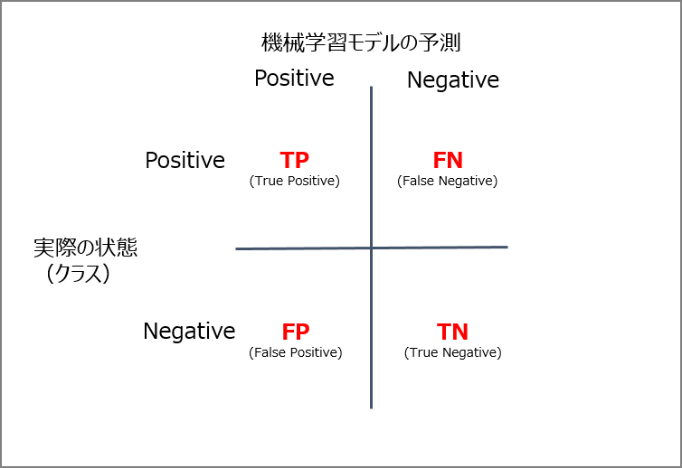
  - 混同行列(Confusion Matrix) とは 〜 2 値分類の機械学習のクラス分類について - Qiita https://qiita.com/TsutomuNakamura/items/a1a6a02cb9bb0dcbb37f
  
- 分類における評価法（TN、FN、TP、FP）

- F1

  - F1スコア（Fスコア または Fメジャー）は、テストの精度の尺度

#### その他

- 文字を整数値に変換して機会学習の対象とする
  - 順序、またはワンホットエンコーディング
- Sagemakerの自動パラメータチューニング
  - 通常、1度に一つのトレーニングジョブを実行すると最小の計算時間で最良の結果が得られる
- 不正アルゴリズム

参考サイト、書籍：

> 損失関数 | 機械学習の学習アルゴリズムの精度を評価する方法について https://axa.biopapyrus.jp/machine-learning/model-evaluation/loss-function.html
>
> 深層学習教科書 ディープラーニング G検定（ジェネラリスト） 公式テキスト | 浅川 伸一, 江間 有沙, 工藤 郁子, 巣籠 悠輔, 瀬谷 啓介, 松井 孝之, 松尾 豊, 一般社団法人日本ディープラーニング協会 | コンピュータ・IT | 本 | Amazon https://www.amazon.co.jp/dp/B07H2ZR6M2
>
> エンジニアなら知っておきたいAIのキホン 機械学習・統計学・アルゴリズムをやさしく解説 | 梅田 弘之 | コンピュータサイエンス | Kindleストア | Amazon https://www.amazon.co.jp/dp/B07N1GWYMT