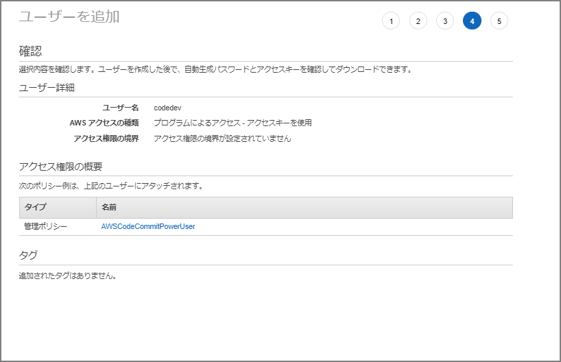
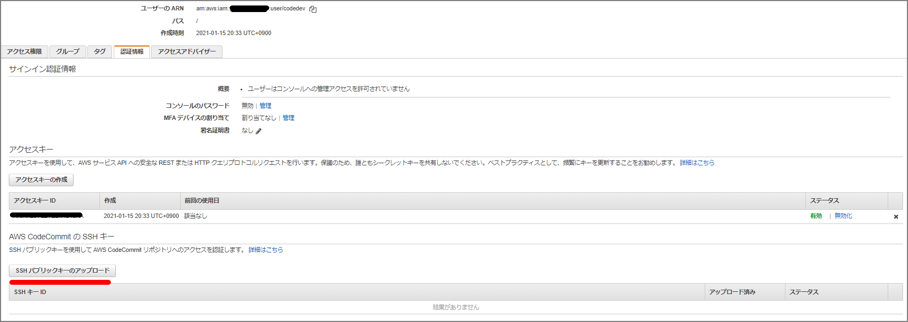

# IAMユーザ作成

IAMユーザを作成して下記の管理ポリシーをアタッチする。

- AWSCodeCommitPowerUser

> CodeCommit でのアイデンティティベースのポリシー (IAM ポリシー) の使用 - AWS CodeCommit https://docs.aws.amazon.com/ja_jp/codecommit/latest/userguide/auth-and-access-control-iam-identity-based-access-control.html#managed-policies-poweruser





# Gitをインストール

既にインストールされているので省略。

```
C:\Users\imazaj>git --version
git version 2.30.0.windows.2
```

ダウンロードであれば下記から。

> Git - Downloads http://git-scm.com/downloads

# Git と CodeCommit 用のパブリックキーとプライベートキーの設定

Git for WindowsのGit Bashを立ち上げssh-keygenコマンドで鍵ファイルを作成

```
$ ssh-keygen
Generating public/private rsa key pair.
～省略～
```

```
C:\Users\imazaj>dir C:\Users\imazaj\.ssh

2019/12/17  15:47    <DIR>          .
2019/12/17  15:47    <DIR>          ..
2021/01/15  20:39             2,610 id_rsa
2021/01/15  20:39               575 id_rsa.pub
2019/12/17  15:47               799 known_hosts
```

IAMユーザの"認証情報"タブに移動して、`AWS CodeCommit の SSH キー`に公開鍵ファイルをアップロードする。



公開鍵情報を貼り付けてアップロード


`SSHパブリックキーID`を控える。


`~/.ssh/config`を作成して、下記情報を入力。`User`は`SSHパブリックキーID`。`IdentityFile`は秘密鍵を指定。

```
Host git-codecommit.*.amazonaws.com
  User xxxxxxxxxxxxxxxxxxx
  IdentityFile ~/.ssh/id_rsa
```

SSH設定の確認

```
ssh git-codecommit.us-east-2.amazonaws.com
```

# リポジトリのクローンを作成

toolrepoというリポジトリに、`README.md`を作成済

```
C:\Users\imazaj>git clone ssh://git-codecommit.ap-northeast-1.amazonaws.com/v1/repos/toolrepo
Cloning into 'toolrepo'...
Warning: Permanently added the RSA host key for IP address 'xxxxxxxxxxxx' to the list of known hosts.
remote: Counting objects: 3, done.
Receiving objects: 100% (3/3), 215 bytes | 23.00 KiB/s, done.
```

```
C:\Users\imazaj\toolrepo>dir
 ドライブ C のボリューム ラベルは OSDisk です
 ボリューム シリアル番号は E49E-5113 です

 C:\Users\imazaj\toolrepo のディレクトリ

2021/01/15  20:56    <DIR>          .
2021/01/15  20:56    <DIR>          ..
2021/01/15  20:56                 0 README.md
               1 個のファイル                   0 バイト
               2 個のディレクトリ   3,597,164,544 バイトの空き領域
```

README.mdを編集してcommit

```
C:\Users\imazaj\toolrepo>git status
On branch master
Your branch is up to date with 'origin/master'.

Changes not staged for commit:
  (use "git add <file>..." to update what will be committed)
  (use "git restore <file>..." to discard changes in working directory)
        modified:   README.md

no changes added to commit (use "git add" and/or "git commit -a")

C:\Users\imazaj\toolrepo>git add README.md

C:\Users\imazaj\toolrepo>git commit -m "first commit"
[master 2ab1525] first commit
 1 file changed, 1 insertion(+)

C:\Users\imazaj\toolrepo>git push
Enumerating objects: 5, done.
Counting objects: 100% (5/5), done.
Writing objects: 100% (3/3), 252 bytes | 252.00 KiB/s, done.
Total 3 (delta 0), reused 0 (delta 0), pack-reused 0
To ssh://git-codecommit.ap-northeast-1.amazonaws.com/v1/repos/toolrepo
   357bc6c..2ab1525  master -> master
```

# 参考

> Windows で AWS CodeCommit リポジトリへの SSH 接続をセットアップする手順 - AWS CodeCommit https://docs.aws.amazon.com/ja_jp/codecommit/latest/userguide/setting-up-ssh-windows.html


